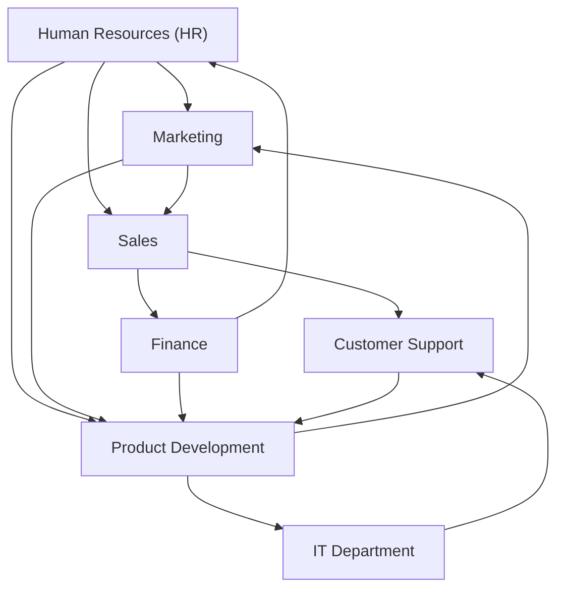
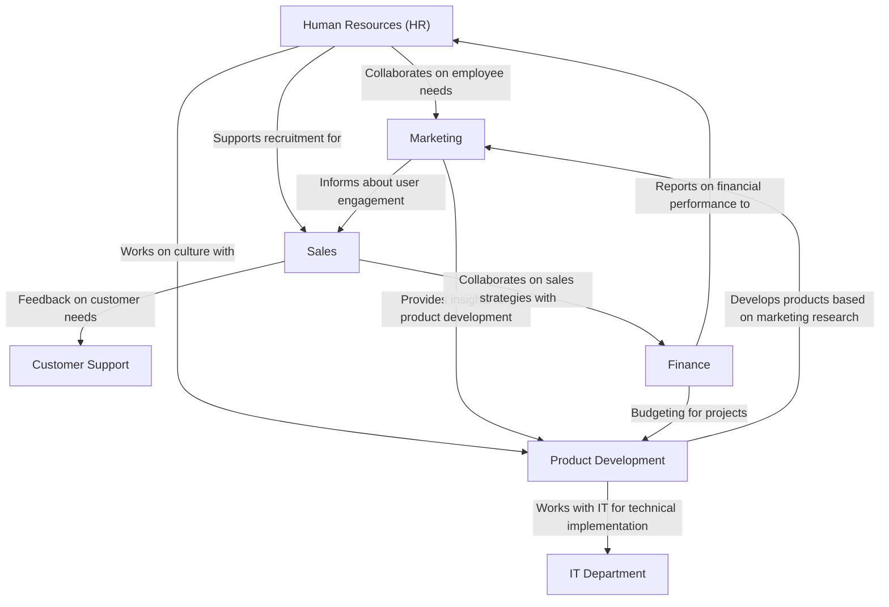

```mermaid

graph TD;
    HR["Human Resources (HR)"] --> Marketing[Marketing]
    HR --> Sales[Sales]
    HR --> Product_Development[Product Development]
    
    Marketing --> Sales
    Marketing --> Product_Development
    
    Sales --> Customer_Support[Customer Support]
    Sales --> Finance[Finance]
    
    Finance --> Product_Development
    Finance --> HR
    
    Product_Development --> Marketing
    Product_Development --> IT_Department[IT Department]
    
    IT_Department --> Customer_Support
    Customer_Support --> Product_Development


```

```mermaid
graph TD;
    HR["Human Resources (HR)"] -->|Collaborates on employee needs| Marketing[Marketing]
    HR -->|Supports recruitment for| Sales[Sales]
    HR -->|Works on culture with| Product_Development[Product Development]
    
    Marketing -->|Informs about user engagement| Sales
    Marketing -->|Provides insights for product development| Product_Development
    
    Sales -->|Feedback on customer needs| Customer_Support[Customer Support]
    Sales -->|Collaborates on sales strategies with| Finance[Finance]
    
    Finance -->|Budgeting for projects| Product_Development
    Finance -->|Reports on financial performance to| HR
    
    Product_Development -->|Develops products based on marketing research| Marketing
    Product_Development -->|Works with IT for technical implementation| IT_Department[IT Department]
```
