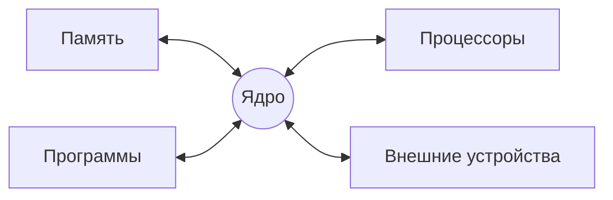

_03.09._
__Операционная система__ - программный комплекс, предоставляющий пользователю среду для выполнения прикладных программ и управления ими, а прикладными программам средства доступа и управления аппаратными ресурсами

Операционная система -> Интерфейс системных вызовов -> Прикладные программы и Конфигурирующие программы

__Задачи программирования могут быть условно разделены на четыре группы:__
- Расширение функциональности ОС
- Конфигурирование режимов работы ОС 
- Разработка прикладных программ
- Решение прикладных задач при помощи готовых задач

__Классификация пользователей:__
- Системные программисты (ОС, Интерфейс системных вызовов)
- Системные администраторы (Конфигурирующие программы)
- Прикладные программисты (Прикладные программы и Конфигурирующие программы)
- Прикладные пользователи (Прикладные пользователи)

__Роли пользователей ОС:__
Системный программист
> Задача: Расширение функций ОС
> Входной язык: Низкоуровневые языки разработки, в том числе Ассемблер 
 
Системный администратор
> Задача: Конфигурирование ОС и регистрация пользователей
> Входной язык: Форматы конфигурационных файлов и языки управления средствами администрирования

Оператор
> Задача: Текущее администрирование системы, установка/удаление ПО, его настройка
> Форматы конфигурационных файлов инсталляторов и устанавливаемого ПО 

Специалист по аппаратному обеспечению
> Задача: Обслуживание аппаратуры, ввод/вывод её в эксплуатацию
> 

Прикладной программист
> Разработка ПО, предназначенного для решения задач прикладного пользователя

Администратор данных
 > Задача: Архивирование данных системы, управление информационными ресурсами (БД, справочники)
 
 Прикладной пользователь
 > Задача: Решение конкретных прикладных задач при помощи готового ПО

Сеанс??? - интервал времени, в течение которого пользователь решает одну или несколько задач, пользуясь средствами, предоставляемыми операционной системы

Основные понятия
			  Ресурсы
Неразделяемые <-|->         Разделяемые
	Одновременного доступа <-|-> Доступ с разделением времени
	

__Процесс переднего плана__ - Процесс, имеющий потенциальную возможность получить входные данные от пользователя с клавиатуры и вывести результаты своей работы на экран.

__Фоновый процесс__  Процесс, выполняемый без непосредственного взаимодействия с пользователем.

Ресурсом может быть как физический объект(процессор, оперативная память и т.д. ), так и логический объект(информационные объекты, существующие только в пределах ОС).

__Классификация ОС:__
По количеству одновременно обслуживаемых пользователей:
- Однопользовательские
- Многопользовательские
По количеству одновременно выполняемых процессов:
- Однозначные
- Многозадачные

_17.09_
# Лекция 2
## Основные принципы функционирования ОС на базе ядра LInux
### Ядро
> Предоставляет оборудование программам\

__Init__ - первый пользовательский процесс Unix-подобных операционных системах. Запускается непосредственно ядром системы и является прародителем всех пользовательских процессов систем. 
__Init__ - Активизирует процессы, необходимые для нормальной работы системы и производит их начальную инициализацию. Обеспечивает завершение работы системы, организует сеансы работы пользователей, в том числе, для удаленных терминалов.
__Включение -> MBR -> GRUB/LiLo -> Kernel (Ядро) -> Init -> Runlevel__
BIOS - Basic Input/Output System
#### Интерпретатор Shell
При входе в ОС пользователь получает копию интерпретатора shell в качестве родительского процесса. Далее, после ввода команды пользователем создается порожденный процесс, называемый процессом-потомком. Т.е. после запуска ОС каждый новый процесс функционирует только как процесс - потомок уже существующего процесса. \

RedOS - по умолчанию ставится графическая оболочка MATE\
Gnome(3 марта 1999), KDE(12 июля 1998)\

NFS - программный комплекс РС-NFS (Network File System) для выполнения сетевых функций. РС-NFS ориентирован для конкретной ОС персонального компьютера (PC) и включает драйверы для работы в сети и дополнительные утилиты. \
SMB - сетевая файловая система, совместимая с Windows NT. \
TCP/IP - протокол контроля передачи данных (Transfer Control Protocol/Internet Protocol). Сеть по протоколам TCP/IP является неотъемлемой частью ОС семейства UNIX. Поддерживаются любые сети, от локальных до Internet, с использованием только встроенных сетевых средств.

# Лекция 3 
https://studfile.net/preview/4186783/page:14/#26
## Ядро ОС. Типы ядер. Привилегированный и пользовательский режимы работы.
__Архитектура ОС__ - структурная организация ОС на основе различных программных модулей\
__Модуль__ - это функционально законченный элемент системы, выполненный в соответствии с принятыми межмодульными интерфейсами\
__Межмодульный интерфейс__ - связующее звено между двумя объединяемыми программными объектами, выполняет функции передачи, приёма и преобразования разнотипных данных.\

__Резидентные модули__ - хранят данные в оперативной памяти\
__Нерезидентные модули__ - находятся на жёстком диске\
__Транзитные модули__ - загружаются в оперативную память только на время выполнения своих функций (посменно)

#### Вспомогательные модули:
- Утилиты - программы, решающие отдельные задачи управления и сопровождения компьютерной системы
- Системные обрабатывающие программы - текстовые и графические редакторы, компиляторы, компоновщики, отладчики
- Программы предоставления пользователю дополнительных услуг - специальный вариант пользовательского интерфейса 
- Библиотеки процедур - упрощают разработку приложений \

https://studfile.net/preview/4186783/page:15/ \
KVM - гипервизор 1 уровня \
Ядро ОС выполняет базовые функции ОС:
- управление процессами
- управление памятью
- управление устройствами ввода-вывода и файловой системой
- интерфейс прикладного программирования API
- защита данных и администрирования \
Оболочка ОС выполняет вспомогательные функции ОС:
- утилиты
- системные обрабатывающие программы
- приложения пользователей \
Монолитное ядро - все основные функции ОС
Микро ядро - минимальный набор функций, планирование потоков, межпроцессное взаимодействие 
https://studfile.net/preview/2910574/page:5/ \

Типы различных ядер:
- монолитное ядро - MS-DOS, Linux, FreeBSD
- микроядро - Mach, Symbian, MINIX 3
- гибридное ядро - NetWare \
Состав операционной системы: 
- системные библиотеки (DLL) - преобразующие системные вызовы приложений в системные вызовы ядра
- пользовательские оболочки (shell) - предоставляют пользователю интерфейс
Пользовательские оболочки:
- текстовый интерфейс (CLI - Linux, CMD - Windows) - консоль
- графический интерфейс (GUI)
> **Графическая оболочка Astra - fly, у RedOS - Mate**

# Лекция 4. RAID-массивы
https://club.dns-shop.ru/blog/t-419-diskovyie-hranilischa-das/29764-chto-takoe-raid-massiv-i-zachem-on-nujen/?utm_referrer=https%3A%2F%2Fyandex.ru%2F
*Два типа памяти:* ПЗУ(постоянная) и ОЗУ(оперативная)\
ПЗУ - энергонезависимые \
SSD - чипы \
___RAID___ - избыточный массив самостоятельных (независимых) дисков - технология объединения двух и более накопителей в единый логический элемент с целью повышения с целью повышения отказоустойчивости и (или) производительности отдельно взятого элемента.
Классификация:
- по исполнению RAID-контроллера 
- по типам поддерживаемых интерфейсов накопителей
- по поддерживаемым уровням RAID
## JBOD
Массив, но не RAID. Эта связка дисков не дает никакой отказоустойчивости и роста производительности, а является просто дисками, «склеенными» в один логический элемент
 ![[Pasted image 20241015093814.png]]
 - Объем такого массива будет равен сумме объемов накопителей, собранных в этот массив
 - При выходе из строя накопителя пострадает информация только на этом же накопителе
 - Массив можно составлять из разных по емкости накопителей и легко расширять 
## RAID-0
Данный массив еще называется «чередованием», так как при записи информации на него она разбивается на части (блоки) фиксированного размера и записывается поочередно на все собранные в массив диски. Применяется для библиотеки игр, видеомонтажа или рендеринга.

![[Pasted image 20241015095711.png]]
 - Количество дисков для сборки RAID 0 — минимум две штуки. 
 - При использовании такого уровня RAID возрастают скорости записи и чтения. 
 - Чем больше дисков в массиве, тем он производительней. 
 - Доступен объем всех дисков. 
 - Но самый главный минус в том, что поломка одного из дисков такого массива будет означать полную потерю информации, поскольку данные хранятся разбитыми по дискам.

## RAID-1
Массив известный как «зеркалирование». Представляет собой полную копию информации с одного диска массива на другой. RAID 1 подойдет для важных данных, сохранность и доступность которых в приоритете.
![[Pasted image 20241015100004.png]]
- Предполагается использование двух накопителей. 
- За счет дублирования обеспечивается высокая надежность — работа продолжится при повреждении одного диска. 
- Но в таком случае необходима его срочная замена, при этом данные восстанавливаются с «зеркального» диска. 
- Распараллеливанием запросов обеспечивается высокая скорость чтения.
- Доступен объем одного диска.  
- Скорость записи остается либо такой же, как в случае использования одного диска, либо даже может немного «проседать».
- Два диска должны быть идентичны

## RAID-2
Эти массивы используют чередование дисков и коды коррекции ошибок (код Хэмминга)
Две группы:
- Для данных
- Для кодов
![[Pasted image 20241015101058.png]]
- За счет чередования достигается высокая скорость операций с данными по сравнению с одним диском. 
- Код Хэмминга позволяет обнаруживать и исправлять ошибки при операциях с файлами «на лету» без снижения скорости операций с данными. 
- Также при выходе из строя одного накопителя массива восстанавливаться данные будут по хранящимся кодам коррекции ошибок.
- Минимум этого массива — 7 дисков. Можно меньше, но это бессмысленно, потому что для кодов потребуется больше дисков, чем для самих данных. С дальнейшим увеличением дисков избыточность будет уменьшаться по экспоненте \
RAID 2 сейчас не используется, потому что он совсем не экономичный, к тому же считается устаревшим. Его вытеснили следующие уровни RAID.
## RAID-3
Так же, как и RAID 2, использует чередование дисков, но без кодов Хэмминга. Вместо этого хранятся контрольные суммы, и они-то и используются для восстановления, а данные разбиваются на байты. Данный RAID-массив наиболее удачен для работы с большими файлами, потоковым мультимедиа, но на практике не встречается ввиду невысокой надежности.
![[Pasted image 20241015101520.png]]
- Минимум три диска
- Скорость операций чтения высокая, скорости операций записи высоки только для больших файлов (чем меньше файл, тем чаще приходится пересчитывать контрольную сумму). 
- RAID 3 предлагает хороший компромисс между доступным объемом и ценой. Хранящаяся информация теряется, если «навернется» больше одного диска.
- Могут наблюдаться проблемы со скоростью при работе с данными небольшого объема.
- Плюс высокая нагрузка на диск, хранящий контрольные суммы, сокращает срок его службы относительно дисков с данными. \
## RAID-4
Можно сказать, это тот же самый RAID 3, только файл бьется не на однобайтные блоки, за счет чего удалось несколько повысить скорость записи мелких файлов. Остальные характеристики соответствуют рейду третьего уровня.
![[Pasted image 20241015101932.png]]

## RAID-5
Один из наиболее удачных. Здесь используются контрольные суммы и чередование как в RAID 3 и RAID 4, но объем под хранение сумм распределяется по всему массиву.
![[Pasted image 20241015102301.png]]
- Минимум 3 диска
- Для хранения контрольных сумм выделяется объем, равный объему одного накопителя.
- Прирост к скорости за счёт параллельности

## RAID-6
Контрольные суммы на этот массив записываются в двойном размере, что требует и  увеличения объема в два раза. Такой «финт» приводит к повышению отказоустойчивости, при этом не сильно увеличивая стоимость.
![[Pasted image 20241015102812.png]]
Минимальное количество дисков — четыре. Ко всем достоинствам RAID 5 прибавляется повышенная надежность, за счет допустимого отказа двух дисков одновременно. Но скорость записи может быть значительно ниже, чем у RAID 5. Шестой рэйд используется там же, где и «пятый», но с заявкой на повышенную надежность.

## Комбинированные уровни
### RAID 01 и RAID 10

Массивы представляют собой кооперирование уровней 0 и 1. RAID 01 — это зеркалирование двух массивов чередования. Также называется «зеркало страйпов».
![[Pasted image 20241015100432.png]]
А RAID10 — это чередование двух зеркальных массивов.
### RAID-100

# Лекция 5. BIOS и UEFI
https://libeldoc.bsuir.by/bitstream/123456789/48836/1/Onoshko_Osnovi.pdf \
__BIST__ (Built-In Self-Test - выполнение встроенной процедуры самотестирования) -> Запись начальных значений в регистры памяти -> сброс кэшей и других внутренних буферов -> решение иных задач по инициализации -> Считывание первой инструкции \
> ___Содержимое оперативной памяти в момент включения компьютера не определенно___ 

![[Pasted image 20241029093134.png]]
- __Серверный мост__ - главное связующее звено между процессором и остальными аппаратными узлами
- __Южный мост__ - отвечает за передачу информации с периферийными устройствами \

__"Uncore"__ - северный мост часто встраивается в сам процессор. "Core" - отдельно.
## BIOS
> Basic I/O systems - базовая система ввода/вывода

__BIOS__ - программа низкого уровня, хранящаяся в ПЗУ(постоянное запоминающее устройство) компьютера. BIOS загружается при включении компьютера и инициирует запуск и тестирование аппаратных компонентов. При успешных тестировании, управление передаётся программе загрузчику ОС. \
> **Прошивка** - код или программа, которое встроено в устройство

Три основные задачи BIOS:
- Выполнить проверку и начальную настройку устройств, подключённых к материнской плате (подпрограмма известна также под названием POST - Power-On Self-Test)
- Выполнить поиск и загрузку ОС
- Предоставить унифицированный (общий для компьютеров с различным оборудованием) программный интерфейс для взаимодействия с имеющимся оборудованием.
## UEFI
> Unified Extensible Firmware Interface - стандартный интерфейс встроенного ПО для компьютеров, заменяющий BIOS

*Преимущества:*
- Повышение безопасности
- Уменьшение времени загрузки или восстановления после гибернации
- Поддержка дисков объёмом более 2,2 Тбайт
- Поддержка современных драйверов устройств с 64-разрядным встроенным ПО 
- Возможность использование BIOS с оборудованием UEFI
## Основные отличия UEFI от BIOS
- При запуске ОС находится не в реальном, а в защищённом режиме
- Используется объектно-ориентированный программный интерфейс
UEFI это спецификация программных интерфейсов
## Классификация поддержки интерфейсов UEFI и BIOS компьютерами
- класс 0 – компьютеры с классической BIOS; 
-  класс 1– компьютеры, которые всегда работают только в режиме CSM (т. е. реализация потенциально поддерживает новые возможности, но загрузка операционной системы осуществляется только классическим способом); 
- класс 2 – компьютеры, поддерживающие запуск так называемых UEFIприложений и имеющие режим CSM; -
- класс 3 – компьютеры с поддержкой UEFI-приложений, но без поддержки CSM.
## Старт ОС
- Подача питания на ноутбук/настольный компьютер
- Запуск ЦП, загрузка команд из ПЗУ
- Самотестирование при включении питания
- Поиск загрузчика и передача ему управления
- Загрузчик ОС
