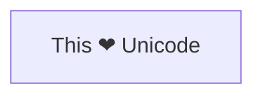
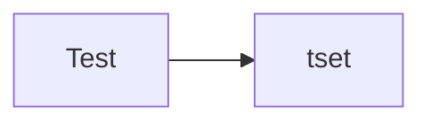
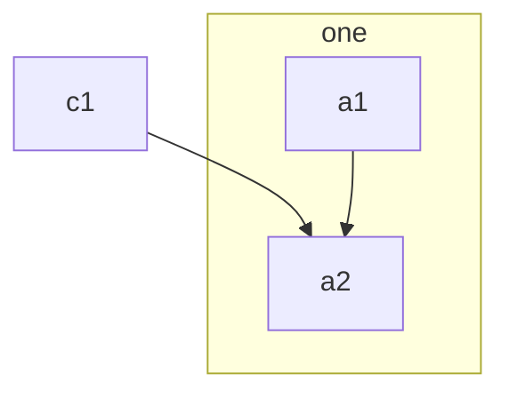

# Конспекты
* [Основы BASH](bash.md)
* [Основы C++](cpp.md)
* [Основы Python](python.md)

```mermaid
flowchart LR 
	id["This ❤ Unicode"]
```

```mermaid
flowchart LR
    Test --> tset

```

```mermaid
flowchart TB 
	c1-->a2; 
	subgraph ide1 [one]; 
	a1-->a2;
	end;
```
