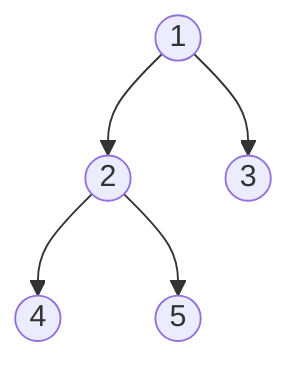

[Лекция 1](Algoritm_lection_1.pdf)
__Алгоритм__ - это набор конечного числа правил, задающих последовательность выполнения операций компьютерной программой для решения задачи определённого типа.

__Алгоритмическое мышление__ 

Свойства алгоритмов:
- ___Конечность___ - алгоритм всегда должен заканчиваться после выполнения конечного числа шагов
- ___Определённость___ - действия, которые нужно выполнить должны быть строго и недвусмысленно определены для каждого возможного случая
- ___Ввод___ - алгоритм имеет некоторое (>=0) число входных данных
- ___Вывод___ - алгоритм должен иметь одно или несколько выходных данных
- ___Эффективность___ - Алгоритм обычно считается эффективным, если все его операторы достаточны просты и понятны

Алгоритм Евклида

## Память и время

_Четыре аспекта использовании памяти:_
Количество памяти, ...
- Необходимое для хранения кода алгоритма
- Необходимое для входных данных
- Необходимое для любых выходных данных (Некоторые алгоритмы, такие как сортировки, )
- Необходимое для вычислительного процесса во время вычислений

## "O" большое
> Математическое обозначение для сравнения асимптотического поведения функции


# Лекция 2. Числовые алгоритмы

# Лекция 3. Алгоритмы сортировки
__Алгоритм сортировки__ - алгоритм для упорядочивания элементов в списке
## Сортировка пузырьком O(n^2)
```python
def bubble_sort(arr):
	for _ in range(len(arr)-1):
		flag = True
		for j in range(len(arr)-i-1):
			if arr[j] > arr[j+1]:
				arr[j], arr[j+1] = arr[j+1], arr[j]
				flag = False
		if flag:
			break
	return arr

print(bubble_sort([3, 2, 1]))
```

## Сортировка вставками
```python
import random
arr = [random.randint(1, 100) for _ in range(random.randint(1, 10))]
print(arr)

def insert_sort(arr):
	for i in range(1, len(arr)):
		while arr[i] < arr[i-1] and i > 0:
			arr[i], arr[i-1] = arr[i-1], arr[i]
			i -= 1
	return arr

print(insert_sort(arr))
```
Можно улучшить, добавив бинарный поиск

## Метод "разделяй и властвуй"


# Лекция 4
___Динамическое программирование(ДП)___ - способ решения сложных задач путём разбиения их на более простые.
- __ДП сверху__ - простое запоминание результатов решения тех подзадач, которые могут повторно встретиться в дальнейшем
- __ДП снизу__ (табулация)- включает в себя переформулирование сложной задачи в виде рекурсивной последовательности более простых подзадач. \

### Задача о рюкзаке
 > Дано: N предметов, каждый предмет имеет вес и стоимость. нужно выбрать все предметы, вес которых не превышает W, наибольшей стоимостью

# Лекция 5. Структуры данных
Элементарные структуры данных: булевый, указательный(содержит адрес памяти), числовой, символьный \
___Абстрактный тип данных (АТД)___ - некоторая математическая или информационная модель с совокупностью операторов, определённых в рамках этой модели \
__Линейный однонаправленный список__ - структура данных, состоящая из элементов одного типа, связанных между собой последовательно посредством указателей. \
__Односвязный список__ - ссылка в одну сторону \
__Двусвязный список__ - ссылка в обе стороны (На следующий и на предыдущий) \
__Стек (stack - стопка)__ - добавление и удаление элементов происходит с одного конца \
__Очереди__ - удаление первого элемента, добавление нового элемента происходит в конец \
__Дек (double ended queue)__ - удаление и добавление может происходить как с начала, так и с конца \
__Множество__ - классическое математическое множество, не имеет порядок и без повторений значений \
__Куча (heap)__ - это полное двоичное дерево, удовлетворяющее свойству кучи: если узел A - это родитель узла B, то ключ узла A больше либо равен ключу узла B:
- min-куча
- max-куча

`[1, 2, 3, 4, 5]`

