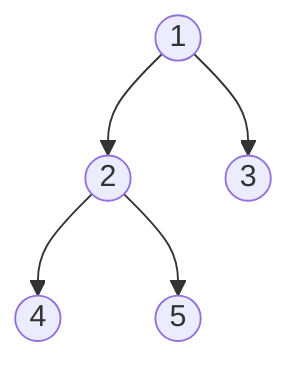

# Лекция 1. Вступление
__Алгоритм__ - это набор конечного числа правил, задающих последовательность выполнения операций компьютерной программой для решения задачи определённого типа.

__Алгоритмическое мышление__ 

Свойства алгоритмов:
- ___Конечность___ - алгоритм всегда должен заканчиваться после выполнения конечного числа шагов
- ___Определённость___ - действия, которые нужно выполнить должны быть строго и недвусмысленно определены для каждого возможного случая
- ___Ввод___ - алгоритм имеет некоторое (>=0) число входных данных
- ___Вывод___ - алгоритм должен иметь одно или несколько выходных данных
- ___Эффективность___ - Алгоритм обычно считается эффективным, если все его операторы достаточны просты и понятны

Алгоритм Евклида

## Память и время

_Четыре аспекта использовании памяти:_
Количество памяти, ...
- Необходимое для хранения кода алгоритма
- Необходимое для входных данных
- Необходимое для любых выходных данных (Некоторые алгоритмы, такие как сортировки, )
- Необходимое для вычислительного процесса во время вычислений

## "O" большое
> Математическое обозначение для сравнения асимптотического поведения функции


# Лекция 2. Числовые алгоритмы

# Лекция 3. Алгоритмы сортировки
__Алгоритм сортировки__ - алгоритм для упорядочивания элементов в списке
## Сортировка пузырьком O(n^2)
```python
def bubble_sort(arr):
	for _ in range(len(arr)-1):
		flag = True
		for j in range(len(arr)-i-1):
			if arr[j] > arr[j+1]:
				arr[j], arr[j+1] = arr[j+1], arr[j]
				flag = False
		if flag:
			break
	return arr

print(bubble_sort([3, 2, 1]))
```

## Сортировка вставками
```python
import random
arr = [random.randint(1, 100) for _ in range(random.randint(1, 10))]
print(arr)

def insert_sort(arr):
	for i in range(1, len(arr)):
		while arr[i] < arr[i-1] and i > 0:
			arr[i], arr[i-1] = arr[i-1], arr[i]
			i -= 1
	return arr

print(insert_sort(arr))
```
Можно улучшить, добавив бинарный поиск

## Метод "разделяй и властвуй"


# Лекция 4. Динамическое программирование
___Динамическое программирование(ДП)___ - способ решения сложных задач путём разбиения их на более простые.
- __ДП сверху__ - простое запоминание результатов решения тех подзадач, которые могут повторно встретиться в дальнейшем
- __ДП снизу__ (табулация)- включает в себя переформулирование сложной задачи в виде рекурсивной последовательности более простых подзадач. \

### Задача о рюкзаке
 > Дано: N предметов, каждый предмет имеет вес и стоимость. нужно выбрать все предметы, вес которых не превышает W, наибольшей стоимостью

# Лекция 5. Структуры данных
Элементарные структуры данных: булевый, указательный(содержит адрес памяти), числовой, символьный \
___Абстрактный тип данных (АТД)___ - некоторая математическая или информационная модель с совокупностью операторов, определённых в рамках этой модели \
__Линейный однонаправленный список__ - структура данных, состоящая из элементов одного типа, связанных между собой последовательно посредством указателей. \
__Односвязный список__ - ссылка в одну сторону \
__Двусвязный список__ - ссылка в обе стороны (На следующий и на предыдущий) \
__Стек (stack - стопка)__ - добавление и удаление элементов происходит с одного конца \
__Очереди__ - удаление первого элемента, добавление нового элемента происходит в конец \
__Дек (double ended queue)__ - удаление и добавление может происходить как с начала, так и с конца \
__Множество__ - классическое математическое множество, не имеет порядок и без повторений значений \
__Куча (heap)__ - это полное двоичное дерево, удовлетворяющее свойству кучи: если узел A - это родитель узла B, то ключ узла A больше либо равен ключу узла B:
- min-куча
- max-куча

`[1, 2, 3, 4, 5]`

# Лекция 6.  Графы
___Граф___ - математическая абстракция, объекты которой обладают парными связями
- Простой (неориентированный)
- Ориентированный граф
- Взвешенный граф
Путь - любая последовательность вершин \
Длина пути - количество рёбер \
### Способы хранения графов
- Матрица смежности
- Список смежности
- Матрица инцидентности
## Поиск в глубину
> Один из основных методов обхода графа 

#DFS
**Пошаговое представление:**
1. Выбираем любую вершину из еще не пройденных, обозначим ее как `   u   `.
2. Запускаем процедуру `   dfs(u)   `
     1. Помечаем вершину `   u   ` как пройденную
     2. Для каждой не пройденной смежной с `u` вершиной (назовем ее `v`) запускаем `dfs(v)`
3. Повторяем шаги 1 и 2, пока все вершины не окажутся пройденными.
### Выделение компонент связности
Для поиска компонент связности используется обычный DFS практически без модификаций. При запуске обхода из одной вершины, он гарантированно посетит все вершины, до которых возможно добраться, то есть, всю компоненту связности, к которой принадлежит начальная вершина. Для нахождения всех компонент просто попытаемся запустить обход из каждой вершины по очереди, если мы ещё не обошли её компоненту ранее. \
Простейший вариант: просто заполнить список `comp`, где `   comp[i]   ` - номер компоненты связности, к которой принадлежит вершина `i`.
## Алгоритм Кана и топологическая сортировка
> Поиск циклов или топологическая сортировка(для каждого ребра uv, вершина u раньше вершины v)

#Кана
**Пошаговое представление** \
1. Создаём список, где указываем для каждой вершины количество входящих рёбер 
2. Если количество входящих рёбер равно 0, добавить в очередь
3. Взять вершину из очереди и пометить как посещённую
4. Для всех смежных вершин уменьшить количество входящих рёбер на 1
5. Добавить в очередь вершину, если количество входящих рёбер равно 0
6. Пока очередь не пуста снова с шага 3 \
Список посещённых вершин (в том порядке, в котором их добавляли) будет результат топологической сортировки. Если количество рёбер в результате не равно общему количеству рёбер => в графе есть цикл, топологическая сортировка невозможна

# Лекция 7. Кратчайшие пути в графах
**Обход в ширину (Поиск в ширину, BFS, Breadth-first search)** — один из простейших алгоритмов обхода графа, являющийся основой для многих важных алгоритмов для работы с графами. \
## BFS
#BFS
1. Создадим массив $dist$ расстояний. Изначально $dist[s]=0$ (поскольку расстояний от вершины до самой себя равно $0$) и $dist[v]=∞$ для $v≠s$.
2. Создадим очередь $q$. Изначально в $q$ добавим вершину $s$.
3. Пока очередь $q$ не пуста, делаем следующее:
    1. Извлекаем вершину $v$ из очереди.
    2. Рассматриваем все рёбра $(v,u)∈E$, то есть те, которые выходят из вершины $v$ Для каждого такого ребра пытаемся сделать релаксацию: если $dist[v]+1<dist[u]$, то мы делаем присвоение $dist[u]=dist[v]+1$ и добавляем вершину $u$ в очередь.
### Волновой метод
### Принадлежит ли вершина кратчайшему пути
Запустим из вершины $s$ в графе $G$ BFS в вершину $v$ — найдём расстояния $d_1$. Построим транспонированный граф $G^T$ — граф, в котором каждое ребро заменено на противоположное. Запустим из вершины $t$ в графе $G^T$ BFS в вершину $v$ — найдём расстояния $d_2$. \
Теперь очевидно, что $v$ принадлежит хотя бы одному кратчайшему пути из $s$ в $t$ тогда и только тогда, когда $d_1(v)+d_2(v)=d_1(t)$ — это значит, что есть путь из $s$ в $v$ длины $d_1(v)$, а затем есть путь из $v$ в $t$ длины $d_2(v)$, и их суммарная длина совпадает с длиной кратчайшего пути из $s$ в $t$.
## Алгоритм Дейкстры 
> Данный алгоритм находит кратчайший путь во взвешенных графах (!!! без отрицательного веса)

#Дейкстры
1. Создать массив $dist$ расстояний. Изначально $dist[s]=0$ и $dist[v]=∞$ для $v≠s$.
2. Создать булев массив $used$, $used[v]=0$ для всех вершин $v$ — в нём мы будем отмечать, совершалась ли релаксация из вершины.
3. Пока существует вершина $v$ такая, что $used[v]=0$ и $dist[v]≠∞$, притом, если таких вершин несколько, то $v$ — вершина с минимальным $dist[v]$, делать следующее:
    1. Пометить, что мы совершали релаксацию из вершины $v$, то есть присвоить $used[v]=1$.
    2. Рассматриваем все рёбра $(v,u)∈E$. Для каждого ребра пытаемся сделать релаксацию: если $dist[v]+w(v,u)<dist[u]$, присвоить $dist[u]=dist[v]+w(v,u)$.


# Лекция 8. Кратчайшие пути в ациклических ориентированных графах
## Алгоритм Беллмана-Форда
>Ищет кратчайший путь в ориентированных взвешенных графах, в случае обнаружения цикла отрицательного веса сообщает об этом

#Беллмана-Форда
1. Инициализация: всем вершинам присваивается предполагаемое расстояние $dist[v]=∞$, кроме вершины-источника, для которой $dist(u)=0$.
2. Релаксация множества рёбер $E$
    1. Для каждого ребра $e=(v,z)∈E$ вычисляется новое предполагаемое расстояние $new_dist(z)=dist(v)+w(e)$.
    2. Если $new_dist(z)<dist(z)$, то происходит присваивание $dist(z)=new_dist(z)$ (релаксация ребра $e$).
3. Алгоритм производит релаксацию всех рёбер графа до тех пор, пока на очередной итерации происходит релаксация хотя бы одного ребра.
4. **Критерий наличия достижимого цикла отрицательного веса**: если после $n-1$ фазы мы выполним ещё одну фазу, и на ней произойдёт хотя бы одна релаксация, то граф содержит цикл отрицательного веса, достижимый из $v$; в противном случае, такого цикла нет.

## Алгоритм Флойда
> Алгоритм нахождения длин кратчайших путей между всеми парами вершин во взвешенном ориентированном графе.

Обозначим длину кратчайшего пути между вершинами $u$ и $v$, содержащего, помимо $u$ и $v$, только вершины из множества ${1..i}$ как $d^{(i)}_{uv}$, $d^{(0)}_{uv}=ω_{uv}$.

На каждом шаге алгоритма, мы будем брать очередную вершину (пусть её номер — $i$) и для всех пар вершин $u$ и $v$ вычислять $d^{(i)}_{uv}=\min{(d^{(i−1)}_{uv},d^{(i−1)}_{ui}+d^{(i−1)}_{iv})}$. То есть, если кратчайший путь из $u$ в $v$, содержащий только вершины из множества ${1..i}$, проходит через вершину $i$, то кратчайшим путем из $u$ в $v$ является кратчайший путь из $u$ в $i$, объединенный с кратчайшим путем из $i$ в $v$. В противном случае, когда этот путь не содержит вершины $i$, кратчайший путь из $u$ в $v$, содержащий только вершины из множества ${1..i}$ является кратчайшим путем из $u$ в $v$, содержащим только вершины из множества ${1..i−1}$.

#Флойда-Уоршелла
1. Создаём матрицу кратчайших расстояний между всеми вершинами $dist$
2. Перебираем все вершины в трёх вложенных циклах $k, i, j$ соответствено
3. $dist[i][j] = min(dist[i][j], dist[i][k] + dist[k][j])$ - Если расстояние от $i$ до $j$ через вершину $k$ меньше чем расстояние в матрице, то заменяем

# Лекция 9. Минимальное покрывающее дерево
**Остовное дерево (spanning tree)** графа $G=(V,E)$ — ациклический связный подграф данного связного неориентированного графа, в который входят все его вершины.

**Минимальное остовное дерево (или минимальное покрывающее дерево)** в (неориентированном) связном взвешенном графе — это остовное дерево этого графа, имеющее минимальный возможный вес, где под весом дерева понимается сумма весов входящих в него рёбер.

## Алгоритм Прима
Будем последовательно строить поддерево $F$ ответа в графе $G$, поддерживая приоритетную очередь $Q$ из вершин $G∖F$, в которой ключом для вершины $v$ является $\underset{u∈V(F),uv∈E(G)}\min{w(uv)}$ — вес минимального ребра из вершин $F$ в вершины $G∖F$. Также для каждой вершины в очереди будем хранить $p(v)$ — вершину $u$, на которой достигается минимум в определении ключа. Дерево $F$ поддерживается неявно, и его ребра — это пары $(v,p(v))$, где $v∈G∖{r}∖Q$, а $r$ — корень $F$. Изначально $F$ пусто и значения ключей у всех вершин равны $+∞$. Выберем произвольную вершину $r$ и присвоим её ключу значение $0$. На каждом шаге будем извлекать минимальную вершину $v$ из приоритетной очереди и релаксировать все ребра $vu$, такие что $u∈Q$, выполняя при этом операцию $decreaseKey$ над очередью и обновление $p(v)$. Ребро $(v,p(v))$ при этом добавляется к ответу.

#Прима
1. Создаём список:
    1. Ключей, который изначально для каждой вершины равен $∞$, кроме стартовой вершины, у которой ключ равен $0$.
    2. Список включённых в $MST$ вершин (по сути список из 0)
    3. Список $parent$, который изначально для каждой вершины равен $-1$
2. Берём вершину $u$, которая не включена в $MST$, такую, что $keys(u)$  минимальна
3. Перебираем смежные с ней вершины $v$ и  $w$ вес ребра $u,v$ 
4. Если $keys(v) > w$, то $keys(v) = w$ и $parent(v) = u$
5. Повторяем с шага 2, пока все вершины не добавлены в $MST$
## Алгоритм Краскала
Будем последовательно строить подграф $F$ графа $G$ ("растущий лес"), пытаясь на каждом шаге достроить $F$ до некоторого MST. Начнем с того, что включим в $F$ все вершины графа $G$. Теперь будем обходить множество $E(G)$ в порядке неубывания весов ребер. Если очередное ребро $e$ соединяет вершины одной компоненты связности $F$, то добавление его в остов приведет к возникновению цикла в этой компоненте связности. В таком случае, очевидно, $e$ не может быть включено в $F$. Иначе $e$ соединяет разные компоненты связности $F$, тогда существует $⟨S,T⟩$ разрез такой, что одна из компонент связности составляет одну его часть, а оставшаяся часть графа — вторую. Тогда $e$ — минимальное ребро, пересекающее этот разрез. Значит, из леммы о безопасном ребре следует, что $e$ является безопасным, поэтому добавим это ребро в $F$. На последнем шаге ребро соединит две оставшиеся компоненты связности, полученный подграф будет минимальным остовным деревом графа $G$. Для проверки возможности добавления ребра используется система непересекающихся множеств.
#Краскала
1. Сортируем рёбра в порядке возрастания их весов.
2. Создаём список $parent$ (представителей), где изначально каждая вершина является представителем самой себя. Также создаём список $rank$, изначально ранг каждой вершины равен 1.
3. Берём ребро из отсортированного списка $(u, v, w)$. 
4. Ищем представителей у $u$ и $v$.
    1. Если представитель один и тот же, то переходим к шагу 3, пропуская это ребро
    2. Если представители разные, выполняем объединение (шаг 5)
5. Объединение: 
    1. $rank(u) > rank(v)$, тогда $parent(v) = u$ 
    2. $rank(u) < rank(v)$, тогда $parent(u) = v$
    3. $rank(u) = rank(v)$, тогда $parent(v) = u$ и $rank(u) += 1$
6. Если в некий список рёбер было добавлено $V-1$ ребро, где $V$ - количество вершин, то выходим из цикла
# Лекция 10.  Транспортные сети.  Максимальный поток. Алгоритм Форда-Фалкерсона
**Сеть (flow network) $G=(V,E)$** представляет собой ориентированный граф, в котором каждое ребро $(u,v)∈E$ имеет положительную пропускную способность (capacity) $c(u,v)>0$Если $(u,v)∉E$, предполагается что $c(u,v)=0$. В транспортной сети выделяются две вершины: исток $s$ и сток $t$.

**Потоком (flow)** $f$ в $G$ является действительная функция $f:V×V→R$, удовлетворяющая условиям:

1. $f(u,v)=−f(v,u)$ (антисимметричность);
2. $f(u,v)⩽c(u,v)$ (ограничение пропускной способности), если ребра нет, то $f(u,v)=0$;
3. $\sum_{v} f(u,v)=0$ для всех вершин $u$, кроме $s$ и $t$ (закон сохранения потока).

Величина потока $f$ определяется как $|f|=∑_{v∈V}f(s,v)$.
## Алгоритм Форда-Фалкерсона (Эдмондса-Карпа)

#Форда-Фалкерсона (улучшенный Эдмондса-Карпа)
1. $maxFlow = 0$
2. Ищем путь от вершины $s$ - истока к вершине $t$ - сток с помощью BFS. 
3. На найденном пути находим минимальную пропускную способность $c_{min}$
4. Для каждого ребра $(u, v)$ этого пути уменьшаем пропускную способность на $c_{min}$, а для обратного ребра $(v, u)$ увеличиваем пропускную способность на $c_{min}$
5. $maxFlow += c_{min}$
6. Возвращаемся на шаг 2, если ещё есть пути от $s$ к $t$
7. Результат: $maxFlow$

---
---
---
# Лекция 13. Поиск подстроки в строке
## Наивный алгоритм
## Z-функция
Z-функция (Z-function) от строки $S$ и позиции $x$ — это длина максимального префикса подстроки, начинающейся с позиции $x$ в строке $S$, который одновременно является и префиксом всей строки $S$. Более формально, $Zi=\max k∣s[i…i+k]=s[0…k]$.

Иными словами, $z[i]$ — это длина наибольшего общего префикса строки $s$ и её $i$-го суффикса.

Значение Z-функции от первой позиции не определено, поэтому его обычно приравнивают к нулю или к длине строки.

"aaaaa" - $[0, 4, 3, 2, 1]$
"aaabaab" - $[0, 2, 1, 0, 2, 1, 0]$
"abacaba" - $[0, 0, 1, 0, 3, 0, 1]$

## Префикс функция
## Hash-функция

