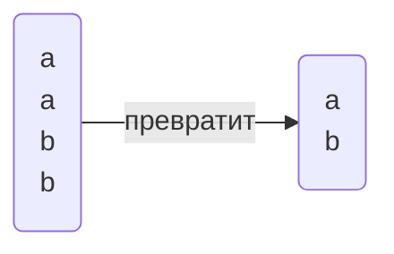

_Евгений Викторович_
%% Зачёт на бумаге %%

<mark style="background: #FF5582A6;">Установить: </mark>
- PostgreSQL
- PgAdmin

# Лекция 1
**Реляционная БД**:
- Данные распределены по смыслу по таблицам
- Между таблицами есть отношения

Одна таблица - одна сущность предметной области

**Столбцы** - характеристики сущности (фиксированное кол-во)
**Строки** - непосредственно экземпляры (неограниченное кол-во)

Столбцы обязательно имеют **тип данных**:
- Числовые 
- Символьные
- Для работы с датами
- Бинарные 
- Логические
- Прочие
*Также можно создавать свои типы данных*

`-- комментарий`
## Конструкция SELECT
```sql
-- Основное
select список_столбцов
from имя_таблицы
-- Доп.
where условия_на_выборку
order by список_столбцов -- Сортировка
```

```sql
-- Example
select id_comp, name from company
```
*Проекция отношений*

Необязательно название, можно выражение (в пределах запроса):
```sql
select Price * ProductCount from Products;
```

Также можно изменить название выходного столбца или задать псевдоним с помощью `AS`
```sql
select ProductCount as Title, Price * ProductCount as totalsum
```

## Условие WHERE
```sql
select * from Products where Price > 100
```
### Функции `like` и `ilike`
- `like 'text'` - с учётом регистра
- `ilike 'text` - без учёта регистра

- `_` - один произвольный символ
- `%` - произвольный набор символов, в том числе пустой

## Пустое значение `NULL`
> Значение в ячейке отсутствует 

Для проверки на пустое значение используется `IS`:
```sql
is null
is not null -- не пустая
```

> Любые операции со значением `NULL` возвращают `NULL`!!! 

`a = NULL` - всегда возвращает False

## Сортировка ORDER BY
```sql
select * from company order by name
```
Для обратной сортировки `desc` (действует на поле)
```sql
select * from company order by name, age desc
-- name в правильном порядке, age в обратном
```
## Ограничение вывода `limit`
```sql
select * from company limit 3
-- будет выведено только 3 строки
```

## Уникальные записи
Для выборки уникальных записей используется ключевое слово `distinct`
```sql
select distinct place from pass_in_trip order by 1 -- 1 - порядковый номер столбца в select (то есть place)
```
`order by 1` - плохая практика



## Объединение запросов `union`
```sql
select name from company
union
select name from passenger
```
Просто `union` удаляет повторяющиеся записи (накладывает `distinct`)
Для вывода всех записей `union all` 
```sql
select name from company
union all
select name from passenger
```

Оба запроса должны выдавать результаты в одинаковой формате (количество и типы полей)


# Практика 2
PgAdmin обращается к серверу только во время запросов


# Лекция 2
##### Создание/удаление объектов
- DDL - язык определения данных
- DML - язык обработки данных

Создание БД:
```SQL
create database <name>
```
Удаление БД (необратимый процесс): %% Весёлая конструкция %%
```SQL
drop database <name>
```
Эти конструкции выполняются на уровне кластера, все остальные(ниже) на уровне БД

**Схема** - некоторая возможность логически разделить объекты в БД, одноуровневые(схема в схеме невозможна). Схема по умолчанию: `public`

```SQL
create schema <name>
drop schema <name>
```

## Создание/удаление таблиц
Для создания:
```SQL
create table <name_table>
(name_colummn_1, type_data, attributes_column_1,
 имя_столбца_2, тип_данных, аттрибуты_столбца_2,
 );
```

Пример:
```SQL
create table customers
(
    Id SERIAL PRIMARY KEY,
    FirstName CHARACTER VARYING(30),
    LastNAme CHARACTER VARYING(30),
    Age INTEGER
);
```

Удаление:
```SQL
drop table <name>
```

### PRIMARY KEY
`PRIMARY KEY` - **первичный ключ**, уникально идентифицируют строку в таблице
Варианты создания первичного ключа
```SQL
create table Cusomers
(
    Id SERIAL PRIMARY KEY,
    ...
)
```
```SQL
create table Cusomers
(
    Id SERIAL,
    ...,
    PRIMARY KEY(Id)
)
```
В качестве первичного ключа может быть любой тип данных, главное чтобы было уникально.

`SERIAL`- создаёт поле int и генерирует последовательные номера (создаёт объект последовательности)1

Составной первичный ключ
```sql
create table Cusomers
(
    Id SERIAL,
    Num INTEGER
    ...,
    PRIMARY KEY (Id, Num)
)
```
`UNIQUE` - также уникальные значения, но не возможно связывать с другими таблицами


### NOT NULL
Чтобы указать, что обязательно нужны некие значения: `NOT NULL`
```SQL
create table Customers
(
    ...,
    Name CHARACTER VARYING(52) NOT NULL
    ...
)
```
По умолчанию NULL возможен, если не указать обратного


### DEFAULT
`DEFAULT` - значение по умолчанию, когда при добавлении не определяем значение этого атрибута
```SQL
create table customers
(
    Id SERIAL PRIMARY KEY,
    FirstName CHARACTER VARYING(30),
    LastNAme CHARACTER VARYING(30),
    Age INTEGER DEFAULT 18
);
```


### CHECK
`CHECK` - задаёт условие для проверки значений 
```SQL
Age INTEGER CHECK(Age > 0 AND Age < 100)
Email CHARACTER VARYING(30) UNIQUE CHECK(Email != '')
```
CHECK можно наложить на всю таблицу

### CONSTRAINT
`CONSTRAINT` - задаёт имя для ограничений 

## Изменение таблиц
```SQL
ALTER TABLE <name>
ADD name_column type_date [attr] |
DROP COLUMN name_column |
ALTER COLUMN name_column параметры |
ADD [CONSTRAINT] определение ограничения |
DROP [CONSTRAINT] имя_ограничения
;
```

С помощью `TYPE` можно поменять тип колонки (но не всегда работает) 
`SET` добавляет ограничение
`RENAME` - переименовать столбец

## Редактирование данных
### Добавление записей в таблицу
```SQL
INSERT INTO имя таблицы (столбец1, столбец 2, столбец 3) VALUES (значение 1, значение 2, значение 3)
```

Можно не указывать перечень столбцов, но тогда нужно указать значения для всех столбцов в определённом порядке

Также можно добавить несколько строк указывая после VALUES через запятую в скобках сами строки 

```SQL
UPDATE имя_таблицы SET столбец1 = значение1, столбец 2 = значение 2 WHERE условие(для каких записей обновить)
```

```SQL
DELETE FROM имя_таблицы WHERE условие (что конкретно удалить)
```
Удаляется строка!

# Практика 2

> Сортировка у `union` всегда одна и объявляется в конце

```SQL
select 3+4
```

Приведение типов:
```SQL
select 3::real
```

Функция random():
```SQL
select random();
select random() * 10;
```

`round()` - округляет число
`trunc()` - количество знаков после запятой

## Date
```SQL
select '2025-02-18'::date
```

## now()
`now()` - вернёт текущую дату и время в формате `timestamp with time zone`
В пределах запроса время не изменяется

## age()
`age()` - перегруженная функция
    1. Передаём дату, считает возраст до текущего дня
```SQL
select age('2006-11-30'::date)`
```
```OUTPUT
18 years 2 mons 18 days
```
## extract()
`extract()` - извлечь

Пример: количество полных лет 
```SQL
select extract(years from age('2006-11-30'::date))
```

Пример:
```SQL
select time_out from trip 
where time_out::time <= '12:00:00'::time
```

```SQL
select * from pass_in_trip where extract(month from date) = 4 and extract(year from date) = 2003;
select * from pass_in_trip where date>='2003-04-01'::date and date<='2003-04-30'::date; 
select * from pass_in_trip where date::text like '2003-04-%'
```

# Практика 3 

## substring(from, start, count)
Срез по строке
> <mark style="background: #FFB86CA6;">Индексы начинаются с 1</mark>
## lenght()
Возвращает длину строки

```SQL
-- task1 
select * from pass_in_trip where extract(year from date) = 2003;
-- where date::text like '2003-%'

-- task2 
select distinct id_psg from pass_in_trip 
-- where place like '1%' or place like '2%' or place like '3%';
where substring(place, 1, length(place) - 1)::int in (1, 2, 3);

-- task3
select name from company where country like '%an%' order by name --desc;

-- task4
select trip_no from pass_in_trip where extract(day from date) % 2 = 0;

-- task5
select *, extract(year from age(date)) from pass_in_trip;

-- task6
select * from pass_in_trip where extract(year from age(date)) > 20;

-- task7
select * from trip where time_out::time <= '12:00:00'::time;

-- task8
select * from trip where extract(hour from time_out) % 2 = 1;

-- task9
select * from trip where time_out > time_in;

-- task10 
select * from trip where days like '%2%4%';

-- task11 
select town_to from trip where days like '%3%5%'
```

## count()
Считает количество...

## split_part(string, delimiter(символ разделения), num)
Делит строку по символу и возвращает num часть 

# Лекция 3
## Аномалии, нормальные формы

> Придумать тему для индивидуального проекта. Индивидуальный проект - маленькая БД, где изначально есть четыре сущности. В известной области. 

**Атрибут** - свойство некоторой сущности
**Домен атрибута** - множество допустимых значений
**Кортеж** - конечное множество взаимосвязанных допустимых значений атрибутов
**Отношение** - конечное множество кортежей (таблица)
**Схема отношений** - конечное множество атрибутов, определяющее некоторую сущность
**Проекция** - отношение, полученное путём удаления и(или) перестановки некоторых атрибутов

**Аномалия** - ситуация в БД, которая приводит к противоречию в БД либо существенно усложняет обработку БД. Причиной является излишнее дублирование данных в таблице.
Аномалии:
![[Pasted image 20250224134609.png]] Пример
- Добавления
> Не можем добавить новую группу, так как добавление группы связано с добавлением студента.
- Редактирования
- Удаления

## Нормализация данных
**Нормализация** - способ организации данных. В нормализованной базе нет повторяющихся данных, с ней проще работать и можно менять её структуру для разных задач. В процессе нормализации данные преобразуют, чтобы они занимали меньше места, а поиск по элементам был быстрым и результативным.  
В процессе нормализации создают дополнительные атрибуты или таблицы.  

**Всего 7** (чаще всего используются первые три)  

Требование первой нормальной формы:
1. Значения атрибута должны быть простыми (атомарными - типо атом как неделимая частица)

<mark style="background: #FF5582A6;">Неправильно:</mark>

| Фирма  | Модели      |
| ------ | ----------- |
| BMW    | M5, X5M, M1 |
| Nissan | GT-R        |
<mark style="background: #BBFABBA6;">Правильно:
</mark>

| Фирма  | Модели |
| ------ | ------ |
| BMW    | M5     |
| BMW    | X5M    |
| BMW    | M1     |
| Nissan | GT-R   |
2. Каждая запись должна иметь уникальную идентификацию  

