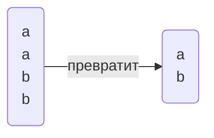
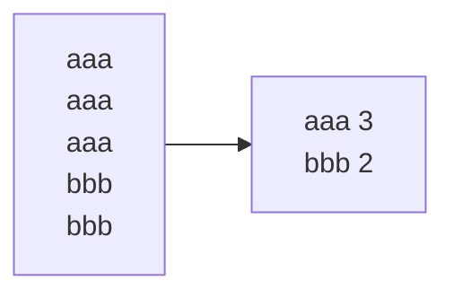

_Евгений Викторович_
%% Зачёт на бумаге %%

<mark style="background: #FF5582A6;">Установить: </mark>
- PostgreSQL
- PgAdmin

# Лекция 1
**Реляционная БД**:
- Данные распределены по смыслу по таблицам
- Между таблицами есть отношения

Одна таблица - одна сущность предметной области

**Столбцы** - характеристики сущности (фиксированное кол-во)
**Строки** - непосредственно экземпляры (неограниченное кол-во)

Столбцы обязательно имеют **тип данных**:
- Числовые 
- Символьные
- Для работы с датами
- Бинарные 
- Логические
- Прочие
*Также можно создавать свои типы данных*

`-- комментарий`
## Конструкция SELECT
```sql
-- Основное
select список_столбцов
from имя_таблицы
-- Доп.
where условия_на_выборку
order by список_столбцов -- Сортировка
```

```sql
-- Example
select id_comp, name from company
```
*Проекция отношений*

Необязательно название, можно выражение (в пределах запроса):
```sql
select Price * ProductCount from Products;
```

Также можно изменить название выходного столбца или задать псевдоним с помощью `AS`
```sql
select ProductCount as Title, Price * ProductCount as totalsum
```

## Условие WHERE
```sql
select * from Products where Price > 100
```
### Функции `like` и `ilike`
- `like 'text'` - с учётом регистра
- `ilike 'text` - без учёта регистра

- `_` - один произвольный символ
- `%` - произвольный набор символов, в том числе пустой

## Пустое значение `NULL`
> Значение в ячейке отсутствует 

Для проверки на пустое значение используется `IS`:
```sql
is null
is not null -- не пустая
```

> Любые операции со значением `NULL` возвращают `NULL`!!! 

`a = NULL` - всегда возвращает False

## Сортировка ORDER BY
```sql
select * from company order by name
```
Для обратной сортировки `desc` (действует на поле)
```sql
select * from company order by name, age desc
-- name в правильном порядке, age в обратном
```
## Ограничение вывода `limit`
```sql
select * from company limit 3
-- будет выведено только 3 строки
```

## Уникальные записи
Для выборки уникальных записей используется ключевое слово `distinct`
```sql
select distinct place from pass_in_trip order by 1 -- 1 - порядковый номер столбца в select (то есть place)
```
`order by 1` - плохая практика



## Объединение запросов `union`
```sql
select name from company
union
select name from passenger
```
Просто `union` удаляет повторяющиеся записи (накладывает `distinct`)
Для вывода всех записей `union all` 
```sql
select name from company
union all
select name from passenger
```

Оба запроса должны выдавать результаты в одинаковой формате (количество и типы полей)


# Практика 2
PgAdmin обращается к серверу только во время запросов


# Лекция 2
##### Создание/удаление объектов
- DDL - язык определения данных
- DML - язык обработки данных

Создание БД:
```SQL
create database <name>
```
Удаление БД (необратимый процесс): %% Весёлая конструкция %%
```SQL
drop database <name>
```
Эти конструкции выполняются на уровне кластера, все остальные(ниже) на уровне БД

**Схема** - некоторая возможность логически разделить объекты в БД, одноуровневые(схема в схеме невозможна). Схема по умолчанию: `public`

```SQL
create schema <name>
drop schema <name>
```

## Создание/удаление таблиц
Для создания:
```SQL
create table <name_table>
(name_colummn_1 type_data attributes_column_1,
 имя_столбца_2 тип_данных аттрибуты_столбца_2,
 );
```

Пример:
```SQL
create table customers
(
    Id SERIAL PRIMARY KEY,
    FirstName CHARACTER VARYING(30),
    LastNAme CHARACTER VARYING(30),
    Age INTEGER
);
```

Удаление:
```SQL
drop table <name>
```

### PRIMARY KEY
`PRIMARY KEY` - **первичный ключ**, уникально идентифицируют строку в таблице
Варианты создания первичного ключа
```SQL
create table Cusomers
(
    Id SERIAL PRIMARY KEY,
    ...
)
```
```SQL
create table Cusomers
(
    Id SERIAL,
    ...,
    PRIMARY KEY(Id)
)
```
В качестве первичного ключа может быть любой тип данных, главное чтобы было уникально.

`SERIAL`- создаёт поле int и генерирует последовательные номера (создаёт объект последовательности)1

Составной первичный ключ
```sql
create table Cusomers
(
    Id SERIAL,
    Num INTEGER
    ...,
    PRIMARY KEY (Id, Num)
)
```
`UNIQUE` - также уникальные значения, но не возможно связывать с другими таблицами


### NOT NULL
Чтобы указать, что обязательно нужны некие значения: `NOT NULL`
```SQL
create table Customers
(
    ...,
    Name CHARACTER VARYING(52) NOT NULL
    ...
)
```
По умолчанию NULL возможен, если не указать обратного


### DEFAULT
`DEFAULT` - значение по умолчанию, когда при добавлении не определяем значение этого атрибута
```SQL
create table customers
(
    Id SERIAL PRIMARY KEY,
    FirstName CHARACTER VARYING(30),
    LastNAme CHARACTER VARYING(30),
    Age INTEGER DEFAULT 18
);
```


### CHECK
`CHECK` - задаёт условие для проверки значений 
```SQL
Age INTEGER CHECK(Age > 0 AND Age < 100)
Email CHARACTER VARYING(30) UNIQUE CHECK(Email != '')
```
CHECK можно наложить на всю таблицу

### CONSTRAINT
`CONSTRAINT` - задаёт имя для ограничений 

## Изменение таблиц
```SQL
ALTER TABLE <name>
ADD name_column type_date [attr] |
DROP COLUMN name_column |
ALTER COLUMN name_column параметры |
ADD [CONSTRAINT] определение ограничения |
DROP [CONSTRAINT] имя_ограничения
;
```

С помощью `TYPE` можно поменять тип колонки (но не всегда работает) 
`SET` добавляет ограничение
`RENAME` - переименовать столбец

## Редактирование данных
### Добавление записей в таблицу
```SQL
INSERT INTO имя таблицы (столбец1, столбец 2, столбец 3) VALUES (значение 1, значение 2, значение 3)
```

Можно не указывать перечень столбцов, но тогда нужно указать значения для всех столбцов в определённом порядке

Также можно добавить несколько строк указывая после VALUES через запятую в скобках сами строки 

```SQL
UPDATE имя_таблицы SET столбец1 = значение1, столбец 2 = значение 2 WHERE условие(для каких записей обновить)
```

```SQL
DELETE FROM имя_таблицы WHERE условие (что конкретно удалить)
```
Удаляется строка!

# Практика 2

> Сортировка у `union` всегда одна и объявляется в конце

```SQL
select 3+4
```

Приведение типов:
```SQL
select 3::real
```

Функция random():
```SQL
select random();
select random() * 10;
```

`round()` - округляет число
`trunc()` - количество знаков после запятой

## Date
```SQL
select '2025-02-18'::date
```

## now()
`now()` - вернёт текущую дату и время в формате `timestamp with time zone`
В пределах запроса время не изменяется

## age()
`age()` - перегруженная функция
    1. Передаём дату, считает возраст до текущего дня
```SQL
select age('2006-11-30'::date)`
```
```OUTPUT
18 years 2 mons 18 days
```
## extract()
`extract()` - извлечь

Пример: количество полных лет 
```SQL
select extract(years from age('2006-11-30'::date))
```

Пример:
```SQL
select time_out from trip 
where time_out::time <= '12:00:00'::time
```

```SQL
select * from pass_in_trip where extract(month from date) = 4 and extract(year from date) = 2003;
select * from pass_in_trip where date>='2003-04-01'::date and date<='2003-04-30'::date; 
select * from pass_in_trip where date::text like '2003-04-%'
```

# Практика 3 

## substring(from, start, count)
Срез по строке
> <mark style="background: #FFB86CA6;">Индексы начинаются с 1</mark>
## lenght()
Возвращает длину строки

```SQL
-- task1 
select * from pass_in_trip where extract(year from date) = 2003;
-- where date::text like '2003-%'

-- task2 
select distinct id_psg from pass_in_trip 
-- where place like '1%' or place like '2%' or place like '3%';
where substring(place, 1, length(place) - 1)::int in (1, 2, 3);

-- task3
select name from company where country like '%an%' order by name --desc;

-- task4
select trip_no from pass_in_trip where extract(day from date) % 2 = 0;

-- task5
select *, extract(year from age(date)) from pass_in_trip;

-- task6
select * from pass_in_trip where extract(year from age(date)) > 20;

-- task7
select * from trip where time_out::time <= '12:00:00'::time;

-- task8
select * from trip where extract(hour from time_out) % 2 = 1;

-- task9
select * from trip where time_out > time_in;

-- task10 
select * from trip where days like '%2%4%';

-- task11 
select town_to from trip where days like '%3%5%'
```

## count()
Считает количество...

## split_part(string, delimiter(символ разделения), num)
Делит строку по символу и возвращает num часть 

# Лекция 3
## Аномалии, нормальные формы

> Придумать тему для индивидуального проекта. Индивидуальный проект - маленькая БД, где изначально есть четыре сущности. В известной области. 

**Атрибут** - свойство некоторой сущности
**Домен атрибута** - множество допустимых значений
**Кортеж** - конечное множество взаимосвязанных допустимых значений атрибутов
**Отношение** - конечное множество кортежей (таблица)
**Схема отношений** - конечное множество атрибутов, определяющее некоторую сущность
**Проекция** - отношение, полученное путём удаления и(или) перестановки некоторых атрибутов

**Аномалия** - ситуация в БД, которая приводит к противоречию в БД либо существенно усложняет обработку БД. Причиной является излишнее дублирование данных в таблице.
Аномалии:
![[Pasted image 20250224134609.png]] Пример
- Добавления
> Не можем добавить новую группу, так как добавление группы связано с добавлением студента.
- Редактирования
- Удаления

## Нормализация данных
**Нормализация** - способ организации данных. В нормализованной базе нет повторяющихся данных, с ней проще работать и можно менять её структуру для разных задач. В процессе нормализации данные преобразуют, чтобы они занимали меньше места, а поиск по элементам был быстрым и результативным.  
В процессе нормализации создают дополнительные атрибуты или таблицы.  

**Всего 7** (чаще всего используются первые три)  

### Первая нормальная форма
Требование первой нормальной формы:
1. Значения атрибута должны быть простыми (атомарными - типо атом как неделимая частица)

<mark style="background: #FF5582A6;">Неправильно:</mark>

| Фирма  | Модели      |
| ------ | ----------- |
| BMW    | M5, X5M, M1 |
| Nissan | GT-R        |
  
<mark style="background: #BBFABBA6;">Правильно:
</mark>

| Фирма  | Модели |
| ------ | ------ |
| BMW    | M5     |
| BMW    | X5M    |
| BMW    | M1     |
| Nissan | GT-R   |
2. Каждая запись должна иметь уникальную идентификацию  (*Сложные ключи*(состоящие из нескольких атрибутов) и *простые ключи*)  
> **Простые ключи** - новые данные, но проще работать
> **Сложные ключи** - когда используется связь, то весь ключ переносится в в дочернюю таблицу (и будет так расти)

### Вторая нормальная форма
Включает в себя первую нормальную форму, имеет составной ключ  и все остальные неключевые атрибуты зависят от *всего ключа*  

| Модель | Фирма  | Цена    | Скидка |
| ------ | ------ | ------- | ------ |
| M5     | BMW    | 5500000 | 5%     |
| X5M    | BMW    | 6000000 | 5%     |
| M1     | BMW    | 2500000 | 5%     |
| GT-R   | Nissan | 5000000 | 10%    |

Цена зависит от `модели` и `фирмы`, но `скидка` зависит только от `фирмы`. Это <mark style="background: #FF5582A6;">не удовлетворяет</mark> второй нормальной форме.  

Эта ситуация решается путём декомпозиции, делением на два или больше отношений.  

| Модель | Фирма  | Цена    |
| ------ | ------ | ------- |
| M5     | BMW    | 5500000 |
| X5M    | BMW    | 6000000 |
| M1     | BMW    | 2500000 |
| GT-R   | Nissan | 5000000 |
|        |        |         |
| Фирма  | Скидка |         |
| BMW    | 5%     |         |
| Nissan | 10%    |         |
  
Вторая нормальная форма рассматривается только для сложных ключей.  

### Третья нормальная группа
Находится во второй нормальной форме и каждый не ключевой атрибут нетранзитивно зависит от первичного ключа. Чтобы нормализовать БД до 3НФ, необходимо сделать так, чтобы в таблице отсутствовали неключевые столбцы, которые зависят от других неключевых столбцов.   
<mark style="background: #FF5582A6;">Неправильно:</mark> 

| Модель | Магазин    | Телефон  |
| ------ | ---------- | -------- |
| BMW    | Риал-авто  | 87-33-98 |
| Audi   | Риал-авто  | 87-33-98 |
| Nissan | Некст-Авто | 94-54-12 |
  
Снова делить. 

| Магазин    | Телефон    |
| ---------- | ---------- |
| Риал-авто  | 87-33-98   |
| Некст-Авто | 94-54-12   |
|            |            |
| Модель     | Магазин    |
| BMW        | Риал-авто  |
| Audi       | Риал-авто  |
| Nissan     | Некст-Авто |


# Практика 4

```SQL
insert into students values (1, 'Ivan', 'Ivanov')
```
В том порядке значение в каком они идут в таблице, и ровно такое же количество

<mark style="background: #FF5582A6;">ВАЖНО!!!</mark>
**Перед выполнение команд, таких как `UPDATE` или `DELETE`, всегда писать и проверять условие `WHERE` с помощью `SELECT` и уже потом выполняем `UPDATE` или `DELETE`**

# Практика 5 
## between
> Проверяет значение в диапазоне, включает левое и правое значение
```SQL
select * from trip 
where time_out::time between '10:00'::time and '16:00'::time
```

## case 
```SQL
select 
    case 
        when time_in > time_out then time_in - time_out
        else time_in - time_out + '24:00'::interval
    end,
    time_in - time_out
from trip
```
  
## .
**Serial** - не тип столбца, а инструкция, которая сначала создаёт `последовательность`, а столбец имеет тип `integer` и имеет значение по умолчанию, которое берётся из ранее созданной последовательности. 

> Если есть таблица с `Serial`, то вручную значения этого столбца не выставляем (за малым исключением, но тогда нужно изменить `Serial)

Для изменения `Serial`:
```SQL
alter sequence student_id_seq restart with 100;
```

# Практика 6
Добавление первичного ключа: (ограничение на всю таблицу)
```SQL
alter table student add primary key(id); 
```

Ограничение на конкретный столбец:
```SQL
alter table student 
alter COLUMN fname set not null,
alter COLUMN lname set not null;
```

`IF EXISTS` - если существует. Если не существует, то предупреждение, но не ошибка
```SQL
drop table if exists student 
```

> `default` срабатывает только, когда поле не заполняем. Если мы явно указываем `null`, то `default` не сработает.

# Лекция 4
## Агрегирующие функции
> Агрегирующие функции выполняют операции **над набором строк**. Результатом такой функции является **одно** значение, а набор строк, для которых она выполнялась, сворачиваются в **одну строку.**  

### count(\*)
> Количество записей
```SQL
select count(*) from company
```
### group by
> Если в запросе присутствует агрегирующая функция и неагргирующие атрибуты, то все эти атрибуты <mark style="background: #FF5582A6;">обязательно перечисляются в `group by`</mark>.
```SQL
select name, count(*) 
from passenger
group by name
```

`group by` - Группировка по уникальным атрибутам   
### having()
> Ограничивает набор записей выдающих в результат (<mark style="background: #FFB86CA6;">тот же where, только работает после группировки</mark>)
```SQL
select name, count(*)
from company
group by name
having count(*) > 1
```

```SQL
select S_group, avg(rating)
from company
1) where S_group like 'K0709-%'
group by S_group
2) having S_group like 'K0709-%'
```
Результат одинаковый, но для сервера выполнение по разному. *`where` будет быстрее.*  
`having` - <mark style="background: #BBFABBA6;">используется для сортировки результата агрегирующий функций.</mark> На этапе `where` нет ещё результата агрегирующих функций.

## Связи
**Связь** - ассоциация(отношение) между сущностями разных типов.  
Выделяют **главную**(родительская) и **зависимую**(дочерняя). Родительская спокойно может обойтись без дочерней.
> Например: студент и группа. Студент без группы не может быть. Группа без студента может существовать.
  
### Связь один к одному (1-1)
Объекту одной сущности можно сопоставить только один объект другой сущности
> Пример: человек и СНИЛС
  
### Связь один ко многим (1-\*)
Несколько строк из дочерней таблицы зависят от одной строки в родительской
> Пример: У одного человека может быть несколько паспортов. Но один паспорт имеет владельца только в виде одного человека.

### Связь многие ко многим (\*-\*)
Одна строка из таблицы А может быть связана с множеством строк из таблицы Б. В свою очередь строка из таблицы Б может быть связана со множеством строк таблицы А.
> Пример: статьи и тэги. Статья имеет множество тегов. Тэги имеют множества статьей.

### Создание связей
Используются внешние ключи.   
**Внешний ключ** - один или несколько атрибутов, которые привязывают сущности одной таблицы к сущности другой.  
Для создания внешних ключей используется `references`.  
#### При создании таблицы
...
#### Изменение существующей таблицы
```SQL
alter table public."ArticleTags"
    add foreign key ('ArticleId') references public."Articles" ("ArticleId")
```

- В базе данных есть только тип один ко многим.  
- Один к одному реализуется с помощью признака уникальности `UNIQUE`  
- Для многие ко многим создаётся специальная таблица отношения - таблица связки. 

#### Параметры связей (атрибуты)
`Foreign key` может иметь атрибуты, определяющие действия БД при удалении (`ON DELETE`) или редактировании (`ON UPDATE`) записи в родительской таблице. 
- `SET NULL` - при удалении записи из родительской таблицы, то в дочерней пропишится `NULL`
- `SET DEFAULT` -  ставится значение по умолчанию
- `NO ACTION` или `RESTRICT` - не позволяет удалить запись в родительской таблице. 
- `CASCADE` - Если удаляется в родительской, то всё связанное удаляется и в дочерней  
```SQL
alter table public."ArticleTags"
    add foreign key ('ArticleId') 
    references public."Articles" ("ArticleId")
        on update no action
        on delete no action;
```
`NO ACTION` - позволяет отсрочить проверку. `RESTRICT` - ставит жёсткий запрет.  

# Практика 7
`trim()` - убирает пробелы
Третий вариант `insert into`:
```SQL
insert into country (name)
select distinct country from company
```
> Вставляет результат `select` в таблицу `country`

`||` - конкатенация строк  
`''` - экранирование `'` 
```SQL
-- Изменения passenger
select * from passenger;
alter table passenger add column lname text;
update passenger set lname = split_part(name, ' ', -1);
select *, trim(split_part(name, lname, 1)) from passenger;
update passenger set name = trim(split_part(name, lname, 1));
alter table passenger alter column lname set not null;

alter table passenger 
add constraint passenger_sex_check
	check (sex in ('m', 'f'));

-- Изменение company
select * from company;

create table country (
	id_country Serial PRIMARY KEY,
	name text not null
);

select * from country;

select distinct replace(country, '
', '') from company;

update company set country = 'Russia' where country like 'Russia%';
select distinct country from company;

insert into country (name)
select distinct country from company;

alter table company add id_country integer;

select *, 'update company set id_country='||
	id_country::text||' where country = ''' || name || ''';' from country;

update company set id_country=1 where country = 'Russia';
update company set id_country=2 where country = 'England';
update company set id_country=3 where country = 'France';

alter table company drop column country;

select * from company;
```

# Практика 8
Увеличение количества ключей в первичном ключе - уменьшает производительность базы.  
`string_to_table(days, ',')` - табличная функция, то есть возвращает таблицу. Разделяет значение по `,` и выносит каждое значение на отдельную строчку.

Самолёты в отдельных отношениях, planes, код в trip, тоже самое в town_to и town_in через union. planes, towns  

```SQL
-- pass_in_trip
alter table pass_in_trip alter column date type date; 
select * from pass_in_trip;
-- trip
select * from trip;
alter table trip alter column time_out type time;
alter table trip alter column time_in type time;

create table trip_days (
	trip_no int not null,
	day int not null check (day between 1 and 7),
	primary key (trip_no, day)
)
select * from trip_days;

select trip_no, string_to_table 
from trip, string_to_table(days, ',');

insert into trip_days
select trip_no, string_to_table::int
from trip, string_to_table(days, ',');

select * from trip_days;
alter table trip drop column days;

select * from trip;
-- homework
create table planes (
	id_plane Serial primary key,
	name text not null
);

insert into planes (name)
select distinct plane from trip;

select * from planes;

alter table trip add id_plane int;
select * from trip;

select *, 'update trip set id_plane = '|| id_plane::text ||' where plane = '''|| name ||''';' from planes;

update trip set id_plane = 1 where plane = 'Boeing';
update trip set id_plane = 2 where plane = 'IL-86';
update trip set id_plane = 3 where plane = 'TU-134';
update trip set id_plane = 4 where plane = 'TU-154';

select * from trip;
select * from planes;

alter table trip drop plane;

create table towns (
	id_town Serial primary key,
	name text not null
)

alter table trip alter id_plane set not null;

select * from towns;

insert into towns (name)
select town_from from trip
union
select town_to from trip;

select *, 'update trip set town_from = ' || id_town::text ||' where town_from ='''|| name ||''';' from towns;
update trip set town_from = 1 where town_from ='London';
update trip set town_from = 2 where town_from ='Paris';
update trip set town_from = 3 where town_from ='Singapore';
update trip set town_from = 4 where town_from ='Moscow';
update trip set town_from = 5 where town_from ='Vladivostok';
update trip set town_from = 6 where town_from ='Rostov';

select * from trip;

select *, 'update trip set town_to = ' || id_town::text ||' where town_to ='''|| name ||''';' from towns;
update trip set town_to = 1 where town_to ='London';
update trip set town_to = 2 where town_to ='Paris';
update trip set town_to = 3 where town_to ='Singapore';
update trip set town_to = 4 where town_to ='Moscow';
update trip set town_to = 5 where town_to ='Vladivostok';
update trip set town_to = 6 where town_to ='Rostov';

select * from trip;
```


# Практика 9
Добавление связи происходит в дочернюю таблицу  
```SQL
alter table student 
	add foreign key ("id_grp") references s_group (id);
```
Проверяет все ли значения соответствуют тем, что есть в s_group  
> Чтобы изменить `foreign key`, нужно удалить и потом создать новый  

`set null` и `set default` почти никогда не используется  
Чаще всего `no action` и `cascade`(удобно, но опасно)  
```SQL
create table s_group (
	id serial primary key,
	name text not null
);
create table student (
	id serial primary key,
	fio text not null,
	id_grp integer
);
insert into s_group (name) values ('K0709-23-1'), ('K0709-23-2'), ('K0709-23-3');  
select * from s_group;
insert into student (fio, id_grp) values
	('student 001', 2),
	('student 011', 1),
	('student 021', 3),
	('student 052', 3);

alter table student 
	add foreign key (id_grp) references s_group (id);
	
delete from s_group where id = 3; --ошибка, нарушение целостности

-- Вариант 1.1
alter table student
	drop constraint student_id_grp_fkey,
	add foreign key (id_grp) references s_group (id)
	on delete set null;
-- Вариант 1.2
alter table student 
	drop constraint student_id_grp_fkey,
	add foreign key (id_grp) references s_group (id)
	on delete set default;
-- Вариант 2.1 (по умолчанию)
alter table student 
	drop constraint student_id_grp_fkey,
	add foreign key (id_grp) references s_group (id)
	on delete no action;
-- Вариант 2.2
alter table student 
	drop constraint student_id_grp_fkey,
	add foreign key (id_grp) references s_group (id)
	on delete restrict;
-- Вариант 3
alter table student 
	drop constraint student_id_grp_fkey,
	add foreign key (id_grp) references s_group (id)
	on delete cascade;

delete from s_group where id = 2;

select * from student;
select * from s_group;
```

# Лекция 5
## Реляционная алгебра, сложные запросы
Реляционная алгебра базируется на теории множеств и является основой логики работы баз данных.  
Результатом любой операции реляционной алгебры является новое отношение
#### Проекция
> Операция, при которой из отношения выделяется часть атрибутов
#### Выбор
> Из отношения выбираем только определённые записи
#### Объединение
> Состыковываем отношения
#### Пересечение
> Отношение, в которое входят кортежи в состав первого отношения и добавляются кортежи из второго.
#### Вычитание
> Берём отношение 1, кроме кортежей, которые существуют в отношении 2
#### Умножение (Декартово произведение)
> Список атрибутов - сумма атрибутов из первого и второго отношения. Кортежи результата будут составляться как произведение каждого кортежа первого отношения на все кортежи второго отношения

```SQL
select * from passenger, pass_in_trip
```
Когда в `from` находится несколько таблиц
####  Соединение
> Произведение с условием на соединение записей
```SQL
select * from passenger, pass_in_trip
where passenger.id_psg = pass_in_trip.id_psg
```
### Варианты соединения: 
Представленные таблицы:

| id  | name    | d.id   |
| --- | ------- | ------ |
| 1   | Alice   | 10     |
| 2   | Bob     | 20     |
| 3   | Charlie | 30     |
| 4   | David   | NULL   |

| id  | name      |
| --- | --------- |
| 10  | HR        |
| 20  | IT        |
| 40  | Finance   |

  
#### INNER JOIN (или просто JOIN)
Внутреннее соединение, в результате только те кортежи, для которых нашлось соответствие, то есть 
> Только те записи, которые существуют в обоих таблицах
```SQL
select e.id, e.name, e.department_id, d.department_name
from employees e -- e - это alias
inner join departments d on e.department.id = d.department.id;
```

| id  | name  | d.id | d.name |
| --- | ----- | ---- | ------ |
| 1   | Alice | 10   | HR     |
| 2   | Bob   | 20   | IT     |

#### LEFT JOIN (LEFT OUTER JOIN)
> Все кортежи из первой таблицы + совпадающие записи из второй таблицы 
```SQL
select e.id, e.name, e.department_id, d.department_name
from employees e -- e - это alias
left join departments d on e.department.id = d.department.id;
```

| id  | name    | d.id | d.name |
| --- | ------- | ---- | ------ |
| 1   | Alice   | 10   | HR     |
| 2   | Bob     | 20   | IT     |
| 3   | Charlie | 30   | NULL   |
| 4   | David   | NULL | NULL   |
  
#### RIGHT JOIN (RIGHT OUTER JOIN)
> Все кортежи из второй таблицы + совпадающие записи из первой таблицы 

| id   | name  | d.id | d.name    |
| ---- | ----- | ---- | --------- |
| 1    | Alice | 10   | HR        |
| 2    | Bob   | 20   | IT        |
| NULL | NULL  | NULL | Finance   |
#### FULL JOIN
> Все кортежи из первой таблицы и из второй. Записи состыкованные и оствшиеся
```SQL
select e.id, e.name, e.department_id, d.department_name
from employees e -- e - это alias
full join departments d on e.department.id = d.department.id;
```

| id   | name    | d.id | d.name  |
| ---- | ------- | ---- | ------- |
| 1    | Alice   | 10   | HR      |
| 2    | Bob     | 20   | IT      |
| 3    | Charlie | 30   | NULL    |
| 4    | David   | NULL | NULL    |
| NULL | NULL    | NULL | Finance |

### Общие рекомендации по построению запросов
1. Выбираем таблицу, являющейся основной в контексте запроса. Например, если нужно выбрать сведения о полетах пассажира – этой таблицей будет `pass_in_trip`, начинаем с нее формировать предложение `from`
 2. Добавляем к ней с использованием `left join` таблицы, уточняющие сведения в запросе в порядке их следования в иерархии структуры БД
 3. Формируем предложение `where`
 4. Формируем текст предложения `select` 
 5. Формируем предложение `order by`
 
