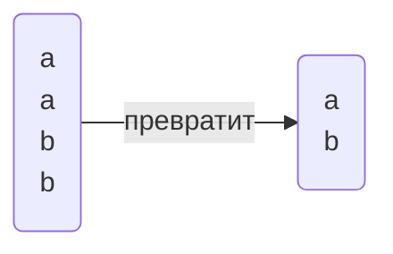
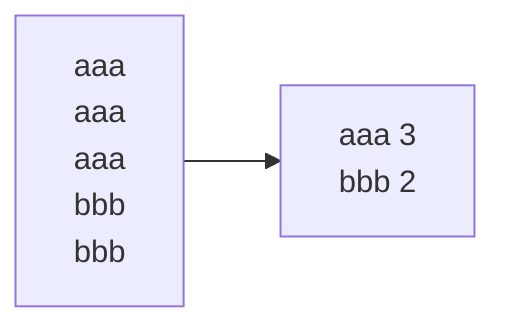
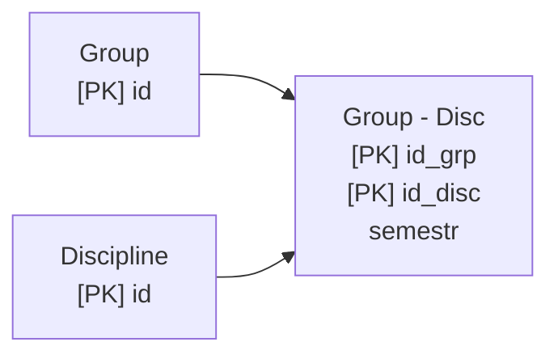

_Евгений Викторович_
%% Зачёт на бумаге %%

<mark style="background: #FF5582A6;">Установить: </mark>
- PostgreSQL
- PgAdmin

# Лекция 1
**Реляционная БД**:
- Данные распределены по смыслу по таблицам
- Между таблицами есть отношения

Одна таблица - одна сущность предметной области

**Столбцы** - характеристики сущности (фиксированное кол-во)
**Строки** - непосредственно экземпляры (неограниченное кол-во)

Столбцы обязательно имеют **тип данных**:
- Числовые 
- Символьные
- Для работы с датами
- Бинарные 
- Логические
- Прочие
*Также можно создавать свои типы данных*

`-- комментарий`
## Конструкция SELECT
```sql
-- Основное
select список_столбцов
from имя_таблицы
-- Доп.
where условия_на_выборку
order by список_столбцов -- Сортировка
```

```sql
-- Example
select id_comp, name from company
```
*Проекция отношений*

Необязательно название, можно выражение (в пределах запроса):
```sql
select Price * ProductCount from Products;
```

Также можно изменить название выходного столбца или задать псевдоним с помощью `AS`
```sql
select ProductCount as Title, Price * ProductCount as totalsum
```

## Условие WHERE
```sql
select * from Products where Price > 100
```
### Функции `like` и `ilike`
- `like 'text'` - с учётом регистра
- `ilike 'text` - без учёта регистра

- `_` - один произвольный символ
- `%` - произвольный набор символов, в том числе пустой

## Пустое значение `NULL`
> Значение в ячейке отсутствует 

Для проверки на пустое значение используется `IS`:
```sql
is null
is not null -- не пустая
```

> Любые операции со значением `NULL` возвращают `NULL`!!! 

`a = NULL` - всегда возвращает False

## Сортировка ORDER BY
```sql
select * from company order by name
```
Для обратной сортировки `desc` (действует на поле)
```sql
select * from company order by name, age desc
-- name в правильном порядке, age в обратном
```
## Ограничение вывода `limit`
```sql
select * from company limit 3
-- будет выведено только 3 строки
```

## Уникальные записи
Для выборки уникальных записей используется ключевое слово `distinct`
```sql
select distinct place from pass_in_trip order by 1 -- 1 - порядковый номер столбца в select (то есть place)
```
`order by 1` - плохая практика



## Объединение запросов `union`
```sql
select name from company
union
select name from passenger
```
Просто `union` удаляет повторяющиеся записи (накладывает `distinct`)
Для вывода всех записей `union all` 
```sql
select name from company
union all
select name from passenger
```

Оба запроса должны выдавать результаты в одинаковой формате (количество и типы полей)


# Практика 2
PgAdmin обращается к серверу только во время запросов


# Лекция 2
##### Создание/удаление объектов
- DDL - язык определения данных
- DML - язык обработки данных

Создание БД:
```SQL
create database <name>
```
Удаление БД (необратимый процесс): %% Весёлая конструкция %%
```SQL
drop database <name>
```
Эти конструкции выполняются на уровне кластера, все остальные(ниже) на уровне БД

**Схема** - некоторая возможность логически разделить объекты в БД, одноуровневые(схема в схеме невозможна). Схема по умолчанию: `public`

```SQL
create schema <name>
drop schema <name>
```

## Создание/удаление таблиц
Для создания:
```SQL
create table <name_table>
(name_colummn_1 type_data attributes_column_1,
 имя_столбца_2 тип_данных аттрибуты_столбца_2,
 );
```

Пример:
```SQL
create table customers
(
    Id SERIAL PRIMARY KEY,
    FirstName CHARACTER VARYING(30),
    LastNAme CHARACTER VARYING(30),
    Age INTEGER
);
```

Удаление:
```SQL
drop table <name>
```

### PRIMARY KEY
`PRIMARY KEY` - **первичный ключ**, уникально идентифицируют строку в таблице
Варианты создания первичного ключа
```SQL
create table Cusomers
(
    Id SERIAL PRIMARY KEY,
    ...
)
```
```SQL
create table Cusomers
(
    Id SERIAL,
    ...,
    PRIMARY KEY(Id)
)
```
В качестве первичного ключа может быть любой тип данных, главное чтобы было уникально.

`SERIAL`- создаёт поле int и генерирует последовательные номера (создаёт объект последовательности)1

Составной первичный ключ
```sql
create table Cusomers
(
    Id SERIAL,
    Num INTEGER
    ...,
    PRIMARY KEY (Id, Num)
)
```
`UNIQUE` - также уникальные значения, но не возможно связывать с другими таблицами


### NOT NULL
Чтобы указать, что обязательно нужны некие значения: `NOT NULL`
```SQL
create table Customers
(
    ...,
    Name CHARACTER VARYING(52) NOT NULL
    ...
)
```
По умолчанию NULL возможен, если не указать обратного


### DEFAULT
`DEFAULT` - значение по умолчанию, когда при добавлении не определяем значение этого атрибута
```SQL
create table customers
(
    Id SERIAL PRIMARY KEY,
    FirstName CHARACTER VARYING(30),
    LastNAme CHARACTER VARYING(30),
    Age INTEGER DEFAULT 18
);
```


### CHECK
`CHECK` - задаёт условие для проверки значений 
```SQL
Age INTEGER CHECK(Age > 0 AND Age < 100)
Email CHARACTER VARYING(30) UNIQUE CHECK(Email != '')
```
CHECK можно наложить на всю таблицу

### CONSTRAINT
`CONSTRAINT` - задаёт имя для ограничений 

## Изменение таблиц
```SQL
ALTER TABLE <name>
ADD name_column type_date [attr] |
DROP COLUMN name_column |
ALTER COLUMN name_column параметры |
ADD [CONSTRAINT] определение ограничения |
DROP [CONSTRAINT] имя_ограничения
;
```

С помощью `TYPE` можно поменять тип колонки (но не всегда работает) 
`SET` добавляет ограничение
`RENAME` - переименовать столбец

## Редактирование данных
### Добавление записей в таблицу
```SQL
INSERT INTO имя таблицы (столбец1, столбец 2, столбец 3) VALUES (значение 1, значение 2, значение 3)
```

Можно не указывать перечень столбцов, но тогда нужно указать значения для всех столбцов в определённом порядке

Также можно добавить несколько строк указывая после VALUES через запятую в скобках сами строки 

```SQL
UPDATE имя_таблицы SET столбец1 = значение1, столбец 2 = значение 2 WHERE условие(для каких записей обновить)
```

```SQL
DELETE FROM имя_таблицы WHERE условие (что конкретно удалить)
```
Удаляется строка!

# Практика 2

> Сортировка у `union` всегда одна и объявляется в конце

```SQL
select 3+4
```

Приведение типов:
```SQL
select 3::real
```

Функция random():
```SQL
select random();
select random() * 10;
```

`round()` - округляет число
`trunc()` - количество знаков после запятой

## Date
```SQL
select '2025-02-18'::date
```

## now()
`now()` - вернёт текущую дату и время в формате `timestamp with time zone`
В пределах запроса время не изменяется

## age()
`age()` - перегруженная функция
    1. Передаём дату, считает возраст до текущего дня
```SQL
select age('2006-11-30'::date)`
```
```OUTPUT
18 years 2 mons 18 days
```
## extract()
`extract()` - извлечь

Пример: количество полных лет 
```SQL
select extract(years from age('2006-11-30'::date))
```

Пример:
```SQL
select time_out from trip 
where time_out::time <= '12:00:00'::time
```

```SQL
select * from pass_in_trip where extract(month from date) = 4 and extract(year from date) = 2003;
select * from pass_in_trip where date>='2003-04-01'::date and date<='2003-04-30'::date; 
select * from pass_in_trip where date::text like '2003-04-%'
```

# Практика 3 

## substring(from, start, count)
Срез по строке
> <mark style="background: #FFB86CA6;">Индексы начинаются с 1</mark>
## lenght()
Возвращает длину строки

```SQL
-- task1 
select * from pass_in_trip where extract(year from date) = 2003;
-- where date::text like '2003-%'

-- task2 
select distinct id_psg from pass_in_trip 
-- where place like '1%' or place like '2%' or place like '3%';
where substring(place, 1, length(place) - 1)::int in (1, 2, 3);

-- task3
select name from company where country like '%an%' order by name --desc;

-- task4
select trip_no from pass_in_trip where extract(day from date) % 2 = 0;

-- task5
select *, extract(year from age(date)) from pass_in_trip;

-- task6
select * from pass_in_trip where extract(year from age(date)) > 20;

-- task7
select * from trip where time_out::time <= '12:00:00'::time;

-- task8
select * from trip where extract(hour from time_out) % 2 = 1;

-- task9
select * from trip where time_out > time_in;

-- task10 
select * from trip where days like '%2%4%';

-- task11 
select town_to from trip where days like '%3%5%'
```

## count()
Считает количество...

## split_part(string, delimiter(символ разделения), num)
Делит строку по символу и возвращает num часть 

# Лекция 3
## Аномалии, нормальные формы

> Придумать тему для индивидуального проекта. Индивидуальный проект - маленькая БД, где изначально есть четыре сущности. В известной области. 

**Атрибут** - свойство некоторой сущности
**Домен атрибута** - множество допустимых значений
**Кортеж** - конечное множество взаимосвязанных допустимых значений атрибутов
**Отношение** - конечное множество кортежей (таблица)
**Схема отношений** - конечное множество атрибутов, определяющее некоторую сущность
**Проекция** - отношение, полученное путём удаления и(или) перестановки некоторых атрибутов

**Аномалия** - ситуация в БД, которая приводит к противоречию в БД либо существенно усложняет обработку БД. Причиной является излишнее дублирование данных в таблице.
Аномалии:
![[Pasted image 20250224134609.png]] Пример
- Добавления
> Не можем добавить новую группу, так как добавление группы связано с добавлением студента.
- Редактирования
- Удаления

## Нормализация данных
**Нормализация** - способ организации данных. В нормализованной базе нет повторяющихся данных, с ней проще работать и можно менять её структуру для разных задач. В процессе нормализации данные преобразуют, чтобы они занимали меньше места, а поиск по элементам был быстрым и результативным.  
В процессе нормализации создают дополнительные атрибуты или таблицы.  

**Всего 7** (чаще всего используются первые три)  

### Первая нормальная форма
Требование первой нормальной формы:
1. Значения атрибута должны быть простыми (атомарными - типо атом как неделимая частица)

<mark style="background: #FF5582A6;">Неправильно:</mark>

| Фирма  | Модели      |
| ------ | ----------- |
| BMW    | M5, X5M, M1 |
| Nissan | GT-R        |
  
<mark style="background: #BBFABBA6;">Правильно:
</mark>

| Фирма  | Модели |
| ------ | ------ |
| BMW    | M5     |
| BMW    | X5M    |
| BMW    | M1     |
| Nissan | GT-R   |
2. Каждая запись должна иметь уникальную идентификацию  (*Сложные ключи*(состоящие из нескольких атрибутов) и *простые ключи*)  
> **Простые ключи** - новые данные, но проще работать
> **Сложные ключи** - когда используется связь, то весь ключ переносится в в дочернюю таблицу (и будет так расти)

### Вторая нормальная форма
Включает в себя первую нормальную форму, имеет составной ключ  и все остальные неключевые атрибуты зависят от *всего ключа*  

| Модель | Фирма  | Цена    | Скидка |
| ------ | ------ | ------- | ------ |
| M5     | BMW    | 5500000 | 5%     |
| X5M    | BMW    | 6000000 | 5%     |
| M1     | BMW    | 2500000 | 5%     |
| GT-R   | Nissan | 5000000 | 10%    |

Цена зависит от `модели` и `фирмы`, но `скидка` зависит только от `фирмы`. Это <mark style="background: #FF5582A6;">не удовлетворяет</mark> второй нормальной форме.  

Эта ситуация решается путём декомпозиции, делением на два или больше отношений.  

| Модель | Фирма  | Цена    |
| ------ | ------ | ------- |
| M5     | BMW    | 5500000 |
| X5M    | BMW    | 6000000 |
| M1     | BMW    | 2500000 |
| GT-R   | Nissan | 5000000 |
|        |        |         |
| Фирма  | Скидка |         |
| BMW    | 5%     |         |
| Nissan | 10%    |         |
  
Вторая нормальная форма рассматривается только для сложных ключей.  

### Третья нормальная группа
Находится во второй нормальной форме и каждый не ключевой атрибут нетранзитивно зависит от первичного ключа. Чтобы нормализовать БД до 3НФ, необходимо сделать так, чтобы в таблице отсутствовали неключевые столбцы, которые зависят от других неключевых столбцов.   
<mark style="background: #FF5582A6;">Неправильно:</mark> 

| Модель | Магазин    | Телефон  |
| ------ | ---------- | -------- |
| BMW    | Риал-авто  | 87-33-98 |
| Audi   | Риал-авто  | 87-33-98 |
| Nissan | Некст-Авто | 94-54-12 |
  
Снова делить. 

| Магазин    | Телефон    |
| ---------- | ---------- |
| Риал-авто  | 87-33-98   |
| Некст-Авто | 94-54-12   |
|            |            |
| Модель     | Магазин    |
| BMW        | Риал-авто  |
| Audi       | Риал-авто  |
| Nissan     | Некст-Авто |


# Практика 4

```SQL
insert into students values (1, 'Ivan', 'Ivanov')
```
В том порядке значение в каком они идут в таблице, и ровно такое же количество

<mark style="background: #FF5582A6;">ВАЖНО!!!</mark>
**Перед выполнение команд, таких как `UPDATE` или `DELETE`, всегда писать и проверять условие `WHERE` с помощью `SELECT` и уже потом выполняем `UPDATE` или `DELETE`**

# Практика 5 
## between
> Проверяет значение в диапазоне, включает левое и правое значение
```SQL
select * from trip 
where time_out::time between '10:00'::time and '16:00'::time
```

## case 
```SQL
select 
    case 
        when time_in > time_out then time_in - time_out
        else time_in - time_out + '24:00'::interval
    end,
    time_in - time_out
from trip
```
  
## .
**Serial** - не тип столбца, а инструкция, которая сначала создаёт `последовательность`, а столбец имеет тип `integer` и имеет значение по умолчанию, которое берётся из ранее созданной последовательности. 

> Если есть таблица с `Serial`, то вручную значения этого столбца не выставляем (за малым исключением, но тогда нужно изменить `Serial)

Для изменения `Serial`:
```SQL
alter sequence student_id_seq restart with 100;
```

# Практика 6
Добавление первичного ключа: (ограничение на всю таблицу)
```SQL
alter table student add primary key(id); 
```

Ограничение на конкретный столбец:
```SQL
alter table student 
alter COLUMN fname set not null,
alter COLUMN lname set not null;
```

`IF EXISTS` - если существует. Если не существует, то предупреждение, но не ошибка
```SQL
drop table if exists student 
```

> `default` срабатывает только, когда поле не заполняем. Если мы явно указываем `null`, то `default` не сработает.

# Лекция 4
## Агрегирующие функции
> Агрегирующие функции выполняют операции **над набором строк**. Результатом такой функции является **одно** значение, а набор строк, для которых она выполнялась, сворачиваются в **одну строку.**  

### count(\*)
> Количество записей
```SQL
select count(*) from company
```
### group by
> Если в запросе присутствует агрегирующая функция и неагргирующие атрибуты, то все эти атрибуты <mark style="background: #FF5582A6;">обязательно перечисляются в `group by`</mark>.
```SQL
select name, count(*) 
from passenger
group by name
```

`group by` - Группировка по уникальным атрибутам   
### having()
> Ограничивает набор записей выдающих в результат (<mark style="background: #FFB86CA6;">тот же where, только работает после группировки</mark>)
```SQL
select name, count(*)
from company
group by name
having count(*) > 1
```

```SQL
select S_group, avg(rating)
from company
1) where S_group like 'K0709-%'
group by S_group
2) having S_group like 'K0709-%'
```
Результат одинаковый, но для сервера выполнение по разному. *`where` будет быстрее.*  
`having` - <mark style="background: #BBFABBA6;">используется для сортировки результата агрегирующий функций.</mark> На этапе `where` нет ещё результата агрегирующих функций.

## Связи
**Связь** - ассоциация(отношение) между сущностями разных типов.  
Выделяют **главную**(родительская) и **зависимую**(дочерняя). Родительская спокойно может обойтись без дочерней.
> Например: студент и группа. Студент без группы не может быть. Группа без студента может существовать.
  
### Связь один к одному (1-1)
Объекту одной сущности можно сопоставить только один объект другой сущности
> Пример: человек и СНИЛС
  
### Связь один ко многим (1-\*)
Несколько строк из дочерней таблицы зависят от одной строки в родительской
> Пример: У одного человека может быть несколько паспортов. Но один паспорт имеет владельца только в виде одного человека.

### Связь многие ко многим (\*-\*)
Одна строка из таблицы А может быть связана с множеством строк из таблицы Б. В свою очередь строка из таблицы Б может быть связана со множеством строк таблицы А.
> Пример: статьи и тэги. Статья имеет множество тегов. Тэги имеют множества статьей.

### Создание связей
Используются внешние ключи.   
**Внешний ключ** - один или несколько атрибутов, которые привязывают сущности одной таблицы к сущности другой.  
Для создания внешних ключей используется `references`.  
#### При создании таблицы
...
#### Изменение существующей таблицы
```SQL
alter table public."ArticleTags"
    add foreign key ('ArticleId') references public."Articles" ("ArticleId")
```

- В базе данных есть только тип один ко многим.  
- Один к одному реализуется с помощью признака уникальности `UNIQUE`  
- Для многие ко многим создаётся специальная таблица отношения - таблица связки. 

#### Параметры связей (атрибуты)
`Foreign key` может иметь атрибуты, определяющие действия БД при удалении (`ON DELETE`) или редактировании (`ON UPDATE`) записи в родительской таблице. 
- `SET NULL` - при удалении записи из родительской таблицы, то в дочерней пропишится `NULL`
- `SET DEFAULT` -  ставится значение по умолчанию
- `NO ACTION` или `RESTRICT` - не позволяет удалить запись в родительской таблице. 
- `CASCADE` - Если удаляется в родительской, то всё связанное удаляется и в дочерней  
```SQL
alter table public."ArticleTags"
    add foreign key ('ArticleId') 
    references public."Articles" ("ArticleId")
        on update no action
        on delete no action;
```
`NO ACTION` - позволяет отсрочить проверку. `RESTRICT` - ставит жёсткий запрет.  

# Практика 7
`trim()` - убирает пробелы
Третий вариант `insert into`:
```SQL
insert into country (name)
select distinct country from company
```
> Вставляет результат `select` в таблицу `country`

`||` - конкатенация строк  
`''` - экранирование `'` 
```SQL
-- Изменения passenger
select * from passenger;
alter table passenger add column lname text;
update passenger set lname = split_part(name, ' ', -1);
select *, trim(split_part(name, lname, 1)) from passenger;
update passenger set name = trim(split_part(name, lname, 1));
alter table passenger alter column lname set not null;

alter table passenger 
add constraint passenger_sex_check
	check (sex in ('m', 'f'));

-- Изменение company
select * from company;

create table country (
	id_country Serial PRIMARY KEY,
	name text not null
);

select * from country;

select distinct replace(country, '
', '') from company;

update company set country = 'Russia' where country like 'Russia%';
select distinct country from company;

insert into country (name)
select distinct country from company;

alter table company add id_country integer;

select *, 'update company set id_country='||
	id_country::text||' where country = ''' || name || ''';' from country;

update company set id_country=1 where country = 'Russia';
update company set id_country=2 where country = 'England';
update company set id_country=3 where country = 'France';

alter table company drop column country;

select * from company;
```

# Практика 8
Увеличение количества ключей в первичном ключе - уменьшает производительность базы.  
`string_to_table(days, ',')` - табличная функция, то есть возвращает таблицу. Разделяет значение по `,` и выносит каждое значение на отдельную строчку.

Самолёты в отдельных отношениях, planes, код в trip, тоже самое в town_to и town_in через union. planes, towns  

```SQL
-- pass_in_trip
alter table pass_in_trip alter column date type date; 
select * from pass_in_trip;
-- trip
select * from trip;
alter table trip alter column time_out type time;
alter table trip alter column time_in type time;

create table trip_days (
	trip_no int not null,
	day int not null check (day between 1 and 7),
	primary key (trip_no, day)
)
select * from trip_days;

select trip_no, string_to_table 
from trip, string_to_table(days, ',');

insert into trip_days
select trip_no, string_to_table::int
from trip, string_to_table(days, ',');

select * from trip_days;
alter table trip drop column days;

select * from trip;
-- homework
create table planes (
	id_plane Serial primary key,
	name text not null
);

insert into planes (name)
select distinct plane from trip;

select * from planes;

alter table trip add id_plane int;
select * from trip;

select *, 'update trip set id_plane = '|| id_plane::text ||' where plane = '''|| name ||''';' from planes;

update trip set id_plane = 1 where plane = 'Boeing';
update trip set id_plane = 2 where plane = 'IL-86';
update trip set id_plane = 3 where plane = 'TU-134';
update trip set id_plane = 4 where plane = 'TU-154';

select * from trip;
select * from planes;

alter table trip drop plane;

create table towns (
	id_town Serial primary key,
	name text not null
)

alter table trip alter id_plane set not null;

select * from towns;

insert into towns (name)
select town_from from trip
union
select town_to from trip;

select *, 'update trip set town_from = ' || id_town::text ||' where town_from ='''|| name ||''';' from towns;
update trip set town_from = 1 where town_from ='London';
update trip set town_from = 2 where town_from ='Paris';
update trip set town_from = 3 where town_from ='Singapore';
update trip set town_from = 4 where town_from ='Moscow';
update trip set town_from = 5 where town_from ='Vladivostok';
update trip set town_from = 6 where town_from ='Rostov';

select * from trip;

select *, 'update trip set town_to = ' || id_town::text ||' where town_to ='''|| name ||''';' from towns;
update trip set town_to = 1 where town_to ='London';
update trip set town_to = 2 where town_to ='Paris';
update trip set town_to = 3 where town_to ='Singapore';
update trip set town_to = 4 where town_to ='Moscow';
update trip set town_to = 5 where town_to ='Vladivostok';
update trip set town_to = 6 where town_to ='Rostov';

select * from trip;
```


# Практика 9
Добавление связи происходит в дочернюю таблицу  
```SQL
alter table student 
	add foreign key ("id_grp") references s_group (id);
```
Проверяет все ли значения соответствуют тем, что есть в s_group  
> Чтобы изменить `foreign key`, нужно удалить и потом создать новый  

`set null` и `set default` почти никогда не используется  
Чаще всего `no action` и `cascade`(удобно, но опасно)  
```SQL
create table s_group (
	id serial primary key,
	name text not null
);
create table student (
	id serial primary key,
	fio text not null,
	id_grp integer
);
insert into s_group (name) values ('K0709-23-1'), ('K0709-23-2'), ('K0709-23-3');  
select * from s_group;
insert into student (fio, id_grp) values
	('student 001', 2),
	('student 011', 1),
	('student 021', 3),
	('student 052', 3);

alter table student 
	add foreign key (id_grp) references s_group (id);
	
delete from s_group where id = 3; --ошибка, нарушение целостности

-- Вариант 1.1
alter table student
	drop constraint student_id_grp_fkey,
	add foreign key (id_grp) references s_group (id)
	on delete set null;
-- Вариант 1.2
alter table student 
	drop constraint student_id_grp_fkey,
	add foreign key (id_grp) references s_group (id)
	on delete set default;
-- Вариант 2.1 (по умолчанию)
alter table student 
	drop constraint student_id_grp_fkey,
	add foreign key (id_grp) references s_group (id)
	on delete no action;
-- Вариант 2.2
alter table student 
	drop constraint student_id_grp_fkey,
	add foreign key (id_grp) references s_group (id)
	on delete restrict;
-- Вариант 3
alter table student 
	drop constraint student_id_grp_fkey,
	add foreign key (id_grp) references s_group (id)
	on delete cascade;

delete from s_group where id = 2;

select * from student;
select * from s_group;
```

# Лекция 5
## Реляционная алгебра, сложные запросы
Реляционная алгебра базируется на теории множеств и является основой логики работы баз данных.  
Результатом любой операции реляционной алгебры является новое отношение
#### Проекция
> Операция, при которой из отношения выделяется часть атрибутов
#### Выбор
> Из отношения выбираем только определённые записи
#### Объединение
> Состыковываем отношения
#### Пересечение
> Отношение, в которое входят кортежи в состав первого отношения и добавляются кортежи из второго.
#### Вычитание
> Берём отношение 1, кроме кортежей, которые существуют в отношении 2
#### Умножение (Декартово произведение)
> Список атрибутов - сумма атрибутов из первого и второго отношения. Кортежи результата будут составляться как произведение каждого кортежа первого отношения на все кортежи второго отношения

```SQL
select * from passenger, pass_in_trip
```
Когда в `from` находится несколько таблиц
####  Соединение
> Произведение с условием на соединение записей
```SQL
select * from passenger, pass_in_trip
where passenger.id_psg = pass_in_trip.id_psg
```
### Варианты соединения: 
Представленные таблицы:

| id  | name    | d.id   |
| --- | ------- | ------ |
| 1   | Alice   | 10     |
| 2   | Bob     | 20     |
| 3   | Charlie | 30     |
| 4   | David   | NULL   |

| id  | name      |
| --- | --------- |
| 10  | HR        |
| 20  | IT        |
| 40  | Finance   |

  
#### INNER JOIN (или просто JOIN)
Внутреннее соединение, в результате только те кортежи, для которых нашлось соответствие, то есть 
> Только те записи, которые существуют в обоих таблицах
```SQL
select e.id, e.name, e.department_id, d.department_name
from employees e -- e - это alias
inner join departments d on e.department.id = d.department.id;
```

| id  | name  | d.id | d.name |
| --- | ----- | ---- | ------ |
| 1   | Alice | 10   | HR     |
| 2   | Bob   | 20   | IT     |

#### LEFT JOIN (LEFT OUTER JOIN)
> Все кортежи из первой таблицы + совпадающие записи из второй таблицы 
```SQL
select e.id, e.name, e.department_id, d.department_name
from employees e -- e - это alias
left join departments d on e.department.id = d.department.id;
```

| id  | name    | d.id | d.name |
| --- | ------- | ---- | ------ |
| 1   | Alice   | 10   | HR     |
| 2   | Bob     | 20   | IT     |
| 3   | Charlie | 30   | NULL   |
| 4   | David   | NULL | NULL   |
  
#### RIGHT JOIN (RIGHT OUTER JOIN)
> Все кортежи из второй таблицы + совпадающие записи из первой таблицы 

| id   | name  | d.id | d.name    |
| ---- | ----- | ---- | --------- |
| 1    | Alice | 10   | HR        |
| 2    | Bob   | 20   | IT        |
| NULL | NULL  | NULL | Finance   |
#### FULL JOIN
> Все кортежи из первой таблицы и из второй. Записи состыкованные и оствшиеся
```SQL
select e.id, e.name, e.department_id, d.department_name
from employees e -- e - это alias
full join departments d on e.department.id = d.department.id;
```

| id   | name    | d.id | d.name  |
| ---- | ------- | ---- | ------- |
| 1    | Alice   | 10   | HR      |
| 2    | Bob     | 20   | IT      |
| 3    | Charlie | 30   | NULL    |
| 4    | David   | NULL | NULL    |
| NULL | NULL    | NULL | Finance |

### Общие рекомендации по построению запросов
1. Выбираем таблицу, являющейся основной в контексте запроса. Например, если нужно выбрать сведения о полетах пассажира – этой таблицей будет `pass_in_trip`, начинаем с нее формировать предложение `from`
 2. Добавляем к ней с использованием `left join` таблицы, уточняющие сведения в запросе в порядке их следования в иерархии структуры БД
 3. Формируем предложение `where`
 4. Формируем текст предложения `select` 
 5. Формируем предложение `order by`
 
# Практика 10
Для создания связи `многие ко многим` используется дополнительная таблица, в которой первичный ключ состоит из двух полей


```SQL
create table s_group (
	id Serial primary key,
	name text not null
);
create table discipline (
	id serial primary key,
	name text not null
);

select * from s_group;

select * from discipline;

insert into s_group (name) values ('K0709-23-1'), ('K0709-23-2'), ('K0709-23-3');
insert into discipline (name) values ('Databases'), ('Literature');

create table group_discipline (
	id_group int not null,
	id_discipline int not null,
	primary key(id_group, id_discipline)
);

alter table group_discipline
	add foreign key (id_group) references s_group (id),
	add foreign key (id_discipline) references discipline (id);


insert into group_discipline (id_group, id_discipline) values 
	(1, 1), (1, 2),
	(2, 1), (2, 2),
	(3, 2);

select * from group_discipline;

select * from group_discipline where id_group = 1; -- Какие дисциплины у группы 1
select * from group_discipline where id_discipline = 1; -- У каких групп дисциплина 1

```
# Практика 10-11
## Задание из мудла:
### СТО
- Сделать первичный ключ
- Вынести режим работы в другую таблицу:
- Разбить адрес (город, улица, дом), город - отдельная сущность
- Добавить номер телефона
> Лучше сделать сразу так, чтобы впоследствии ничего не делать

```SQL
-- ## Города
create table towns (
	town_id serial primary key,
	name text not null
);

-- # СТО
create table station (
	id serial primary key,
	name text not null,
	town_id int not null references towns (town_id), -- поэтому сначала towns, либо alter
	address text not null,
	director text not null,
	phone char (11) not null,
);

-- ## Расписание
create table schedule (
	station_id int not null references station (id),
	day int not null check (day between 1 and 7),
	time_start time not null,
	time_end time not null,
	primary key (station_id, day) -- обеды не сделаем, для них (station_id, day, time_start)
);

```

## Прайс лист
- Id
- СТО
- Стоимость помимо названия зависит от категории и сто, поэтому убираем стоимость в другую таблицу, также все три поля, от которых зависит, тоже в ту таблицу (останется id, название и описание)
- Категория тоже отдельная сущность  
Таблицы:
- Работа
    - id
    - name
    - description
- Тип ТС
    - id
    - name
- Стоимость
    - id
    - категория
    - СТО_id
    - Стоимость  
  
## ТС
Марка зависит от модели
Таблички:
- ТС
    - id
    - регистрационный номер
    - модель
    - владелец
- Модель
    - id
    - name
    - марка
    - тип тс
- Марка
    - id
    - name
-  Person
    - id
    - ФИО
    - phone  

<mark style="background: #FF5582A6;">Если первичный ключ в другой таблице сложный, то ссылаемся мы на весь ключ, то есть указываем все атрибуты первичного ключа</mark>

## Посещения
Список - нарушение, выносим в отдельную таблицу работ  
Таблицы:
- Выполненная работа
    - id_посещения PK
    - id_работы PK
    - master
    - %
    - price - выделяем это поле, потому что в будущем цена может измениться, но мы должны помнить сколько заплатили в тот день

- Посещения
    - id
    - data
    - id_ts
    - id_station
    - ...  
    - Итоговую стоимость считаем при надобности, не выделяем как поле, дублирование информации (иногда осознанное нарушение 3НФ, если нужно считать данные со многих таблиц, но берём ответственность за то, что эти данные совпадали) 
  
person - переделать
```SQL
-- ## Города
create table towns (
	town_id serial primary key,
	name text not null
);

-- # СТО
create table station (
	id serial primary key,
	name text not null,
	town_id int not null references towns (town_id), -- поэтому сначала towns, либо alter
	address text not null,
	director text not null,
	phone char (11) not null
);

-- ## Расписание
create table schedule (
	station_id int not null references station (id),
	day int not null check (day between 1 and 7),
	time_start time not null,
	time_end time not null,
	primary key (station_id, day) -- обеды не сделаем, для них (station_id, day, time_start)
);

-- # Стоимость
-- ## Тип ТС
create table type_ts (
	id serial primary key,
	name text not null
);

-- ## Работа
create table service (
	id serial primary key,
	name text not null,
	description text not null
);

-- ## Цены
create table price (
	id_type_ts int not null references type_ts (id),
	id_service int not null references service (id),
	id_station int not null references station (id),
	price int not null,
	primary key (id_type_ts, id_service, id_station)
);

-- # ТС
-- ## Марка
create table brand (
	id serial primary key,
	name text not null
);

-- ## Модель
create table model (
	id serial primary key,
	name text not null,
	id_brand int not null references brand (id),
	id_type_ts int not null references type_ts (id)
);

-- ## Человек-владелец
create table person (
	id serial primary key,
	fname text not null,
	lname text not null,
	phone char (11) not null
);

-- ## ТС
create table ts (
	id serial primary key,
	reg_number char (9) not null,
	id_model int references model (id),
	id_person int references person (id)
);

-- # Посещения

```

# Лекция 6
## Подзапросы
Подзапросы - это запросы, которые вкладываются внутрь другого запроса. Подзапросы могут возвращать одно значение, несколько значений или целую таблицу, в зависимости от контекста. 
### Скалярный подзапрос
> Возвращает одно значение (одну строку или столбец). Используется в `SELECT, WHERE, HAVING`
```SQL
select name, (select avg(salary) from employees) as avg_salary
from employees;
```
### Подзапрос, возвращающий несколько значений
> Используется операторами `IN, ANY, ALL, EXISTS`
```SQL
select name 
from employees
where department_id in (select id from department where location = 'New York');
```
- `ANY` - используется для сравнения значения с хотя бы одним 
- `ALL` - используется для сравнения значения со всеми значениями из результата подзапроса
```SQL
-- salary больше минимального
select name, salary
from employees
where salary > any (select salary from employees where department_id = 10);
-- лучше min в данном запросе вместо any
```
```SQL
-- salary больше всех
select name, salary
from employees
where salary > all (select salary from employees where department_id = 10);
```
- `EXISTS` - проверяет, возвращает ли подзапрос хотя бы одну строку
```SQL
select name
from employees e
where exists(
    select 1
    from departments d
    where d.id = e.department_id and d.location = 'New York'
);
```
### Подзапрос, который возвращает таблицу
> Может использоваться в `FROM` как временная таблица
```SQL
select e.name, d.department
from employees e
    join (select id, name as department_name from department) d 
    on e.department_id = d.id;
```
### Использование подзапросов
- В `SELECT`: для вычисления значений.
- В `FROM`: для создания временных таблиц.
- В `WHERE`: для фильтрации данных.
- В `HAVING`: для фильтрации групп.
- В `INSERT, UPDATE, DELETE`: для работы с данными на основе результатов подзапроса

### Связанные подзапросы
> Если подзапрос связан с основным и не может быть выполнен отдельно. Связанные подзапросы почти не переписываются через `JOIN`
#### В условии WHERE
```SQL
-- Выводит всех сотрудников, у которых зарплата больше среднего в ЕГО отделе
select name, salary
from employees e
where salary > (select avg(salary))
                from employees e2
                where e2.department_id = e1.department_id);
```
В условии `where` есть ссылка на e1, поэтому не получится выполнить отдельно.  
Подзапросы довольно медленные, используются по мере необходимости, в отсутствии других возможностей.  
## Представления
Представления (`View`) - ещё один объект в БД - это виртуальная таблица, которая представляет результат выполнения запроса. Хранится только скрипт, во время обращения - выполняется этот скрипт и возвращается его результат. Не работает `ORDER BY`   
Основные характеристики:
- Виртуальность
- Динамичность
- Абстракция
- Безопасность  
  
### Создание представлений
```SQL
create view <name> as
select <column1>, ...
from <table1>
where <conditon>
```
### Изменение представления
```SQL
create or replace view_name as
select <new_column1>, ...
from <new_table1>
where <newconditon>
```
Количество атрибутов и их типы должны совпадать и названия тоже
### Удаление представления 
```SQL
drop view view_name
```
### Материализованные представления
> Представляют собой сохранённый запрос и закешированные данные

Создаются с помощью `CREATE MATERIALIZED VIEW`  
Хранят результат выполнения запроса на момент создания или обновления.  
Требуют явного обновления (`REFRESH MATERIALIZED VIEW`)  
```SQL
create materialized view mat_view_name as
select column1, ...
from table_name
where condition;
```
```SQL
refresh materialized view mat_view_name -- обновление
```
## Оператор with
> Позволяет в пределах запроса создать виртуальную таблицу
```SQL
with active_employees as (
    select id, name, department
    from employees
    where active = true
)
select * from active_employees;
```
### что-то
### Рекурсия
```SQL
with RECURSIVE employee_hierarchy as (
    select id, name, manager_id
    from employees
    where manager_id не дописано
)
```

# Практика 13-14
```SQL
select * 
from company
	join country on country.id_country = company.id_country;

select * 
from company
	left join country on country.id_country = company.id_country;

select * 
from company
	right join country on country.id_country = company.id_country;

-- from moodle
-- 1
select t.trip_no, c.name
from trip t
	left join company c on c.id_comp = t.id_comp;
-- 2
select psg.lname, psg.name, pit.place
from pass_in_trip pit
	join passenger psg on psg.id_psg = pit.id_psg;
-- 3
select distinct psg.lname, psg.name 
from pass_in_trip pit
	left join passenger psg on psg.id_psg = pit.id_psg
where pit.date between '2003-04-01'::date and '2003-04-30'::date;
-- 4
select distinct psg.lname, psg.name
from pass_in_trip pit
	join passenger psg on psg.id_psg = pit.id_psg
where substring(pit.place, 1, length(pit.place) - 1)::int = 4
-- 5
select t.name
from towns t
	left join trip tr on tr.id_town_to = t.id_town
	left join pass_in_trip pt on pt.trip_no = tr.trip_no
	left join passenger p on p.id_psg = pt.id_psg
where p.name like 'Bruce' -- and p.lname like 'Willis'

select tt.name
from passenger p
	left join pass_in_trip pit on pit.id_psg = p.id_psg
	left join trip t on t.trip_no = pit.trip_no
	left join towns tt on tt.id_town = t.id_town_to
where p.name = 'Bruce'
-- 6
-- my:
select c.name
from company c
	left join trip t on t.id_comp = c.id_comp
	left join pass_in_trip pt on pt.trip_no = t.trip_no
	left join passenger p on p.id_psg = pt.id_psg
where p.name like 'Bruce' and p.lname like 'Willis'

-- correct:
select c.name
from pass_in_trip pit
	left join trip t on t.trip_no = pit.trip_no
	left join company c on c.id_comp = t.id_comp
	left join passenger p on p.id_psg = pit.id_psg
where p.name like 'Bruce' and p.lname like 'Willis'
-- 7
select p.name, p.lname
from pass_in_trip pit
	join trip t on t.trip_no = pit.trip_no
	join towns tt on tt.id_town = t.id_town_to
	join company c on c.id_comp = t.id_comp
	join country cc on cc.id_country = c.id_country
	join passenger p on p.id_psg = pit.id_psg
where tt.name = 'Paris' and cc.name = 'France'
-- 8
select t.trip_no, c.name, cc.name
from trip t
	join trip_days td on td.trip_no = t.trip_no
	join company c on c.id_comp = t.id_comp
	join country cc on c.id_country = cc.id_country
where td.day = 1
-- 9
select p.name, p.lname
from pass_in_trip pit
	join passenger p on p.id_psg = pit.id_psg
	join trip t on t.trip_no = pit.trip_no
	join towns t1 on t.id_town_from = t1.id_town
	join towns t2 on t.id_town_to = t2.id_town
where t1.name = 'Moscow' and t2.name = 'Rostov'
-- 10
select t.trip_no, town_from.name, town_to.name, t.price
from trip t
	join company c on c.id_comp = t.id_comp
	join country cc on c.id_country = cc.id_country
	join towns town_from on t.id_town_from = town_from.id_town
	join towns town_to on t.id_town_to = town_to.id_town
where cc.name = 'Russia'
-- 11
select p.name, p.lname, pit.place
from pass_in_trip pit
	join passenger p on p.id_psg = pit.id_psg
	join trip t on t.trip_no = pit.trip_no
	join trip_days td on t.trip_no = td.trip_no
where td.day = 3
```
# Практика 15
## Агрегирующие функции
### count
```SQL
select count(*) from passenger; -- количество строк, которые вернули
select count(sex) from passenger; -- количество не NULL значений
select count(distinct sex) from passenger; -- количество уникальных (кроме NULL) значений
```
### min и max
```SQL
select min(price), max(price) from trip
```

## group by
```SQL
select sex, count(*) from passenger -- ошибка
```
```SQL
select sex, count(*) from passenger 
group by sex -- группирует и выполняет агрегирующую функцию для каждой группы
```
1. `from`
2. `where`
3. `group by`  
В `GROUP BY` должны участвовать все атрибуты, которые не являются агрегирующими функциями  
`GROUP BY` не используется если в `SELECT` только агрегирующие функции  
# Лекция 7
## Транзакции и уровни изоляции
**Транзакция** - последовательность операция, выполняемых как единое целое. Транзакция либо завершается успешно (все изменения сохраняются), либо откатываются (и все изменения отменяются).  
> *Пример*: перевод денег с одного счёта на другой

Если один из шагов **не выполняются**, то вся операция должна быть **отменена**.  
### Свойства транзакций (ACID)
- **Atomicity (Атомарность)** - транзакция выполняется как единое целое, все операции выступают как один неделимый объект
- **Consistency (Согласованность)** - Транзакция переводит состояние базы из одного согласованного(все данные не нарушают ограничения, которые существуют в базе) состояния в другое согласованное состояние
- **Isolation (Изоляция)** - параллельные транзакции не должны влиять друг на друга
- **Durability (Долговечность)** - После завершения транзакции изменения сохраняются, даже в случае сбоя в системе, *изменения не отменяются*
### Синтаксис
`BEGIN` - начало транзакции  
`COMMIT` - завершение транзакции  
`ROLLBACK` - отменяет всё, что сделано в рамках текущей транзакции. Но не всегда, иногда транзакция выходит за свои пределы. 
> Например, если мы добавляем запись в таблицу,  в которой есть последовательность `SERIAL`, то добавления отменится, а номер последовательности не уменьшится 
```SQL
begin;
insert into ...;
commit;
```
```SQL
begin;
insert into ...
rollback;
```
`SAVEPOINT` - создание точки сохранения внутри транзакции
```SQL
begin;
insert into ...;

savepoint my_save;

update ...;

rollback to my_save;

commit;
```
**База данных может сама закрывать транзакции и только в одном случае она закрывает транзакцию корректно** (`COMMIT`): 
> Когда пользователь корректно отключился и изменения, которые прописаны в транзакции, успешно выполняются.

Во всех остальных случаях `ROLLBACK`  
База данных автоматически создаёт транзакцию для `INSERT, DELETE, UPDATE`  
### Счётчик транзакций
> Внутренний механизм, который используется для управления транзакциями и их изоляциями. Каждой транзакции присваивается уникальный номер `TRANSACTION ID` или `XID`. Счётчик работает как объект кластера, а не в рамках конкретной базы данных. 

`XID` - 32-разрядное число. При создании строки с `XID=100`, то такая строчка будет видна только транзакциям, у которых `XID > 100`. В случае достижения максимального числа транзакций `XID` начинается с начала.  
### Уровни изоляции
#### Проблемы параллельного выполнения операций
- **Потерянное обновление** - две транзакции одновременно изменяют одни и те же данные, одно из изменений потеряется 
- **Грязное чтение** -<mark style="background: #FF5582A6;"> ...</mark>
- **Неповторяемое чтение** - транзакции читают одни и те же данные. но получают различные значения из-за изменения внесённых другой транзакции
- **Фантомное чтение** - разный набор строк в результате из-за изменения внесённых другой транзакции
#### Виды изоляций
1. `Read Uncommitted` - Чтение незафиксированных данных
    - Разрешает грязное чтение
    - Самый низкий уровень изоляции
    - Используется, когда важна производительность, а целостность данных не критична
2. `Read Committed` -  Чтение зафиксированных данных
    - Запрещает грязное чтение
    - <mark style="background: #FF5582A6;">...</mark>
    - ...
3. `Repeatable Read`
    - <mark style="background: #FF5582A6;">...</mark>
    - ...
    - ...
4. `Serializable` 
    - Самый строгий уровень изоляции
    - Запрещает грязное, неповторяемое и фантомное чтение
    - Транзакции выполняются так, как если бы они выполнялись последовательно
#### Синтаксис
Для конкретной транзакции: 
```SQL
begin transaction isolation level *уровень изоляции*
```
Для всей сессии:
```SQL
set transaction isolation level *уровень изоляции*
```
#### Реализация
- **Блокировка (Locks)** - Транзакции блокируют данные, чтобы другие транзакции не могли <mark style="background: #FF5582A6;">...</mark>
    - Блокировка на уровне таблиц
    - Блокировка на уровне строк
Блокировки доступны в **автоматическом режиме**, а также можно в **ручном режиме**, но надо позаботиться о минимизации времени блокировки.

# Практика 17
Любой подзапрос, используемый в `WHERE`, должен иметь только один атрибут  
`p.*` - выводит все столбцы таблицы `p`  
```SQL
-- select ...
-- from ...
-- where ... (select ...)

--Part 1
--1
select * from company
where id_comp not in (
	select distinct id_comp from trip
);

--2
select *
from passenger
where id_psg not in ( 
	select distinct id_psg from pass_in_trip
);
-- Найти рейсы, билет на которые дороже средней стоимость 
select trip_no from trip
where price > (select avg(price) from trip);

--3
select * from passenger
where id_psg in (select distinct id_psg from pass_in_trip
	where trip_no in (select trip_no from trip
		where price > (select avg(price) from trip)
	)
);

--4
select * from passenger
where id_psg not in (
	select distinct id_psg
	from pass_in_trip pit
		join trip t on t.trip_no = pit.trip_no
		join towns tw on tw.id_town = t.id_town_to
	where tw.name = 'Paris'
);

--5
select * from country
where id_country in (
	select distinct comp.id_country
	from company comp
		join trip t on t.id_comp = comp.id_comp
		join towns tw on tw.id_town = t.id_town_to
	where tw.name = 'Moscow'
);

--6
select * from company
where id_comp in (
	select distinct id_comp from trip
	group by id_comp
	having count(*) > (
		select count(*) from trip
		where id_comp in (
			select id_comp from company
			where name = 'Aeroflot'
		)
	)
);

-- Part 2
-- 1
select * from passenger
where id_psg not in (
	select distinct id_psg from pass_in_trip
	where trip_no in (
		select distinct trip_no from trip
		where id_comp in (
			select distinct id_comp from company
			where name = 'Aeroflot'
		)
	)
);

```
# Практика 18
%% Сдача проектов %%
# Практика 19
```SQL
-- Part 2
-- 1
select * from passenger
where id_psg not in (
	select distinct id_psg from pass_in_trip
	where trip_no in (
		select distinct trip_no from trip
		where id_comp in (
			select distinct id_comp from company
			where name = 'Aeroflot'
		)
	)
);

-- 2
select * from towns
where id_town in (
	select distinct id_town_to from trip 
	where price > (
		select avg(price) from trip
		where id_town_to in (
			select id_town from towns
			where name = 'Moscow'
		)
	)
);

-- 3
select * from passenger
where id_psg in (
	select distinct id_psg from pass_in_trip
	where trip_no in (
		select trip_no from trip
		where price > (select avg(price) from trip)
	)
);

-- 4
select distinct trip_no from trip_days
group by trip_no
having string_agg(day::text, ',') = (
	select string_agg(day::text, ',') from trip_days
	where trip_no = 1101
);


-- 5
select * from towns
where id_town in (
	select id_town_from from trip
	group by id_town_from
	having count(*) > (
		select avg(cnt) from (
			select count(*) as cnt from trip
			group by id_town_from
		) 
	)
);

-- 6
select * from company
where id_comp in (
	select distinct id_comp from trip
	group by id_comp
	having count(*) > (
		select avg(cnt) from (
			select count(*) as cnt from trip
			group by id_comp
		)
	)
)
```

# Практика 20
## Связанные подзапросы
> `NULL`<mark style="background: #FF5582A6;"> в БД такое же исключение, как и </mark>`0`<mark style="background: #FF5582A6;"> в математике. Любая операция с</mark> `NULL` <mark style="background: #FF5582A6;">будет</mark> `NULL`<mark style="background: #FF5582A6;">. Любое сравнение с </mark>`NULL` <mark style="background: #FF5582A6;">возвращает</mark> `FALSE`

## coalesce
`coalesce()` - возвращает первый ненулевой аргумент (не `NULL`)
```SQL
-- Part 3
-- 1
select *
from trip t
where t.price > (
	select avg(price) from trip t2
	where t2.id_comp = t.id_comp
);
-- 2
select pit.* from pass_in_trip pit
	join trip t on t.trip_no = pit.trip_no
	join passenger p on p.id_psg = pit.id_psg
where t.price > (
	select avg(price) from trip t2
		join pass_in_trip pit2 on pit2.trip_no = t2.trip_no
		join passenger p2 on p2.id_psg = pit2.id_psg
	where p2.sex = p.sex
);

-- Example (подзапрос в select) и про null
select pit.*, (
	select avg(price) from trip t2
		join pass_in_trip pit2 on pit2.trip_no = t2.trip_no
		join passenger p2 on p2.id_psg = pit2.id_psg
	where coalesce(p2.sex, '-') = coalesce(p.sex, '-') -- NULL поменяется на '-', всё отсальное без изменений
) 
from pass_in_trip pit
	join trip t on t.trip_no = pit.trip_no
	join passenger p on p.id_psg = pit.id_psg
where t.price > (
	select avg(price) from trip t2
		join pass_in_trip pit2 on pit2.trip_no = t2.trip_no
		join passenger p2 on p2.id_psg = pit2.id_psg
	where p2.sex = p.sex
);

-- 3
select * from trip t
	join company comp on comp.id_comp = t.id_comp
where t.price > (
	select avg(price) from trip t2
		join company comp2 on comp2.id_comp = t2.id_comp
	where comp.id_country = comp2.id_country
);

-- 4
select distinct p.* from passenger p
	join pass_in_trip pit on pit.id_psg = p.id_psg
	join trip t on t.trip_no = pit.trip_no
where t.price > (
	select avg(price) from trip t2
	where t2.id_comp = t.id_comp
);

-- 5
select distinct trip_no from trip_days
where trip_no != 1101
group by trip_no
having string_agg(day::text, ',' order by day) = (
	select string_agg(day::text, ',' order by day) from trip_days
	where trip_no = 1101
);

-- 6
select p.* from passenger p
	join pass_in_trip pit on pit.id_psg = p.id_psg
	join trip t on t.trip_no = pit.trip_no
group by p.id_psg
having string_agg(t.trip_no::text, ',' order by t.trip_no) = (
	select string_agg(t2.trip_no::text, ',' order by t2.trip_no) from trip t2
		join company comp on comp.id_comp = t2.id_comp
	group by t2.id_comp
	where comp.name = 'Aeroflot'
);


```

# Практика 21
## Метаданные
Информация о структурах, свойствах и отношениях между объектами в БД, но не содержат пользовательские данные.  
Эти сведения лежат в двух схемах:
- **information_schema** - стандарт SQL-схема, которая представляет единый интерфейс для доступа к метаданным. (Поддерживается всеми базами данных)
- **pg_catalog** - только в PostgreSQL  

**Основные задачи:**
- Универсальность
- Безопасность
- Удобство

**Представления** - сохранённый SQL запрос  
Основные представления:
- **tables** - информации о таблицах
- **columns** - сведения о столбцах
- **views** - данные о представлениях
- **schemata** - информация о схемах
- **table_constraints** - ограничения таблиц
```sql
-- example
select * from information_schema.views
where table_schema = 'information_schema' and table_name ilike '%constraint%';

select * from information_schema.constraint_column_usage
where constraint_name in (
	select constraint_name from information_schema.table_constraints
	where table_name = 'trip' and constraint_type = 'FOREIGN KEY'
)


-- task
select 'create table trip (' 
union all
select column_name || ' ' || data_type ||
	case 
		when is_nullable = 'NO' then ' not null'
		else ''
	end || ','
from information_schema.columns
where table_name = 'trip'
union all
select 'primary key (' || 
	(select string_agg(column_name, ',') from information_schema.constraint_column_usage
	where constraint_name in (
		select constraint_name from information_schema.table_constraints
		where table_name = 'trip' and constraint_type = 'PRIMARY KEY'
	)) || '),'
union all
select 'foreign key (' || key_usg.column_name || ') ' || 'references ' || usg.table_name || ' (' || usg.column_name || '),' from information_schema.constraint_column_usage usg
	join information_schema.key_column_usage key_usg on key_usg.constraint_name = usg.constraint_name
where usg.constraint_name in (
	select constraint_name from information_schema.table_constraints
	where table_name = 'trip' and constraint_type = 'FOREIGN KEY'
)
union all 
select ')'
--
```

# Практика 23
## Представления
```SQL
create or replace view pass1 as
select id_psg, 
	trim(coalesce(name, '') || ' ' || coalesce(lname, '')) as name, -- coalesce - первое не-NUll значение, trim - удаление пробелов
	sex 
from passenger;

select * from pass1
order by id_psg;

update passenger set lname = 'Willis-1' where id_psg = 1;

create materialized view pass2 as
select id_psg, 
	trim(coalesce(name, '') || ' ' || coalesce(lname, '')) as name, -- coalesce - первое не-NUll значение, trim - удаление пробелов
	sex 
from passenger;


update passenger set lname = 'Willis' where id_psg = 1;

select * from pass1 order by id_psg;
select * from pass2 order by id_psg;

refresh materialized view pass2;

select * from pass2 order by id_psg;

```
## Временные таблицы
Только в рамках одной сессии  
```SQL
create temporary table temTable(
	id int not null,
	name text
);

insert into temTable values (1, 'abc');
select * from temTable; -- только в этой сессии, если ещё раз подключиться, то там уже не будет
```
## WITH
Когда создание представления особо не нужно, но подобное хотелось бы  
```SQL
with pass3 as (
	select id_psg, 
	trim(coalesce(name, '') || ' ' || coalesce(lname, '')) as name, -- coalesce - первое не-NUll значение, trim - удаление пробелов
	sex 
	from passenger
)
select * from pass3;
```

# Лекция 8 (Last Lection)
## Индексы и производительность
**Индекс** - отдельная структура, отдельный файл, в котором определены специальным образом данные  
- **B-Tree** - структура данных, самобалансирующегося дерева. %% Отсылка на Зернова??? %%
- **Хэш-Фукнция** 
- **GIST (Обобщённое поисковое дерево)** - каждый узел описывает диапазон или множество значений и связан с **предикативной функцией**(типо возвращает "да" или "нет") 
- **GIN (Обратный индекс)** - Он работает с типами данных, которые состоят из нескольких элементов, неатомарных. 
- **BRIN** - все данные разбиваются на блоки, а потом по каждому блоку строятся характеристики
**В PostgreSQL используются B-Tree(по умолчанию) и hash-функция**  
### Создание индексов
> Создание индексов - важный шаг для оптимизации производительности запросов. Неправильное или избыточное создание индексов может привести к замедлению операций записи (INSERT, UPDATE, DELETE) и увеличение объёма данных

```SQL
create index idx_name on table_name (column_name);
-- явно указывая тип индекса
create index idx_name on table_name (column_name) using btree;
```
### Анализ запросов
Для анализа запросов используются конструкции
```SQL
EXPLAIN и EXPLAIN ANALYZE
```
Пример:
```SQL
explain select * from table2 where c_isso in (select c_isso in from table1)
```
<mark style="background: #FF5582A6;">ДОПИСАТЬ</mark>


# Практика 24
В большой БД, тестовые запросы ограничиваем с помощью `limit`:
```SQL
select * from temp_table 
limit 10;
```

Выполняет запрос и выводит результаты анализа
```SQL
explain analyze select * from table_name
```


# Практика 25
- Классическая SQL-инъекция
> Изменяется основной запрос
- Union-атаки 
> Извлечение данных
- Слепые SQL-инъекции
> Нет видимой реакции

# 3 курс
## Функции и хранимые процедуры 
<mark style="background: #FF5582A6;"> Функция не может изменять данные в БД (только SELECT) </mark> и она возвращает какое-то значение  
<mark style="background: #FF5582A6;"> Процедуры в отличии от функции может изменять данные, </mark> но не может быть вызвана в SELECT, используется **call**, также не имеет выходных данных

### Функция.Создание
```sql
create [or replace] function function_name(param_list)
    returns return_type
    language plpgsql -- plpgsql - язык в Postgres
   as
$$
declare
-- variable declaration
begin
-- logic
end;
$$
```

```sql
create [or replace] function absl(n int)
    returns int
    language plpgsql -- plpgsql - язык в Postgres
   as
$$
begin
    if n<0
        then return -n
    else return n
end;
$$
```
### Элементы языка plpgsql
#### Оператор INTO
```sql
create [or replace] function fn2(customer_id int)
    returns numeric(10, 2)
    language plpgsql -- plpgsql - язык в Postgres
   as
$$
declare
    maxCost numeric(10, 2);
    minCost numeric(10, 2);
begin
    select max(cost), min(cost)
    into maxCost, minCost
    from purchases
    where user_id = customer_id;
    return maxCost - minCost
end;
$$
```
#### IF, CASE, LOOP, FOR
<mark style="background: #FF5582A6;">дописать...</mark>  
```sql
if лог.выражение then
    операторы
else 
    операторы
end if;
```
```sql
case выражение поиска
    when выражение then
        операторы
    else
end case
```
```sql
for цель in запрос loop
    операторы
end loop
```
```sql
for query_row in 
    select id_comp, name
    from ...
```

#### RAISE
Вывод сообщений и вызов ошибок  
```plpgsql
raise [уровень] 'формат' [, выражение [, ...]] [using параметр = значение [, ...]];
```
Уровень: **debug, log, info, notice, warning и exception**  
**Exception** прерывает транзакцию, все остальные генерируют только сообщения  
> Пример:
> ...

#### Обработка ошибок
Только одна на всю функцию  
### Хранимая процедура
```sql
create [or replace] procedure procedure_name(parametr_list)
    language plpgsql
as $$
    stored_procedure_body;
$$;
```
Вызов процедуры:
```sql
call procedure_name();
```

# Практика 1
## Скалярные функции (возвращают одно значение)
Если поля имеют одинаковые названия можно использовать `using` вместо `on`
```sql
select * 
from pass_in_trip
    join passenger using(id_psg) 
```

```sql
-- drop function if exists abs1;
-- create or replace function abs1(n integer) -- or replace - когда не поменяли сигнатуру 
-- 	returns integer
-- 	language 'plpgsql'
-- as
-- $$
-- begin
-- 	if n<0
-- 		then return -n;
-- 		else return n;
-- 	end if;
-- end;
-- $$

-- select abs1(0); 

-- Task 1
-- Функция, возвращающая полное имя пассажира в формате "Имя Фамилия". 
-- Аргаментом функции должен быть идентификатор пользователя. 
-- При реализации функции учесть, что имя или фамилия у пользователя могут отсутствовать. 
-- Результирующее значение не должно содержать лишних пробелов.
create or replace function full_name(id integer)
	returns text
	language 'plpgsql'
as
$$
declare
	name_ text;
	lname_ text;
begin
	-- select lname, name 
	-- into lname_, name_
	-- from passenger
	-- where id_psg = id;
	-- return trim(coalesce(name_, '') || ' ' || coalesce(lname_, ''));

	-- select trim(coalesce(name, '') || ' ' || coalesce(lname, ''))
	-- into name_
	-- from passenger
	-- where id_psg = id;
	-- return name_;

	return (select trim(coalesce(name, '') || ' ' || coalesce(lname, ''))
			from passenger
			where id_psg = id);
end;
$$

select *, full_name(id_psg) from passenger; --

alter table passenger
	alter column lname drop not null;
alter table passenger
	alter column name drop not null;
-- текст запроса можно посмотреть при просмотре свойств в pgagmin

select * from passenger;
update passenger set lname = null where id_psg = 37;
update passenger set name = null, lname = null where id_psg = 24;


select *, full_name(id_psg) from passenger; -- дичайший запрос
-- 1
select *, full_name(id_psg) from pass_in_trip; -- будет медленнее, чем 2 запрос, так как на каждую запись свой подзапрос(в функции)
-- 2
select *, trim(coalesce(name, '') || ' ' || coalesce(lname, ''))
from pass_in_trip
	join passenger using(id_psg);

```
2. Функция расчета общей суммы потраченных денег пассажиром. Аргумент функции идентификатор пассажира, результат вещественное число
```sql
create function potratili_money(id integer)
 returns numeric(20, 2)
 language 'plpgsql'
as
$$
declare
summa numeric(20, 2);
begin
select sum(price)
into summa
from trip
 join pass_in_trip using(trip_no) --вместо обычной формы join
where id_psg = id;
return summa;
end;
$$

select potratili_money(1)
```
3. Функция расчета средней стоимости билета по маршруту. У функции два аргумента: идентификатор города отправления и идентификатор города назначения. Результат вещественное число

```sql

create function sr_price(town_from integer, town_to integer)
 returns numeric(20, 2)
 language 'plpgsql'
as
$$
begin
return (select avg(price) from trip where id_town_from = town_from and id_town_to = town_to)
end;
$$
```

4. Функция подсчета количества рейсов авиакомпании за период. Аргементы идентификатор а/к, дата начала периода и дата окончания периода. Результат целое число 
```sql
create or replace function count_trip(id_company integer, start_date date, end_date date)
 returns integer
 language 'plpgsql'
as
$$
begin
 return (select count(*)
 from trip
  join pass_in_trip using(trip_no)
 where id_company = id_comp and date between start_date and end_date);
end;
$$

select count_trip(1, '2003-04-01', '2003-04-30')
```
# Практика 2
## Табличные функции
Разница между представлением и табличной функцией:
- Не можем передать параметры в представление, а в функции можем передать параметры и выполнить запрос с ними  
День недели:
```sql
select extract(dow from now()) -- день недели (day of week)
```

```
return query 
```
## Задача 1
Написать функцию, которая возвращает все рейсы, вылетающие из заданного города в день недели, указанный датой. 
Аргументы: дата вылета, идентификатор города вылета. Результат таблица: номер рейса, время вылета, город прилета.
```sql
-- Task 1
drop function if exists flight_at_date; 
create or replace function flight_at_date(fdate date, tFrom integer)
	returns table (
		trip_no integer, -- Возвращаем таблицу с такой структурой (описание как у create)
		id_town_to integer,
		town_to text,
		time_out time
	)
	language 'plpgsql'
as
$$
begin
	return query 
		select trip.trip_no, trip.id_town_to, name, trip.time_out
		from trip
			join trip_days using(trip_no)
			join towns on towns.id_town = trip.id_town_to
		where day % 7 = (select extract(dow from fdate))
				and id_town_from = tFrom;
end;
$$


select trip_no, id_town_from, name, time_out
from trip
	join trip_days using(trip_no)
	join towns on towns.id_town = trip.id_town_from
where day % 7 = (select extract(dow from '2025-09-14'::date))
		and id_town_from = 6;

select * from flight_at_date('2025-09-14'::date, 6);

-- 1
select *
from towns
	join flight_at_date('2025-09-14'::date, id_town) on true -- on - обязателен, но тут как затычка
order by name, time_out
-- 2
select *
from towns, flight_at_date('2025-09-14'::date, id_town) 
order by name, time_out
```
## generate_serias(from, to)
Генерирует последовательность  
## ascii('char') и chr()
- `ascii` - Код в ASCII таблице
- `chr` - Обратное в символ  
## Задание 3
```sql
-- Task 3
-- Написать функцию, которая возвращает список свободных мест на указанном рейсе. 
-- Аргументы: номер рейса, дата вылета. Результат: таблица с одним полем - свободно место. 
-- Для работы функции принять что в самолете 20 рядов в каждом из которых 6 мест: a,b,c,d,e,f.

select chr(ascii('a') + place - 1) from generate_series(1, 6) place;
select * from generate_series(1, 20);

-- create function ...
select row::text || chr(ascii('a') + place - 1) 
from generate_series(1, 6) place, 
	generate_series(1, 20) row
where row::text || chr(ascii('a') + place - 1) not in (
	select place
	from pass_in_trip
	where date = '2003-04-01' and trip_no = 1181
)


```

## Итог
> Желательно всё решать через `select`  

# Лекция 2
## Триггеры
**Триггеры** - это подпрограммы, которые реагируют при наступления определённого события  
  
Триггер должен быть *связан с указанной таблицей, представлением или временной таблицей*. Он запускает свою часть кода только при выполнении операций с этой сущностью - `INSERT`, `UPDATE`, `DELETE`  
  
В зависимости от требований мы можем запускать триггер ***до, перед или вместо*** события/операции  
  
`TRUNCATE` - очищает данные таблицы, в отличии от `DELETE`: нельзя сделать откат, и выполняется моментально  
  
Можно выполнять триггер для каждой записи или всего набора сразу  
  
### Создание триггера (в postgres)
1. Создать триггерную функцию, реализующую логику работы триггера. 
> Прим. Одна функция может использоваться в нескольких триггерах

2. Создать триггер, назначив триггерную функцию на таблицу БД (или представление), указав при каких обстоятельствах она должна вызываться  
  
```sql
create [constraint] trigger имя {before | after | instead of } {событие(insert, update, delete, truncate) [or ...]}
    on имя_таблицы
    [ from ссылающаяся таблица ]
    [ not deferrable ] [ deferrable ] [ ini.....
    [ for [each] {row | statement} ]
    [ when условие ]
    execute procedure имя_функции ()
```

- `BEFORE` - триггер **не видит изменений**, внесённых в данные
- `AFTER` - триггер **видит изменения**, внесённые в данные
- `INSTEAD OF` - может быть использован только для представлений  
  
> Пример:
```sql 
create trigger passenger_audit
after insert or update or delete on passenger
    for each row execute procedure check_account_update()
```
### Триггерная функция
```sql
create function pass_trigger()
    returns trigger
    language 'plpgsql'
as
$$
begin

end;
$$
```
Это что-то между функцией и процедурой

#### Специальные переменные для триггерной функции
- `NEW` - тип данных `RECORD`, содержит новую строку БД для команд `INSERT/UPDATE` 
- `OLD` - тип данных `RECORD`, содержит старую строку БД для команд `UPDATE/DELETE` 
- `TG_TABLE_NAME` - Тип данных `name`, имя таблицы, для которой сработал триггер
- `TG_OP` - Тип данных `text`, содержит строку, содержащую `INSERT/UPDATE/DELETE/TRUNCATE`  
> Прим. `NEW` и `OLD` имеет структуру таблицы, которой применяются  
  
```sql
create function pass_trigger()
    returns trigger
    language 'plpgsql'
as
$$
begin
    if tg_op = 'INSERT' and NEW.sex = 'm' then
        new.name = 'Mr. ' || NEW.name;
    end if;
    return NEW; 
end;
$$
нормаль```

С триггером `BEFORE` обязательно нужно что-то вернуть `NEW` или `OLD`. Если вернём `NULL`, то транзакция закончится ошибка. Для `AFTER` при возвращении `NULL` просто проигнорируется. Чтобы в `AFTER` прервать операцию можно вызвать `raise exception`.  
  
Если триггерная операция `DELETE`, то возвращаем `OLD`, так как `NEW` пустой.  
  
# Практика 1 (Учебная практика)
## Пользовательские типы данных
> это возможность PostgreSQL, позволяющая создавать собственные типы данных под конкретные способности приложения. Они расширяют стандартную систему СУБД
  
Все пользовательские типы создаются в базе данных, а не в кластере  
#### Композитные типы
**Композитные типы (Составные типы)** - аналоги структур в языках программирования  
```sql
create type address_type as (
    city varchar(100),
    street varchar(100),
    house_number varchar(10),
    postal_case varchar(6)
)
```
#### Перечисляемые типы
**Типы-перечисления (ENUM)** - ограниченный набор строковых значений  
```sql
create type seat_class as enum (
    'economy',
    'premium_economy',
    'buisness',
    'first'
)
```
Как и везде - это уникальные идентификаторы(числа). Присваиваются в пределах БД: в двух БД у enum будут разные идентификаторы. 
  
Прим.: `check` - худший вариант, `enum` и `foreign key` примерно одинаковы
### Управление типами
#### Просмотр информации о типах
> Все пользовательские типы в схеме
```sql
select typname, typcategory, typtype
from pg_type
where typnamespace = (select oid from pg_namespace where nspname = 'public')
and typname not like 'pg_%';
```
> Значения ENUM типа
```sql
select enumlabel
from pg_enum
where enumtypid = 'flight_status'::regtype
order by enumsortorder;
```
#### Редактирование
```sql
alter type
    old_имя rename to new_имя
drop type имя_типа cascade --удаление с удалением зависимостей
alter type имя add value 'diverted' after 'departed'
alter type имя add value 'diverted' before 'departed'
```
Изменять тип нельзя, только пересоздавать  
#### Выборка, вставка данных
```sql
insert into passenger (full_name, gender, home_address)
values (
    'ФИО',
    'm',
    ('Москва', 'Пушкина', '1')::home_address -- приведение к композитному типу       -- ИЛИ
    ROW('Москва', 'Пушкина', '1') 
)
```
##### Доступ к полям композитного типа
```sql
select full_name,
    (home_address).city, ...
```

#### Обновление
```sql
update pasenger set home_address.city = 'Санкт-Петербург'
```
### Комментарии
```sql
comment on type flight_status is 'Тут типо коммент'
```
<mark style="background: #FF5582A6;">Комментарии можно наложить почти на всё</mark>  

## Задание 
```sql
select * from passenger;

create type full_name as (
	name text,
	lname text
);

create type gender as enum (
	'm', 'f'
)

create table p2 (
	id integer,
	fname text,
	lname text,
	sex char(1)
)

select * from p2
order by id

alter table p2
add name full_name,
add sex2 gender


-- update p2 set name.name = fname, name.lname = lname
update p2 set name = (fname, lname)::full_name;
update p2 set sex2 = sex::gender

alter table p2
	drop column fname,
	drop column lname,
	drop column sex
	

alter table p2
	rename column sex2 to sex;
```

# Практика 3
## Пользовательские агрегатные функции
Состоит из набора функций:
1. **Начальное состояние (INITCOND):** Создаётся переменная "аккумулятор" (буфер), которая будет хранить промежуточный результат.
2. **Функция перехода состояния (SFUNC):** функция, которая вызывается для каждой строки в наборе
3. **Финальная функция (FINALFUNC):** после обработки всех строк
4. **Функция сортировки (SORTOP)**  

```sql
create aggregate имя([аргументы]) (
    SFUNC = функция_перехода,
    STYPE = тип_данных_состояния,
    [INITCOND = начальное_значение_данных],
    [FINALFUNC = финальная_функция], 
    -- для парал. работы
    [PARALLEL = {SAFE | RESTRICTED | UNSAFE }],
    [COMBINEFUNC = функция комбинации],
    [SERIALFUNC = фун.сериализации], 
    [DESERIALFUNC = фун.десериализация ], 
    --
    [MSSPACE = размер_памяти],
    -- 
    [SORTOP = оператор_сравнения]
);
```
> Пример:  

Функция перехода:
```sql 
create or replace function concat_unique_sfunc(state text, value text)
    returns text
    language sql
immutable 
as 
$$
    select 
        case
            when state is NULL then value
            when value is NULL then state
            whene position(',' || value || ',' in ',' || state || ',') > 0 
                then state
            else state || ', ' || value
        end;
$$
```
Прим.: `immutable` - функция, результат которой зависит только от аргументов функции. Не обязательно, но будет работать быстрее  

`trim('строка', 'символ')`

# Лекция 3
## История изменения данных
### Полное копирование
**Суть**: Сохранение полных копий сущностей при каждом изменении данных  
```sql
create table products_history (
    id serial primary key,
    product_id int,
    name varchar(100),
    price decimal(10, 2),
    category_id int,
    version int,
    valid_from timestamp,
    valid_to timestamp,
    changed_by varchar(50)
)
```
**Преимущества**:
- Простота реализации и восстановления  
**Недостатки**:
- Высокие затраты на копирование
- Дублирование одинаковых данных  

### Дельта-подход
**Суть**: сохранение только изменённых полей
```sql
create table products_changed(
    id serial primary key,
    product_id int,
    field_name varchar(50),
    old_value text,
    new_value text,
    changed_at timestamp default current_timestamp,
    changed_by varchar(50)
)
```
**Преимущества**:
- Экономия места
- Точное отслеживание изменений по полям
**Недостатки**:
- Сложность восстановления (сложные триггеры и т.д.)  
  
### Подход с версионированием
**Суть**: явное управление версиями сущностей
```sql
create table products (
    id serial,
    version int default 1,
    name varchar(50),
    price decimal(10, 2),
    is_current boolean default true,
    created_at timestamp defult current_timestamp,
    creted_by varchar(50),
    primary key (id, version)
)
```
**Преимущества**:
- Простой механизм
- Быстрое восстановление  
**Недостатки**:
- Высокие затраты на хранения  

### Event Sourcing Pattern
**Суть**: Хранение последовательности событий вместо состояния  
```sql
create table product_events (
    id serial primary key,
    product_id uuid,
    event_type varchar(50), -- 'PRODUCT_CRATED', 'PRICE_CHANGED', etc
    event_data JSONB,
    event_version int,
    accured_at timestamp defult current_timestamp,
    creted_by varchar(50),
)
```
Проекция текущего состояния 
![[Pasted image 20250925111306.png]]
# Практика 2 (Учебная практика)

```sql
drop aggregate str_agg(text, text);
drop function str_agg_sfunc cascade;
create or replace function str_agg_sfunc(buf text[], value text, symbol text)
	returns text[]
	language sql
	immutable
as 
$$
	-- if position(value in state) = 0
	-- 	then return trim(state||symbol||value, symbol);
	-- 	else return state;
	-- end if;
	select array[case
		when buf[1] is null or position(symbol||value||symbol in symbol||buf[1]||symbol) = 0
			then coalesce(buf[1]||symbol, '') || value
		else buf[1]
		end, symbol];
$$

create or replace function str_agg_ffunc(buf text[]) 
	returns text
	language sql
as 
$$
	select string_agg(str, buf[2] order by str) from string_to_table(buf[1], buf[2]) str
$$


create or replace aggregate str_agg(text, text) ( --только тип
	sfunc = str_agg_sfunc,
	stype = text[],
	finalfunc = str_agg_ffunc
	--initcond = ''
);

select string_agg(name, ', '), str_agg(name, ', ') from planes
	join trip using(id_plane)
group by id_comp
select string_agg(a, ', ' order by a) from string_to_table('TU-154, TU-134', ', ') a
select string_agg(distinct name, ', ' order by name), str_agg(name, ', ') from planes
	join trip using(id_plane)
group by id_comp


-- Task 4
-- Написать агрегатную функцию формирующую строку с именами пассажиров 
-- в которой сначала представлены пассажиры бизнес класса (места до 4-го ряда включительно), 
-- потом пассажиры эконом класса. Пассажиры в каждой группе должны следовать в алфавитном порядке (фамилия, имя). 
-- результатом должна быть строка вида: Бизнесс класс: Пассажир 1, Пассажир 2; Эконом класс: Пассажир 1, Пассажир 2...

select cls_psg(name, place)
from pass_in_trip pit
	join passenger p using(id_psg)

drop aggregate cls_psg(text, text);
create or replace aggregate cls_psg(text, text) (
	sfunc = cls_psg_sfunc,
	stype = text[],
	initcond = '{"", ""}',
	finalfunc = cls_psg_ffunc
)

create or replace function cls_psg_sfunc(buf text[], psg_name text, psg_place text)
	returns text[]
	language 'plpgsql'
as
$$
begin
	if substring(psg_place, 1, length(psg_place)-1)::int <= 4
		then return array[trim(buf[1] || ', ' ||psg_name, ', '), buf[2]];
		else return array[buf[1], trim(buf[2] || ', ' || psg_name, ', ')];
	end if;
end;
$$

create or replace function cls_psg_ffunc(buf text[])
	returns text
	language sql
as
$$
	select (select 'Бизнес класс: ' || string_agg(distinct name, ', ' order by name) || '; '
	from string_to_table(buf[1], ', ') name) ||
	(select 'Эконом класс: ' || string_agg(distinct name, ', ' order by name) || ';'
	from string_to_table(buf[2], ', ') name)
$$

select substring(place, 1, length(place)-1)::int from pass_in_trip
```
# Практика 4
> Написать агрегатную функцию формирующую строку с именами пассажиров в которой сначала представлены пассажиры бизнес класса (места до 4-го ряда включительно), потом пассажиры эконом класса. Пассажиры в каждой группе должны следовать в алфавитном порядке (фамилия, имя). Результатом должна быть строка вида: Бизнесс класс: Пассажир 1, Пассажир 2; Эконом класс: Пассажир 1, Пассажир 2...
```sql
--------------------------------------
-- Task 4

create type cls_psg_type as (
	buisness text,
	economy text
);

create or replace function full_name(id int)
	returns text
	language sql
	immutable
as
$$
	select coalesce(name || ' ' || lname, '') from passenger
	where id_psg = id
$$

create or replace function cls_psg_sfunc(buf cls_psg_type, id int, place text)
	returns cls_psg_type
	language sql
as
$$
	select (
		case
			when substring(place, 1, length(place)-1)::int <= 4
				then (buf.buisness || ', ' || full_name(id), buf.economy)::cls_psg_type
			else (buf.buisness, buf.economy || ', ' || full_name(id))::cls_psg_type
		end
	)
$$

create or replace function order_str(str text, sep text)
	returns text
	language sql
	immutable
as
$$
	select string_agg(a, sep order by a) from string_to_table(str, sep) a
$$

create or replace function cls_psg_ffunc(buf cls_psg_type)
	returns text
	language sql
	immutable
as
$$
	select 'Бизнесс класс: ' || trim(order_str(buf.buisness, ', '), ', ') ||
			'; Эконом класс: ' || trim(order_str(buf.economy, ', '), ', ')
$$

create or replace aggregate cls_psg(int, text) (
	sfunc = cls_psg_sfunc,
	stype = cls_psg_type,
	initcond = '("", "")',
	finalfunc = cls_psg_ffunc
);

select cls_psg(id_psg, place) from pass_in_trip
group by trip_no

```

# Практика 3 (Учебная)
Последовательности единственные сущности, которые живут вне транзакции
```sql
-- create table persons (
-- 	id serial primary key,
-- 	fname text not null,
-- 	lname text not null,
-- 	bdate date,
-- 	gender char(1) check(gender in ('m', 'f')) not null
-- );

create or replace function persons_ftrg()
	returns trigger
	language 'plpgsql'
as
$$
begin
	raise notice '% on %.% for id = %', tg_op, tg_table_schema, tg_table_name, new.id;
	-- new.lname = '[unknown]';
	-- update persons set lname = '[unknown]' where id = new.id; -- Запустит бесконечное выполнение, пока stack не переполнится
	-- raise exception 'Error!';
	-- return null;
	return case when tg_op = 'DELETE' then old else new end; 
end;
$$;

create or replace trigger persons_trg 
	after insert or update or delete -- of можно название какого-то аттрибута(работает только для update)
	on persons
	-- for each row
	execute procedure persons_ftrg();

insert into persons (fname, lname, gender) values ('Ivan', 'Antonov', 'm');
select * from persons;

update persons set lname = 'PUPUPU';
select * from persons;
```

# Практика 5
Разница между `null` в `before` и `raise exception` в `after` в том, что `raise exception` это исключительная ситуация сама по себе, которая типа "стресс для программы", лучше не генерировать исключительные ситуации  
  
```sql
-- create table product (
-- 	id serial primary key,
-- 	name text not null,
-- 	amount int not null default 0
-- );

-- create type direction as enum ('in', 'out');

-- create table sales (
-- 	id serial primary key,
-- 	sale_date timestamp not null default now(),
-- 	id_prod int not null references product(id),
-- 	dir direction not null,
-- 	count int not null
-- );


create or replace function sales_ftrg()
	returns trigger
	language 'plpgsql'
as
$$
declare 
	cnt int; 
begin
	if tg_op = 'INSERT' then 
		cnt = case when new.dir = 'in' then new.count else -new.count end; 
		if (select amount < -cnt from product where id = new.id_prod) then
			raise notice 'Товара "%" на складе недостаточно!',
				(select name from product where id = new.id_prod);
			return null;
		end if;
		update product set amount = amount + cnt where id = new.id_prod;
		return new;
	end if;
end;
$$;

create or replace trigger sales_trg
	before insert
	on sales
	for each row
	execute procedure sales_ftrg();

insert into product (name) values ('Apple MacBook Pro M4'), ('Apple MacBook Air'), ('Lenovo IdeaPad') 
select * from sales;

insert into sales (id_prod, dir, count) values (1, 'out', 12), (2, 'out', 25) 
select * from product
```

# Лекция 4
- До следующего понедельника выбрать тему
- Бонусное задание вместо экзамена: ORM, страницы ...

# Практика 4 (Учебная)
**Контрольная работа по функциям (без агрегатных, только скалярные)** 
```sql 
create or replace function sales_ftrg()
	returns trigger
	language 'plpgsql'
as
$$
declare 
	cnt int; 
	cnt1 int;
	cnt2 int;
begin
	if tg_op in ('INSERT', 'DELETE') then 
		cnt = case when coalesce(new.dir, old.dir) = 'in' 
				then coalesce(new.count, -old.count) 
				else -coalesce(new.count, -old.count) 
			end; 
		-- cnt = case when tg_op 'DELETE' then -cnt else cnt;
		if (select amount < -cnt from product where id = new.id_prod) then
			raise notice 'Товара "%" на складе недостаточно!',
				(select name from product where id = coalesce(new.id_prod, old.id_prod));
			return null;
		end if;
		update product set amount = amount + cnt 
		where id = coalesce(new.id_prod, old.id_prod);
		return new;
	end if;

	if tg_op = 'UPDATE' then
		
		cnt1 = case when old.dir = 'in' then -old.count else old.count end; 
		cnt2 = case when new.dir = 'in' then new.count else -new.count end;

		if new.id_prod = old.id_prod then 
			if (select amount < -(cnt1 + cnt2) from product where id = new.id_prod) then
			raise notice 'Товара "%" на складе недостаточно!',
				(select name from product where id = new.id_prod);
			return null;
			end if;
		else 	
			if (select amount < -(cnt1) from product where id = old.id_prod) then
			raise notice 'Товара "%" на складе недостаточно!',
				(select name from product where id = old.id_prod);
			return null;
			end if;

			if (select amount < -(cnt2) from product where id = new.id_prod) then
			raise notice 'Товара "%" на складе недостаточно!',
				(select name from product where id = new.id_prod);
			return null;
			end if;
		end if;
		
		-- как будто удаление
		update product set amount = amount + cnt1 where id = old.id_prod;
		-- как будто добавление
		update product set amount = amount + cnt2 where id = new.id_prod;
	end if;
	
end;
$$;

```

# Практика 6
# Лекция 5

# Практика 5 (Учебная)
```sql
--alter table product add column price numeric(10,2) 
select * from product 


create type operation as enum ('insert', 'update', 'dalete');

create table price_history (
  id serial primary key,
  date_change timestamp not null default now(),
  id_prod int not null references product(id),
  old_price numeric(10,2),
  new_price numeric(10,2),
  op operation not null
);

create or replace function price_history_ftrg()
  returns trigger
  language 'plpgsql'
  as
$$
declare
  row record;
begin
  row = coalesce(new, old);
  insert into price_history (id_prod, old_price, new_price, op) values 
    (row.id, old.price, new.price, lower(tg_op)::operation);
  return row;
end;
$$;

create or replace trigger price_history_trg 
  before insert or update or delete 
  on product 
  for each row 
  execute procedure price_history_ftrg();

select * from product
select *from price_history

update product set price = 9

```
# Практика 7
> Все триггеры выполняются в рамках одной транзакции операции, поэтому даже если триггеры выполняются до (`before`) вставки записи в таблицу, а потом если операция закончилась с ошибкой, то и все изменения триггеров откатятся  
  
```sql
-------------------------------------
-- Полное копирование              --
-------------------------------------
select * from sales

create table sales_history (
	id_history serial primary key,
	id int,
	sale_date timestamp,
	id_prod int,
	dir direction,
	count int,
	op operation, -- встроенный тип
	op_date timestamp
);

alter table sales_history alter column op_date set default now();

create or replace function sales_history_ftrg()
	returns trigger
	language 'plpgsql'
as
$$
declare 
	row record;
begin
	row = coalesce(old, new);
	insert into sales_history (id, sale_date, id_prod, dir, count, op) values
	(row.id, row.sale_date, row.id_prod, row.dir, row.count, lower(tg_op)::operation);
	return null; -- trigger - after, поэтому можно null
end;
$$;


create or replace trigger sales_history_trg
	after insert or update or delete
	on sales
	for each row
	execute procedure sales_history_ftrg();

select * from sales;
update sales set count = 5 where id = 4;

insert into sales (id_prod, dir, count) values (1, 'in', 100)
select * from product

update sales set count = 95 where id = 12
select * from sales_history

```
> ПОЛНОЕ КОПИРОВАНИЕ: Под каждую таблицу, своя копия; необходимо перечислять все атрибуты в триггерной функции 

# Лекция 6
## Транзакции
Транзакция - набор действий, которые в БД выполняются как одно целое
# Лекция 7 
## Уровни изоляция
<mark style="background: #FF5582A6;"> В первом этапе - нормализованная БД + описание</mark>  
   
Всего 4 уровня изоляции  
> Чем выше уровень изоляции, тем меньше проблем параллельного выполнения, но тем ниже производительность
  
### Read Uncommitted
Чтение незафиксированных данных
- Разрешает грязное чтение (видим неподтверждённые данные)
- Самый низкий уровень изоляции
- Используется, когда важна производительность, а целостность данных не критична

### Read Committed
> Используется по умолчанию в PostgreSQL 
  
Чтение зафиксированных данных
- Запрещает грязное чтение
- Разрешает неповторяемое чтение и фантомное чтение
- Наиболее распространённый уровень изоляции 

### Repeatable Read
Повторяемое чтение
- Запрещает грязное чтение и неповторяемое чтение
- Разрешает фантомное чтение

### Serializable
Сериализуемый 
- Самый строгий уровень изоляции
- Запрещает грязное, неповторяемое и фантомное чтения
- Транзакция выполняется так, как если бы они выполнялись последовательно

### Begin transaction isolation level <уровень>
СУБД использует различные механизмы для реализации разных уровней транзакции 
- Блокировки - блокирует данные для других транзакций
- Многовариантность - работает со снимком данных

## Блокировки
Например, EXCLUSIVE блокирует все кроме select

Блокировка таблицы
```sql
Begin;
Lock table my_table in access exclusive mode;

Commit;
```

Блокировка строки
```sql
Begin;
Lock table my_table where id=1 for update;

Commit;
```

Проблема взаимоблокировок
Если мы заблокировали строку, а при обновлении сработал триггер, который тоже пытается заблокировать эту строку

# Практика 6 (Учебная)
`to_jsonb(new)` - превращает `new` типа `record` в JSON  
```sql
raise notice '% = %', col_row.column_name, to_jsonb(new)->>col_row.column_name;
```

```sql
------------------------------
-- Дельта копирование
------------------------------
create table sales_history_delta (
	id serial primary key,
	table_name text,
	column_name text,
	old_value text,
	new_value text,
	op operation not null,
	op_date timestamp not null default now()
);

alter table sales_history_delta add keys text;

create or replace function sales_history_delta_ftrg()
	returns trigger
	language "plpgsql"
as
$$
declare
	col_row record;
begin
	for col_row in select column_name 
					from information_schema.columns 
					where table_name = tg_table_name
	loop
		-- raise notice '% = %', col_row.column_name, to_jsonb(new)->>col_row.column_name;
		if (to_jsonb(old)->>col_row.column_name != to_jsonb(new)->>col_row.column_name) then
			insert into sales_history_delta (table_name, column_name, old_value, new_value, op)
			values (tg_table_name, col_row.column_name, to_jsonb(old)->>col_row.column_name, to_jsonb(new)->>col_row.column_name, lower(tg_op)::operation);
		end if;
	end loop;
	return null;
end;
$$;


create or replace trigger sales_history_delta_trg
	after insert or update or delete
	on sales
	for each row
	execute procedure sales_history_delta_ftrg();

select column_name from information_schema.columns
where table_name = 'sales'


insert into sales (id_prod, dir, count) values (3, 'in', 2)

update sales set count = 4 where id = 14;

select * from sales_history_delta

```

# Практика 8
В Postgres всего два уровня транзакции: read commit и repetable read
## Файл 1
```sql
begin isolation level repeatable read; 

set lock_timeout = '3s';
select *from account;
update account set balance = balance + 5000 where id = 1 

commit
rollback

```

## Файл 2
```sql
create table account (
id serial primary key,
user_name text not null,
balance numeric(10, 2)
)

insert into account (user_name, balance) values
  ('user 1', 1000),
  ('user 2', 2000);

begin; --isolation level repeatable read; 

select *from account where id in (1, 2) for update;


update account set balance = balance - 100 where id = 1;
update account set balance = balance + 100 where id = 2;
select *from account;
commit;
rollback;

select *, xmin, xmax from account

```
# Практика 7 (Учебная)
## Ролевая модель безопасности
- Роль в PostgreSQL определяет права доступа к БД и её объектам
- Роль - это объект кластера, а не БД
- Роли могут иметь различные привилегии, включая создание, изменение и удаление объектов  
  
**Причины отдельной ролевой модели в базе от ролевой модели в приложении: дополнительный уровень защиты**
> Ни одна система не должна позволять подключаться под пользователем `SUPERUSER`
### Создание/удаление
```sql
create role название_роли;
drop role название_роли;
```
#### Атрибуты роли
- `SUPERUSER` - все привилегии
- `CREATEDB` - создание БД
- `CREATEROLE` - создание пользовательских ролей
- `LOGIN`- возможность входа в БД (роли без логина могут выступать в роли каскадных/абстрактных ролей для наследования от них)
- `REPLICATION` - участие в репликации данных
- `PASSWORD` - пароль  
  
```sql
alter role имя_роли with атрибут;
```
#### Привилегии (разрешения)
Привилегии могут быть назначены с помощью команды `GRANT`, а убраны с помощью команды `REVOKE`  

Только вывод поля `name`:
```sql
grant select (name) on company to pg2
```
На select и update:
```sql
grant select, update ob trip to pg2
```
Все привилегии:
```sql
grant all privileges on passenger to pg2
```
Забрать привилегии:
```sql
revoke all privileges on passenger from pg2
```
### Подключение
Файл `pg_hba.conf` является одним из основных файлов конфигурации PostgreSQL, используется для определения правил аутентификации, которые управляют тем, как клиенты подключаются к серверу
#### Протоколы аутентификации
- trust
- reject
- md5
- scram-sha-256

# Лекция 8
## Redis
**Redis** - хранилище значений ключей, хранит данные в оперативной памяти  
**Плюсы:**  
- Скорость/Производительность  
**Минусы:**
- Энергозависимость
- Высокие требования к оперативной памяти  
Поэтому используется для хранения кэша  
  
100 тысяч запросов SET- и GET-запросов в секунду на Linux сервере  
  
Типы данных почти любые

Архитектура:
- Единственный экземпляр Redis
- Redis HA (High Availability)
- Redis sen...
- Redis Cluster  
  
**RDB (Redis Database Backup)** - постоянное хранение данных в файлах RDB подразумевает создание снапшотов

### Правила именования ключей
`test:newKey:attrName`  
- test - пространство имён
- newKey - имя ключа
- attrName
  
### Создание, чтение и редактирование
- set
- get
- getset
- и т.д.  
  
# Практика 9 | Практика 8 (Учебная)
## .NET Framework


На следующей лекции показываем проекты, у кого есть
- ORM Django 1 пара
- ClickHouse/Redis по одной паре
- Всё остальное на проекты


