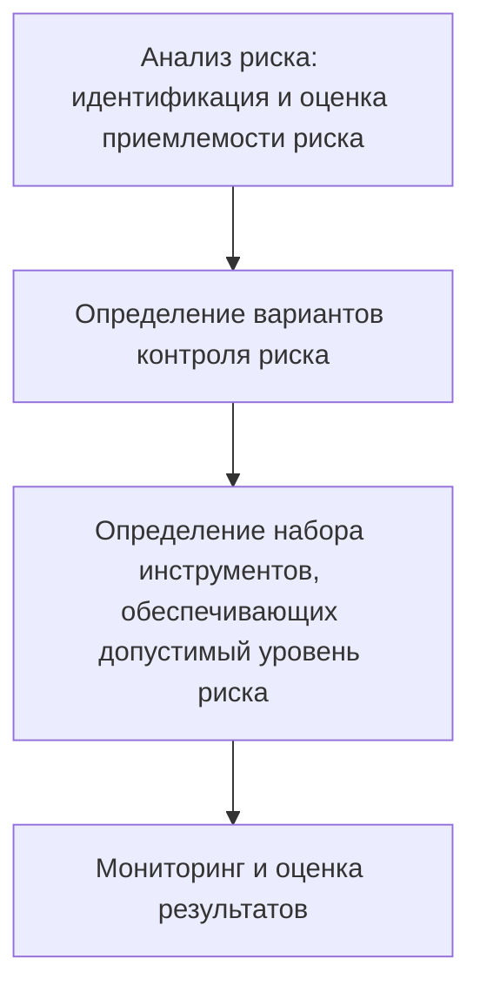

# Практика 1
## БЖД и её основные положения
  
**БЖД** - область научно-практических знаний, изучающая природу опасностей, которые угрожают человеку и окружающему миру, закономерности их формирования и проявления, способы предупреждения и защиты от них и ликвидации их последствий  
  
**Предмет БЖД:** Защита жизненно важных интересов личности, общества и государства, имущества и окружающей среды от внешних и внутренних угроз

- Личность - её права и свободы
- Общество - его материальные и духовные ценности
- Государство - его конституционный стой, суверенитет и территориальная целостность  
**Задачи БЖД:**
- Анализ источников и причин возникновения опасностей, прогнозирование и оценка их взаимодействия
- Разработка эффективных систем и методов профилактики опасностей
- Организация систем мониторинга и контроля опасностей и управление состоянием безопасности техносферы 
- Разработка и реализация мер по ликвидации последствий проявления опасностей
- Организация обучения населения основам безопасности и подготовку специалистов БЖД  

## Основные положения дисциплины
1. Деятельность человека потенциальна опасна
> Любое действие человека имеет риск потенциальной опасности

2. Опасности - это то, что угрожает не только человеку, но и обществу, государству в целом
> Человек обиделся, начал вступать в различные организации, а дальше угроза остальным

3. Безопасность - это такой уровень опасности, с которым на данном этапе научного и экономического развития можно смириться, - это приемлемый риск
> Мы приняли такие меры, чтобы снизить риски возникновения опасности

4. Опасности по своей природе вероятностны (случайны), потенциальны (скрыты), перманентны (постоянны) и тотальны (всеобщи)
5. Все опасности действует в пространстве и времени - они есть всегда и везде
6. Защиты от опасностей достигаются совершенствованием средств объектов защиты, применением защитных мер
  
## Опасность (определение)
**Опасность** - это явление, процессы, объекты, свойства предметов, способные в определённых условиях причинить ущерб здоровью человеку, разрушительно действовать на определённую среду (природную, социальную, производственную, экономическую)

# Практика 2
Тест перед зачётом:
- Хорошо пишем - один вопрос на зачёте
- Плохо пишем - три вопроса на зачёте  
- Пересдачу не оплачивают 

#### Идентификация опасностей

**Идентификация опасностей** - ***Процесс обнаружения*** и установления количественных, временных, пространственных и иных характеристик, необходимых и достаточных для разработки профилактических и оперативных мероприятий, направленных на предупреждение реализации опасностей и обеспечение нормальной жизнедеятельности 

#### Безопасность
**Безопасность** - защищённость жизненно важных интересов личности, общества и государства от внешних и внутренних угроз  

- Для защиты личности от внутренних угроз - **Конституция РФ**  
- От внешних угроз защищает **МИД** (Министерство Иностранных Дел), а также **служба внешней разведки**    

> Человек считается виновным после вступления в силу судебного решения  
#### Угроза безопасности
**Угроза безопасности** - *совокупность условий и факторов*, создающих опасность жизненно важным интересам личности, общества и государства  

#### Субъект безопасности
**Субъект безопасности** - государство, осуществляющее функции в этой области через органы 
- законодательной (**ГосДума**), 
- исполнительной (**Следственный комитет** - контроль исполнения законодательства) 
- судебной властей  

#### Авария
**Авария** - опасное техногенное происшествие, создающее на определённой территории или объекте угрозу жизни, здоровью и имуществу людей и могущее привести к разрешению зданий, сооружений, оборудования и транспортных средств, нарушению производственного... 

#### Жизнедеятельность
**Жизнедеятельности** - совокупность всех видов и форм деятельности человека
> Всё происходит по вине жизнедеятельности человека (его действий или бездействия)  

#### Катастрофа
**Катастрофа** - событие с трагическими последствиями (погибло не < 100 человек, не < 400 ранены, не < 35 тыс. человек эвакуированы, не < 70 тыс. остались без источников питьевой воды)

#### Стихийное бедствие
Стихийное бедствие - разрушительное природное (природно-антропогенное) явление значительного масштаба, в результате которого может возникнуть или возникли

#### Ущерб
Ущерб - потери в производственной и непроизводственной сфере жизнедеятельности человека, вред окружающей среде, причинение в результате аварии, природного стихийного бедствия, ЧС и **исчисляемое в денежном эквиваленте** 

#### ЧС
ЧС - неожиданная, внезапно возникшая обстановка на определённой территории или объекте экономики в результате аварии, катастрофы, опасного природного явления или стихийного бедствия, которые могут привести к человеческим жертвам, ущербу здоровья людей или окружающей среде, материальным потерям и нарушению жизнедеятельности 

#### Зона ЧС
Зона ЧС - зона, где произошло ЧС?

### Вывод
БЖД рассматривает все опасности, с какими может столкнуться человек в процессе жизнедеятельности. Это основы личной, коллективной и государственной защиты

# Практика 3
## Опасности и ЧС
### Опасность
**Опасность** - угроза неблагоприятного воздействия чего-либо на какой-то объект, которое может придавать ему нежелательные качества и динамику развития, ухудшить его свойства, результаты функционирования  
  
**Признаки**:
- Угроза жизни и здоровью живых объектов (основной признак)
- Возможность нанесения ущерба здоровью и окружающей среде
- Возможность нарушения условий нормального функционирования организма человека и экологических систем  
  
### Классификация
#### По происхождению:
- Природные
- Техногенные
- Экологические 
- Социальные
- Антропогенные
- Биологические  
#### По локализации:
- Литосфера
- Гидросфера
- Атмосфера
- Космос  
#### По последствиям:
- Утомление
- Заболевания
- Травмы
- Авария
- Пожары
- Смерть  

#### По ущербу
- Социальный (Конфликт на предприятии - остановка производства)
- Технический 
- Экологический
- Экономический
  
**Ветви власти:** судебная, исполнительная, законодательная и СМИ (неофициально)  

# Практика 4
Сдавали дз

# Практика 5
## Опасный производственный фактор (ОПФ)
> Такой производственный фактор, воздействие которого на работающего в определённых условия приводит к травме или другому внезапному резкому ухудшению здоровью  
  
**Виды ОПФ:**
- Электрический ток определённой силы
- Раскаленные тела 
- Возможность падения с высоты работающего или деталей
- Оборудование, работающее под давлением выше атмосферного  
  
Человек, поднимающийся выше двух метров, должен пройти обучение и подписаться в инструктаже  
  
## Вредный производственный фактор (ВПФ)
> Такой фактор, воздействие которого на работающего в определённых условиях приводит к заболеванию или снижению трудоспособности  
  
**Виды ВПФ:**
- Неблагоприятные метеусловия
- Запыленность и загазованность воздушной среды
- Воздействие шума, вибрации, ультразвука 
- Наличие электромагнитных полей, лазерного и ионизирующих излучений
  
## Безопасность труда
> Состояние условий труда, при котором исключено воздействие на работающих ВПФ и ОПФ  
  
## Вредные вещества, содержащиеся в воздухе рабочей зоны
- Аэрозоли - воздух или газ, содержащие в себе взвешенные твердые или жидкие частицы
## Освещение на рабочих местах
- На рабочем месте - не менее 150-300 лк (люкс)
- В аудиториях, лабораториях - не менее 300-500 лк  
  
## Шум
- 120-130 дБ - болевое ощущение и повреждения в слуховом аппарате 
- 180 дБ - Разрыв барабанной перепонки  
Примеры: Отбойный молоток - 90 дБ, кузнечный цех - 100 дБ, сирены - 130 дБ, громкая музыка - 110 дБ, реактивный самолёт - 150 дБ
  
- Инфразвук - ниже 20 Гц (компрессор, некоторые животные)
- Ультразвук - более 20000 Гц (дельфины, летучие мыши)
- Вибрация - совокупность механических колебаний  
  
## Борьба с шумом, инфра- ультразвуком, вибрацией
- Уменьшение шума и вибрация 
- Изменение направленности и излучения шума
- Рациональное планирование предприятий цехов
- Уменьшение звуковой мощности и параметров вибрации по пути их распространения
- Применение глушителей при аэродинамических шумах
- Применение СИЗ-средства индивидуальной защиты (вкладыши, наушники, шлемы)
- Использование виброзащитной обуви, перчаток  
  
# Лекция 2
**Имеет ли гражданин право оказывать первую помощь, не являясь профессиональным медицинским работником?**
> **Ответ:** Согласно федеральному закону/Конституции первая помощь - это особый вид помощи, которую может оказывать любой гражданин
  
**Отличие первой помощи от первой медицинской помощи?**
> **Ответ:** Первая медицинская помощь использует лекарственные препараты и медицинские инструменты в отличии от первой помощи
  
**Кто обязан оказывать первую помощь пострадавшим?**
> **Ответ:** Закон устанавливает обязанность по оказанию первой помощи для лиц, которые в силу профессиональных обязанностей первыми оказываются на месте происшествия с пострадавшими (спасатели, пожарные, сотрудники полиции). Среди обычных очевидцев происшествия обязанность принять меры для оказания первой помощи возникает у водителей, причастных к ДТП, в котором погибли или ранены люди. В том числе, первую помощь должны оказать учителя/педагоги по той же причине проф. принадлежности.
> Каждый сотрудник гос.служб обязаны пройти курсы по оказанию первой помощи, также как и каждый водитель и преподаватель
  
**Можно ли привлечь к ответственности за неправильное оказание первой помощи?**
> **Ответ:** В связи с тем, что жизнь человека провозглашается высшей ценностью, сама попытка защитить эту ценность ставится выше возможной ошибки в ходе оказания первой помощи, так как дает человеку шанс на выживание. Уголовное и административное законодательство не признают правонарушением причинение вреда охраняемым законом интересам в состоянии крайней необходимости.
  
**Предусмотрена ли ответственность за неоказание первой помощи?**
> **Ответ:** Для лиц, обязанных оказывать первую помощь, за ее неоказание в зависимости от обстоятельств совершения деяния и наступивших последствий предусмотрена юридическая ответственность вплоть до уголовной.
> Для простых очевидцев происшествия, оказывающих первую помощь в добровольном порядке, никакая ответственность за неоказание первой помощи применяться не может.  

**Обязан ли учитель, прошедший обучение правилам оказания первой помощи, оказывать её другому сотруднику школы или учащимся**
> **Ответ**: обязан согласно закону об образовании 
  
**Артериальное кровотечение:** жгут выше раны строго на одежду  
**Венозное кровотечение:** давящая повязка на рану  
  
### Человек подавился косточкой
1. Вызываем скорую помощь
2. Оказывать психологическую помощь, успокоить
### Травмы различных областей тела
- Ушибы
- Вывихи
- Переломы
- Ожоги: ни в коем случае под холодную воду, лопнувшие волдыри опасны заражением
- Черепно-мозговые травмы: сотрясение мозга
- Обморожения  
  
**Чем опаснее обморожение ожога?**
> При ожоге человек сразу чувствует боль, при обморожении рецепторы не подают сигнал, мы поздно обращаем внимание на обморожение. нельзя под горячую воду, потому что не чувствуешь температуру, и резкий перепад температуры => могут полопаться сосуды
  
**Какие виды отравления могут быть?**
> - Пищевое (тошнота, рвота, температура)
> - Яд (укусы)
> - Воздух
> - Радиация

Нельзя накладывать жгуты при укусах змеи

# Практика 6
%% Что такое БЖД?
Слышимый шум от скольки до скольки Гц? от 20 до 20 тысяч
Уровень звука измеряется? в децибелах
По природе звука не бывает? 
Какими параметрами характеризуется вибрация?
При работе с реактивного веществами следует применять всё, кроме? Беруши
Что является техн средствами обеспечения безопасности? Защ.одежда...
Основные причины несчастных случаев от воздействия эл.тока? 
Рабочее место - то место, или куда необходимо... и которое находится под контролем? Работодатель
Параметр микроклимата не нормируется? Параметрическое давление-атмосферное давление
Каким прибором измеряется относительная влажность? Гидрометр
Освещённость измеряется? в люксах
Основным мероприятием по обеспечению безопасности в ЧС? не относится: 
К основным фактором следует отнести? Отсутсвие знаков ????
Последствия ЧС складываются из ? %%

**Экстремальная ситуация** — это неожиданное, резкое событие или ряд событий, которые представляют угрозу для здоровья, жизни людей, окружающей среды или имущества.  
  
**ЧС** - совокупность опасных событий или явлений, приводящих к нарушению безопасности жизнедеятельности  
  
**Почему нам нужно это разделение на ЭС, локальная ЧС, Региональная ЧС?**
> **Ответ**: Потому что для каждого вида есть свой алгоритм действия и свои критерии. 
> **Пример**: Если региональная ЧС, то могут выделить деньги региона на восстановление, если это ниже регионального, то не могут выделить деньги региона. 
  
**Критерии перехода ЭС в ЧС:**
- Число пострадавших более 10 человек
- Число погибших более 4 человек
- Прямой материальный ущерб(!Всегда финансы!) в больших размерах(размытая формулировка, потому что для каждого региона по своему)
**Виды ЧС:**
- **Техногенные** 
    - Транспортные аварии
    - Пожары, взрывы, угрозы взрывов
    - Аварии с выбросом химическим опасным веществ
    - Аварии с выбросом радиоактивных веществ
    - Внезапное обрушение зданий
    - Аварии на электроэнергетических установках
    - Аварии на коммунальных системах жизнеобеспечения
    - Аварии на очистных сооружения
    - Гидродинамические аварии  
- **Природного**
    - Геофизические (землетрясения, извержения)
    - Геологические (оползни, обвалы, лавины)
    - Метеорологические (ураганы, смерчи, гололёд)
    - Морские гидрологические (цунами, отрыв льдов)
    - Гидрологические (наводнения, заторы)
    - Гидрогеологические (высокие уровни грунтовых вод)
    - Природные пожары (торфяные, лесные)
    - Инфекционная заболеваемость людей
    - Инфекционная заболеваемость сельхоз животных
    - Поражение сельхоз растений болезнями и вредителями  
- **Экологического** (Загрязнение атмосферы, почвы, воды; изменение состояния биосферы)  
    - Изменение состояние суши (обвалы, просадки)
    - Изменение состава и свойств атмосферы (климат)
    - Изменение состояний водной среды (загрязнение)
    - Изменение состояния биосферы (гибель животных)  

**Инфекционные заболевания** - болезни, вызванные попадание в организм человека болезнетворных микроорганизмов (бактерий, вирусы, грибы)  
  - Грипп,
- ОРВИ,
- Корь,
- Оспа,
- ВИЧ-инфекция,
- Вирусные гепатиты,
- Клещевой энцефалит,
- Желтая лихорадка.
**Неинфекционные заболевания** -  это заболевания, которые не передаются от человека к человеку. Они развиваются постепенно и часто связаны с факторами, которые можно контролировать: неправильное питание, низкая физическая активность, употребление табака и алкоголя, хронический стресс  
- сердечно-сосудистые болезни (инфаркт и инсульт);
- онкологические заболевания;
- хронические респираторные болезни (хроническая обструктивная болезнь лёгких и астма);
- диабет; 

# Лекция 3
## Авиационная медицина
**Факторы внешней среды, влияющие на организм человека в условиях полёта:**
- изменение параметров атмосферного (барометрического) давления
- увеличение объёма газов
- снижение парциального давления (напряжение кислорода)
- повышение радиации и снижение температуры в зависимости от высоты полёта воздушного судна
- скорость
- ускорение
- шум 
- вибрации  
  
> Радиация имеет свойство накапливаться, от солнца - самого крупного источника радиации 
### Гипоксия
**Гипоксия** - нехватка кислорода
**Признаки**:
- хроническая усталость
- частая головная боль
- депрессивные состояния
- бессонница
- болевые ощущения в области груди 
- нарушение сердцебиения 
- быстрая утомляемость
- ухудшение слуха, зрения
- одышка
- рвота, тошнота
- нарушение ориентации
- нарушение обмена веществ
  
> Кислород участвует во всех биохимических процессах, поэтому его недостаток очень сильно влияет на весь организм

> После 3-4 дней без воды начинаются необратимые процессы, восстановление уже в больнице

### Шум и вибрации
Работающие двигатели и турбулентность являются источником шума и вибраций.   
Помимо избирательного действия на **слуховой анализатор**, интенсивный и высокочастотный шум может оказывать вредное воздействие на весь организм, вызывая **утомление и снижение работоспособности** 

> Двигатели самолёта не обклеят виброизоляция, потому они всё равно прикрепленные к крыльям и по ним всё равно будет проходить вибрации 

При длительном и многократном воздействии на организм человека вибрация может вызывать патологические изменения в мышцах, костно-суставном аппарате конечностей, в позвоночнике
> От постоянной вибрации мышцы начинают отрафироваться. из-за того что они расслабляются, эффект расслабленных мышц  
  
> При вибрации суставы (жидкость, плёнка) начинают разрушаться и кости начинают тереться друг об друга  
  
> В позвоночнике вибрации воздействуют на спинной мозг

### Воздушная болезнь
**Характеризуется**: 
- комплексом симптомов вегетативных расстройств 
- ухудшением самочувствия 
- снижением работоспособности  
  
**Может протекать в скрытой форме:**
- изменение окраски кожного покрова (бледность)
- повышенное потоотделения 
- тремор (дрожь) пальцев рук
- увеличение частоты сердечных сокращений
- и др.  
  
**При выраженной форме симптомы укачивания проявляются отчётливо и характеризуется нарушением:**
- желудочно-кишечного тракта (тошнота, рвота)
- сердечно-сосудистой
- нервной
- дыхательной 
- и других систем
  
### Изменение часовых поясов
> По прибытии в другой часовой пояс организм человека продолжает функционировать в своём исходном биологическом ритме, не смотря на резкую смену дня и ночи  
  
Такое рассогласование приводит к **десинхронозу**. Оно проявляется нарушением сна, аппетита, снижением работоспособности.
  
Симптомы десинхроноза возникают при временных сдвигах на период более 4 часов
 
## Политика Аэрофлота в области безопасности
### Обеспечение безопасности включают в себя два основных направления:
- **Обеспечение авиационной безопасности** - направленное на сохранение жизни и здоровья пассажиров, членов экипажа, наземного персонала, безопасности воздушного судна и охрана объектов авиапредприятия  
- **Безопасность полётов** - основной задачей которой, является предотвращение авиационных происшествий, инцидентов и повреждений воздушного судна, а также обеспечения профессиональных действий экипажа в случае аварийной внештатной ситуации на борту воздушного судна
  
В случае явной угрозы безопасности полёта в целях спасения жизни людей КВС имеет право принять решение:
- о вынужденной посадке ВС по пути следования
- о прекращения полёта и возвращения на аэродром вылета  
В случае, когда воздушное судно терпит бедствие, командир воздушного судна обязан принять все возможные 
# Практика 7

## Анализ риска и управление рисками

### Риск
**Риск** - это вероятность причинения вреда жизни или здоровью граждан, имуществу физ. лиц или юр. лиц, государственному или муниципальному имуществу, окружающей среде, жизни или здоровью животных и растений, с учётом тяжести этого вреда   
  
**Виды рисков:**
- Индивидуальный - реализация опасности для конкретного индивидуума
- Коллективный - риск для группы людей
- Мотивированный - обоснованная возможность быть подвергнутым опасности (необходимость оказания помощи пострадавшим людям)    
- Немотивированный - Необоснованная возможность быть подвергнутым опасности (нежелание выполнять инструкции)  
  
## Концепция приемлемого риска
**Концепция приемлемого риска** - допустимый уровень риска, оправданный с точки зрения экономических, социальных и экологических факторов и с которым общество в целом готово мириться ради получения определённых положительных результатов своей деятельности  
  
Зоны риска:
- Неприемлемого 
- Переходная
- Приемлемого

## Формула вероятностной оценки риска и прогнозирования событий опасного типа
$$ Q_x = n / N $$
- `Q` - коэффициент вероятности несчастного случая
- `x` - вид
- `n` - число людей, подвергнувшихся неблагоприятным воздействиям
- `N` - общее число людей, занятых в данной сфере жизнедеятельности  
  

### Процедура управления риском

# Лекция 5
**Инсульты** происходит из-за повышенного кровяного давления, разрывов капилляров, кровоизлияний в мозг  
  
**Что самое опасное в сигарете?** 
> **Ответ:** при сильном нагревании сигарета выделяет вредные вещества

**Вестибулярный аппарат - это?**
> **Ответ:** Орган во внутреннем ухе, который отвечает за поддержание равновесия, координацию движений и пространственную ориентацию

**Кто принимает окончательное решение, что делать с воздушным судном?**
> **Ответ:** только командир воздушного судна имеет право принимать решения, что делать с самолётом

## Обморок
**Обморок** - кратковременная внезапная потеря сознания, вызванная ишемией головного мозга в результате недостаточного кровоснабжения с быстрым, полным самостоятельным восстановлением нормального состояния через несколько секунд или минут.  

**Может возникать в результате острого или хронического стресса:**
- душное помещение
- длительное стояние
- психоэмоциональное напряжение 
- переутомления
- интенсивная боль  
  
**Предвестники обморока:**
- слабость
- мелькание мушек перед глазами
- головокружение
- тошнота
- чувство дурноты
- потемнения в глазах
- звон в ушах
- потливость
- дискомфорт в верхних отделах живота
- учащение дыхания
- общая слабость  
  
**При осмотре:**
- бледность кожи
- холодные, влажные конечности
- расслабление мышц
- снижение артериального давления
- урежение пульса
- редкое поверхностное дыхание  
  
**Что сделать в первые секунды развития обморока:**
- Убедиться в наличии пульса на сонной артерии
- расстегнуть ворот одежды
- ослабить поясной ремень
- приподнять ноги
- поднести к носу ватку с нашатырным спиртом 
- надавить указательным пальцем в точку перегородки носа (там много нервных окончаний)  
  
**Как остановить артериальное кровотечение?**
> Ответ: наложить жгут или шпагат выше раны, на сонную артерию можно наложить жгут через руку

## Внутреннее кровотечение
**Как остановить внутреннее кровотечение?**
> **Ответ:** остановить невозможно 
