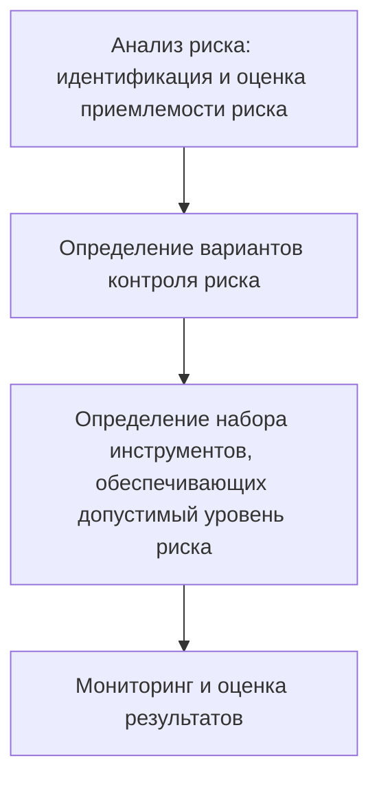

# Практика 1
## БЖД и её основные положения
  
**БЖД** - область научно-практических знаний, изучающая природу опасностей, которые угрожают человеку и окружающему миру, закономерности их формирования и проявления, способы предупреждения и защиты от них и ликвидации их последствий  
  
**Предмет БЖД:** Защита жизненно важных интересов личности, общества и государства, имущества и окружающей среды от внешних и внутренних угроз

- Личность - её права и свободы
- Общество - его материальные и духовные ценности
- Государство - его конституционный стой, суверенитет и территориальная целостность  
**Задачи БЖД:**
- Анализ источников и причин возникновения опасностей, прогнозирование и оценка их взаимодействия
- Разработка эффективных систем и методов профилактики опасностей
- Организация систем мониторинга и контроля опасностей и управление состоянием безопасности техносферы 
- Разработка и реализация мер по ликвидации последствий проявления опасностей
- Организация обучения населения основам безопасности и подготовку специалистов БЖД  

## Основные положения дисциплины
1. Деятельность человека потенциальна опасна
> Любое действие человека имеет риск потенциальной опасности

2. Опасности - это то, что угрожает не только человеку, но и обществу, государству в целом
> Человек обиделся, начал вступать в различные организации, а дальше угроза остальным

3. Безопасность - это такой уровень опасности, с которым на данном этапе научного и экономического развития можно смириться, - это приемлемый риск
> Мы приняли такие меры, чтобы снизить риски возникновения опасности

4. Опасности по своей природе вероятностны (случайны), потенциальны (скрыты), перманентны (постоянны) и тотальны (всеобщи)
5. Все опасности действует в пространстве и времени - они есть всегда и везде
6. Защиты от опасностей достигаются совершенствованием средств объектов защиты, применением защитных мер
  
## Опасность (определение)
**Опасность** - это явление, процессы, объекты, свойства предметов, способные в определённых условиях причинить ущерб здоровью человеку, разрушительно действовать на определённую среду (природную, социальную, производственную, экономическую)

# Практика 2
Тест перед зачётом:
- Хорошо пишем - один вопрос на зачёте
- Плохо пишем - три вопроса на зачёте  
- Пересдачу не оплачивают 

#### Идентификация опасностей

**Идентификация опасностей** - ***Процесс обнаружения*** и установления количественных, временных, пространственных и иных характеристик, необходимых и достаточных для разработки профилактических и оперативных мероприятий, направленных на предупреждение реализации опасностей и обеспечение нормальной жизнедеятельности 

#### Безопасность
**Безопасность** - защищённость жизненно важных интересов личности, общества и государства от внешних и внутренних угроз  

- Для защиты личности от внутренних угроз - **Конституция РФ**  
- От внешних угроз защищает **МИД** (Министерство Иностранных Дел), а также **служба внешней разведки**    

> Человек считается виновным после вступления в силу судебного решения  
#### Угроза безопасности
**Угроза безопасности** - *совокупность условий и факторов*, создающих опасность жизненно важным интересам личности, общества и государства  

#### Субъект безопасности
**Субъект безопасности** - государство, осуществляющее функции в этой области через органы 
- законодательной (**ГосДума**), 
- исполнительной (**Следственный комитет** - контроль исполнения законодательства) 
- судебной властей  

#### Авария
**Авария** - опасное техногенное происшествие, создающее на определённой территории или объекте угрозу жизни, здоровью и имуществу людей и могущее привести к разрешению зданий, сооружений, оборудования и транспортных средств, нарушению производственного... 

#### Жизнедеятельность
**Жизнедеятельности** - совокупность всех видов и форм деятельности человека
> Всё происходит по вине жизнедеятельности человека (его действий или бездействия)  

#### Катастрофа
**Катастрофа** - событие с трагическими последствиями (погибло не < 100 человек, не < 400 ранены, не < 35 тыс. человек эвакуированы, не < 70 тыс. остались без источников питьевой воды)

#### Стихийное бедствие
Стихийное бедствие - разрушительное природное (природно-антропогенное) явление значительного масштаба, в результате которого может возникнуть или возникли

#### Ущерб
Ущерб - потери в производственной и непроизводственной сфере жизнедеятельности человека, вред окружающей среде, причинение в результате аварии, природного стихийного бедствия, ЧС и **исчисляемое в денежном эквиваленте** 

#### ЧС
ЧС - неожиданная, внезапно возникшая обстановка на определённой территории или объекте экономики в результате аварии, катастрофы, опасного природного явления или стихийного бедствия, которые могут привести к человеческим жертвам, ущербу здоровья людей или окружающей среде, материальным потерям и нарушению жизнедеятельности 

#### Зона ЧС
Зона ЧС - зона, где произошло ЧС?

### Вывод
БЖД рассматривает все опасности, с какими может столкнуться человек в процессе жизнедеятельности. Это основы личной, коллективной и государственной защиты

# Практика 3
## Опасности и ЧС
### Опасность
**Опасность** - угроза неблагоприятного воздействия чего-либо на какой-то объект, которое может придавать ему нежелательные качества и динамику развития, ухудшить его свойства, результаты функционирования  
  
**Признаки**:
- Угроза жизни и здоровью живых объектов (основной признак)
- Возможность нанесения ущерба здоровью и окружающей среде
- Возможность нарушения условий нормального функционирования организма человека и экологических систем  
  
### Классификация
#### По происхождению:
- Природные
- Техногенные
- Экологические 
- Социальные
- Антропогенные
- Биологические  
#### По локализации:
- Литосфера
- Гидросфера
- Атмосфера
- Космос  
#### По последствиям:
- Утомление
- Заболевания
- Травмы
- Авария
- Пожары
- Смерть  

#### По ущербу
- Социальный (Конфликт на предприятии - остановка производства)
- Технический 
- Экологический
- Экономический
  
**Ветви власти:** судебная, исполнительная, законодательная и СМИ (неофициально)  

# Практика 4
Сдавали дз

# Практика 5
## Опасный производственный фактор (ОПФ)
> Такой производственный фактор, воздействие которого на работающего в определённых условия приводит к травме или другому внезапному резкому ухудшению здоровью  
  
**Виды ОПФ:**
- Электрический ток определённой силы
- Раскаленные тела 
- Возможность падения с высоты работающего или деталей
- Оборудование, работающее под давлением выше атмосферного  
  
Человек, поднимающийся выше двух метров, должен пройти обучение и подписаться в инструктаже  
  
## Вредный производственный фактор (ВПФ)
> Такой фактор, воздействие которого на работающего в определённых условиях приводит к заболеванию или снижению трудоспособности  
  
**Виды ВПФ:**
- Неблагоприятные метеусловия
- Запыленность и загазованность воздушной среды
- Воздействие шума, вибрации, ультразвука 
- Наличие электромагнитных полей, лазерного и ионизирующих излучений
  
## Безопасность труда
> Состояние условий труда, при котором исключено воздействие на работающих ВПФ и ОПФ  
  
## Вредные вещества, содержащиеся в воздухе рабочей зоны
- Аэрозоли - воздух или газ, содержащие в себе взвешенные твердые или жидкие частицы
## Освещение на рабочих местах
- На рабочем месте - не менее 150-300 лк (люкс)
- В аудиториях, лабораториях - не менее 300-500 лк  
  
## Шум
- 120-130 дБ - болевое ощущение и повреждения в слуховом аппарате 
- 180 дБ - Разрыв барабанной перепонки  
Примеры: Отбойный молоток - 90 дБ, кузнечный цех - 100 дБ, сирены - 130 дБ, громкая музыка - 110 дБ, реактивный самолёт - 150 дБ
  
- Инфразвук - ниже 20 Гц (компрессор, некоторые животные)
- Ультразвук - более 20000 Гц (дельфины, летучие мыши)
- Вибрация - совокупность механических колебаний  
  
## Борьба с шумом, инфра- ультразвуком, вибрацией
- Уменьшение шума и вибрация 
- Изменение направленности и излучения шума
- Рациональное планирование предприятий цехов
- Уменьшение звуковой мощности и параметров вибрации по пути их распространения
- Применение глушителей при аэродинамических шумах
- Применение СИЗ-средства индивидуальной защиты (вкладыши, наушники, шлемы)
- Использование виброзащитной обуви, перчаток  
  
# Лекция 2
**Имеет ли гражданин право оказывать первую помощь, не являясь профессиональным медицинским работником?**
> **Ответ:** Согласно федеральному закону/Конституции первая помощь - это особый вид помощи, которую может оказывать любой гражданин
  
**Отличие первой помощи от первой медицинской помощи?**
> **Ответ:** Первая медицинская помощь использует лекарственные препараты и медицинские инструменты в отличии от первой помощи
  
**Кто обязан оказывать первую помощь пострадавшим?**
> **Ответ:** Закон устанавливает обязанность по оказанию первой помощи для лиц, которые в силу профессиональных обязанностей первыми оказываются на месте происшествия с пострадавшими (спасатели, пожарные, сотрудники полиции). Среди обычных очевидцев происшествия обязанность принять меры для оказания первой помощи возникает у водителей, причастных к ДТП, в котором погибли или ранены люди. В том числе, первую помощь должны оказать учителя/педагоги по той же причине проф. принадлежности.
> Каждый сотрудник гос.служб обязаны пройти курсы по оказанию первой помощи, также как и каждый водитель и преподаватель
  
**Можно ли привлечь к ответственности за неправильное оказание первой помощи?**
> **Ответ:** В связи с тем, что жизнь человека провозглашается высшей ценностью, сама попытка защитить эту ценность ставится выше возможной ошибки в ходе оказания первой помощи, так как дает человеку шанс на выживание. Уголовное и административное законодательство не признают правонарушением причинение вреда охраняемым законом интересам в состоянии крайней необходимости.
  
**Предусмотрена ли ответственность за неоказание первой помощи?**
> **Ответ:** Для лиц, обязанных оказывать первую помощь, за ее неоказание в зависимости от обстоятельств совершения деяния и наступивших последствий предусмотрена юридическая ответственность вплоть до уголовной.
> Для простых очевидцев происшествия, оказывающих первую помощь в добровольном порядке, никакая ответственность за неоказание первой помощи применяться не может.  

**Обязан ли учитель, прошедший обучение правилам оказания первой помощи, оказывать её другому сотруднику школы или учащимся**
> **Ответ**: обязан согласно закону об образовании 
  
**Артериальное кровотечение:** жгут выше раны строго на одежду  
**Венозное кровотечение:** давящая повязка на рану  
  
### Человек подавился косточкой
1. Вызываем скорую помощь
2. Оказывать психологическую помощь, успокоить
### Травмы различных областей тела
- Ушибы
- Вывихи
- Переломы
- Ожоги: ни в коем случае под холодную воду, лопнувшие волдыри опасны заражением
- Черепно-мозговые травмы: сотрясение мозга
- Обморожения  
  
**Чем опаснее обморожение ожога?**
> При ожоге человек сразу чувствует боль, при обморожении рецепторы не подают сигнал, мы поздно обращаем внимание на обморожение. нельзя под горячую воду, потому что не чувствуешь температуру, и резкий перепад температуры => могут полопаться сосуды
  
**Какие виды отравления могут быть?**
> - Пищевое (тошнота, рвота, температура)
> - Яд (укусы)
> - Воздух
> - Радиация

Нельзя накладывать жгуты при укусах змеи

# Практика 6
%% Что такое БЖД?
Слышимый шум от скольки до скольки Гц? от 20 до 20 тысяч
Уровень звука измеряется? в децибелах
По природе звука не бывает? 
Какими параметрами характеризуется вибрация?
При работе с реактивного веществами следует применять всё, кроме? Беруши
Что является техн средствами обеспечения безопасности? Защ.одежда...
Основные причины несчастных случаев от воздействия эл.тока? 
Рабочее место - то место, или куда необходимо... и которое находится под контролем? Работодатель
Параметр микроклимата не нормируется? Параметрическое давление-атмосферное давление
Каким прибором измеряется относительная влажность? Гидрометр
Освещённость измеряется? в люксах
Основным мероприятием по обеспечению безопасности в ЧС? не относится: 
К основным фактором следует отнести? Отсутсвие знаков ????
Последствия ЧС складываются из ? %%

**Экстремальная ситуация** — это неожиданное, резкое событие или ряд событий, которые представляют угрозу для здоровья, жизни людей, окружающей среды или имущества.  
  
**ЧС** - совокупность опасных событий или явлений, приводящих к нарушению безопасности жизнедеятельности  
  
**Почему нам нужно это разделение на ЭС, локальная ЧС, Региональная ЧС?**
> **Ответ**: Потому что для каждого вида есть свой алгоритм действия и свои критерии. 
> **Пример**: Если региональная ЧС, то могут выделить деньги региона на восстановление, если это ниже регионального, то не могут выделить деньги региона. 
  
**Критерии перехода ЭС в ЧС:**
- Число пострадавших более 10 человек
- Число погибших более 4 человек
- Прямой материальный ущерб(!Всегда финансы!) в больших размерах(размытая формулировка, потому что для каждого региона по своему)
**Виды ЧС:**
- **Техногенные** 
    - Транспортные аварии
    - Пожары, взрывы, угрозы взрывов
    - Аварии с выбросом химическим опасным веществ
    - Аварии с выбросом радиоактивных веществ
    - Внезапное обрушение зданий
    - Аварии на электроэнергетических установках
    - Аварии на коммунальных системах жизнеобеспечения
    - Аварии на очистных сооружения
    - Гидродинамические аварии  
- **Природного**
    - Геофизические (землетрясения, извержения)
    - Геологические (оползни, обвалы, лавины)
    - Метеорологические (ураганы, смерчи, гололёд)
    - Морские гидрологические (цунами, отрыв льдов)
    - Гидрологические (наводнения, заторы)
    - Гидрогеологические (высокие уровни грунтовых вод)
    - Природные пожары (торфяные, лесные)
    - Инфекционная заболеваемость людей
    - Инфекционная заболеваемость сельхоз животных
    - Поражение сельхоз растений болезнями и вредителями  
- **Экологического** (Загрязнение атмосферы, почвы, воды; изменение состояния биосферы)  
    - Изменение состояние суши (обвалы, просадки)
    - Изменение состава и свойств атмосферы (климат)
    - Изменение состояний водной среды (загрязнение)
    - Изменение состояния биосферы (гибель животных)  

**Инфекционные заболевания** - болезни, вызванные попадание в организм человека болезнетворных микроорганизмов (бактерий, вирусы, грибы)  
  - Грипп,
- ОРВИ,
- Корь,
- Оспа,
- ВИЧ-инфекция,
- Вирусные гепатиты,
- Клещевой энцефалит,
- Желтая лихорадка.
**Неинфекционные заболевания** -  это заболевания, которые не передаются от человека к человеку. Они развиваются постепенно и часто связаны с факторами, которые можно контролировать: неправильное питание, низкая физическая активность, употребление табака и алкоголя, хронический стресс  
- сердечно-сосудистые болезни (инфаркт и инсульт);
- онкологические заболевания;
- хронические респираторные болезни (хроническая обструктивная болезнь лёгких и астма);
- диабет; 

# Лекция 3
## Авиационная медицина
**Факторы внешней среды, влияющие на организм человека в условиях полёта:**
- изменение параметров атмосферного (барометрического) давления
- увеличение объёма газов
- снижение парциального давления (напряжение кислорода)
- повышение радиации и снижение температуры в зависимости от высоты полёта воздушного судна
- скорость
- ускорение
- шум 
- вибрации  
  
> Радиация имеет свойство накапливаться, от солнца - самого крупного источника радиации 
### Гипоксия
**Гипоксия** - нехватка кислорода
**Признаки**:
- хроническая усталость
- частая головная боль
- депрессивные состояния
- бессонница
- болевые ощущения в области груди 
- нарушение сердцебиения 
- быстрая утомляемость
- ухудшение слуха, зрения
- одышка
- рвота, тошнота
- нарушение ориентации
- нарушение обмена веществ
  
> Кислород участвует во всех биохимических процессах, поэтому его недостаток очень сильно влияет на весь организм

> После 3-4 дней без воды начинаются необратимые процессы, восстановление уже в больнице

### Шум и вибрации
Работающие двигатели и турбулентность являются источником шума и вибраций.   
Помимо избирательного действия на **слуховой анализатор**, интенсивный и высокочастотный шум может оказывать вредное воздействие на весь организм, вызывая **утомление и снижение работоспособности** 

> Двигатели самолёта не обклеят виброизоляция, потому они всё равно прикрепленные к крыльям и по ним всё равно будет проходить вибрации 

При длительном и многократном воздействии на организм человека вибрация может вызывать патологические изменения в мышцах, костно-суставном аппарате конечностей, в позвоночнике
> От постоянной вибрации мышцы начинают отрафироваться. из-за того что они расслабляются, эффект расслабленных мышц  
  
> При вибрации суставы (жидкость, плёнка) начинают разрушаться и кости начинают тереться друг об друга  
  
> В позвоночнике вибрации воздействуют на спинной мозг

### Воздушная болезнь
**Характеризуется**: 
- комплексом симптомов вегетативных расстройств 
- ухудшением самочувствия 
- снижением работоспособности  
  
**Может протекать в скрытой форме:**
- изменение окраски кожного покрова (бледность)
- повышенное потоотделения 
- тремор (дрожь) пальцев рук
- увеличение частоты сердечных сокращений
- и др.  
  
**При выраженной форме симптомы укачивания проявляются отчётливо и характеризуется нарушением:**
- желудочно-кишечного тракта (тошнота, рвота)
- сердечно-сосудистой
- нервной
- дыхательной 
- и других систем
  
### Изменение часовых поясов
> По прибытии в другой часовой пояс организм человека продолжает функционировать в своём исходном биологическом ритме, не смотря на резкую смену дня и ночи  
  
Такое рассогласование приводит к **десинхронозу**. Оно проявляется нарушением сна, аппетита, снижением работоспособности.
  
Симптомы десинхроноза возникают при временных сдвигах на период более 4 часов
 
## Политика Аэрофлота в области безопасности
### Обеспечение безопасности включают в себя два основных направления:
- **Обеспечение авиационной безопасности** - направленное на сохранение жизни и здоровья пассажиров, членов экипажа, наземного персонала, безопасности воздушного судна и охрана объектов авиапредприятия  
- **Безопасность полётов** - основной задачей которой, является предотвращение авиационных происшествий, инцидентов и повреждений воздушного судна, а также обеспечения профессиональных действий экипажа в случае аварийной внештатной ситуации на борту воздушного судна
  
В случае явной угрозы безопасности полёта в целях спасения жизни людей КВС имеет право принять решение:
- о вынужденной посадке ВС по пути следования
- о прекращения полёта и возвращения на аэродром вылета  
В случае, когда воздушное судно терпит бедствие, командир воздушного судна обязан принять все возможные 
# Практика 7

## Анализ риска и управление рисками

### Риск
**Риск** - это вероятность причинения вреда жизни или здоровью граждан, имуществу физ. лиц или юр. лиц, государственному или муниципальному имуществу, окружающей среде, жизни или здоровью животных и растений, с учётом тяжести этого вреда   
  
**Виды рисков:**
- Индивидуальный - реализация опасности для конкретного индивидуума
- Коллективный - риск для группы людей
- Мотивированный - обоснованная возможность быть подвергнутым опасности (необходимость оказания помощи пострадавшим людям)    
- Немотивированный - Необоснованная возможность быть подвергнутым опасности (нежелание выполнять инструкции)  
  
## Концепция приемлемого риска
**Концепция приемлемого риска** - допустимый уровень риска, оправданный с точки зрения экономических, социальных и экологических факторов и с которым общество в целом готово мириться ради получения определённых положительных результатов своей деятельности  
  
Зоны риска:
- Неприемлемого 
- Переходная
- Приемлемого

## Формула вероятностной оценки риска и прогнозирования событий опасного типа
$$ Q_x = n / N $$
- `Q` - коэффициент вероятности несчастного случая
- `x` - вид
- `n` - число людей, подвергнувшихся неблагоприятным воздействиям
- `N` - общее число людей, занятых в данной сфере жизнедеятельности  
  

### Процедура управления риском

# Лекция 5
**Инсульты** происходит из-за повышенного кровяного давления, разрывов капилляров, кровоизлияний в мозг  
  
**Что самое опасное в сигарете?** 
> **Ответ:** при сильном нагревании сигарета выделяет вредные вещества

**Вестибулярный аппарат - это?**
> **Ответ:** Орган во внутреннем ухе, который отвечает за поддержание равновесия, координацию движений и пространственную ориентацию

**Кто принимает окончательное решение, что делать с воздушным судном?**
> **Ответ:** только командир воздушного судна имеет право принимать решения, что делать с самолётом

## Обморок
**Обморок** - кратковременная внезапная потеря сознания, вызванная ишемией головного мозга в результате недостаточного кровоснабжения с быстрым, полным самостоятельным восстановлением нормального состояния через несколько секунд или минут.  

**Может возникать в результате острого или хронического стресса:**
- душное помещение
- длительное стояние
- психоэмоциональное напряжение 
- переутомления
- интенсивная боль  
  
**Предвестники обморока:**
- слабость
- мелькание мушек перед глазами
- головокружение
- тошнота
- чувство дурноты
- потемнения в глазах
- звон в ушах
- потливость
- дискомфорт в верхних отделах живота
- учащение дыхания
- общая слабость  
  
**При осмотре:**
- бледность кожи
- холодные, влажные конечности
- расслабление мышц
- снижение артериального давления
- урежение пульса
- редкое поверхностное дыхание  
  
**Что сделать в первые секунды развития обморока:**
- Убедиться в наличии пульса на сонной артерии
- расстегнуть ворот одежды
- ослабить поясной ремень
- приподнять ноги
- поднести к носу ватку с нашатырным спиртом 
- надавить указательным пальцем в точку перегородки носа (там много нервных окончаний)  
  
**Как остановить артериальное кровотечение?**
> Ответ: наложить жгут или шпагат выше раны, на сонную артерию можно наложить жгут через руку

## Внутреннее кровотечение
**Как остановить внутреннее кровотечение?**
> **Ответ:** остановить невозможно, только операционной хирургом 

# Практика 8
## Система безопасности человека
### 1. Виды и системы безопасности
- **Безопасность** - состояние защищённости жизненно важных интересов личности, общества и государства от внутренних и внешних угроз
- **Система безопасности** - совокупность взаимосвязанных и упорядоченных элементов, включающих в себя мероприятия для целей обеспечения безопасности
- **Международная безопасность** - защищённость международных отношений в мировой политики, нормальная жизнедеятельность мирового сообщества, стабильное развитие и сотрудничество народов и стран в условиях надёжной защищённости жизненно важных интересов каждого из них от форм вооружённого насилия
- **Региональная безопасность** - защищённость отношений внутри и между социально-территориальными общностями одного региона
- **Национальная безопасность** - защищённость развития и условий жизнедеятельности страны (нации), при котором обеспечивается приоритет ее жизненно важных интересов, гарантируется ее выживание, свободное, независимое функционирование и процветание при сохранении своих фундаментальных ценностей
#### Также разделяется как
- Система личной и коллективной безопасности человека в процессе его жизнедеятельности
- Система охраны природной среды (биосферы)
- Система государственной (национальной) безопасности
- Система глобальной безопасности
### 2. Принципы обеспечения безопасности
- Соблюдение и защита прав и свобод человека и гражданина
- Законность
- Системность и комплексность обеспечения мер безопасности 
- Приоритет предупредительных мер
- Взаимодействие федеральных, региональных и других органов власти
### Методы обеспечения безопасности
**Гомосфера** - пространство (рабочая зона), где находится человек в процессе рассматриваемой деятельности  
**Ноксосфера** - пространство, в котором постоянно существуют опасности
- Пространственное и временное разделение гомосферы и ноксосферы (ДУ, автоматизация, роботизация)
- Нормализация ноксосферы путём исключения опасности (Средства коллективной защиты)
- Адаптация человека к соответствующей среде и повышение  его защищённости (профотбор, обучение, средства индивидуальной защиты)
### Средства производственной безопасности
- **Оградительные устройства**
- **Блокирующие устройства** - предупреждают возникновение опасных производственных факторов при нарушении параметров технологических процессов и оборудования
- **Защитные устройства** - ограждают человека от воздействия опасных производственных факторов
- **Средства индивидуальной защиты**
    - Спец. одежда
    - Спец. обувь
    - Средства защиты глаз и лица
    - Средства защиты органов дыхания
    - Защитные дерматологические средства - для предупреждения заболеваний кожи
    - Медицинские средства - аптечка индивидуальная, индивидуальный противохимический пакте, индивидуальный перевязочный пакет
- **Средства коллективной защиты** - защитные сооружения
    - **Убежища** - защитные сооружения герметического типа, защищающее от всех поражающих факторов мирного и военного времени
    - **Противорадиционные укрытия** - защищает людей от ионизирующего излучения, заражения радиоактивными веществами
    - **Укрытия простейшего типа** - щели (открытые и перекрытые), траншеи, землянки
    - **Рассредоточение** - вывоз и вывод рабочих и служащих предприятий и организаций, продолжающих работу в условиях ЧС, из городов и прилегающих к ним населенных пунктов, находящихся в зонах возможных сильных разрушений, с размещением их для проживания и отдыха в загородной зоне
    - **Эвакуация** - Вывод и вывоз рабочих и служащих объектов, деятельность которых переносится в загородную зону или прекращается на время ЧС, а также всего нетрудноспособного населения  из городов и населённых пунктов 
- **Социально-педагогические средства защиты**
    - Образование и воспитание личности безопасного поведения
    - Укрепления дисциплины 
    - Информирование
    - Укрепление здоровья и адаптивных возможностей человека
    - Формирование правового самосознания личности и общества
- **Естественные системы защиты организмов**
    - Сенсорные системы
    - Железы
    - Боль
    - Костно-мышечная система

# Практика 9
## Дестабилизирующие факторы современности
### Группы дестабилизирующих факторов
- Проблемы экономического и политического взаимодействия государств
    - Проблема предотвращения милитаризации государств и создание благоприятных условий для социального прогресса всех стран и народов
    - Проблемы борьбы с международным терроризмом
    - Проблема преодоления технологической и экономической отсталости развивающихся стран
- Проблемы взаимодействия общества и природы
    - Предотвращение катастрофического загрязнения окружающей среды 
    - Обеспечение человечества необходимыми природными ресурсами
- Проблемы взаимодействия людей и общества
    - Проблема роста народонаселения
    - Проблема охраны и укрепления здоровья людей
    - Проблема образования и культурного роста
    - Проблема миграции
## Миграция 
**Миграция** - любое территориальное перемещение, совершающееся между разными...  
### Виды миграции
**Иммиграция** - въезд в страну  
**Эмиграция** - выезд из страны  
### Плюсы миграционных потоков
- Эмиграция уменьшает давление на рынок труда
- Трудовые мигранты пересылают деньги в свою страну
- Использование квалифицированных кадров без подготовки
- Привлечение неквалифицированной рабочей силы даёт возможность заниматься интеллектуальной деятельностью 
### Минусы миграционных потоков
- Усиление безработицы в странах, принимающих мигрантов, рабочей силы, понижение зарплаты
- Ухудшение криминогенной обстановки в местах проживания мигрантов
- Вовлечение в теневую экономику (не платят налоги и т.д., зарплата в конвертах, деньги уходят из оборота страны)
- Сложности медицинского обслуживания, адаптация
### Особенности современных миграционных процессов
- Высокий процент межгосударственной интеллектуальной миграции
- В Россию ожидается перенаселение 2 млн.чел из Средней Азии, 200 тыс.чел из Балтики, 400 тыс.чел из Закавказья (данные 2000-го года)
- Отток населения из районов Севера, Дальнего Востока и Сибири в центральные районы
- Миграция смягчает естественную убыль в России
# Лекция 6
Внутреннее кровотечение
**Как остановить внутреннее кровотечение?**
> **Ответ:** остановить невозможно, только операционной хирургом 
  
Признаки внутреннего кровотечения:
- бледная, прохладная, липкая кожа
- жажда
- частый, слабый пульс  
  
Норма объёма циркулирующей крови в человека = 4-4,5 литра  
Общие признаки шока, говорящее о тяжелой кровопотере:
- Беспокойство
- Бледность или синюшность кожи
- Нарушение сознания

## Кома
**Кома** - состояние, при котором наблюдается угнетение сознания, отсутствие психической деятельности и нарушение двигательных, чувствительных сомовегетативных функций организма.  
  
**Наиболее частые причины коматозных состояний:**
- Алкоголь и наркотики
- Травмы
- Отравления
- Черепно-мозговая травма
- Инфекция
- Метаболические нарушения
  
**Предвестники алкогольной комы:**
- запах
- частое чиханье и громка отрыжка
- повышенное выделение слизи из носа и рта
- иногда предшествует выраженное психомоторное возбуждение 
- гиперемия кожи лица  
  
**Признаки алкогольной комы:**
- Выраженное нарушение сознания вплоть до его отсутствия
- Запах алкоголя в выдыхаемом воздухе
- Кожные покровы бледные или синюшные, влажные и холодные
- Дыхание сначала частое, затем редкое
- Частый, слабый пульс
- Слюнотечение  
  
**Признаки наркотической комы:**
- Бледность кожи
- Расширенные или суженные зрачки
- Покрасневшие или мутные глаза 
- Замедленная или ускоренная речь
- Плохая координация движений  
  
## Сахарный диабет
Сахарный диабет - заболевание эндокринной системы, обусловленное абсолютной или относительной недостотаточностью гормона поджелудочной железы инсулина
> Возникает, потому что инсулин прекращает вырабатываться 
  
## Гипогликемическая кома (диабетическая кома)
1. Утомлённость и мышечная слабость

## Клиническая смерть
**Клиническая смерть** - обратимый этап умирания, переходное состояние от жизни к смерти
**Признаки:**
- отсутствие сознания 
- самостоятельного дыхания
- пульсация на магистральных артериях 
- расширение зрачков 
- отсутствие реакции зрачков на свет
- арефлексия 
- выраженная бледность/цианоз кожных покров
- отсутствие пульса на сонной артерии  
  
Высшие отделы головного мозга могут перенести остановку кровообращения в условиях нормотермии в течении **4-6 минут**  
  
## Социальная смерть
Возникает в случае, когда сердечно-лёгочной реанимации  начата с опозданием (в пределах от 1 до 5 минут с момента остановки сердечной деятельности)   
  
**Характеризуется**:
- Отсутствие признаков функционирования коры головного мозга при восстановленной сердечной деятельности и дыхания
Социальная смерть является серьёзным юридическим аспектом

# Практика 10
Ужесточение миграционной политики:
- Вид на жительство
- 20% штата сотрудников могут быть только иммигрантами  

## Демографическая ситуация как фактор опасности
- Устойчивая депопуляция и старение населения (коренного населения становится меньше)
- Низкий уровень рождаемости
- Сверхсмертность населения трудоспособного возраста  
  
### Причины людских потерь
- На дорогах
- От пожаров
- От криминала 
- От алкоголя
- От наркотиков
- От утопления
- От суицидов 
- От табакокурения
- Бытовой и производственный травматизм  
  
### Задача демографической политики
- Увеличение населения за счёт улучшения качества жизни, снижения преждевременной смертности
- Увеличение продолжительности здоровой активной жизни
- Укрепление института семьи
- Улучшение репродуктивного здоровья населения
- Создание условий для самореализации молодёжи

### Здоровье населения как фактор личной и национальной безопасности страны
**Факторы формирующие здоровье:**
- Генетические факторы 15-20%
    - Хромосомные и генные болезни (гемофилия, болезнь Дауна)
    - Наследственные болезни, развивающиеся в процессе индивидуального развития (сахарный диабет, подагра)
- Состояние окружающей среды 20-25%
- Медицинское обеспечение 10-15%
- Условие и образ жизни 50-55%  
  
> **СПИД** - синдром приобретённого имуннодефицита, **ВИЧ** - вирус имуннодефицита человека

# Лекция 7
Сколько нажатий в минуту при СЛР?
> Ответ: 100 нажатий в минуту, а делаем 30 нажатий к 2-ум вдохам  
  
%%
- 20% посещаемость  
- 20% оценки за занятия  
- 40% зачёт  
- 20% пропали?  
- 60 вопросов
%%
  
## Общие признаки шока, говорящие о большой потере крови
- беспокойство
- бледность или синюшность кожи
- нарушение сознания вплоть до его отсутствия 
- подкожная венозная сеть не определяется 
- озноб, холодные конечности, холодный пот
- при надавливании на ноготь его окраска восстанавливается более чем через 2 секунды
- снижение артериального давления
- пульс частый, едва прощупывается  
  
Может ли сахарный диабет возникнуть из-за переедания сладкого?
> Ответ: 
  
Из-за чего появляется сахарный диабет?
> **Ответ**: поджелудочная железа (инсулин) перестаёт вырабатываться

Излечим ли сахарный диабет?
> **Ответ**: 1 тип - ещё есть шанс, но небольшой, 2 тип - уже нет, пока считаем неизлечимым  
  
К чему может привести сахарный диабет?
> Ответ: может привести к глипоклемической коме (диабетической)  
  
<mark style="background: #FF5582A6;">!! КЛИНИЧЕСКАЯ СМЕРТЬ ОБРАТИМА В ПЕРВЫЕ 5 МИНУТ !!</mark> 

## Завести сердце одним ударом
1. Освободить грудную клетку
2. Необходимо двумя пальцами прикрыть мечевидный отросток, чтобы уберечь его от удара
3. Цель удара - не "проломить" грудную клетку, а сотрясти её  
  
Если удар не помог, то необходимо начать оказывать сердечно-легочную реанимацию  
  
1. Восстановление проходимости дыхательных путей (нельзя сувать палец в рот)
2. Проведение искусственного дыхания
3. Проведение непрямого массажа сердце  

Неумышленный вред человеку во время первой помощи, то ничего не будет  
  
## Искусственное дыхание
- выдыхаемый воздух содержит 16% кислорода, до 4% углекислого газа
- не забывать заткнуть нос, чтобы воздух через него обратно не шёл  
- два способа: рот ко рту, рот к носу (челюсть сломана, ещё какие-то повреждения)
- также можно использовать специальную лицевую маску, она снабжена односторонним клапаном
- сильные вдохи могу отправить воздух в пищевод

# Лекция 8
## Первая помощь при травмах
### Виды кровотечений
- Артериальное
- Венозное
- Капиллярное
- Внутреннее* *(по сути то же три кровотечения, останавливается только в операционной хирургами)*
#### Артериальное
> Изливающаяся кровь имеет ярко-красный цвет, бьёт сильной пульсирующей струёй  
  
Останавливаем жгутов, турникетом  
  
**Пальцевое прижатие артерий в ране или на протяжении** - самый быстрый способ остановки кровотечения, при котором осуществляется прижатие артерии к кости между раной и сердцем для прекращение поступления крови к повреждённому участку сосуда, артерия прижимается в определённых точках  
#### Венозное
> Кровь более тёмное и обильно выделяется из раны непрерывной струёй  
  
Останавливаем тугой/давящей повязкой на рану

### Правила наложения кровоостанавливающего жгута
- Выше раны
- На одежду/на ткань
- Под жгут вложить записку с указанием времени наложения жгута
- Не более часа (в идеале **полчаса**, пот ослабить на пару секунд)
- Убедиться в отсутствие пульса  
  
1. Перед наложением жгута надо наложить тканевую или бинтовую повязку
2. Завести жгут под конечность
3. Растянуть 
4. Наложить первый растянутый тур (самый важный, как можно сильнее натянуть)
5. Накладываем жгут, чтобы каждый последующий тур наполовину перекрывал предыдущий, растягивать уже не надо  
  
> В качестве импровизированных жгутов можно использовать галстук, ремень или прочная ткань, скрученная в виде полосы шириной 2-3 см. Нельзя использовать: проволоку, провод, верёвку и подобными  
  
### Давящая повязка
1. Закрыть рану стерильной салфеткой
2. Наложить поверх салфетки туго скрученный тампон
3. С силой вдавить тампон в рану
4. Туго прибинтовать тампон к конечности
5. Выполнить иммобилизацию* раненой конечности   
  
> **Иммобилизация** - обездвижевание 

### Общие признаки говорящие о тяжелой кровопотере
- Беспокойство
- Бледность и синюшность кожи
- Нарушение сознание вплоть до его отсутствия

## Ожоги
В зависимости от глубины поражения кожи и тканей различают 4 степени ожогов:
1. Покраснение кожи 
2. Образование пузырей
3. Омертвение всей толщи кожи
4. Обугливание тканей
> При ожогах погибают из-за болевого шока чаще всего, а также заражение крови

При ожогах нельзя:
- Сдирать с обожжённой поверхности остатки одежды (ткани)
- Смазывать обожженную поверхность маслами и жирами - они перекрывают доступ к кислороду, ухудшают заживление
- Вскрывать ожоговые пузыри
- Смывать грязь и сажу с поверхности кожи
- Туго бинтовать обожжённую поверхность 
- Наклеивать лейкопластырь
- Смазывать лосьонами и т.д.

# Практика 11
**Бедность** - характеристика экономического положения индивида или группы людей, при котором они не могут сами поддерживать определённый приемлемый уровень жизни  
  
## Ступени экономической депривации
1. 4 ступень - Нищета - ресурсов не хватает на питание, семьи экономит на предметах гигиены, не обновляет одежду для детей, отказывает в покупке соков, фруктов, не имеет дорогих предметов мебели
2. 3 ступень - Острая нуждаемость (бедность) - Низкое качество питание, нехватка одежды, обуви, трудно
3. 2 ступень - Малообеспеченность 
4. 1 ступень

## Методы борьбы с бедностью и нищетой
- Разработать комплексный стратегии, планы
- Улучшить для бедных доступ к производственным ресурсам
- Стремиться к удовлетворению основных потребностей человека во всех слоях населения
- Укреплять, расширять законодательство для усиления социальной защиты и уменьшение уязвимости  
  
## Меры безопасности в случае бедности
- Минимальное жилище - лучше изолированные малые комнаты, чем одна большая
- Работа - не нужно интенсифицировать труд, в свободное время надо учиться, искать другую работу
- Закупки - оптом, сравнивать цены, учитывать качество, не следовать рекламе
- Питание - цельные крупы, черный хлеб, нерафинированное масло, семена бобовых растений
- Экономия тепла - заделать все щели, отключать при отсутствии дома отопления
- Экономия электричества - светлые тона обоев, не занавешивать окна, убрать лампы накаливания
- Самообслуживание - делать многое самому

## Безработица
Безработица - отсутствие работы для трудоспособного гражданина, имущего 

## Меры безопасности в сфере безработицы
- **Создание роста спроса на товары** - повышает занятость в сфере производства
- **Улучшение информационного обеспечения рынка труда** - сбор информации о вакансиях
- Создание служб переобучения и переквалификации 
- Материальная помощь безработным
- Создание условий для развития малого предпринимательства
  
## Опасности на потребительском рынке
**Потребительский рынок** - рынок, образованный отдельными лицами и домохозяйствами, покупающими или приобретающими иным способом товары и услуги для личного потребления 

## Наиболее распространенные опасности в России
- Поддельный или просроченные лекарства - 87%
- Отечественной водки продаётся в два раза больше, чем производится заводами
- Просроченные и восстановленные продукты питания - 44%
- Поддельная одежда и обувь - более 30%
  
## Меры безопасности на потребительском рынке
- Обращать внимание при покупке товара на состав, срок годности, производителя 
- Интересоваться информацией о товаре, транслируемой в СМИ
- Покупать в официальных магазинах

**Реклама** - это информация, распространяемая любым способом, в любой форме и с использованием любых средств, адресованная неопределённому кругу лиц и направленная на привлечение внимания, формирование и поддержание интереса к объекту рекламирования
  

# Практика 12
## Социальная опасность
### Семейно-бытовые конфликты

**Семейный конфликт** - способ выражения и разрешения противоречий, лежащих в основе взаимоотношений и взаимодействий членов семьи  
- Супружеский конфликт
- Конфликт между родителями и детьми  
  
**Способы разрешения супружеских конфликтов:**
- Не употреблять обидных слов и не переходить на личности
- Не стремиться любой ценой одержать верх в споре - победа за счет поражения любимого человека
- Уважение к личности партнера и его точке зрения  
  
**Способы разрешения конфликтов между родителями и детьми:**
- Интерес - желаемая цель, а позиция - выражение интересов
- Рассматривать причину в возрастных кризисах детей 
- Не использование деструктивных стилей воспитания  
  
**Бытовое насилие** - это повторяющийся с увеличением частоты цикл физического, словесного, духовного и экономического оскорбления с целью контроля, запугивания, внушения чувства страха, со стороны одного лица по отношению к другому, с которым первое лицо состоит в семейных (бытовых) отношениях  
  
**Виды семейного насилия:**
- Физическое насилие 
- Психическое насилие  

# Лекция 9
