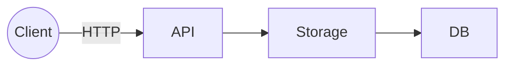
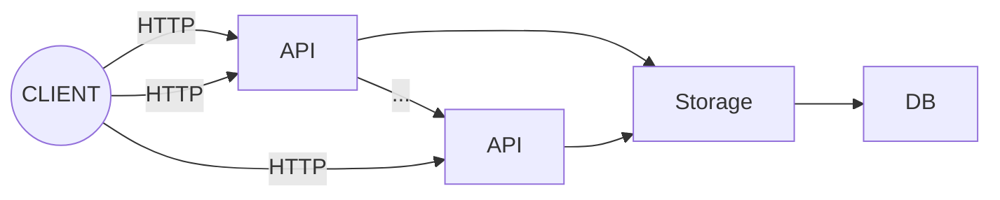
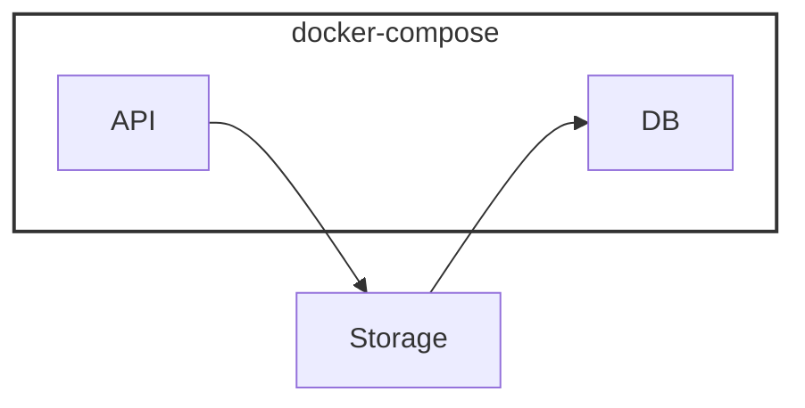
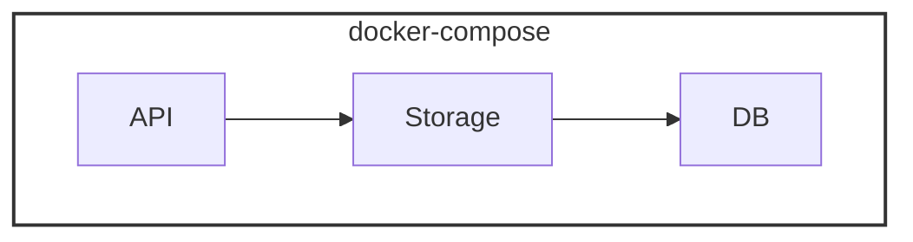
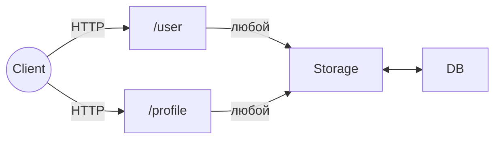
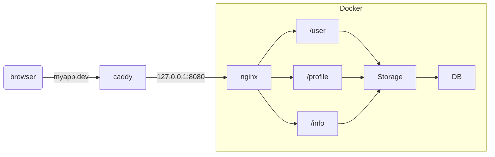

# Лекция 1
- Логирование
- Метрики - значения нагрузок
- Трассировка - отслеживание прохождения запроса  
  
# Практика 1
- Интерпретируемый код на сервере с точки зрения расхода ресурсов хуже компилируемого
- Python, nodeJS использует один поток при выполнении программы (не считая новых версий и библиотек)

## Dockerfile
```Dockerfile
FROM python:3.13.13-alpine3.23

RUN pip3 install fastapi uvicorn

WORKDIR /app

COPY . . 

CMD [ "uvicorn", "main:app", "--host", "0.0.0.0", "--port", "8080" ]
```

- `alpine` - самый легкий дистрибутив линукса
- На dockerhub-е ищем образы , скорее всего там уже есть базовый образ со всем тем, что нам нужно для запуска нашей программы
### Как мы ищем подходящий docker образ
1. Что мы хотим запустить? По тому и ищем
2. Используем официальный образ
3. Ориентация по тегам, `версия софта + версия операционки`
4. Базовый образ (ОС) берём одинаковой версии   
> **Но будет ли это влиять, если каждый контейнер изолирован друг от друга?** 
> ***Ответ:*** Влиять на работу не будет, но мы будем таскать оба образа, например, `alpine3.23` и `alpine3.22`, вместо одного (docker кэширует слои, благодаря этому одна и та же версия в контейнерах будет только один раз скопирована)  
  
> Одно приложение = один контейнер  
  
### Компилируемые языки
Антипаттерн: запихнуть компилятор go в контейнер, итог большой размер контейнера 
```Dockerfile
FROM golang:1.26.2-alpine3.23

WORKDIR /app

COPY . .

CMD [ "go", "run", "/app/cmd/service/main.go" ]
```
Должно быть:
```Dockerfile
# STAGE Build

FROM golang:1.26.2-alpine3.23 AS builder

WORKDIR /app

COPY . .

RUN go build -o /tmp/service ./cmd/service

# STAGE Run

FROM alpine:3.23

WORKDIR /app

#  --from=0 - взять из первого(нулевого точнее, нумерация с нуля) stage
COPY --from=0 /tmp/service /app/service 

CMD [ "/app/service" ]
```

# Лекция 2
`CGO_ENABLED = 0` - Go компилятор выдёргивает какой-либо бинарный код функций из библиотек ОС, чтобы не было зависимости от конкретного семейства дистрибутивов, установка через переменные окружения, напримре 
```Dockerfile
ENV CGO_ENABLED=0
```
**Контейнеры докера неизменяемые** - запускаются каждый раз как новый  
## Кэширование 
```Dockerfile
...
ENV GOCACHE=/root/.cache/go-build

RUN --mount=type=cache,target=/root/.cache/go-build \
    go build -o /tmp/service ./cmd/service

```
Ускорении сборки за счёт того, что компилятор берёт кэш неизменных файлов
- `go mod vendor` - создаёт папку `vendor` со скаченными зависимостями, которые используются в проекте
```Dockerfile
...
# Без COPY . . 
RUN --mount=type=cache,target=/root/.cache/go-build \
    --mount=type=bind,target=. \
    go build -o /tmp/service ./cmd/service
```
Здесь при выполнении этой команды, монтируется исходный код в папку проекта - ускорение за счёт отсутствия копирования

# Практика 3

> Три отдельно запущенных сервиса  

- Всегда держим *"Как мы будем масштабировать"*  
- *Чем больше мы делим на сервисы, тем легче мы сможем делегировать задачи между программистами* 

## Варианты

- Для того чтобы обращаться к host-овым сервисам (те, что не в докере), используем адрес ***host.docker.internal*** и порт нашего сервиса 


```docker-compose.yaml
services:
    ...postgres...

    api:
        context: . # где должен браться dockerfile
        dockerfile: api.Dockerfile 
        
volumes:
    ...
```

# Практика 4
- Переменные окружения считываются один раз!
- Если изменяем переменные окружения  
В `docker-compose.yaml`:
- `pull_policy: never` - Docker вообще не заглядывает в реестр. Он пытается запустить контейнер, используя только те образы, которые уже скачаны или собраны локально. Если образа нет — запуск упадет с ошибкой.
- `restart: unless-stopped` - всегда перезапускается, за исключением ручной остановки контейнера

> *Dockerfile обязанность программиста*  

> *Задача программиста: от начала разработки до готового контейнера* 

# Практика 5
## Лабораторная №1

- Каждый прямоугольник - отдельный сервис
- REST API  

### Структуры данных в БД
**User**
- ID int
- username
- email  
  
**Profile**
- ID int (foreign key)
- FirstName
- LastName  

### Механизмы
+ **Миграции** - механизм управления структурой базы    
+ **Автогенерация**

# Практика 5

Чтобы отправлять запросы именно через сервер `myapp.dev`, то есть по порту `80`, а не по `127.0.0.1:8080`, использовать внешний сервис с балансировщиком `caddy`
- маршрут к `caddy` указываем в файле `hosts` 
