# Лекция 1
- Логирование
- Метрики - значения нагрузок
- Трассировка - отслеживание прохождения запроса  
  
# Практика 1
- Интерпретируемый код на сервере с точки зрения расхода ресурсов хуже компилируемого
- Python, nodeJS использует один поток при выполнении программы (не считая новых версий и библиотек)

## Dockerfile
```Dockerfile
FROM python:3.13.13-alpine3.23

RUN pip3 install fastapi uvicorn

WORKDIR /app

COPY . . 

CMD [ "uvicorn", "main:app", "--host", "0.0.0.0", "--port", "8080" ]
```

- `alpine` - самый легкий дистрибутив линукса
- На dockerhub-е ищем образы , скорее всего там уже есть базовый образ со всем тем, что нам нужно для запуска нашей программы
### Как мы ищем подходящий docker образ
1. Что мы хотим запустить? По тому и ищем
2. Используем официальный образ
3. Ориентация по тегам, `версия софта + версия операционки`
4. Базовый образ (ОС) берём одинаковой версии   
> **Но будет ли это влиять, если каждый контейнер изолирован друг от друга?** 
> ***Ответ:*** Влиять на работу не будет, но мы будем таскать оба образа, например, `alpine3.23` и `alpine3.22`, вместо одного (docker кэширует слои, благодаря этому одна и та же версия в контейнерах будет только один раз скопирована)  
  
> Одно приложение = один контейнер  
  
### Компилируемые языки
Антипаттерн: запихнуть компилятор go в контейнер, итог большой размер контейнера 
```Dockerfile
FROM golang:1.26.2-alpine3.23

WORKDIR /app

COPY . .

CMD [ "go", "run", "/app/cmd/service/main.go" ]
```
Должно быть:
```Dockerfile
# STAGE Build

FROM golang:1.26.2-alpine3.23 AS builder

WORKDIR /app

COPY . .

RUN go build -o /tmp/service ./cmd/service

# STAGE Run

FROM alpine:3.23

WORKDIR /app

#  --from=0 - взять из первого(нулевого точнее, нумерация с нуля) stage
COPY --from=0 /tmp/service /app/service 

CMD [ "/app/service" ]
```

# Лекция 2
`CGO_ENABLED = 0` - Go компилятор выдёргивает какой-либо бинарный код функций из библиотек ОС, чтобы не было зависимости от конкретного семейства дистрибутивов, установка через переменные окружения, напримре 
```Dockerfile
ENV CGO_ENABLED=0
```
**Контейнеры докера неизменяемые** - запускаются каждый раз как новый  
## Кэширование 
```Dockerfile
...
ENV GOCACHE=/root/.cache/go-build

RUN --mount=type=cache,target=/root/.cache/go-build \
    go build -o /tmp/service ./cmd/service

```
Ускорении сборки за счёт того, что компилятор берёт кэш неизменных файлов
- `go mod vendor` - создаёт папку `vendor` со скаченными зависимостями, которые используются в проекте
```Dockerfile
...
# Без COPY . . 
RUN --mount=type=cache,target=/root/.cache/go-build \
    --mount=type=bind,target=. \
    go build -o /tmp/service ./cmd/service
```
Здесь при выполнении этой команды, монтируется исходный код в папку проекта - ускорение за счёт отсутствия копирования

# Практика 3
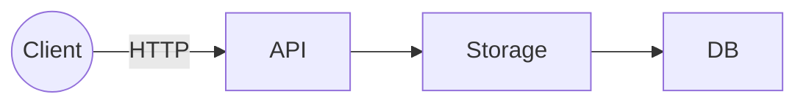
> Три отдельно запущенных сервиса  

- Всегда держим *"Как мы будем масштабировать"*  
- *Чем больше мы делим на сервисы, тем легче мы сможем делегировать задачи между программистами* 
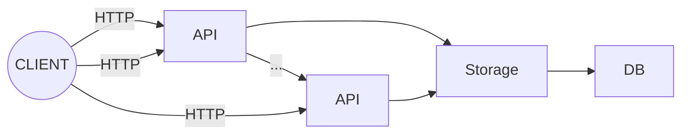
## Варианты
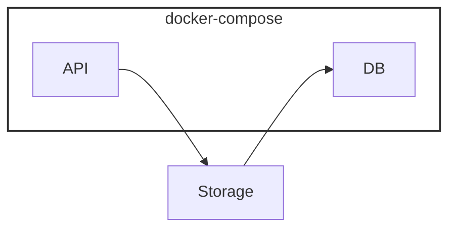
- Для того чтобы обращаться к host-овым сервисам (те, что не в докере), используем адрес ***host.docker.internal*** и порт нашего сервиса 
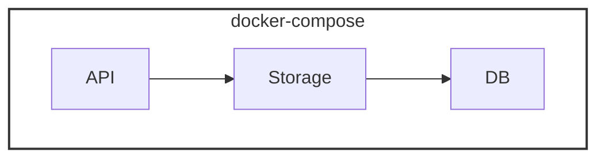

```docker-compose.yaml
services:
    ...postgres...

    api:
        context: . # где должен браться dockerfile
        dockerfile: api.Dockerfile 
        
volumes:
    ...
```

# Практика 4
- Переменные окружения считываются один раз!
- Если изменяем переменные окружения  
В `docker-compose.yaml`:
- `pull_policy: never` - Docker вообще не заглядывает в реестр. Он пытается запустить контейнер, используя только те образы, которые уже скачаны или собраны локально. Если образа нет — запуск упадет с ошибкой.
- `restart: unless-stopped` - всегда перезапускается, за исключением ручной остановки контейнера

> *Dockerfile обязанность программиста*  

> *Задача программиста: от начала разработки до готового контейнера* 

# Практика 5
## Лабораторная №1
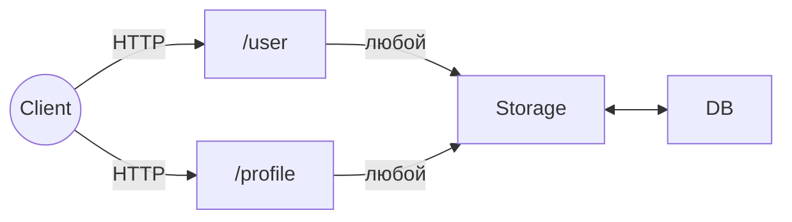
- Каждый прямоугольник - отдельный сервис
- REST API  

### Структуры данных в БД
**User**
- ID int
- username
- email  
  
**Profile**
- ID int (foreign key)
- FirstName
- LastName  

### Механизмы
+ **Миграции** - механизм управления структурой базы    
+ **Автогенерация**

# Практика 5
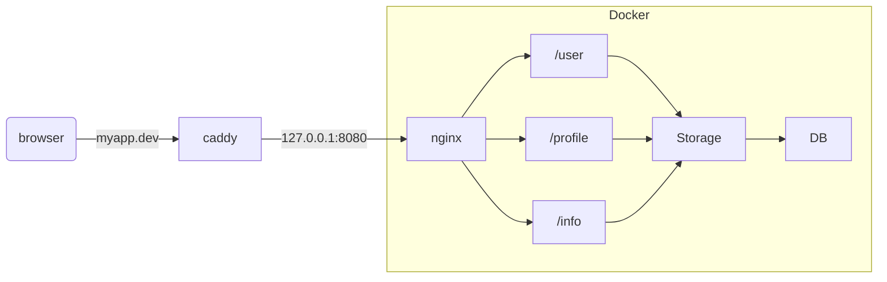
Чтобы отправлять запросы именно через сервер `myapp.dev`, то есть по порту `80`, а не по `127.0.0.1:8080`, использовать внешний сервис с балансировщиком `caddy`
- маршрут к `caddy` указываем в файле `hosts` 

# Практика 6
```nginx
upstream root {
    server routing-root-1:8080;
}

upstream math {
    server routing-math-1:8080;
}

map $http_x_rpc_method $service {
    hostnames;
    
    math.* math;
    user.* user;
    default root;
}

server {
    location / {
        if ($http_authorization !~ "^Bearer .*") {
            return 401;
        }
        proxy_pass http://$service;
    }
}
```
- Переменные: `$http_x_rpc_method`, где `X-Rpc-Method` - заголовок в HTTP 

# Лекция 3
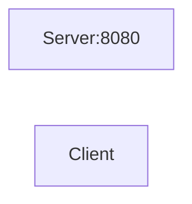
# Практика 7
- Все кастомные заголовки должны начинаться с `X-`, например, (`X-Custom-Header`), чтобы какой-нибудь маршрутизатор на пути от клиента к серверу не удалил ваш заголовок  
- Пропускная способность перед балансировщиком является бутылочным горлышком 
- Балансировщик может принимать миллионы соединений пока, не упадёт, но отдавать может по количеству сетевых интерфейсов, у которых может быть доступно 65 000 свободных портов, но можно использовать виртуальные адреса
# Практика 8
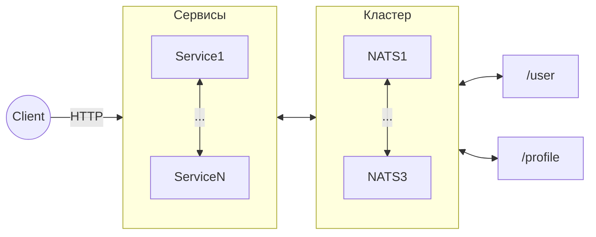
 - В данной модели между каждым микросервисом и брокером одно постоянно открытое соединение
> Благодаря этому мы ушли от модели, когда тратим ресурсы на постоянное открытие и закрытие соединения  

- Проверять `Content-Length` в запросах, что не превышает какой-то длины, чтобы *"никто не отправил Войну и мир в body запроса"* 
- Пакет `validator` для Go

# Лекция 4
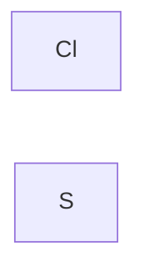
# Практика 9
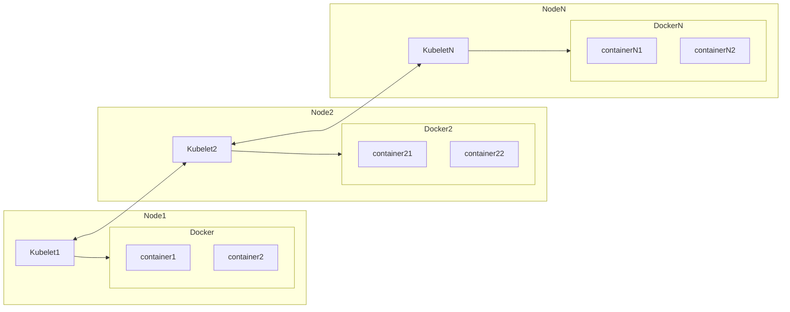
- В терминологии облачных сервисов - физические серверы называются ***нодами*** 
- `containerd` - системный сервис 
- statefull -
- stateless - все данные хранят только в оперативной памяти и только пока работают
- statefull сервис не надо тащить в облако


# Практика 10
- Минимальная единица - `pod`
- Один `pod` - один контейнер (*хотя возможность сделать несколько контейнеров внутри pod-а есть*)
- `docker build -t hunterxiii/container_name:latest .` 
    - `docker build -t hunterxiii/container_name:1.0.1-alpine3.23 .` 
    - `docker -t hunterxiii/container_name:1.0.1-alpine3.23 hunterxiii/container_name:latest .`
```env
APP_VERSION=1.0.1-alpine3.23
``` 
- `docker build -t hunterxiii/container_name:${APP_VERSION} .` 
- `docker -t hunterxiii/container_name:${APP_VERSION} hunterxiii/container_name:latest .`
## Deployment 
- `kubectl get all -o wide`
    - `wide` - более подробно
- `kubectl config get contexts`

# Лекция 5
- Каждый слой в *docker* живёт отдельным файлом (например, *alpine*, ..., *app/service*) 
- У каждого слоя есть свой *ID Layer*
- У контейнера тоже есть свой *ID*
- Каждый контейнер это по сути список id-шников слоёв 
- Каждый контейнер может иметь несколько тэгов
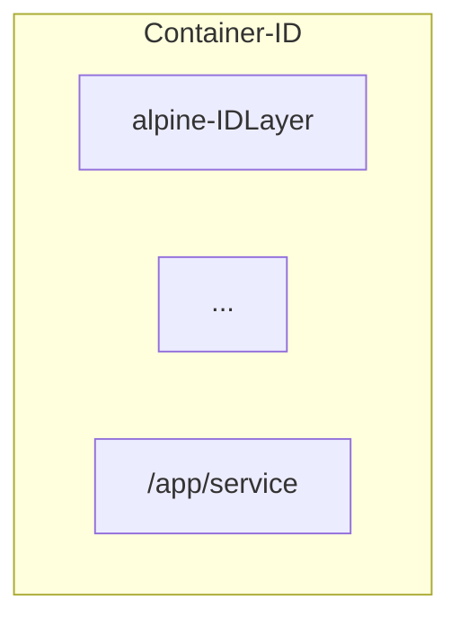
  
> Например, если в kubernetes используется контейнер с тэгом `latest` (чтобы не менять конфигурацию), то он при запуске проверяет совпадает ли ID-шник текущего контейнера с тем, у которого на данный момент стоит тэг `latest`  
  
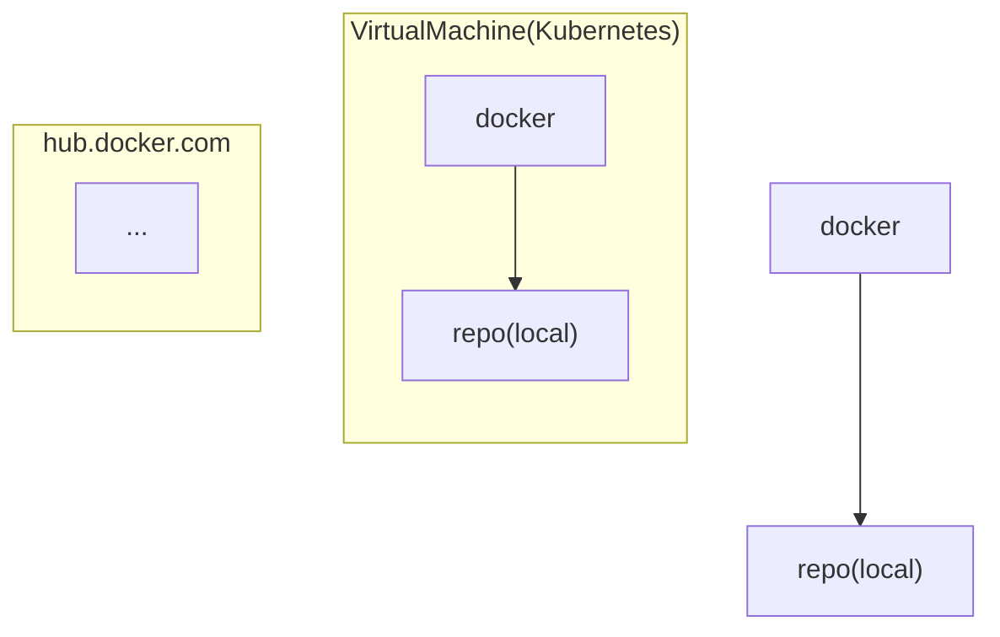

- Не очень удобно через `hub.docker.com` для локальной разработки
> Запустить *k3s* в виртуальной машине?
- Чтобы упростить, можно поставить свой *git server* (*gitea*)
> Никогда локально не ставить *gitlab*, слишком много ресурсов требует, корпоративный софт не для локальной разработки, gitea - легкий и простой, поддерживает хранение реестров объектов (*пакеты python*, *go*, ***контейнеры***) 
- Можно поднять *gitea* в докере
> Следующая проблемы - доменные имена
- Для этого прописываем в `/etc/hosts` доменное имя
- ***Caddy*** для сертификата и https ставить на локально машине 

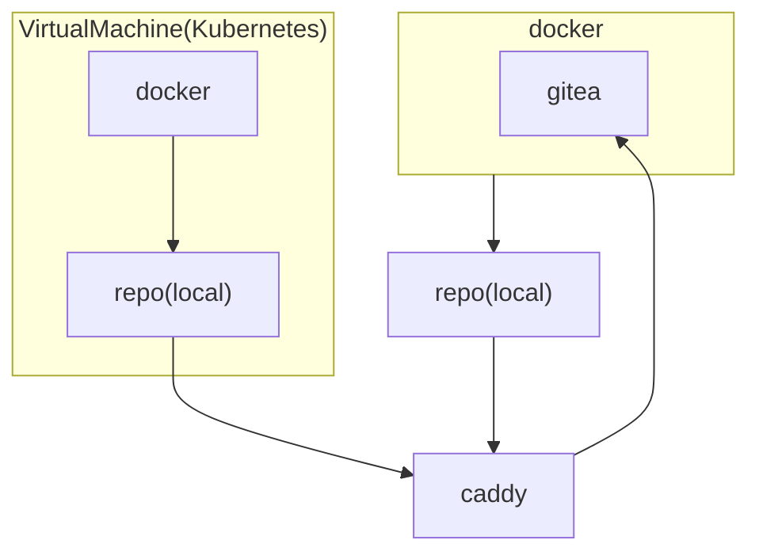
- Такая схема максимально приближена к реальной разработке   
  
`Taskfile`
```yaml
version: "3"

env:
  ENV: local

dotenv: [".env", ".env.{{.ENV}}"]

tasks:
    build:
        cmds:
            - docker build -t ${APP_IMAGE_NAME}:${APP_VERSION}-alpine3.23 . 
            - `docker -t ${APP_IMAGE_NAME}:${APP_VERSION}-alpine3.23 ${APP_IMAGE_NAME}:latest .`
              
    push: 
        cmds:
            - docker push ${APP_IMAGE_NAME}:${APP_VERSION}-alpine3.23
            - docker push ${APP_IMAGE_NAME}:latest
```
  
- Утилита `kubectl` работает с любым kubernetes, где бы он не был развёрнут   
   
- У `kubectl` нет команды `stop`, остановка deployment-а осуществляется с помощью `scale` до 0 (`--replicas=0`)  
  
`service.yaml`
```yaml
apiVersion: v1
kind: Service # Это свитч по сути
metadate:
    ...
spec:
    type: ClusterIP # Только внутри кластера
          NodePort # Доступно по IP ноды и PORT-у ноды
          LoadBalancer # По внешнего IP адресу
          и 4-ый
    selector:
        app: demo-server # Критерий, по которому мы выбираем
    ports:
        - name: http
          port: 80
          targetPort: http
          protocol: TCP
    
```

# Практика 11
- `ExternalIP` - это белый IP-шник 

`ingress.yaml`
```yaml
apiVersion: ...
kind: Ingress
metadata:
    name: demo-server-ingress
    annotations:
        # тут либо для nginx, либо для traefik
        # эти настройки должен передать Ingress контроллеру 
spec:
    rules:
        - host: demo.sirius.io
          http: 
              - paths: /
              pathType: Prefix
              backend: 
                  service:
                      name: demo-server-service
                      port:
                          name: http
```

# Практика 12
- deployment
    - pod
    - replicaset
- service - транспортная маршрутизация
- ingress - логическая маршрутизация 
- configMap 
> Картинку в формате base64 в записать в ConfigMap

- При `rollout restart` - запускается поверх `replicas` дополнительный контейнер, проверяет, что он готов (`readinessProbe`), завершает предыдущий и так обновляет все контейнеры
# Практика 13
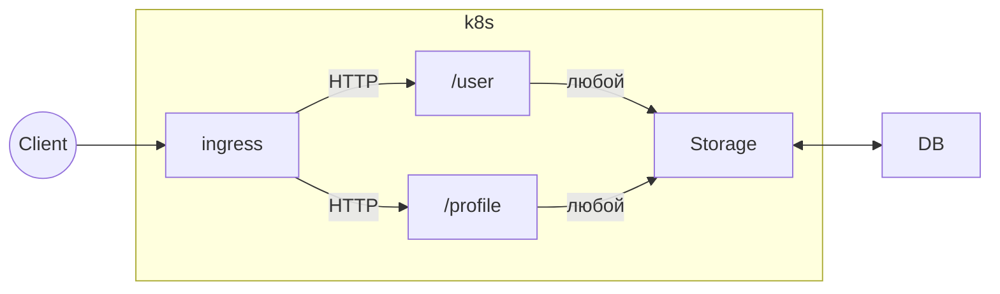
- Все сервисы, кроме базы данных (потому что это statefull сервис) тащим в ***kubernetes*** 
- На хостовой машине:
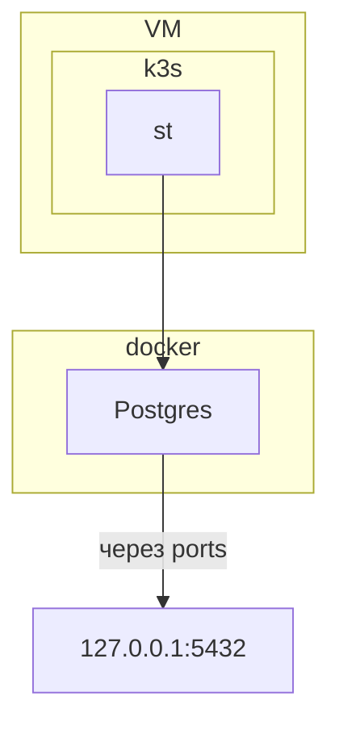
  
- в `/etc/hosts` прописываем доменное имя для `postgres`   
- если не получится связать с postgres, то пока забиваем 

# Практика 14
- Все логи должны уходить в *STDOUT*  
  
1. ELK
2. Grafana
3. VictoriaMetrics  
  
- OpenTelemetry  
  
- Мониторинг, по идее, должен быть запущен отдельно от кластера kubernetes-а 
## Стэк Grafana
- Alloy - выгребает логи из докера и отправляет на хранение
- Loki - БД (типа TSDB)

 > Все логи пишем в STDOUT
 
## Логирование
- DEBUG
- INFO
- WARN
- ERROR

### Примеры 
#### DEBUG
- Дополнительная информация, которая важна для разработчика 
#### WARN
> Пользователь попытался три раза зайти с неправильным паролем за последние 15 секунд

#### ERROR
- Программные ошибки  
> База данных недоступна


# Практика 15
- Ваше приложение должно уметь принимать запросы на ручку `/metrics`
- Если приложение работает на постоянной основе, то используем `pull` модели, то есть `alloy` сам опрашивает по ручке `/metrics` и логи из STDOUT
- Если приложение иногда запускается, а потом выключается - `push` модели, приложение само отправляет метрики, например, в `prometheus` и `loki`, в сам `alloy` тоже можно
https://habr.com/ru/companies/tochka/articles/683608/

# Практика 16
## Типы метрик
- **Counter** - просто счётчик, целое число
- **Gauge** - стрелка, может увеличиваться и уменьшаться
- Для времени запроса: создаём `counter` (количество запросов) и `time` (сумма времени всех запросов), при запросе просто высчитываем `time / counter`
> *Это не самое лучшее решение, если мы хотим отследить масштаб бедствия*
- Другой вариант: *"Если запрос выполняется < 0.1s - хорошо, < 0,25s - приемлемо, < 0,5 - что-то не так, > - очень плохо"*, то есть используем  **hystogram** - по сути несколько счётчиков


# Практика 17
Let's Encrypt - бесплатные сертификаты, выдаёт на 3 месяца  
Нельзя обеспечить надёжную передачу данных между двумя точками 
Keycloak - сервис аутентификации
