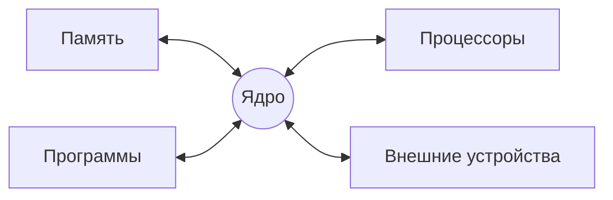

_03.09._
__Операционная система__ - программный комплекс, предоставляющий пользователю среду для выполнения прикладных программ и управления ими, а прикладными программам средства доступа и управления аппаратными ресурсами

Операционная система -> Интерфейс системных вызовов -> Прикладные программы и Конфигурирующие программы

__Задачи программирования могут быть условно разделены на четыре группы:__
- Расширение функциональности ОС
- Конфигурирование режимов работы ОС 
- Разработка прикладных программ
- Решение прикладных задач при помощи готовых задач

__Классификация пользователей:__
- Системные программисты (ОС, Интерфейс системных вызовов)
- Системные администраторы (Конфигурирующие программы)
- Прикладные программисты (Прикладные программы и Конфигурирующие программы)
- Прикладные пользователи (Прикладные пользователи)

__Роли пользователей ОС:__
Системный программист
> Задача: Расширение функций ОС
> Входной язык: Низкоуровневые языки разработки, в том числе Ассемблер 
 
Системный администратор
> Задача: Конфигурирование ОС и регистрация пользователей
> Входной язык: Форматы конфигурационных файлов и языки управления средствами администрирования

Оператор
> Задача: Текущее администрирование системы, установка/удаление ПО, его настройка
> Форматы конфигурационных файлов инсталляторов и устанавливаемого ПО 

Специалист по аппаратному обеспечению
> Задача: Обслуживание аппаратуры, ввод/вывод её в эксплуатацию
> 

Прикладной программист
> Разработка ПО, предназначенного для решения задач прикладного пользователя

Администратор данных
 > Задача: Архивирование данных системы, управление информационными ресурсами (БД, справочники)
 
 Прикладной пользователь
 > Задача: Решение конкретных прикладных задач при помощи готового ПО

Сеанс??? - интервал времени, в течение которого пользователь решает одну или несколько задач, пользуясь средствами, предоставляемыми операционной системы

Основные понятия
			  Ресурсы
Неразделяемые <-|->         Разделяемые
	Одновременного доступа <-|-> Доступ с разделением времени
	

__Процесс переднего плана__ - Процесс, имеющий потенциальную возможность получить входные данные от пользователя с клавиатуры и вывести результаты своей работы на экран.

__Фоновый процесс__  Процесс, выполняемый без непосредственного взаимодействия с пользователем.

Ресурсом может быть как физический объект(процессор, оперативная память и т.д. ), так и логический объект(информационные объекты, существующие только в пределах ОС).

__Классификация ОС:__
По количеству одновременно обслуживаемых пользователей:
- Однопользовательские
- Многопользовательские
По количеству одновременно выполняемых процессов:
- Однозначные
- Многозадачные

_17.09_
# Лекция 2
## Основные принципы функционирования ОС на базе ядра LInux
### Ядро
> Предоставляет оборудование программам\

__Init__ - первый пользовательский процесс Unix-подобных операционных системах. Запускается непосредственно ядром системы и является прародителем всех пользовательских процессов систем. 
__Init__ - Активизирует процессы, необходимые для нормальной работы системы и производит их начальную инициализацию. Обеспечивает завершение работы системы, организует сеансы работы пользователей, в том числе, для удаленных терминалов.
__Включение -> MBR -> GRUB/LiLo -> Kernel (Ядро) -> Init -> Runlevel__
BIOS - Basic Input/Output System
#### Интерпретатор Shell
При входе в ОС пользователь получает копию интерпретатора shell в качестве родительского процесса. Далее, после ввода команды пользователем создается порожденный процесс, называемый процессом-потомком. Т.е. после запуска ОС каждый новый процесс функционирует только как процесс - потомок уже существующего процесса. \

RedOS - по умолчанию ставится графическая оболочка MATE\
Gnome(3 марта 1999), KDE(12 июля 1998)\

NFS - программный комплекс РС-NFS (Network File System) для выполнения сетевых функций. РС-NFS ориентирован для конкретной ОС персонального компьютера (PC) и включает драйверы для работы в сети и дополнительные утилиты. \
SMB - сетевая файловая система, совместимая с Windows NT. \
TCP/IP - протокол контроля передачи данных (Transfer Control Protocol/Internet Protocol). Сеть по протоколам TCP/IP является неотъемлемой частью ОС семейства UNIX. Поддерживаются любые сети, от локальных до Internet, с использованием только встроенных сетевых средств.

# Лекция 3 
https://studfile.net/preview/4186783/page:14/#26
## Ядро ОС. Типы ядер. Привилегированный и пользовательский режимы работы.
__Архитектура ОС__ - структурная организация ОС на основе различных программных модулей\
__Модуль__ - это функционально законченный элемент системы, выполненный в соответствии с принятыми межмодульными интерфейсами\
__Межмодульный интерфейс__ - связующее звено между двумя объединяемыми программными объектами, выполняет функции передачи, приёма и преобразования разнотипных данных.\

Резидентные модули - хранят данные в оперативной памяти\
Нерезидентные модули - находятся на жёстком диске\
Транзитные - загружаются в оперативную память только на время выполнения своих функций (посменно)

### Вспомогательные модули:
- Утилиты - программы, решающие отдельные задачи управления и сопровождения компьютерной системы
- Системные обрабатывающие программы - текстовые и графические редакторы, компиляторы, компоновщики, отладчики
- Программы предоставления пользователю дополнительных услуг - специальный вариант пользовательского интерфейса 
- Библиотеки процедур - 