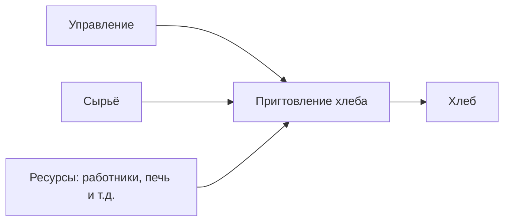

# Практика 1
- **Ингредиенты (мука, дрожжи, соль, вода, добавки)** — ~4,95 ₽ (11%)
- **Оплата труда (пекари, упаковка, внутренняя логистика)** — ~7,20 ₽ (16%)
- **Энергия (газ, электричество, отопление печей)** — ~2,25 ₽ (5%)
- **Упаковка** — ~1,35 ₽ (3%)
- **Накладные расходы (аренда, амортизация оборудования, ремонт)** — ~5,40 ₽ (12%)
- **Логистика и оптовики (транспорт, склад, дистрибьюторы)** — ~3,60 ₽ (8%)
- **Наценка магазина (ретейл-маржа)** — ~11,25 ₽ (25%)
- **Налоги и сборы** — ~3,60 ₽ (8%)
- **Прибыль пекарни** — ~5,40 ₽ (12%)  
**Итого: 45 ₽.**

## Бизнес-процесс (0 уровень)

## Декомпозируем (1 уровень)

диаграмма idev рассматривает каждый процесс как вход, выход и ...