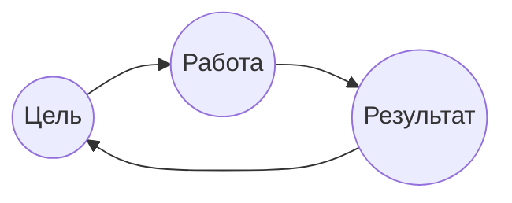
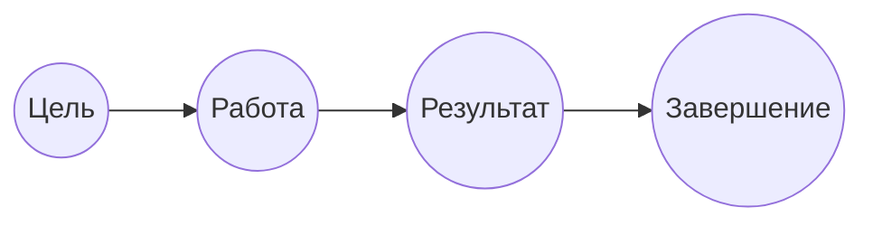

$Беспалов$ $Сергей$ $Владимирович$ 
# Практика 1
__Проект__ - деятельность, направленная на достижение цели
## Операционная деятельность

## Проектная деятельность

Цель: Достижимая, Конкретная, Ограниченная по времени, Выполнимая

## Жизненный цикл проекта
1. Процесс инициации 
2. Процесс планирования
3. Процесс исполнения
4. Процесс мониторинга и контроля
5. Процесс завершения
## Проектный треугольник
Сроки Деньги Качество

## Области знаний
Интеграция, стоимость, сроки, ___человеческие ресурсы___, управление рисками, 
