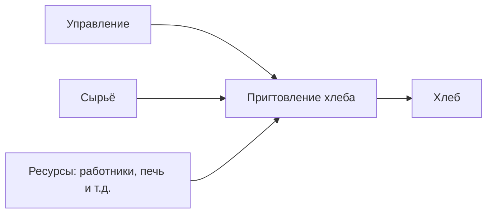
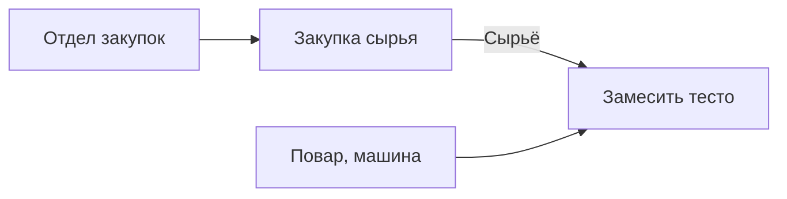

# Практика 1
- **Ингредиенты (мука, дрожжи, соль, вода, добавки)** — ~4,95 ₽ (11%)
- **Оплата труда (пекари, упаковка, внутренняя логистика)** — ~7,20 ₽ (16%)
- **Энергия (газ, электричество, отопление печей)** — ~2,25 ₽ (5%)
- **Упаковка** — ~1,35 ₽ (3%)
- **Накладные расходы (аренда, амортизация оборудования, ремонт)** — ~5,40 ₽ (12%)
- **Логистика и оптовики (транспорт, склад, дистрибьюторы)** — ~3,60 ₽ (8%)
- **Наценка магазина (ретейл-маржа)** — ~11,25 ₽ (25%)
- **Налоги и сборы** — ~3,60 ₽ (8%)
- **Прибыль пекарни** — ~5,40 ₽ (12%)  
**Итого: 45 ₽.**

## Бизнес-процесс (0 уровень)

## Декомпозируем (1 уровень)

диаграмма idev рассматривает каждый процесс как вход, выход и ...

# Практика 2
# Управление IT-активами
**ИТ-актив** - оборудование, ПО, элемент или сущность, которая может использоваться для получения обработки, хранения и распространения 
информации  
  
**Материальный ИТ-актив** - часть имущества организации, которая имеет материально-вещественную форму, является идентфицируемой частью ИТ структуры, способной функционировать самостоятельно, обладающей стоимостной характеристикой, предназначенной для использования с целью предоставления ИТ продукта/услуг и достижение целей организации
- устройство конечного пользователя 
- сетевое/коммутационное оборудование
- оборудование центра обработки данных (ЦОД)
- периферийные устройства
- мультимедиа (передача и преобразование видео/аудио сигналов и сигналов управления, интерактивное, VR и пр.)
  
### Жизненный цикл ИТ-актива
1. Наименование и количество этапов, процессов и видов деятельности внутри каждого этапа *определяются организацией*
2. Основные этапы: планирование, закупка, эксплуатация, выбытие ИТ актива 

### План управления ИТ-активами
План всегда задокументирован

![[-2147483648_-225047.jpg]]

ITIL и COBIT - сборники методологий по управлению ИТ-активами

# Практика 3
- Люди - управленческие роли центра комптенций  
- Процессы - Охват процессных областей
- Системы - Перечень решений и инструментов, которые позволяют упростить процессы центра компетенций и взаимодействия 
- Ресурсы - Вендоры, поставщики, заказчики, перечень типового ПО и МТР и пр.
- Доступность - Каждый участник ЦК должен иметь доступ к необходимой информации
KPI - оценка эффективности  
Цели Центра компетенций/функционального направления 
- унификация и систематизация 
- автоматизация
- встраивание роли в другие процессы
- выстраивание карьерных треков
- аналитика  
  
Уровни зрелости
![[Pasted image 20251001090442.png]]  
  
Профессиональное сообщество на базе центра компетенций позволяет:
- Улучшение коммуникации
- Оцифрованные навыки
- Формализованная деятельность
- Доступность для анализа на объективных фактах
- ...

## Ролевые матрицы и матрицы компетенций

# Практика 4
## ИТ-актив
**ИТ-актив** - оборудование, ПО, элемент или сущность, которая могут быть использована для получения, обработки, хранения и распространения информации, способствовать распространению ИТ-продукта или услуги, а также имея потенциальную или фактическую ценность для компании. 
## Нематериальные активы
**Нематериальные активы** - часть имущества организации, которая не имеет материально-вещественной формы, является идентифицируемой единицей, предназначенной для использования с целью предоставления ИТ-продукта или услуг или достижения целей организации.  
  
**Включают:**
- Программное обеспечение
- Лицензии (и включая подтверждение лицензий)
- Контракты
- Цифровой информационный актив (включая БД, базы знаний и пр. информационные ресурсы)
- и другой  
  
**Программное обеспечение** - все программы или их часть, которые обрабатывают или поддерживают обработку цифровой информации  
  
**Лицензия** - правовой инструмент, определяющий использование и распространения ПО, защищённого авторским правом.
  
**Коммерческое ПО** - лицензируется для использования 

**Свободное ПО** - доступное 
  
**Лицензионное соглашение** - документ, определяющий условия 
  
**Лицензирование** - процесс получения разрешения на использование ПО  
  
**Жизненный цикл** - это этапы, в течение которых осуществляется управление активом  
> Примечание: название, кол-во этапов, а также видов деятельности специфичны для организации  
  
**Инвентаризация ПО** - процесс учёта использования всех программных продуктов в организации, включая версии, лицензии и места установки  
  
**Управление нематериальными ИТ-активами** - Скоординированная деятельность организации по планированию, учёту и отслеживанию нематериальных активов(в том числе программ), обеспечивающее достижение целевых показателей для основной деятельности организации, выраженная на более ИТ практик, процессов и технологий для управления и оптимизации использования нематериальных ИТ активов в организации на всех этапах жизненного цикла с целью принятия качественных управленческих решений по планированию, закупки, эксплуатации и выбытии нематериальных активов   
> Отличие управлением материальными активами от нематериальными в юридических аспектах  
  
## Юридические аспекты
%% ... Читает закон ... %%

# Практика 5
Ответственность за нарушение прав использование программ для ЭВМ:
- Гражданско-правовая
- Административная 
- Уголовная  
  
**ДЗ:** Поискать в интернете что такое **метрика лицензирования** 
![[IMG20251003103617.jpg]]
![[IMG20251003104706.jpg]]
**Метрика лицензирования** (англ. license metric) — это измеримый показатель, на основании которого определяется число лицензий, необходимых для полноценного и корректного лицензирования программного обеспечения.

Метрики учитывают различные аспекты использования ПО, например:

- **Количество устройств** (компьютеров, серверов) или **пользователей**, которые будут использовать лицензируемое приложение. 
- **Число процессоров** в серверах, на которых работает лицензируемое приложение. 
- **Число реквизитов доступа** (логин, пароль и т. д.), которые выдаются пользователям для доступа к приложению. 

## Виды

Некоторые виды метрик лицензирования программного обеспечения:

- **Named User Plus (NUP)** — лицензируются **именованные пользователи** — лица, уполномоченные использовать программы, установленные на одном или нескольких серверах, независимо от того, использует ли оно программу в данный момент времени или нет.
- **Processor (CPU)** — лицензируются **все процессоры** системы, на которой установлены и/или запускаются программы. Доступ к программам, лицензируемым по этой метрике, может предоставляться как внутренним пользователям организации, так и третьим лицам.
- **Employee User** — лицензируются **сотрудники компании**, в том числе работающие неполный рабочий день, временные работники, агенты, подрядчики или субподрядчики.
- **Application User** — лицензируются **лица, уполномоченные компанией использовать** лицензированные прикладные программы, установленные на одном или нескольких серверах, независимо от того, использует ли оно активно программу в какой-либо момент времени или нет.