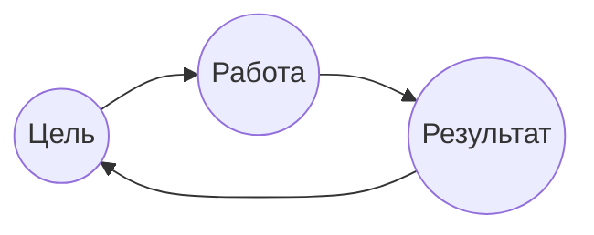
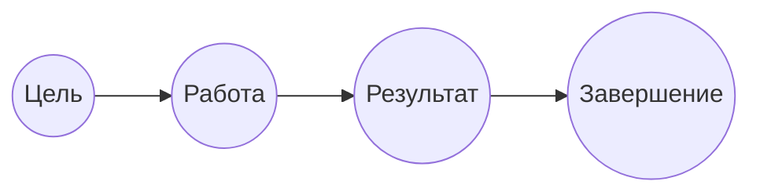
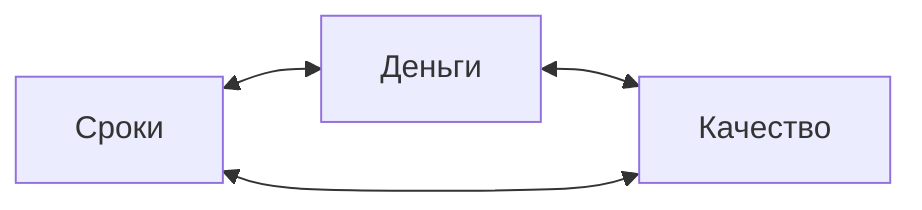
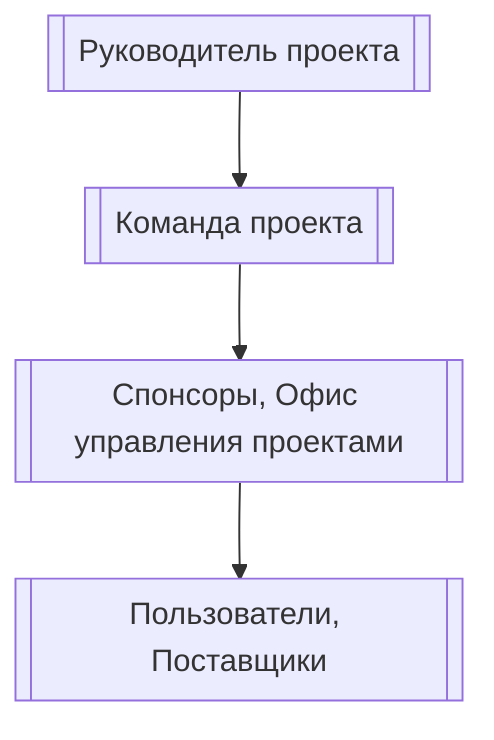
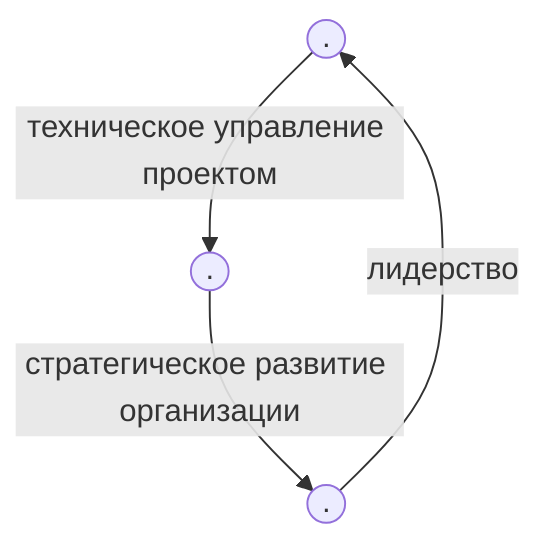

---
$Беспалов$ $Сергей$ $Владимирович$ 
# Практика 1
__Проект__ - деятельность, направленная на достижение цели, ограниченная во времени и имеющая бюджет
## Операционная деятельность

## Проектная деятельность

Цель: Достижимая, Конкретная, Ограниченная по времени, Выполнимая

## Жизненный цикл проекта
1. Процесс инициации - ставим цель, собираем требования
2. Процесс планирования
3. Процесс исполнения
4. Процесс мониторинга и контроля
5. Процесс завершения
## Проектный треугольник
Сроки Деньги Качество

## Области знаний
Интеграция, стоимость, сроки, ___человеческие ресурсы___, управление рисками, 
# Практика 2
## Роль Руководителя Проекта (РП) в проекте
> Организовать работу таким образом, чтобы бизнес цель была достигнута. Не обязан знать тонкости реализации той или иной задачи, но обязан знать, кто её должен выполнять

### Участники проектной команды
- РП
- Команда проекта (Внутренняя и внешняя)
- Заказчик
- Пользователь(и)

#### Треугольник талантов РП

Лидер: добрый, строгий, ответственный, инициативный, решительный 
### ДЗ
1. Поделиться на группы 
2. Придумать название 
3. Выбрать РП

