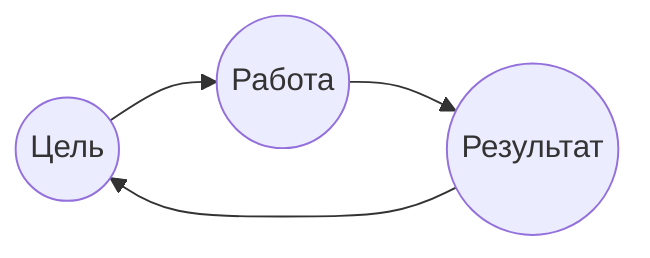
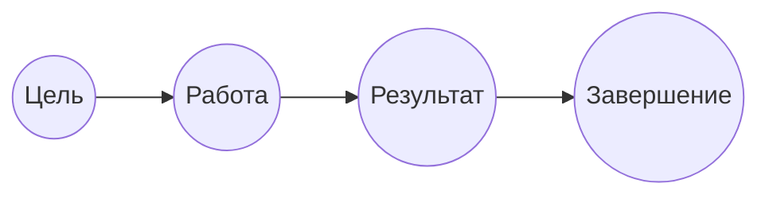

---
$Беспалов$ $Сергей$ $Владимирович$ 
# Практика 1
__Проект__ - деятельность, направленная на достижение цели, ограниченная во времени и имеющая бюджет
## Операционная деятельность

## Проектная деятельность

Цель: Достижимая, Конкретная, Ограниченная по времени, Выполнимая

## Жизненный цикл проекта
1. Процесс инициации - ставим цель, собираем требования
2. Процесс планирования
3. Процесс исполнения
4. Процесс мониторинга и контроля
5. Процесс завершения
## Проектный треугольник
![[Pasted image 20241114154348.png]]

## Области знаний
Интеграция, стоимость, сроки, ___человеческие ресурсы___, управление рисками, 
# Практика 2
## Роль Руководителя Проекта (РП) в проекте
> Организовать работу таким образом, чтобы бизнес цель была достигнута. Не обязан знать тонкости реализации той или иной задачи, но обязан знать, кто её должен выполнять

### Участники проектной команды
- РП
- Команда проекта (Внутренняя и внешняя)
- Заказчик
- Пользователь(и)
![[Pasted image 20241114154224.png]]
Лидер: добрый, строгий, ответственный, инициативный, решительный 
### ДЗ
1. Поделиться на группы 
2. Придумать название 
3. Выбрать РП

# Практика 3
### ДЗ
Придумать проект
## Группы процессов и области знаний
PMI - Project Manager Institut - выпускают свод правил по управлению проектом \ 
PMBOK - свод правил
https://studylib.ru/doc/6346157/pmbok-6th-edition-ru
![[Pasted image 20241114153933.png]]
5 группа процессов и 10 областей знаний. 
![[Pasted image 20241114154826.png]]
Группы процессов 
- ***Группы процессов инициации*** - работы, выполняемые для определения нового проекта или новой фазы существующего проекта 
- ***Группы процессов планирования*** 
- ***Группы процессов исполнения*** - работы, которые должны быть выполнены в указанном плане управления проекта 
- ***Группы процессов мониторинга и контроля*** - отслеживание, анализ выполнения задач 
- ***Группы процессов завершения*** 

> *"Допускайте ошибки, фиксируйте ошибки"*

