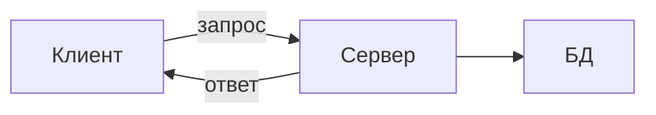
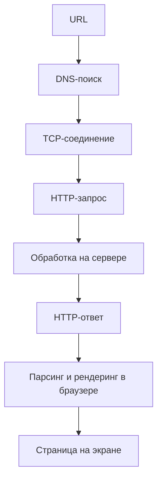

_МикишЕнко Виктор Витальевич_
# Лекция 1
**Сервер** - программа, которая обслуживает запросы клиентов по сети  
Виды серверов:
- **Веб-серверы** (Apache, Nginx)
- **Серверы приложений** (Django, Spring)
- **Почтовые серверы**
- **Сервера баз данных**  
  
## Архитектура Клиент-Сервер
**Сервер** - центральный узел, предоставляющий ресурсы и услуги  
**Клиент** - потребитель услуг, инициирующий запросы  

## Модель OSI
1. Физический
2. Канальный
3. Сетевой
4. Транспортный
5. Сеансовый
6. Представительный 
7. Прикладной

## Модель TCP-IP
1. Канальный - Передача по сети
2. Сетевой - Доставка до компьютера
3. Транспортный(TCP, UDP) - Доставка до программы
4. Прикладной - Данные приложений

## Адресация в сети
**IP-адрес** - уникальный идентификатор компьютера в сети  
**Порт** - идентификатор конкретной программы на компьютере
- 0-1023 - Системные (требует прав администратора)
- 1024-49151 - Зарегистрированные (популярные приложения)
- 49152-65535 - Динамические (для клиентов)

## Сокет - полный адрес
**Сокет** = **IP-адрес** + **номер порта**  
**Сокет** - это конечная точка для двустороннего обмена данными между программами по сети  
**Сокет** - это объект в коде, через который можно:
- Устанавливать соединение
- Отправлять и получать данные
- Закрывать соединение

## Глоссарий
- **REST API** - мост между клиентом и сервером  
- **REST** - архитектурный стиль для написания веб-серверов
- **API** - интерфейс для взаимодействия программ
- **REST API** - Единый стандарт для обмена данными между клиентом и сервером   
- **framework** - основа для постройки приложений - готовый набор инструментов
- **Django** - это высокоуровневый фреймворк для быстрой разработки безопасных и поддерживаемых веб-приложений на Python
## Глоссарий
- **REST API** - мост между клиентом и сервером  
- **REST** - архитектурный стиль для написания веб-серверов
- **API** - интерфейс для взаимодействия программ
- **REST API** - Единый стандарт для обмена данными между клиентом и сервером   
- **framework** - основа для постройки приложений - готовый набор инструментов
- **Django** - это высокоуровневый фреймворк для быстрой разработки безопасных и поддерживаемых веб-приложений на Python

# Лекция 2
## Обработка множественных подключений
### Жизненный цикл TCP-соединения
1. socket() - "купить телефон"
2. bind() - "набрать номер телефона" 
3. listen() - "включить ожидания клиента"
4. accept() - "снять трубку на входящем звонке"  
`socket(), bind(), listen(), accept()` - системные вызовы (API операционной системы)  
  
### Многопоточные сервера
- (+) Относительная простота
- (-) Ограниченная масштабируемость
- (-) Риски
- (-) Ограниченные ресурсы  
  
Можно использовать **пул потоков** вместо **потока на клиента**, каждый пул обслуживает несколько клиентов  
### Неблокирующий I/O (вход/выход) и мультиплексирование
> Идея заключается в том, что один поток может опрашивать множество клиентов и обслуживать только тех, кто готов
  
#### Событийный цикл 
1. Спрашиваем ОС - какие сокеты готовы?
2. Обрабатываем готовые
3. Возвращаемся к шагу 1  
  
Используется в высоконагруженных системах

### Асинхронность
> Современный стандарт для новых проектов

Концепция async/await:  
1. `async` - объявление асинхронной функции
2. `await` - точка приостановки
```python
async def handle_client(client_socket):
    data = await client.recv(1024)
    result = await process_data(data)
    await client.send(result)
    
async.run() 
```
- Вся логика должна быть асинхронной
- Сложность отладки
- Подходит не для всех задач
- Трудно отслеживать выполнение  
  
Лучше использовать для I/O - задач, там где большой обмен информации
# Лекция 3
## HTTP
**HTTP (HyperText Transfer Protocol)** - это протокол прикладного уровня. Набор правил для обмена данными  
**Аналогия с письмом:**
- HTTP - текст письма
- TCP - служба доставки
- IP - адрес
- Ethernet/Wi-Fi - грузовик

### Ключевые принципы 
- **Запрос-Ответ:** клиент всегда инициализирует запрос, сервер всегда отвечает
- **Без состояния:** каждый новый запрос не помнит о предыдущем диалоге, для решения этой проблемы придумали Cookies и Sessions. 
- **Текстовый формат**
- **Простота отладки:** можно даже вручную написать HTTP-запрос в обычном текстовом редакторе
### Принцип работы веб-браузера


### Из чего состоит HTTP-запрос?
- Стартовая строка - версия HTTP, метод
- Заголовки (мета-информация)
- Тело (данные, опционально)
```http
GET /catalog/book?id=123&name=a HTTP/1.1 <-- Стартовая строка
Host: mysite.com         |
User-Agent: Mozilla...   | <-- Заголовки
Accept: text/html        |
Cookie: user=john_doe    |
(Тело обычно пустое у GET) <-- Тело
```
### Стартовая строка
1. Метод 
2. URI (путь) 
3. Версия HTTP
```http
POST /login HTTP/1.1
```
### Заголовки
> Это метаинформация, которая уточняет детали запроса, передаёт служебные данные
  
Примеры заголовков:
- Host
- User-Agent - какой браузер
- Content-Type - важен, если у запроса есть тело
- Content-Length - размер тела
- Cookie

### Тело
> Отделяются от заголовка пустой строкой, фактические данные, которые мы передаём серверу
  
**Что можно передавать:**
- Данные форм
- Загружаемые файлы
- JSON/XML
- Любые другие данные, которые нужны серверу

### Из чего состоит HTTP-ответ?
- Статусная строка (успех или ошибка)
- Заголовки (метаинформация)
- Тело
```http
HTTP/1.1 200 OK
Content-Type: text/html; charset=UTF-8
Content-Length: 12540
Set-Cookie: session

<!DOCTYPE HTML>...
```

### Статусная строка
> Содержит коды состояний

- 1xx - Информационные
- 2xx - Успех
- 3xx - Перенаправление
- 4xx - Ошибка клиента
- 5xx - Ошибка сервера
### Заголовки ответа
> Метаинформация об ответе и инструкция для браузера. Они говорят браузеру, как обрабатывать полученные данные

### Тело
> Это и есть та самая веб-страница, картинка, файл JSON или любой другой ресурс, ради которого отправляли запрос

# Лекция 4
## Безопасность сетевых приложений
Open Web Application Security Project  
### A1: Broken Access Control - нарушение контроля доступа
### A2: Сбой криптографии
- Шифрование - преобразование данных в напечатемый формат
- Хеширование - создание "отпечатка" данных
- Сохранение целостности - гарантия, что данные не изменены
- Безопасная передача - защита от перехвата
- Надёжное хранение - защита на сервере и БД  
**Возможные уязвимости:**
- Пароли хранятся в открытом виде (простой текст в БД)
- Данные передаются по HTTP вместо HTTPS
- Слабые (устаревшие) алгоритмы шифрования
- Утечка ключей

# Учебная практика 1
Свой мессенджер 

**Цели проекта:**
- Создать базовый набор функций общения
- Реализовать минимальную систему профилей пользователей
- Обеспечить простой и понятный интерфейс

**Функционал**:
- Регистрация / вход
- Профиль пользователя + аватар
- Список пользователей
- Личные переписки в реальном времени
- Отправка текста и изображений
- Простой UI 

Идеи названий:
- Commex - communication exchange
- кодовое название НЕМАКС (NoMAX)
# Лекция 5
## Введение в Djnago
> Высокоуровневый веб-фреймворк Python для быстрой разработки с чистым и практичным подходом к проектированию 

**Готовые модули:**
- Аутентификация
- Админ-панель
- Формы
- Отправка email
- Кеширование
- Интернационализация
- RSS/Atom
- Защиты

### Встроенный роутинг
```python
urlpatterns = [
    path('', views.home, name="home"),
]
```
### ORM
Вместо ручного написания SQL-запросов используется ORM
```python
from django.db import models

class User(model.Model):
    name = models.CharField(max_length=100)
    age = model.IntegerField()
    created_at = models.DateTimeField(auto_field_now=True) 
```
А потом используем простые команды

### Шаблонизация
Технология отделения бизнес-логики приложения от его презентационного слоя, которая позволяет динамически генерировать HTML-страницы
```html
<h1>Товары</h1>

    <ul>
        ...
    </ul>
```

### MVC - Django MTV
- **Model** (Модель) - данные и логика
- **Template** (Шаблон) - отображения (это view в MVC)
- **View** (Представления) - логика обработки запросов (Это controller в MVC)  
**MTV = model-template-view**  
Способ организации кода в Django, где каждый компонент отвечает за свою работу  
### Model
```python
# models.py
class Product(model.Models):
    name = models.CharField(max_length=100)
    price = models.IntegerField()
    if_stock = models.BooleanFiels(deafult=True)
```
- Описываем структуру данных и бизнес-логику
- Модель работает с реальной БД
- Во время работы программа создаёт таблицу в БД
### Template
```html
<h1>Товары</h1>

    <div>
        <p>{{ product.name }}</p>
    <div>
    ...
```
### View
Функция Python, которая определяет какие конкретные данные попадут в заглушки шаблонов
```python
def product_list(request):
    products = Product.objects.all()
    return response(request, "products.html", {"products": products})
```

# Лекция 6
Запрос -> urls.py -> views.py -> models.py -> template.html -> Ответ  
## Маршрутизация (URLconf) -> Карта приложения
Механизм сопоставления URL-адресов с представления (файлы `urls.py`)
```python
from django.urls import path
from . import views

urlpatterns = [
    path('', views.home, name='home'),
]
```
Помимо глобального маршрутизатора, есть ещё маршрутизация в приложениях (`appname/urls.py`)

## Представления (Views) 
Обработать запрос и вернуть ответ  
Есть виды представлений:
- Функциональные представления
- Классовые представления  
Обязательно принимают `request` и возвращают `HttpResponse`  

## Шаблоны (Templates)
HTML-файлы с заглушками для подстановки данных  
Django Template Language - язык для шаблонов 
- `{{ variable }}` - для подстановки данных
-  - для `for, if и т.д.`    
   
**Есть вариант наследования шаблонов** - создаётся один `base.html`, где определяется общая разметка сайта, а в остальных пишется основная информация в ` ... `  

# Лекция 7
# Лекция 8
## Админ-панель
## Класс ModelAdmin - кастомизация панели
- list_display - какие поля показывать в списке
- list_filter - фильтры в правой панели
- search_fields - поля для поиска
- list_editable - поля для редактирования прямо в списке  
  
```python
@admin.register(Article)
class ArticleAdmin(admin.ModelAdmin):
    ...
```
  
> Админка автоматически понимает связи: можно открыть и сразу изменить дочернюю (связанную) таблицу из родительской

## Actions - массовые операции

# Лекция 9
## Function-Based Views и основы маршрутизации
1. Принимают HttpRequest
2. Выполняют бизнес логику
3. Возвращают HttpResponse  

# Лекция 10
## Class-Based Views и продвинутая маршрутизация

| Класс            | Для чего используются   | Пример использования                    |
| ---------------- | ----------------------- | --------------------------------------- |
| **ListView**     | Списки объектов         | *Список товаров, статей, пользователей* |
| **DetailView**   | Детали одного объекта   | *Список товара, статья, профиль*        |
| **TemplateView** | Статические страницы    | *"О нас", "Контакты", "Помощь"*         |
| **CreateView**   | Создание объектов       | *Формы добавления товаров*              |
| **UpdateView**   | Редактирование объектов | *Формы редактирования товаров*          |
| **DeleteView**   | Удаление объектов       | *Подтверждение удаления товаров*        |
### Классификация CBV

| Уровень       | Что это                     | Примеры                                |
| ------------- | --------------------------- | -------------------------------------- |
| Generic CBV   | Готовые классы "из коробки" | ListView, DetailView, CreateView       |
| Кастомные CBV | Свои классы на основе View  | ReportView, APIView, SearhView         |
| Миксины       | Переиспользуемые компоненты | LoginRequiredMixin, StaffRequiredMixin |

## Mixins
- LoginRequiredMixin - только для авторизованных
- PermissionRequiredMIxin - проверка прав доступа