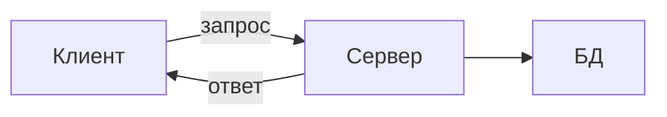

_МикишЕнко Виктор Витальевич_
# Лекция 1
**Сервер** - программа, которая обслуживает запросы клиентов по сети  
Виды серверов:
- **Веб-серверы** (Apache, Nginx)
- **Серверы приложений** (Django, Spring)
- **Почтовые серверы**
- **Сервера баз данных**  
  
## Архитектура Клиент-Сервер
**Сервер** - центральный узел, предоставляющий ресурсы и услуги  
**Клиент** - потребитель услуг, инициирующий запросы  

## Модель OSI
1. Физический
2. Канальный
3. Сетевой
4. Транспортный
5. Сеансовый
6. Представительный 
7. Прикладной

## Модель TCP-IP
1. Канальный - Передача по сети
2. Сетевой - Доставка до компьютера
3. Транспортный(TCP, UDP) - Доставка до программы
4. Прикладной - Данные приложений

## Адресация в сети
**IP-адрес** - уникальный идентификатор компьютера в сети  
**Порт** - идентификатор конкретной программы на компьютере
- 0-1023 - Системные (требует прав администратора)
- 1024-49151 - Зарегистрированные (популярные приложения)
- 49152-65535 - Динамические (для клиентов)

## Сокет - полный адрес
**Сокет** = **IP-адрес** + **номер порта**  
**Сокет** - это конечная точка для двустороннего обмена данными между программами по сети  
**Сокет** - это объект в коде, через который можно:
- Устанавливать соединение
- Отправлять и получать данные
- Закрывать соединение

## Глоссарий
- **REST API** - мост между клиентом и сервером  
- **REST** - архитектурный стиль для написания веб-серверов
- **API** - интерфейс для взаимодействия программ
- **REST API** - Единый стандарт для обмена данными между клиентом и сервером   
- **framework** - основа для постройки приложений - готовый набор инструментов
- **Django** - это высокоуровневый фреймворк для быстрой разработки безопасных и поддерживаемых веб-приложений на Python
## Глоссарий
- **REST API** - мост между клиентом и сервером  
- **REST** - архитектурный стиль для написания веб-серверов
- **API** - интерфейс для взаимодействия программ
- **REST API** - Единый стандарт для обмена данными между клиентом и сервером   
- **framework** - основа для постройки приложений - готовый набор инструментов
- **Django** - это высокоуровневый фреймворк для быстрой разработки безопасных и поддерживаемых веб-приложений на Python

