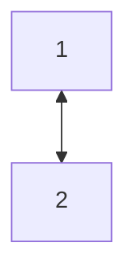

  _04.09_
# Лекция 1.  От полностью централизованных систем к вычислительным сетям
### Системы пакетной обработки

В 50-х годах 20-го века вычислительные центры строились на базе больших громоздких и дорогих компьютеров универсального назначения, т. е. на базе ___мейнфреймов___. Они не были предназначены для интерактивной работы пользователей и работали в режиме пакетной обработки.

Основным носителем информации были ___перфокарты___, которые передавались операторам мейнфрейма, а те в свою очередь загружали в мейнфрейм, примерно, для однодневной обработки. 

__Плюсы:__
- Самый эффективный режим использования вычислительной мощности
> _Пояснение:_ 
> Самая дорогая и мощная компонента мейнфрейма, а именно центральный процессор (ЦП) использовался постоянно (>90% времени)

__Минусы:__
- Большая цена ошибки, которая выражалась в потерянном рабочем дне, как самого мейнфрейма, так и обслуживающего персонала; в большом потреблении электроэнергии и т.п.
> _Основная причина:_ Неправильная перфокарта (Перепутан 0 и 1)
- Ненадёжный носитель информации в виде перфокарты
- Не было интерактивного режима
> Пользователи не обращались напрямую, а через операторов
- Все информационные ресурсы были централизованы 

#### Информационные ресурсы:
- Файлы любого формата
- База данных
- Периферийные устройства
- Вычислительная мощность (Оперативная память, внешняя память, процессор)
- Доступы (К другой сети, к внешней сети, к БД и т.д)
- Сайты, порталы, WEB-страницы

_06.09_
# Практика 1. 
## Многотерминальные системы

По мере удешевлении процессоров в начале 60-х годов появились новые способы организации вычислительного процесса. 

 Появились _**интерактивные многотерминальные системы разделения времени**_. 

В таких системах мейнфрейм отдавался в распоряжение сразу нескольким пользователям посредством терминала. Реакция на действие пользователя не занимала много времени. 
Таким образом, у пользователей складывалась иллюзия единоличного владения мейнфреймом через терминал. Таким образом, стоит сказать о _псевдопараллельной обработки_ многотерминальной системы.

- __Централизованным оставалась вычислительная мощность, зато функция ввода/вывода стали распределённой.__

В этот период было актуально имперический _закон Гроша_, который гласил, что производительность компьютера была прямо пропорциональна квадрату его стоимости.
> _Пример:_ Один компьютер за 1 миллион был лучше двух компьютеров за 500 тыс.

Многотерминальные системы стали первым шагом к созданию локальных сетей.

## Глобальные сети

Сначала была решена задача попроще, а именно соединение мейнфрейма и терминала, удалённого на несколько сотен километров. Это задача решалась с помощью телефонных линий связи и модема.
> Модем: перевод аналогового сигнала в цифровой и обратно - __модуляция__

Чуть позже по той же схеме соединили два мейнфрейма между собой. 

Компьютеры получили возможность обмениваться данными в автоматическом режиме, что является базовым механизмом в любой вычислительной сети. 

В первых глобальных сетях были созданы три классические сетевые службы, которые используются и по сей день:
- Службы электронной почты
- Службы синхронизации БД
- Службы файлового обмена

Кроме того в первых глобальных сетях были отработаны такие концепции:
- Многоуровневые построения коммуникационных протоколов
> _Пример:_ TCP/IP
- Коммутация пакетов
- Маршрутизация пакетов в составных сетях

Таким образом, исторически первыми появились глобальные сети, а не локальные.

## Локальные сети

В начале 70-х годов произошёл технологический прорыв в области производства компьютерных компонентов. __Появились большие интегральные схемы__. Их сравнительно невысокая стоимость и высокие функциональные возможности привели к созданию мини компьютеров, которые стали конкурентами мейнфреймам, закон Гроша перестал соответствовать действительности. Тем не менее первое время мини-компьютеры продолжали работать автономно. Это происходило по двум причинам: аппаратная и программная несовместимость. Однако в некоторых организациях мини-ЭВМ разных производителей связывали между собой нестандартными устройствами сопряжения. Таким образом, в то время создание сетей было творческой задачей или даже искусством.

В середине 80-х годов положение дел изменилось, поскольку появились стандартные сетевые технологии:
- Ethernet
- Token ring
- Arcnet

Мощным стимулом для появления этих технологий стало создание ___персонального компьютера(ПК)___, они стали идеальными элементами создания сетей, так как с одной стороны они являются достаточно мощными для работы сетевого ПО, а с другой стороны явно нуждаются в объединении вычислительной мощности для решения сложных задач, а также для разделения дорогих сетевых устройств. 

Таким образом, создание сети перестало быть искусством, а стало быть рутиной работой. Теперь для создания сетей было необходимо:
1. Приобрести стандартные сетевые адаптера. Например, Ethernet.
2. Приобрести стандартный кабель и соединить его с сетевыми адаптерами стандартными разъёмами
3. Установить на компьютер одну из популярных сетевых ОС (В то время: Netware от Novel).

# Практика 2
## Современные тенденции

|      Анг       |      Рус      |           Заметка            |
| :------------: | :-----------: | :--------------------------: |
| Роутер(router) | Маршрутизатор | Объединяет устройства в сети |
|     Switch     |  Коммутатор   | Перенаправляет пакеты данных |
|    Репитор     |  Повторитель  |      Продлевает сигнал       |
|    Хаб(hub)    | Концентратор  | Простое соединение устройств |
|     Bridge     |     Мосты     |   Соединяет разные сети \    |
\
__DHCP__ - раздаёт IP-адреса
__DNS__ - переводит символьный адрес в цифровой
LAN - локальные
WAN - глобальные
### 1.
 В своём развитии глобальные сети догоняют локальные, а именно скорости в глобальных сетях становятся сопоставимыми со скоростями. Таким образом, в WAN создаются и разворачиваются сетевые службы и сервисы, которые по удобству и прозрачности сопоставимы со службами в LAN.

### 2.
 Раннее в сетях использовалось не интеллектуальное оборудование: повторители мосты, концентраторы. На данный момент используется устройства: коммутаторы и маршрутизаторы(свичи и роутеры), которые поддерживают разнообразные сетевые протоколы и являются специализированными мощными мультипроцессорами, которые нужно настраивать, оптимизировать и администрировать.

### 3.
Мейнфреймы получили вторую жизнь в виде ___серверов___, однако перестали быть универсальными, и теперь их можно классифицировать по назначению: 
- ___Файловые сервера___, который в свою очередь можно разделить на сервера БД, облачные, игровые, видеохостинг и зеркальные
- ___Принт-сервера___ 
- ___Вычислительный сервер___ (для майнинга)
- ___Сервер унифицированных коммуникаций___ (ip-телефония, электронная почта, видео конференц связь и мессенджеры)
- ___Сервер информационной безопасности___ (СКУД, антивирус, VPN, firewall)
- ___Коммуникационный сервер___ 

### 4.
В начале передавалась только текстовая информация, по мере развития сетей в них стала передаваться мультимедийная информация, а также другие виды трафика, чувствительные к задержке. В современных сетях передаётся такая информация: 
- трафик реального времени 
- биометрия
- телеметрия
- ЭТМ, связанная с транзакциямим

# Лекция 2
## Модель комплекса программно-аппаратных сетей (одна из первых)
1. Аппаратный слой (мейнфреймы,  мини-ЭВМ, ПК, ноуты, смартфоны...)
2. Коммуникационное оборудование
3. Операционные системы
4. Сетевые приложения
На первых этапах развития сетей наибольшее значение и стоимость имел 1 слой, а именно аппаратный, однако на сегодняшний день 2 слой выходит на первый план по важности и стоимости.

#### Что даёт предприятию использование сетей?
_Плюсы:_
- Повышение эффективности работы, которое может выражаться, например, в увеличении предприятия (Например, уменьшение количества принтеров)
- Более высокая отказоустойчивость(Дублирование узлов сети или технологий |Например, дублирование сервера, чтобы распределять запросы) информационных систем и аппаратного обеспечения предприятия
- Автоматизация технологических процессов (СЭД, Система контроля доступа, Интернет вещей)
- Возможность совместного использования данных и устройств (БД, СЭД)
- Оперативный доступ к обширной корпоративной информации 
- Совершенствование коммуникации (Intranet, Корпоративные мессенджеры (Microsoft Teams, ))
**СЭД** — система электронного документооборота.
**Intranet** - внутренний интернет, некий сайт
_Минусы:_
- Сложности, связанные с ПО 
- Обеспечение надёжности и производительности при транспортировке сообщений
- Вопросы, связанные с обеспечением безопасности (Аттаки, вирусы)

# Практика 3
## Компьютерная сеть и процесс передачи информации
___Компьютерная сеть___ - система, которая служит чтобы обеспечить обмен данными между вычислительными устройствами и/или программным обеспечением.
- Проводная: Витая пара, оптоволокно, коаксиальный кабель
- Беспроводная: Wi-Fi, Bluetooth, ИК
__Сетевой элемент <=> NE(Network Element) <=> Узел <=> Хост__
Контрольная сумма - необходимо, чтобы проверить, что данные неискажены 
TTL - количество прыжков (хоп-ов) по маршутизаторам
### Процесс передачи данных
Сравним доставку реальных объектов с сетевой связью. Реальные объекты упаковываются в посылке, к которым прилагаются документы содержащие служебную информацию: квитанция, опись. 

> По аналогии сетевое приложение, сгенерировав данные разбивает их на фрагменты и упаковывает каждый фрагмент в новую структуру данных, добавляя заголовок и концевик, такой процесс называется ___инкапсуляция___. В заголовке: ip получателя и отправителя, длина пакеты, контрольная сумма, TTL (время жизни пакеты, измеряемое в хопах). 

Далее посылки переходят на распределительный центр, где они сортируются оп адресам назначения. 
> По аналогии данные приходят на маршрутизатор, где они ___декапсулируются___ и маршрутизатор ищет соответствие ip адреса получателя со своей таблицей маршрутов. Если соответствие найдено, то __шлюз__ вновь инкапсулирует сетевой пакет и отправляет его по выходному порту, который нашёл в своей таблице. Если соответствие не найдено, то есть 3 варианта: 
1. Пакет удаляется
2. Пакет удаляется с уведомлением источника данных
3. Данные инкапсулируются в пакеты и отправляются по порту по умолчанию (настраиваемый выходной порт специально для таких целей) \
> Далее пакет может пройти несколько транзитных маршрутизаторов. ___Маршрутизатор-шлюз___ отличается от ___транзитного___ тем, что стоит на границе локальной сети, тогда как транзитный маршрутизатор стоит на пути следования пакета от одной сети к другой. 

 Далее посылки из распределительного центра с помощью различных вариантов доставляются в распределительный центр города назначения, откуда их привозят на почту, либо курьером получателю. Получатель проверяет целостность посылки и принимает её, либо возвращает. 
 >По аналогии данные со шлюза с помощью разных каналов передачи данных через транзитные маршрутизаторы достигает шлюза сети назначения. Этот шлюз декапсулирует сетевой пакет, сверяется со своей таблицей маршрутизации, вновь инкапсулирует и отправляет хосту получателя. Получатель декапсулирует сетевой пакет, проверяет контрольную сумму. Если контрольная сумма корректна, то оставляет эти данные. Если же данные искажены, то уведомляет источника информации. \

***<mark style="background: #CACFD9A6;">Сети могут состоять из трёх уровней:</mark>***
- Нижний - уровень доступа
- Чуть выше - уровень агрегации (распределения)
- Уровень ядра

# Лекция 3
## Типы сетей и топологий
Сети могут делиться в зависимости от классификационного признака \
### По охвату
- LAN -локальные
- MAN - городские
- WAN (Wide Area Network) - глобальные
Person Area Network (PAN) - персональная сеть, объединение устройств одного пользователя  \
BAN Body Area Network - нательная сеть \
MBAN - медицинская нательная сеть \
WMBAN (Wireless medical BAN) - беспроводная медицинская нательная сеть \
Nano Network - применяется в биомедицине и в военных технологиях \
NFC (Near Field Communication) - Расстояние: 4 см, 4 Кб/с \
### По функциональному назначению:
- LPWAN (Low-Power WAN) - глобальная сеть малого энергопотребления
- IAN (Internet Area Network) - сеть без привязке к физическому месту, облачная сеть
- NAN (Near Area Network) - сеть близкого размещения \
### Основным критерием классификация сетей будет топология 
Топологии бывают физическими и логическими. 
- __Физическая__ топология представляет собой граф, в котором вершинами являются конечные устройства и коммуникационное оборудование, а рёбрами являются электрические соединения в виде каналов передачи данных. По сути, это схема физического расположения устройств и кабельных систем. 
- __Логическая__ топология является схемой маршрутов данных в этой сети и определяется настройкой коммуникационного оборудования. \
Физическая и логическая топология могут совпадать, а могут и не совпадать. \

![[Pasted image 20241016093051.png]] 
#### 1. Полносвязная
> Каждый узел связан с каждым отдельным каналом передачи данных. Каждый с каждым.

Плюсы:
- Высокая отказоустойчивость (достаточно много запасных маршрутов)
- Скорость обмена данных \
Минусы:
- Экономически неэффективна (много провод и доп. сетевые адаптеры для каждого узла) 
- Масштабируемость крайне низкая \
Используется крайне редко и в очень маленьких сетях.
#### 2. Ячеистая
>Из полносвязной путём удаления избыточных связей, прямые каналы передачи данных остаются только те, по которым происходит интенсивный обмен данными.  \

Плюсы и минусы такие же, как у полносвязной, но чуть ослаблены \
На ранних стадиях развития сетей данная топология могла использоваться для создания глобальных сетей.
#### 3. Общая шина
 > Компьютеры подключаются к общему кабелю по схеме монтажного или. Передаваемая информация будет распространяться в обе стороны \

Плюсы: 
- Снижает стоимость проводки 
- Унифицирует подключение новых модулей (Высокая масштабируемость)
- Обеспечение почти мгновенного широковещательного(broadcast) обращения ко всем компьютерам в сети
Минусы:
- Низкая надёжность и отказоустойчивость (любой дефект кабеля или одного из многочисленных разъёмов полностью парализует сеть)
- Низкая производительность сети
- Низкая безопасность 
- Возможность образования коллизий 
#### 4.  Кольцевая топология
> Соответствует сети, в которой компьютеры, соединяясь, образуют замкнутый контур, движение по кольцу происходит в одном направлении, если компьютер распознаёт данные как свои, то он копирует их в свой внутренний буфер, если как чужие, то двигает дальше по кольцу

Плюсы: 
- Не имеет особых ограничений по числу абонентов, сеть может содержать более 1000 компьютеров, поскольку каждый из них усиливает сигнал, а общая длина кольца может достигать десятков км. Длина кольца будет формально ограничена только пропускной способностью каналов и времени прохождения сигнала по нему
- Лёгкая диагностика неполадок в сети (если данные вернулись к отправителю, то значит к получателю не дошли; тестовые пакеты отправляются по кольцу и отслеживается, где они теряются)
Минусы:
- Низкая масштабируемость (Добавление новых элементов достаточно сложная)
- Низкая безопасность 
- Неоднозначная отказоустойчивость и надёжность

# Практика 4
_Продолжение Практики 3_ 
## Коммуникационные устройства
### Коммутатор
> Используется для доступа к сети и коммутации кадров данных

___Коммутатор___ - это устройство, которое объединяет конечные устройства в локальную сеть \
- коммутация L2 (канальный)
__MAC-адрес__ \
Коммутатор образует широковещательный домен. ___Broadcast домен___ - это совокупность устройств, для которых справедливо следующее правило: 
> если некоторый хост А отправляет широковещательную рассылку, а другой хост В получает её, то они находятся в одном широковещательном домене

Кроме широковещательных существуют и __коллизионные домены__. Коллизионный домен образуется с помощью моста. \
___Коллизионный домен___ - это совокупность устройств, которые борются за один канал передачи данных, и при передачи данных в неё могут возникать коллизии. \
_Маршрутизатор не образует не один из доменов, однако он будет изолировать широковещательный домен._ \
`ff-ff-ff-ff-ff-ff` - MAC-адрес широковещательной рассылки \
___Протокол ARP___ - позволяет по MAC-адресу найти IP-адрес и наоборот. С помощью протокола ARP формируется ARP-таблица \
Коммутатор осуществляет передачу данных на основе коммутации уровня 2 и коммутации уровня 3. Рассмотрим следующие случаи:
1. И отправитель, и получатель находятся в одном широковещательном домене \
    1.1 Отправитель знает и IP-адрес и MAC-адрес \
        Хост отправитель создаёт данные для отправки инкапсулируя PDU в сетевой пакет, в заголовке которого указывает: свой IP-адрес в качестве отправителя и IP-адрес получателя в соответствующем поле. Далее пакет инкапсулируется в кадр, в заголовке которого: MAC-адрес отправителя и и известный MAC-получателя. После этого кадр отправляется в сеть, где его обрабатывает коммутатор. А именно коммутатор видя MAC-адрес получателя сверяется со своей таблицей коммутации(какой MAC стоит за каким портом), где находит выходной порт, через который отправляет эти данные. На этом коммутация L2 закончена. _Вывод:_ Для устройств по обе стороны от коммутатор он остаётся "прозрачным", они его не видят
    1.2 Отправитель знает только IP-адрес получателя, но не знает MAC \
        Сначала формируется ARP запрос, т.е. отправитель в заголовке IP пакета указывает свой IP адрес и известный ему IP адрес получателя, инкапсулирует этот пакет в кадр, в заголовке которого указывает в отправителя свой MAC, а в качестве получателя адрес широковещательной рассылки(ff-ff-ff-ff-ff-ff). Кадр отправляется в сеть, где коммутатор видя broadcast рассылку пересылает её во все свои порты. каждый хост, получив этот кадр декапсулирует его и вытаскивает из IP заголовка IP адрес получателя, далее он сравнивает этот адрес со своим, если они не совпадают, то хост удаляет этот кадр, если адреса совпадают, то получатель формирует кадр-ответ, котором указывает свой MAС и отправляет его источнику ARP-запросов. Получив ответ на свой ARP запрос, хост обновляет свою ARP таблицу, и дальнейшее передача данных пойдёт по сценарию. _Вывод:_ Каждое устройство на пути следования кадров будет декапсулировать его, получать информацию о MAC и IP адресах, которые там указаны, и если некоторые связки IP и MAC адресов будут неизвестны этому устройству, то оно их добавит в свою ARP таблицу. 

# Практика 5
_Продолжение практики 4...._
2. Коммутация на L3, когда два хоста находятся в разных широковещательных доменах, но хотят передавать друг другу данные
    Хост отправитель инкапсулирует PDU в сетевой пакет, в заголовк которого указывает в качестве адреса отправителя свой IP-адрес, в качестве адреса получателя известный ему IP адрес хоста B. Этот пакет инкапсулируется в кадр, в заголовке которого в качестве адреса отправителя хост указывает свой MAC адрес, а в качестве адреса получателя - MAC адрес того устройства, дальше которого он не видит. Это MAC адрес маршрутизатора-шлюза, который ограничивает широковещательный домен, в котором находится хост отправителя. ARP запрос в данном случае не поможет поскольку хост получателя находится в другом широковещательном домене.  Кадр через коммутатор доходит до маршрутизатора-шлюза. Маршрутизатор шлюз декапсулирует кадр, вытаскивая MAC адрес получателя. Видит, что это его MAC адрес, значит кадр назначается ему. Декапсулирует из кадра сетевой пакет, сравнивает IP-адрес получателя со своим адресом и понимает, что пакет предназначен не ему. Начинает искать соответствие IP адреса получателя в своей таблице маршрутизации. После нахождения такого соответствия маршрутизатор будет знать IP-адрес следующего устройства, куда нужно будет отправить пакет. В своей ARP таблице он найдёт соответствующий MAC адрес этому IP адрес. Далее маршрутизатор, не изменяя сетевой пакет (IP адрес отправителя и получателя остаются такими же) инкапсулирует его в кадр, в заголовке которого оставит MAC адрес отправителя без изменения, а в качестве MAC адреса получателя поставит MAC адрес следующего устройства, которое нашёл в ARP таблице. После этого кадр дойдёт через коммутатор до хоста B. \
    Если широковещательные домены соединяются не одним шлюзом, а между ними есть транзитные маршрутизаторы, то на каждом из них процедура инкаспуляции, декапсуляции и проверки таблицы будет повторяться.  __Этот процесс называется коммутацией L3__

## Маршрутизаторы
__Маршрутизатор__ - это устройство, которое соединяет разные локальные сети между собой.  
У маршрутизатор есть следующие функции:
- Соединение сетей одного или разных типов
- Изоляция широковещательных доменов
- Поддержка таблицы маршрутизации и работающих протоколов маршрутизации
- Выбор маршрутов и пересылка IP-пакетов
- Доступ к глобальной сети и преобразование сетевых адресов
- Функции безопасности \

# Лекция 4
*продолжении лекции 3...*
#### 5. Активная звезда
Топология звезда соответствует сети, в которой каждый хост будет включаться отдельным кабелем к общему устройству, которая находиться в центре сети. Чаще всего таким устройством является коммутатор. Данное устройство будет перенаправлять информацию, то есть управлять передачей данных, кроме того центральное устройство может служить интеллектуальным фильтром и при необходимости блокировать запрещённые администратором передачи данных. Особенности:
1. Существенно больше надёжность, чем в топологии шина, однако меньше, чем в других топологиях. Если центральное устройство аварийно завершает свою работу, то вся сеть перестаёт работать.
2. Сложность и стоимость центрального устройства при простоте и дешевизне абонентских. 
3. Ограничение по числу абонентов. Количество подключаемых устройств зависит от количества портов на центральном устройстве. Данное ограничение можно преодолеть посредством подключения других коммутаторов, таким образом получается топология ***иерархическая звезда или по-другому дерево.*** 
Кроме активной звезды есть и ***пассивная звезда***. Она отличается тем, что в центре нет какого либо активного устройства, там просто идёт соединение проводов, что фактически нам даёт общую шину. 
#### 6. Гибридная
На данный момент самой популярной является гибридная, она же смешанная топология, которая за счет преимущества одних топологий будет снижать недостатки других. 

### По роли компьютера в сети

Помимо представленных существуют ещё классификации сетей. В данном случае классификационным признаком будет роль компьютера в сети: одноранговые сети и сети с выделенным сервером.
#### Одноранговая сеть
В одноранговой сети каждый хост может являться как владельцем ресурсов (сервер) так и запрашивающим ресурсы у других хостов. 
#### Сети с выделенным сервером
Это такие сети, в котором есть чёткое разделение между хостами, где большая часть хостов являются клиентами, а сервера выполняют исключительную роль владельцев ресурсов. 

## Многоуровневый подход к построению сети 
***Протокол*** - формализованные правила, определяющие последовательность и формат сообщений, которыми обмениваются сетевые компоненты, лежащие на одном уровне, но в разных узлах \

***Интерфейс*** - четко определенные правила и стандартизованные форматы сообщений с помощью которых модули, реализующие протоколы соседних уровней и находящиеся в одном узле, взаимодействуют друг с другом. 

---

Основным приёмом при решение сложных задач является *декомпозиция*, то есть разделение сложной задачи на несколько более простых задач - *модулей*. В результате чего достигается логическое упрощение задачи, а также появляется возможность модификации отдельных модулей без изменения остальной части системы. \
При декомпозиции используется многоуровневый подход, который заключается в следующий:
1. Всё множество модулей разбиваются на уровни, которые образуют иерархию 
2. Множество модулей, составляющих один уровень, сформировано таким образом, что для выполнения задач они обращаются только к модулям соседнего нижележащего уровня 
3. Результаты работы модулей, которые относятся к одному уровню, могут быть переданы только модулям соседнего вышележащего уровня. \
Такая иерархическая организация предполагает чёткое определение функций каждого уровня и интерфейса между ними.  
- IPX/SXP
- TCP/IP модель стека 
- OSI
- SDN

# Практика 6 
*Продолжение практики 5...* \
### Межсетевой экран (МСЭ)
Межсетевой экран выполняет следующие задачи:
- Изоляция сетей с различным уровнем безопасности
- Реализация контроля доступа с использованием политик безопасности 
- Реализация аутентификации личности пользователя (Triple A- AAA - authorization authefication accounting)
- Реализация удалённого доступа => } VPN
- Поддержка шифрования данных => } VPN 
- Реализация преобразования сетевых адресов (Серый и белые адреса)
- Реализация других функций безопасности (НСД - несанкционированный доступ)
### Беспроводные устройства
В широком смысле беспроводная сеть это та сеть, которая использует радиоволны, лазерные и инфракрасные сигналы, для замены некоторых или всех в локальной сети. В качестве беспроводных устройств можно использовать следующее:
1. Точки доступа,которые будут разделяться по режимам управления:
    1. Fat AP (Access port)
        Этот режим применяется в частных жилых домах, работает такая точка доступа независимо и необходимо настраивать отдельно. Такой режим обладает простыми функциями и имеет низкие затраты
    2. Fit AP
        Применяется для средних и крупных предприятий. Для работы таких точек доступа требуется контроллер доступа, через который осуществляется управление и настройка режима (Контроллер доступа необязательно аппаратный, может быть и программным)
    3. Облачное управление
        Оно применяется для малых и средних предприятий. Для единого управления и настройки требуется облачная платформа. Этот режим предоставляет различный функции и поддерживает автоматическую настройку и запуск в работу (технология plug and play) 
2. Контроллер доступа 
     Разворачивается на уровне агрегации всей сети, чтобы обеспечить высокоскоростные, безопасные и надёжные услуги беспроводной локальной сети. Контроллер доступа предоставляет услуги беспроводного управления данными с большой ёмкостью, высокой производительностью, надёжностью, простотой установки и обслуживания. Он обеспечивает гибкую организацию сети и энергосбережения. 

## Стандартизация компьютерных сетей
<mark style="background: #FF5582A6;">! Нужно переписать презентацию, так как конспект отдельно от презы</mark>
RFC - технические спецификации и стандарты, широко применяемые во всемирной сети \
_RFC 1149_
В зависимости от статуса организаций различают следующие виды стандартов:
1. Стандарты отдельных фирм
    Например, стек протоколов DecNet от фирмы Dec
2. Стандарты специальных комитетов и объединений
    Fast Ethernet - стандартизовал специальный комитет Fast Ethernet Alliance \
    ATM - комитет ATM Forum
# Практика 7
_Продолжение практики 6 (Стандартизация)_
3. Национальные стандарты
    -  ANSI (American National Standart Institute) -> приняла стандарт FDDI
    -  Росстандарт выпускает ГОСТ 
4. Международный стандарт
    ISO - международная организация по стандартам -> модель OSI
Некоторые стандарты могут повысить свой класс за счёт популяризации и выхода на международный уровень. 
> Пример: Стандарт по архитектуре компьютера IBM  (от фирменного до международного)

Существует ещё одна национальная организация, вклад которой в развитие IT и сетей в частности невозможно переоценить: DoD  - Department of Depends - министерство обороны США -> (TCP/IP) 
## Коммутация
Коммутация - процесс соединения абонентов компьютерной сети через различные узлы связи. \
Типы коммутации:
1.  Коммутация каналов
    При коммутации каналов сеть образует между конечными узлами непрерывный составной физический канал, который состоит из последовательно соединённых коммутаторами промежуточных канальных участков. Условием образование единого канала является равенство скоростей в каждом из его составляющих каналов. Равенство скоростей означает, что коммутаторы не должны буферизировать передаваемые данные. \
    ***Плюсы***: 
    - Постоянная и известная скорость передачи данных
        Это даёт пользователю сети на основе заранее произведённой оценке установить в сети канал нужной скорости
    - Низкий и постоянный уровень задержки передачи данных, что позволяет качественно передавать данные, чувствительные к задержкам (трафик реального времени - голос, видео) \
    ***Минусы***:
    - Нерациональное использование пропускной способности физических каналов.
        Та часть пропускной способности, которая отводится составному каналу, даётся ему на всё время соединения, однако во время передачи данных могут возникать ситуации, когда канал будет простаивать (паузы в разговоре). Невозможность динамического распределения пропускной способности является принципиальным ограничением данной технологии, так как информационный поток в целом будет являться единицей коммутации. 
    - Отказ сети в обслуживание запроса на установление соединения (DoS)
        Такая ситуация может возникнуть из-за того, что на некотором участке нужно установить соединение вдоль канала, который уже нагружен максимально возможным количеством потоков (ситуация `Новый год`). И когда конечный абонент уже занят передачей данных с другим абонентом (ситуация `Занят`) 
    - Обязательная задержка перед передачей данных из-за фазы установления соединения \
2. Коммутация пакетов

# Практика 8
_Продолжение практики 7....(Коммутация)_
2. Коммутация пакетов
    Это техника коммутации была специально разработана для эффективной передачи компьютерного трафика. Типичные сетевые приложения генерируют трафик очень неравномерно с высоким уровнем пульсации скорости передачи данных. При коммутации пакетов используются коммутаторы с буферизацией, а единицей коммутации являются пакеты, то есть небольшие фрагменты, на которые разбиваются исходные сообщения. Если необходимо связать двух конкретных абонентов, то необходимо использовать коммутацию каналов, однако при использовании коммутации пакетов повышается общий уровень пропускной способности сети в целом. Это доказано империческим(практическим) путём и с помощью иммитационного математического моделирования.  \
    ***Плюсы:*** 
    - Высокая общая пропускная способность сети при передачи пульсирующего трафика.
    - Возможность динамически перераспределять пропускную способность физических каналов между абонентами в соответствии с реальными потребностями \
    ***Сеть с коммутацией пакетов может генерировать следующие задержки:***
    1. На источнике данных
        1. Время на на инкапсуляцию и передачу заголовков  
        2. Задержки, вызванные интервалами между передачами следующего пакета (джиттер)
    2. На получателе
        1. Время на декапсуляцию  
        2. Время на сборку исходного сообщения
    3. Задержка на коммутаторе
        1. Время на буферизацию пакетов
        2. Время на коммутацию, которое складывается из времени ожидания пакета в очереди и времени перемещения пакета в исходящий порт (Зависит от состояния в сети, переменная величина) \
    ***Минусы***:
    - Неопределённость скорости передачи данных
    - Переменная величина задержки пакетов
    - Возможная потеря данных в случае переполнения буфера \
    В настоящее время используются методы, которые позволяют преодолеть указанные недостатки - это методы обеспечения качества обслуживания - ***QoS***. 
Сети с коммутацией пакетов в наше время используется, для того чтобы одновременно передавать  различные виды трафика с применением технологии QoS. Такие методы коммутации считаются сегодня самыми перспективными для создания конвергентных сетей, в которых обеспечивается комплексное, качественное обслуживание абонентов любого типа. \
Коммутации каналов, кроме традиционных телефонных сетей, широко применяется для образования высокоскоростных постоянных соединений в опорных сетях по технологиям SDH и DWDM.
3. Коммутация сообщений
    По своим принципа близка к коммутации пакетов, однако есть различия: 
    1. Буферизация происходит на транзитных компьютерах, точнее на их жёстких дисках. Количество этих транзитных компьютерах старались уменьшить, в идеале до двух штук.
    2. Сообщения имеют произвольную длину в отличии от пакетов, и определяется она не технологическими соображениями, а содержанием информации
    В сетях с коммутацией сообщений транзитные компьютеры могли связываться как сетью с коммутацией пакетов, так и с сетью с коммутацией каналов.
    Применялась данная технология в основном для электронной почты.
$2^{16} = 65536$  
# Практика 9
## Заголовок пакета IPv4
Стандартный размер пакетов IPv4 20 байт без опциональной части (она 0-40 байт). 
![[Pasted image 20241129112829.png]]
### Заголовок пакетов состоит из следующих полей:
- **Версия**: длина 4 бита
- **Длина заголовка**: длина 4 бита - указывает размер заголовка в 32-битных блоках. Стандартный заголовок 20 байт будет возвращать значение 5.
- **Тип сервиса** - данное поле необходимо для дифференцирования услуг QoS. Размер поля 8 бит. Это поле разделено на два подполя. Первое - это приоритет пакета, 3 бита. Нулевой приоритет - это самый обычный, седьмой - самый высокий приоритет. Следующие 3 бита образуют подполе критерия выбора маршрута: D -  по минимальной задержке, T - по максимальной пропускной способности, R - по максимальной надёжности. Выбирается обычно один бит из этих трёх, редко, когда 2, 3 - бесполезно. Оставшиеся два бита в этом поле зарезервированы и равны 0. 
- **Общая длина** - размер 16 бит, означает общую длину пакета с учётом заголовка и данных, значение измеряется в байтах. Максимальный размер пакета: 65535 байт. В основном используется пакеты размером 576 байт и меньше, однако даже эти пакеты не всегда вмещаются в пропускную способностью. Следующие три поля нужны при фрагментации пакетов. 
    ***Фрагментация*** - процесс разделения пакета на несколько частей, если он не вмещается в пропускную способность канала передачи данных
- **Идентификатор** - занимает 16 бит, используется для распознавании пакетов на получателе. Все фрагменты исходного пакета должны иметь одинаковое значение данного поля. 
- **Флаги** - размер 3 бита, определяет контроль над фрагментацией. Первый бит зарезервирован, всегда 0. Второй бит - нефрагментировать, единица в этом бите означает, что фрагментация запрещена, а 0 - разрешена. Третий - "У пакета есть ещё фрагмент", 1 - за текущем фрагментом есть ещё фрагменты, 0 - это последний фрагмент.
- **Смещение фрагментов** - длина 13 бит, указывает на относительное положение фрагмента в исходном фрагменте. Смещение должно быть кратно 8-ми байтам. 
- **TTL** - время жизни пакета, длина 8 бит, измеряется в хопах. Максимум 255 хопов. 
- **Протокол** - длина 8 бит, указывает на протокол, который будет обрабатывать данные на получателе, после того, как их обработает IP протокол. (например, ICMP - 1, TCP - 6, UDP - 17)
- **Контрольная сумма** - 16 бит, проверить целостность данных в пакете
- **IP адрес источника** - 32 бита
- **IP адрес получателя** - 32 бита
- **Опции** - кратно 32 бита, поле опции является необязательным и используется при отладке сети. В опциях можно указать точный маршрут, то есть регистрировать проходимые пакетом маршрутизаторы, также можно указывать данные системы безопасности и временные метки. Если информация в поле опции не кратно 32 битам, то соответствующее количество нулей записывается в поле выравнивание.  
# Практика 10
## IP - адресация
IPv4 адреса можно классифицировать различными способами:
1. Классы A,B,C,D,E
    Сетей класса C больше чем сетей класса А, однако хостов больше в сетях класса А. Это объясняется тем, что сетевая часть в сетях класса А 8 бит, а хостовая 24, тогда как у сетей класса C сетевая часть 24 бита, а хостовая 8
2. Частные и публичные IP адреса (Серые и белые)
    Публичный адрес (белый) используется в сети Интернет, является уникальным и дублировать его нельзя. Серые адреса используется  в локальной сети, в сети Интернет их использовать нельзя, серый IP адрес может повторяться, но в разных локальных сетях. Для того чтобы отсрочить момент исчерпания IPv4 были созданы два костыльных решения. Во-первых, это ***серый адреса***, во-вторых протокол ***NAT***, который позволяет транслировать белые адреса в серые и наоборот.
3. UNICAST, MULTICAST (Групповые), BROADCAST (Широковещательные)
Существуют специальные IP адреса, которые не относятся не к одной классификации. 
1. **Ограниченный широковещательный адрес - 255.255.255.255** - Может использоваться только в качестве получателя, область действия ограничивается шлюзом 
2. **Любой IP адрес - 0.0.0.0** - Может использоваться только в качестве отправителя. Если интерфейс хоста не получает свой IP адрес во время запуска, то он отправляет запрос к DCHP серверу, где в качестве адреса отправителя указывает данный IP адрес, ожидается, что DHCP сервер назначит доступный IP адрес данному хосту. Второй вариант использование в качестве статического маршрута по умолчанию. На серверах этот IP адрес даёт команду прослушивать и принимать соединение с любого IP адреса. На клиентских устройствах данный IP адрес указывает на то, что клиент не подключён к сети в TCP/IP и это устройство работает в автономном режиме. 
3. **Loopback/localhost - 127.0.0.0/8** - Localhost работает с так называемым кольцевым трафиком. Этот трафик генерируется локальным хостом и не выходит за его пределы. Данные адрес может использоваться как отправитель, так и получатель. Такой кольцевой трафик нужен для тестирования ПО на самом локальном устройстве. 
4. **Link-local - 169.254.0.0/16** - Данный диапазон используется для указания адреса отправителя, в том случае, если в сети нет DHCP сервера или с ним есть какие-то проблемы. Данный адрес используется для временной связи. 
## Протокол ICMP
ICMP - вспомогательный протокол сетевого уровня, на который возложены следующие функции:
1. Проверка доступности сетевых объектов (хосты, сети, коммуникационные устройство, веб сайты) 
    Данная функция решается с помощью утилиты ping. Сообщения, которой являются самыми популярными у ICMP (эхо-запрос, эхо-ответ). Также в ICMP сообщении есть поле содержания, размер которого 32 бита, если поле не используется, то все биты заполняются нулями. В сообщении эхо-запроса данное поле содержит идентификатор и последовательный номер. Источник будет ассоциировать эхо-ответ с эхо-запросом по идентификатору и последовательному номеру. 
2. Диагностика сети (traceroute)
    Функции диагностики сети реализуются с помощью команды tracert, которая работает по следующему алгоритму. Каждая итерация предполагает увеличение TTL на единицу, а значит передвижение пакета на один маршрутизатор дальше, каждый маршрутизатор отправляет пакет о том, что отправленный пакет закончил существование на этом маршрутизаторе. Там происходит, пока пакет не достигнет хоста назначения.
3. Перенаправление трафика. 
    В случае перенаправления в поле содержимое указывается IP адрес шлюза, на который можно перенаправить трафик. Данная функция оптимизирует маршруты передачи данных. 
    > Ситуация со слайда: 
    > Хост А хочет отправлять запросы на сервер А, на данном хосте прописан шлюз по умолчанию: роутер B. Поэтому запросы для сервера А отправляются сначала на шлюз по умолчанию, то есть на роутер B. Роутер B понимает, что данный маршрут неоптимальный и создаёт ICMP сообщение (Redirect), в котором указывает в поле содержимое указывает IP адрес роутера А, и отправляет сообщение хосту А. Хост А, получив ICMP перенаправление, переписывает шлюз по умолчанию на роутер А. 

# Лекция 5
## Модель OSI
> Пример многоуровневого подхода

Модель OSI является эталонной модели, которая в жизни не используется, но к которой все стремятся.  \
### <mark style="background: #FF5582A6;">1. Физический уровень</mark>
> Физический уровень имеет дело с **<mark style="background: #FF5582A6;">передачей битов по физическим каналам</mark>** связи(оптоволокно, витая пара, коаксиальный кабель, WiFi). 

К этому уровню имеют отношения характеристики физических сред передачи данных такие как: полоса пропускания, помехозащищённость, волновое сопротивление и т.д. На этом же уровне определяются характеристики электрических сигналов такие как: уровни напряжения и тока, сопротивление, тип кодирование и скорость передачи данных. Также на этом уровне определяются типы разъёмов и назначения каждого контакта. Функции физического уровня <mark style="background: #FF5582A6;">со стороны компьютера будет выполнять сетевой адаптер </mark>и последовательный порт(устарел, только консольный кабель). Как таковых протоколов на физическом уровне нет, но есть спецификация: 10-BASE-T, которая предполагает использование витой пары 3 категории с волновым сопротивление 100 Ом, с разъёмом RJ-45, длиной физического сегмента 100 м и т.д.
### <mark style="background: #FFB86CA6;">2. Канальный уровень</mark>
На физическом уровне передаются биты, однако при этом не учитывается, что в некоторых сетях, в которых линии связи используются попеременно, физическая среда передачи данных может быть занята, **<mark style="background: #FFB86CA6;">проверкой доступности среды передачи данных занимается канальный уровень</mark>**. Единицей передачи является <mark style="background: #FFB86CA6;">кадр</mark>. На канальном уровне используется ***<mark style="background: #FFB86CA6;">физическая адресация по MAC-адресам</mark>***. Основным устройством на канальном уровне является **<mark style="background: #FFB86CA6;">коммутатор</mark>**.  
Ещё важной задачей данного уровня является <mark style="background: #FFB86CA6;">реализация механизма обнаружения и коррекции ошибок</mark>. С помощью контрольной суммы на канальном уровне решается проблема искажения данных. Коррекция ошибки происходит с помощью повторной передачи кадра. 
Передача кадров между хостами на данном уровне происходит с помощью протоколов, которые поддерживаются <mark style="background: #FFB86CA6;">строго определённую топологию связи</mark>. 
Функции канального уровня <mark style="background: #FFB86CA6;">со стороны компьютера реализуются сетевыми адаптерами и драйверами</mark>. В глобальных сетях, которые редко обладают регулярной топологией, канальный уровень обеспечивает обмен данными между двумя соседними компьютерами, которые соединены индивидуальными линиями связи (P2P - Point to point)
Примером протокола канального уровня является **<mark style="background: #FFB86CA6;">протокол ARP</mark>**. 
### <mark style="background: #BBFABBA6;">3. Сетевой уровень</mark>
Единицей передачей данных является **<mark style="background: #BBFABBA6;">сетевой пакет</mark>**, используется **<mark style="background: #BBFABBA6;">IP адресация</mark>**, основным устройством является **<mark style="background: #BBFABBA6;">маршрутизатор</mark>**. 
Основная задача сетевого уровня: **<mark style="background: #BBFABBA6;">решение задачи маршрутизации</mark>**, то есть определение оптимального маршрута пути следования пакета. Другие задачи:
1. <mark style="background: #BBFABBA6;">Связь между сетями разных топологий и технологий</mark>. Чтобы с одной стороны сохранить простоту передачи данных типовых топологий, а с другой стороны допустить использование других топологий, вводится сетевой уровень.
2. На данном уровне может решаться задача <mark style="background: #BBFABBA6;">фильтрации трафика</mark>. С помощью маршрутизатора можно создать надёжные и гибкие барьеры на пути нежелательного трафика.
3. <mark style="background: #BBFABBA6;">Согласование разных типов адресации</mark>. 
На сетевом уровне существует два типа протоколов: протокол адресации (IP, ICMP), протокол маршрутизации (RIP, IS-IS, OSPF, BGP). Протоколы маршрутизации - это те протоколы, с помощью которых маршрутизаторы собирают информацию о топологии межсетевых соединений. Например, обмениваясь своими таблицами маршрутизации. 
Функции сетевого уровня будут реализовываться программными модулями операционной системы хоста и маршрутизатора.
### <mark style="background: #ABF7F7A6;">4. Транспортный уровень</mark>
Единицей передаче данных являются <mark style="background: #ABF7F7A6;">сегменты и датаграммы</mark>. Используется <mark style="background: #ABF7F7A6;">адресация по портам</mark>. <mark style="background: #ABF7F7A6;">Протоколы UDP и TCP</mark>. 
На пути от отправителя к получателю данные могут быть искажены или утеряны и, хотя некоторые функции по обнаружению и исправления ошибок могут быть на других уровнях. Именно транспортный уровень обеспечивает приложениям или верхним уровнем модели передачу данных с той степенью надёжностью, которая им требуется. 
Транспортный уровень предоставляет определённый класс сервиса, которые различаются по следующим характеристикам:
1. Срочность
2. Возможность восстановления прерванной связи
3. Наличие средств мультиплексирования нескольких соединений между различными прикладными протоколами через общий транспортный протокол. (Несколько потоков передаются одни протоколом транспортного уровня)
4. Способность к обнаружению и исправления ошибок передачи данных (Искажение данных, потеря данных, дублирования данных)
Для того, чтобы обнаружить ошибки используются следующие средства:
1. Контрольная сумма
2. Предварительное установление соединения
3. Циклическая нумерация сегментов
4. Установление тайм-аутов доставки
5. Подтверждение получения сегментов
6. Повторная передача сегментов
Транспортный уровень является промежуточным между сети зависимыми уровнями (нижние 3) и сети независимыми  уровнями (верхние 3)
### <mark style="background: #ADCCFFA6;">5. Сеансовый уровень</mark>
<mark style="background: #ADCCFFA6;">Обеспечивает управление диалогом,</mark> то есть фиксирует какая из сторон является активной, и<mark style="background: #ADCCFFA6;"> предоставляет средства синхронизации</mark>. Средства синхронизации предоставляют собой контрольные точки, для восстановления диалога.
В жизни <mark style="background: #ADCCFFA6;">протоколов сеансового уровня очень мало (SMP, RPC), поскольку функции сеансового уровня берут на себя протоколы либо транспортного, либо прикладного уровня</mark>.

