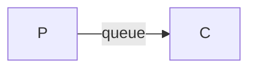
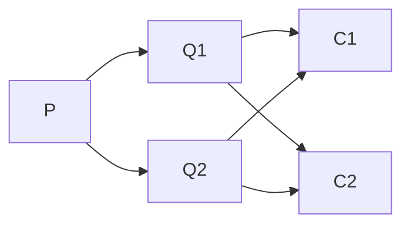
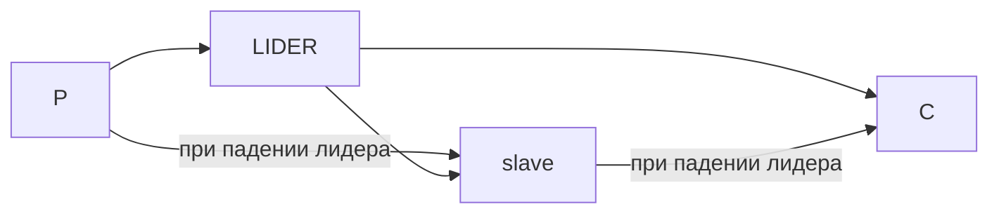

*Целищев Егор Дмитриевич*  
# Лекция 1
# Практика 1
# Лекция 2. Выбор брокера очередей для высоконагруженных приложений
**Зачем нужны очереди:**
- Распределения задач 
- Планирование исполнения (отложенные задачи, все планировщики задач работают с брокером)
- Честность выделения ресурсов (грамотно распределить нагрузку)
- Репликация сообщений (сообщения не теряются)
- Отказоустойчивость, надёжность, гарантия доставки
- Коммуникация микросервиса  
  
**Где применяются очереди:**
- "Железо"
- Ядро операционной системы
- Приложения 
- Сетевые взаимодествия
- Распределённые системы (микросервисы)
- Стык разных бизнесов  
> Фактически везде  
  
**Очередь**:
- Средство коммуникаций при помощи сообщений
- Подход Put/Take - one to one
- **Подход Publish/Subscribe** - one to many (*один из основных*) 
- Подход Request/Response - one to one, но синхронный
- Протоколы: AMQP, MQTT, STOMP, NATS, ZeroMQ, ...  
  
**Какие есть варианты?**
- Облачные решения 
    - Yandex Message Queue
    - Amazon SQS - Simple Queue Service
    - Mail.ru Cloud Queues
    - ...
- Специализированные брокеры
    - RabbitMQ
    - Apache Kafka
    - ...
- Реализация очереди с помощью СУБД
    - PgQueue
    - Redis
    - ...  
- "Сокеты на стеродидах" 
    - NATS, ZeroMQ, ...  
  
**Основные кандидаты**:
- Apache Kafka
> Распределённый лог сообщений для стриминга (для большого потока данных). Apache Kafka использует бинарный протокол поверх TCP
- RabbitMQ
> Традиционный брокер, протокол AMQP
- Managed Cloud Queue
> Максимальное удобство в облаках + деплой
- NATS
> Связующее звено для микросервисов 

## Apache Kafka
1. Producers and Consumers
2. Топики
3. Pub/Sub на топики
4. Partitions - у продюсера и консюмера один partition в одном топике
5. Брокеры
6. Репликация
7. Долговечное хранилище  
  
Сообщения в Kafka при попадании в топик сразу записывается на диск (в файлы логов партиций), что обеспечивает надёжность хранения. При этом для высокой производительности Kafka активно использует кэш страниц ОС, поэтому чтение часто происходит из оперативной памяти, а не с физического диска  

## Apache ZooKeeper
Хранение конфигураций: централизованное хранение настроек для всех узлов системы
1. Синхронизация: координация действий между узлами, чтобы избежать конфликтов
2. Распределенные блокировки: помогает узлам "договариваться" о доступе к общим ресурсам 
3. Выбор лидера: автоматически выбирает главный узел в распределённой системе

# Лекция 3
## RabbitMQ
- Producer/Consumer
- Queue - буфер
- Message 
- Exchange - получает сообщения от producers и помещает их в очереди в зависимости от правил, определённых типом exchange. Для получения сообщений очередь должна быть привязана хотя бы к одному exchange
- Binding - связующее звено между очередью и exchange
- Routing key - ключ, который exchange смотрит, чтобы решить, как направить сообщения в очереди. Как адрес для сообщения
- AMQP

## Проблемы очередей: Алгоритмы очередей
- FIFO - первое сообщение пришло, первым и уйдёт
- LIFO - последние сообщение уйдёт первым (например, можно использовать в логах - последние ошибки являются более важными)
- Best Effort - если один обработчик не смог обработать, то сообщение вернётся в очередь, его возьмёт другой
- Приоритизация сообщений - к сообщениям добавляется приоритет, с высоким приоритетом раньше обрабатываются 
> В рамках Kafka приоритизация с помощью новых подочередей (partition), также в других брокерах, где нет встроенной приоритизации
- Отложенные задачи, повтор с задержкой
- **Dead Letter queue** - механизм откладывания сообщений, которые мы не смогли обработать, эти сообщения хранятся в специальной отдельной очереди (обрабатываются специалистами или другими обработчиками)
- **TTL** time to live (сколько сообщения живёт в очереди), **TTR** time to release (сколько времени нужно на обработку до возвращения обратно в очередь), **Putback** (возврат обратно в очередь)
## Второй слой проблем
- Приоритизация и голодание
> Два потока задач с разными приоритетами, задачи с низким приоритетом могут не добраться до consumer, потому что вперёд всегда будут проходить приоритетные сообщения
- Пропускная способность 
> Узкие места без возможности масштабирования, проблемы дизайна системы
- Производительность
- Масштабируемость 
## Третий слой проблем
- Проблема двух генералов
> ! Отправка строго один раз, строгий порядок сообщений

## Четвёртый слой проблем
- Оборудование
    - Диск
    - Хост упал
    - Дата-центр
- Временный отказ
    - Питание
    - Сеть
    - Split brain (теряется связь между двумя системами)
- Отказ навсегда
    - Физическое уничтожение (например, *сгорел сервер*)
# Лекция 4. Паттерны очередей в распределённой системе

## Single instance
- Отсутствие масштабируемости
- Низкая доступность
- Низкая надёжность

## Multi-instance
- Масштабируема 

### Одно сообщение в одну из очередей
### Одно и тоже сообщение в N очередей
- Сообщение может быть обработано несколько раз (можно попробовать использовать **идемпотентность**)
## Репликация

### Реплицированные очереди, 1 из N
Несколько очередей, которые представлены в виде лидеров и slaves
## Кворум (похоже на блокчейн)
**Правило большинства** - данные считаются надёжно записанными, если их подтвердило больше половины узлов-реплик  
  
**Плюсы:**
- **Надёжность**
- **Отказоустойчивость**: система может продолжить работать после сбоя лидера (им становится другая реплика с актуальными данными)
- **Защита от split-brain**: большинство помогает избежать, когда два узла считают себя главными
- **Согласованность:** у нового лидера обычно более актуальные данные  
  
**Минусы:**
- Запись медленнее, чем без репликации: надо дождаться большинства
- Больше расход ресурсов: сеть, диск, память
- Сложнее в настройке и эксплуатации
- Если потеряно большинство узлов, запись обычно останавливается, даже если часть серверов ещё жива
- Не всегда подходит для сценариев, где важнее максимальная скорость, чем надёжность  
  
**Availability Zone** - отдельная зона отказа внутри одного региона: обычно независимый дата-центр или группа дата-центров, *отказ одной AZ не должен уронить остальные*  
  
...

## Мониторинг и эксплуатация
- Размеры очереди
    - Очередь всегда ограничена
> Нормальное состояние очереди - **пустое**

- Время 
    - Полная обработка сообщений
    - Время исполнения 
- Количество повторов и потерь/отказов
- ЛОГИ!

- Настраивайте политики отказа
    - Перестаньте принимать новые сообщения в случае проблем
    - Уничтожьте старые (дедлайн давно прошёл)
    - "Спасайте" выживших  
- Запланируйте падение 
    - Для того, чтобы подняться

# Лекция 5. Git Flow и Git
Git Flow - как мы строим разработку в гите
### Develop and main
Самое простое для пет-проектов
### Feature/fix 
Каждая новая функция в своей ветке, после окончания - merge в dev
### Release 
Когда dev готова к release, создаём новую ветку, но не хотим ещё в main под новый тег, либо если кто-то отдельный заливает релизы в main и тестиурет, мы делаем промежуточный релиз и дальше продолжаем свою разраотку
### Hotfix 
Из main быстренько поменяли и обратно
## Версии
`MAJOR.MINOR.PATCH` 
- MAJOR - релизы какие-то
- MINOR - новые фичы
- PATCH - исправления  
  
**Git tags** - для CI/CD, по ним чаще всего запускается **deploy pipeline** 

## Аналоги Git Flow
- Trunc Based Development - быстрый цикл разработки
- Forking Workflow

## CI/CD
- CI - отвечает за качество кода до релиза, сборка, тесты, статический анализ  
- CD - отвечает за готовность к выкладке 

# Лекция 6. Паттерны отказоустойчивой архитектуры
## Timeout/Retry(refresh)
Retry - повторный запрос
- При долгой обработке запроса
- От ошибки сервера
- По времени (*опасно, почти не используется*)
- На счётчиках 
> Retry между timeout

## idempotent keys - ключи идемпотентности
> Чем раньше вернём `X-Request-ID`, тем лучше

## Deadlines
