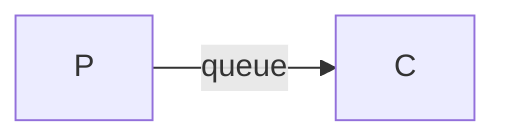
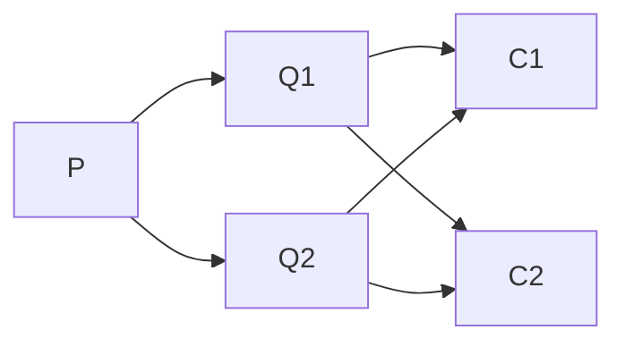
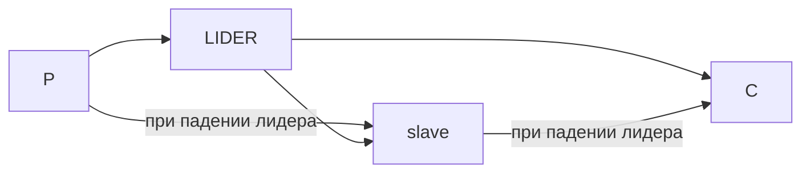
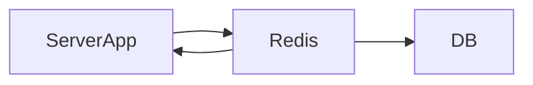
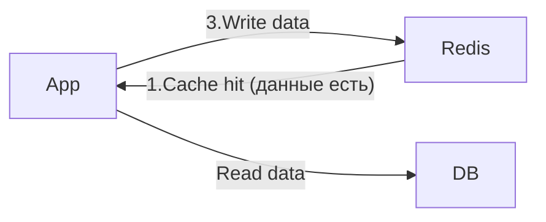

*Целищев Егор Дмитриевич*  
# Лекция 1
# Практика 1
# Лекция 2. Выбор брокера очередей для высоконагруженных приложений
**Зачем нужны очереди:**
- Распределения задач 
- Планирование исполнения (отложенные задачи, все планировщики задач работают с брокером)
- Честность выделения ресурсов (грамотно распределить нагрузку)
- Репликация сообщений (сообщения не теряются)
- Отказоустойчивость, надёжность, гарантия доставки
- Коммуникация микросервиса  
  
**Где применяются очереди:**
- "Железо"
- Ядро операционной системы
- Приложения 
- Сетевые взаимодествия
- Распределённые системы (микросервисы)
- Стык разных бизнесов  
> Фактически везде  
  
**Очередь**:
- Средство коммуникаций при помощи сообщений
- Подход Put/Take - one to one
- **Подход Publish/Subscribe** - one to many (*один из основных*) 
- Подход Request/Response - one to one, но синхронный
- Протоколы: AMQP, MQTT, STOMP, NATS, ZeroMQ, ...  
  
**Какие есть варианты?**
- Облачные решения 
    - Yandex Message Queue
    - Amazon SQS - Simple Queue Service
    - Mail.ru Cloud Queues
    - ...
- Специализированные брокеры
    - RabbitMQ
    - Apache Kafka
    - ...
- Реализация очереди с помощью СУБД
    - PgQueue
    - Redis
    - ...  
- "Сокеты на стеродидах" 
    - NATS, ZeroMQ, ...  
  
**Основные кандидаты**:
- Apache Kafka
> Распределённый лог сообщений для стриминга (для большого потока данных). Apache Kafka использует бинарный протокол поверх TCP
- RabbitMQ
> Традиционный брокер, протокол AMQP
- Managed Cloud Queue
> Максимальное удобство в облаках + деплой
- NATS
> Связующее звено для микросервисов 

## Apache Kafka
1. Producers and Consumers
2. Топики
3. Pub/Sub на топики
4. Partitions - у продюсера и консюмера один partition в одном топике
5. Брокеры
6. Репликация
7. Долговечное хранилище  
  
Сообщения в Kafka при попадании в топик сразу записывается на диск (в файлы логов партиций), что обеспечивает надёжность хранения. При этом для высокой производительности Kafka активно использует кэш страниц ОС, поэтому чтение часто происходит из оперативной памяти, а не с физического диска  

## Apache ZooKeeper
Хранение конфигураций: централизованное хранение настроек для всех узлов системы
1. Синхронизация: координация действий между узлами, чтобы избежать конфликтов
2. Распределенные блокировки: помогает узлам "договариваться" о доступе к общим ресурсам 
3. Выбор лидера: автоматически выбирает главный узел в распределённой системе

# Лекция 3
## RabbitMQ
- Producer/Consumer
- Queue - буфер
- Message 
- Exchange - получает сообщения от producers и помещает их в очереди в зависимости от правил, определённых типом exchange. Для получения сообщений очередь должна быть привязана хотя бы к одному exchange
- Binding - связующее звено между очередью и exchange
- Routing key - ключ, который exchange смотрит, чтобы решить, как направить сообщения в очереди. Как адрес для сообщения
- AMQP

## Проблемы очередей: Алгоритмы очередей
- FIFO - первое сообщение пришло, первым и уйдёт
- LIFO - последние сообщение уйдёт первым (например, можно использовать в логах - последние ошибки являются более важными)
- Best Effort - если один обработчик не смог обработать, то сообщение вернётся в очередь, его возьмёт другой
- Приоритизация сообщений - к сообщениям добавляется приоритет, с высоким приоритетом раньше обрабатываются 
> В рамках Kafka приоритизация с помощью новых подочередей (partition), также в других брокерах, где нет встроенной приоритизации
- Отложенные задачи, повтор с задержкой
- **Dead Letter queue** - механизм откладывания сообщений, которые мы не смогли обработать, эти сообщения хранятся в специальной отдельной очереди (обрабатываются специалистами или другими обработчиками)
- **TTL** time to live (сколько сообщения живёт в очереди), **TTR** time to release (сколько времени нужно на обработку до возвращения обратно в очередь), **Putback** (возврат обратно в очередь)
## Второй слой проблем
- Приоритизация и голодание
> Два потока задач с разными приоритетами, задачи с низким приоритетом могут не добраться до consumer, потому что вперёд всегда будут проходить приоритетные сообщения
- Пропускная способность 
> Узкие места без возможности масштабирования, проблемы дизайна системы
- Производительность
- Масштабируемость 
## Третий слой проблем
- Проблема двух генералов
> ! Отправка строго один раз, строгий порядок сообщений

## Четвёртый слой проблем
- Оборудование
    - Диск
    - Хост упал
    - Дата-центр
- Временный отказ
    - Питание
    - Сеть
    - Split brain (теряется связь между двумя системами)
- Отказ навсегда
    - Физическое уничтожение (например, *сгорел сервер*)
# Лекция 4. Паттерны очередей в распределённой системе

## Single instance
- Отсутствие масштабируемости
- Низкая доступность
- Низкая надёжность

## Multi-instance
- Масштабируема 

### Одно сообщение в одну из очередей
### Одно и тоже сообщение в N очередей
- Сообщение может быть обработано несколько раз (можно попробовать использовать **идемпотентность**)
## Репликация

### Реплицированные очереди, 1 из N
Несколько очередей, которые представлены в виде лидеров и slaves
## Кворум (похоже на блокчейн)
**Правило большинства** - данные считаются надёжно записанными, если их подтвердило больше половины узлов-реплик  
  
**Плюсы:**
- **Надёжность**
- **Отказоустойчивость**: система может продолжить работать после сбоя лидера (им становится другая реплика с актуальными данными)
- **Защита от split-brain**: большинство помогает избежать, когда два узла считают себя главными
- **Согласованность:** у нового лидера обычно более актуальные данные  
  
**Минусы:**
- Запись медленнее, чем без репликации: надо дождаться большинства
- Больше расход ресурсов: сеть, диск, память
- Сложнее в настройке и эксплуатации
- Если потеряно большинство узлов, запись обычно останавливается, даже если часть серверов ещё жива
- Не всегда подходит для сценариев, где важнее максимальная скорость, чем надёжность  
  
**Availability Zone** - отдельная зона отказа внутри одного региона: обычно независимый дата-центр или группа дата-центров, *отказ одной AZ не должен уронить остальные*  
  
...

## Мониторинг и эксплуатация
- Размеры очереди
    - Очередь всегда ограничена
> Нормальное состояние очереди - **пустое**

- Время 
    - Полная обработка сообщений
    - Время исполнения 
- Количество повторов и потерь/отказов
- ЛОГИ!

- Настраивайте политики отказа
    - Перестаньте принимать новые сообщения в случае проблем
    - Уничтожьте старые (дедлайн давно прошёл)
    - "Спасайте" выживших  
- Запланируйте падение 
    - Для того, чтобы подняться

# Лекция 5. Git Flow и Git
Git Flow - как мы строим разработку в гите
### Develop and main
Самое простое для пет-проектов
### Feature/fix 
Каждая новая функция в своей ветке, после окончания - merge в dev
### Release 
Когда dev готова к release, создаём новую ветку, но не хотим ещё в main под новый тег, либо если кто-то отдельный заливает релизы в main и тестиурет, мы делаем промежуточный релиз и дальше продолжаем свою разраотку
### Hotfix 
Из main быстренько поменяли и обратно
## Версии
`MAJOR.MINOR.PATCH` 
- MAJOR - релизы какие-то
- MINOR - новые фичы
- PATCH - исправления  
  
**Git tags** - для CI/CD, по ним чаще всего запускается **deploy pipeline** 

## Аналоги Git Flow
- Trunc Based Development - быстрый цикл разработки
- Forking Workflow

## CI/CD
- CI - отвечает за качество кода до релиза, сборка, тесты, статический анализ  
- CD - отвечает за готовность к выкладке 

# Лекция 6. Паттерны отказоустойчивой архитектуры
## Timeout/Retry(refresh)
Retry - повторный запрос
- При долгой обработке запроса
- От ошибки сервера
- По времени (*опасно, почти не используется*)
- На счётчиках 
> Retry между timeout

## idempotent keys - ключи идемпотентности
> Чем раньше вернём `X-Request-ID`, тем лучше

## Deadlines
1. Определение допустимого времени ожидания на стороне клиента
2. Deadline Propogation - явно обозначаем timeout при запросе к сервису 
3. Время ожидания одного (ре)трая / общее время ожидания
4. Разное время ожидания для разных зависимостей  
  
## Rate/Burst limiting
**Rate limiting** - средний значение RPS - при котором сервер обрабатывает запросы "не напрягаясь"  
**Burst limiting** - критическое значение, при котором сервер может упасть, после достижения это лимита "режем" запросы вплоть до восстановления обычного лимита  
> **RPS (Requests Per Second)** — это **количество запросов, которые сервер обрабатывает за одну секунду**  
  
## Circuit Breaker
1. Авто-выключение сервисов при всплеске или повторяющихся ошибках
2. Проверка восстановления сервиса
- Защита от каскадных сбоев
- Медленный сервис
- Временная перезагрузка БД
- Частичная доступность
- Защита внешних API
> Отличие от Rate/Burst limiting - rate ограничивает частоту запросов, circuit breaker предотвращает каскадные сбои, отключая запросы к упавшему сервису

## Dummy (Failover)
> Упала вся система, но отвечать пользователям надо: тогда используем упрощённую/урезанную копию  
  
- High-Availability Cluster - серверы работают в связке, если один выходит из строя, его задачи мгновенно перехватывают другой
- Hot Standby - резервный компонент работает синхронно с основным и готов принять нагрузку немедленно (один сервер мощный, второй слабее)
- Cold Standby - резервный компонент включается и загружается только после сбоя основного, что увеличивает время простоя
- Базы данных - репликация данных на резервный узел с автоматическим переключением запросов записи/чтения
- DNS Failover - при отказе основного сайта, DNS-записи автоматически обновляется, указывая на IP-адрес резервного сервера (часть реализации Dummy)  
## Bulkhead
Изолирует компоненты системы, разделяя ресурсы (потоки, соединения, память) на пулы, чтобы **сбой в одной части не приводил к отказу всей системы**  
  
- Изоляция путем разделения ресурсов - выделение потоков и пулов соединения, между различными службами 
- Изоляция на уровне процессов - выделение сервисов в отдельные процессы или контейнеры (Database per Service)  

# Лекция 7
Чтобы распределённая система жила под нагрузкой и сбоями, нужно 4 класса механизмов:
## Loose Coupling - компоненты системы относительно независимы друг от друга
1. Relaxed Temporal Constraints - гибкие, а не жесткие ограничения по времени
2. Idempotency - многократное выполнение операции даст тот же результат, как если бы она была выполнена только один раз 
3. Self-Containment - модуль является независимым и инкапсулированным, сводя к минимуму его зависимость от внешних сервисов
4. Location Transparency - способность компонентов взаимодействовать друг с другом, не зная о конкретном физическом или логическом местоположении (брокеры помогают)
5. Stateless - каждая транзакция или запрос от клиента к серверу рассматривается как независимая и изолированная единица, при этом сервер не сохраняет никакой информации о состоянии клиента между запросами. Каждый запрос как в первый раз, передаём нужную информацию только в запросе и не храним состояние (меньше точек отказа)
6. Event Driven - компоненты взаимодействуют друг с другом посредством событий 
    - Событие - это смена состояния или значительное изменение в компоненте, которое вызывает response or action
    - Event Sourcing 
    - CQRS
    - Async
## Isolation - локализуем проблемы
1. Shed Load = Circuit Breaker
2. Bulkhead
3. Complete Parameter Checking

### Isolation vs Loose Coupling
- Loose Coupling - как мы строим архитектуру, как мы взаимодействуем
- Isolaton - про изоляцию сбоев и предотвращении распространении 
## Latency Control - контролируем время ответа и деградацию системы, ответа
1. Shed Load = Circuit Breaker 
2. Timeouts & Retry
3. Bounded Queues - Ограниченные очереди сообщений
4. Fan Out (Bulkhead) - логическое разделение запросов, делим один тяжелый запрос на несколько маленьких
5. Quickest Reply - приоритет отдаётся максимально быстрому времени ответа, например, на несколько сервисов (реплик) отправляем один и тот же запрос и первый же ответ отправляем пользователю
## Supervision - то как строим метрика/механизмы отслеживания
## Зачем внедрять паттерны отказоустойчивости
1. Сокращение времени простоя сервисов 
2. Лучшая изоляция от сбоёв
3. Повышение производительности системы
4. Повышение качества обслуживания пользователей

## Caching 
Кэширование может использоваться на любом этапе
- Client (Browser)
- CDN 
- Web Server (Nginx)
- На уровне приложения
- Кэш БД  
## Nginx
Nginx - это высокопроизводительный Web Server и Reverse Proxy Server 
1. Мастер-процесс - запускается один, его задача:
    - Читать конфигурацию
    - Запускать и контролировать воркеры 
    - Перезапускать их при необходимости
2. Worker процессы - выполняют всю основную работу:
    - Принимают входящие соединения 
    - Читают и обрабатывают запросы 
    - Отдают ответы 
> Каждый воркер работает в неблокирующем цикле событий и может обрабатывать тысячи соединений параллельно

### 1. Single listen socket, single worker process 
### 2. Single listen socket, miltiple worker process
- Один listen socket 
- Несколько worker процессов 
- Каждый worker работает независимо и может обрабатывать собственный набор соединений
### 3. 

## Что такое CDN?
**Content Delivery Network** - сеть серверов, пространственно распределённая для обеспечения высокого уровня доступности и **повышенной производительности** систем, **работа которых кэшируется** в этой сети

# Лекция 8. Caching продолжение

## Caching on the backend

- Уменьшение задержки
- Снижена нагрузка на БД
### Client-Side (Local) Caching
### Distributed Cache / Redis Cluster
- Хранение данных на нескольких машинах или узлах
- Все узлы видят одни и те же данные в любой момент времени (разные политики констистентности)  
+ Масштабируемость
+ Отказоустойчивость 
### Global Cache
Единое облачное хранилище кэшированных данных, к которому обращаются все узлы приложения  
  
В отличие от локального кэша, который живёт внутри каждого сервера, глобальный кэш обеспечивает консистентность: если один сервер обновил данные, все остальные ... тоже   
  
- Local vs Distributed - скорость против согласованности: локальный кэш моментальный, но на 10-ти серверах будет 10 вариантов версий данных
- Global Cache - единый источник правды
- Distributed Cache - может быть как независимым паттерном, так и внутри Global Cache

## Политики записи
### Lazy Loading 
- Загрузка данных в кэш только по запросу
> Помогает избежать заполнение кэша ненужными данными и может быть эффективной для больших наборов данных  

**Плюсы:**
+ Сокращение времени начальной загрузки
+ Избежать ненужного потребления ресурсов 
+ Часто используемые данные с большей вероятностью кэшируются  
**Минусы:**
- Соответствие кэшированных данных исходному источнику
- Реализация истечения срока действия имеет решающее значение для поддержания актуальности и производительности кэша
## Write-Through Cache 
- Когда **данные обновляются**, они записываются **одновременно в кэш и БД**.
> Это гарантирует, что кэш всегда содержит актуальные данные, но может замедлить операции записи

**Плюсы:**
+ Синхронизация с БД/ **высокая консистентность**
+ Поскольку одновременно и в кэш и в БД, то риск потери данных из-за сбоя кэша снижается  
  
**Минусы:**
- Слишком много ненужны данных
- Более высокая задержка

## Write-Back Cache
- Данные сначала записываются в кэш и помечаются как "грязные", а затем асинхронно сохраняются в основное хранилище (БД, диск...)  
**Плюсы:**
- Асинхронность
**Минусы:**
- Несогласованность данных (например, краш кэш сервера и данные не успели записаться)

##  TTL (time to live) 
1. Создание записи в кэше: добавляется TTL
2. Доступ к кэшу: проверка TTL
3. После истечения TTL данные считаются устаревшими

## Eviction Policies (политики удаления)
### ...
- **Удаляет** из кэша элементы, **использованные давно**
> Недавно использованные данные с большей вероятностью могут быть использованы снова
### LFU (Least Frequently Used)
- Удаляет из кэша наименее часто используемые элементы 
> Но есть проблемы, что при добавления новых данных, у них маленькое число использование, из-за чего они будут удалены сразу, даже если ресурс очень востребованным, поэтому надо давать время для таких данных
### FIFO/LILO
- Удаляет из кэша последний элемент, когда кэш заполнен
## Сервисы для кэширования

|                                | Apache Ignite                                                                   | Redis                                                                                                         | Memcached                                                                                |
| ------------------------------ | ------------------------------------------------------------------------------- | ------------------------------------------------------------------------------------------------------------- | ---------------------------------------------------------------------------------------- |
| Data-model                     | key-value, sql                                                                  | Key-value + различные структуры данных (list, sets, strings...)                                               | Только key-value                                                                         |
| Персистентность                | есть возможность хранение данных на диске                                       | RDB                                                                                                           | Только в памяти                                                                          |
| Используется                   | Подходит для распределённых вычислений, кэширования, обработки данных           | кэширование, хранилище сессий,                                                                                | кэширование ускорение динамических веб-приложений                                        |
| Консистетность и долговечность | сильная консистентность и долговечность, подходит для транзакционных приложений | возможности для обеспечения согласованности и долговечности, но конфигураци могу влиять на производительность | упор на производительность, а не на консистентность и долговечность, упор на кэширование |

# Лекция 9. Ошибки в архитектуре Highload-приложений
## Проблемы с БД
### Транзакции 
**ACID** - требования гарантирует правильность и надёжность работы системы
> Выполнение всех пунктов говорит о том, что у вас транзакция
#### Атомарность (Atomicity)
> Каждая транзакция будет выполнена полностью или не будет выполнена совсем

#### Согласованность (Consistency)
> Транзакция не допускает промежуточных результатов, база остаётся консистетной
#### Изоляция (Isolation)
> Во время выполнения транзакции параллельные транзакции не должны оказывать влияние на её результат

Чем выше уровень изоляции, тем меньше аномалий, которые могут быть следующими:
- Потерянная запись
- Грязное чтение
- Неповторяющееся чтение
- Фантомы  
##### Способы борьбы
- Блокировки - блокируем данные в базе 
- Версии - при каждом обновлении БД создаётся новая версия

#### Надёжность (Durability)
> Изменения должны остаться сохранёнными после возвращения системы в работу (после сбоев...)

### Жадные запросы
- Более конкретные запросы
> *Меньше звёздочек*

## Проблемы с кодом
### HTTP API
- Микросервис висит
- Проблемы с WebServer (Apache/Nginx)
#### Решение 
- TimeOut
- Кэширование
- ...
## Архитектурные проблемы
### Serve static
- Тяжелые файлы статики 
- Медленные клиенты (медленная сеть)
### Sessions
1. Не храните сессии в файловой системы
2. Если нет ограничений на хранение сессий - используйте cache

### Горизонтальное масштабирование
Проблемы:
1. Локальные файловые хранилища
2. Хранение файлов в плохо масштабируемых или экзотических БД  
  
Решение:
1. Хранение файлов в S3 (Simple Storage Service)
2. Не использовать БД, про которые сказано выше

