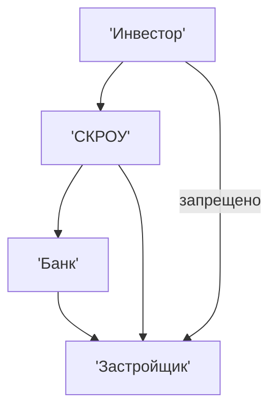

# Практика 1
_Василий Николаевич Борщ_  
## Фин.Безопасность
**Финансовая безопасность в цифровой среде** - способность защищать свои деньги, данные и доступ к фин. сервисам от кражи, мошенничества и несанкционированного доступа  
  
**Почему студенты - главная мишень:**
> Активные, доверчивые, технологичные и не до конца осознают риски  
  
Студент становится мишенью в тот момент, когда у него появляется первая банковская карта  
  
**Уязвимость студентов:** 
> Студенты часто ищут: подработку, скидки и лёгкие пути заработка  
  
Данные ЦентроБанка(ЦБ): 60% процентов цифрового мошенничества - люди до 25 лет, каждый третий случай связан с фишингом через соц сети или мессенджеры  
  
### Фишинг
Фишинг - мошенническая атака при которой злоумышленники под видом гос.органов или популярных сервисов выманивают личные данные: пароли, смс-коды, реквизиты карт
phishing от phreaking и fishing  
  
- В 90-е годы кража учётных записей абонентов телефонной линии. 
- В 2000-е годы переход к банковским данным, поддельные сайты, системы EBay и PayPal.
- В 2010-е фишинг через email, соц. сети и смс
- В 2020-ых - всё вышеперечисленное + поддельные приложения, дипфейки  

> По данным ЦБ РФ в 2024 году ущерб от фишинга превысил 15 млрд рублей  
  
#### Противодействие фишингу
1. Включать критическое мышление 
2. Проверять источники информации (не верить на слово, проверять инфу)

## Мошенничество в соц.сетях и мессенджерах
> Оно появилось с появлением соц.сетей, первые соц. сети в 2004  
  
Злоумышленники быстро помяни, что люди доверяют тем, кого видят в списке друзей и реагируют на эмоции: страх, жалость и жадность. Так началась эра **социальной инженерии** в соц.сетях.  
  
**Социальная инженерия** - метод психологических манипуляций и обмана с целью выполнить действия для захвата данных.  
  
Социальная инженерия = Давление  
  
**Стадии соц.инженерии:**
1. Сбор информации о жертве
2. Установление контакта и получение доверия
3. Эксплуатация (использование полученных данных для достижения цели)
4. Исчезновение  
  
Спам - массовая рассылка  
  
## 7 правил фин. безопасности в цифровой среде
1. Использование сложных паролей (8 символов, цифры, буквы, знаки) - самый безопасный пароль - это пароль, который придумали сами и он нелогичен
2. Использование двухфакторной аутентификации (2FA)
3. Нельзя переходить по подозрительным ссылкам (Проверять адреса сайтов, не нажимать на письма с подозрительным контекстом - срочно, вы выиграли...)
4. Обновляем ПО и приложения 
5. Не хранить данные карт в приложениях и браузерах. 
6. Не использовать открытые сети вайфай и vpn соединения при проведения операция в банковских приложений
7. Использовать виртуальные карты и лимиты для оплаты в интернете. Проверять историю операций. Установить лимит на снятие и переводы карты  

## Что делать если деньги украли:
1. Заблокировать карту немедленно
2. Написать в поддержку банка
3. Подать заявление в полицию  
  
# Практика 2
## Фин.Грамотность
**Финансовая грамотность** - умение управлять своими финансами для успешной реализации своих целей: 
- долгосрочных (несколько лет), 
- среднесрочных (1 год), 
- краткосрочных (текущие цели)  
  
**Долгосрочные финансовые цели:**
- Купить транспортное средство 
- Открыть бизнес  
- Приобрести недвижимость  
**Среднесрочные цели:**
- Обновить смартфон и др.
- Отдых  
**Краткосрочные цели:**
- Продукты питания (ТПС - товары повседневного спроса)
- Транспорт
- Развлечения  
  
**Доходы** - деньги, которые мы получаем регулярно:
- Стипендия
- Подработка 
- Помощь родителей
- Подарки  
  
**Расходы** - деньги, которые мы тратим на регулярной основе:
- Еда
- Оплата жилья, аренда
- Интернет
- Развлечения
- Шопинг  
  
> **Баланс бюджета** - тратить меньше, чем получать  
  
| Доходы            | Расходы                 |
| ----------------- | ----------------------- |
| Стипендия - 5 т.р | Продукты питания 15 т.р |
| Родители - 10 т.р | Аренда - 3 т.р          |
| Подарки - 15 т.р  | Интернет 1 т.р          |
| Работа - 5 т.р    | Развлечения - 5 т.р     |
|                   | Шоппинг - 3 т.р         |
|                   | Транспорт - 2 т.р       |
| 35 т.р            | 29 т.р                  |
| + 6 т.р           |                         |
Баланс может быть:
- Дефицитным - расходы превышают наши доходы 
- Профицитным - доходы выше расходов
- Нулевой - баланс может быть нулевым в случаем, когда доходы = расходам  
  
## Правило 50/30/20
Для реализации нам необходимо разделить бюджет на 50% обязательных расходов, 30% на развлечения и 20% на сбережения. Это позволит нам достичь финансовой стабильности  
  
## Налоги
%% грустно %%
> Налоги надо платить 
   
> Налоги дешевле платить, чем не платить 
  
**НДФЛ** - налог на доход физического лица - 13%
(1 млн, 130 т.р)
  
**Налоговый вычет** - компенсировать на затраты:
- Мед.обслуживание - 100 т.р * (13%) = 13 т.р.
- Спорт. организация - 50 т.р. * (13%) = 6.5 т.р.
- Обучение - 300 т.р. * (13%) = 39 т.р.
- Приобретение недвижимости  
  
Для возврата налога необходимо взять документы в мед.организации чек об оплате и обслуживании, загрузить их в личный кабинет(создать лк на сайте ФМС) мои налоги, указав реквизиты банковской карты, и в течении месяцы сумма вернутся на расчётный счёт  
  
Налоговый вычет за недвижимость можно оформить только один раз  
  
## Активы и пассивы
**Активы** - то, что приносит деньги:
- Вклад с %
- Акции
- Доход от сдачи квартиры в аренду
- Вложения в бизнес
  
**Пассивы** - то, что отнимает деньги
- Автомобили
- Смартфоны
- Кредиты
- ...  
  
> Богатые покупают активы, а бедный и средний класс инвестируют в пассивы  

Страх и жадность - главные эмоции, мешающие стать богатыми  
 
# Лекция 1
## Финансовый план - как построить фин. будущее
Фин. план - это дорожная карта для достижения ***фин. целей***  
Фин.план включает:
1) Анализ доходов и расходов 
2) Постановка целей по методу SMART
3) Составление бюджета
4) Создание подушки безопасности
5) Погашение долгов  
  
### Метода SMART
- **S** - Цель должна быть **конкретной** (`Нам нужно 100т.р. на ноутбук`) 
- **M** - Цель должна быть **измеримой** (`Ноутбук с конкретными хар-ками`)
- **A** - Цель должна быть **по карману**
- **R** - Цель должна быть **реалистичной** (`откликаться вам`)
- **T** - Цель должна быть **ограничена по времени**
## Фин.подушка
**Фин.подушка** - помогает пройти период времени, когда отсутствует доход (потеря работы, болезнь и т.д.)  
Хранить нужно на накопительном счёте для быстрой доступности  

## Главное:
> Начни с малого: веди учёт, откладывай 20%, ставь конкретные цели. Инвестируй в активы, а не в пассивы  

## Активный доход
**Активный доход** - это деньги, которые мы получаем за труд и время
> Примеры: зарплата, подработка, продажи, фрилнас
  
**Особенность:** если перестаёте работать, то доход прекращается.  

## Пассивный доход
**Пассивный доход** - доход, который работает на вас, пока вы спите
> Примеры: арендная плата за квартиру, проценты по вкладу, дивиденды от акций, роялти

**Особенность:** требует первоначальных усилий или вложений  

## Сравнение

|      Критерий      |       Активный доход        | Пассивный доход |
| :----------------: | :-------------------------: | :-------------: |
| Зависит от времени |              +              |        -        |
| Начальные вложения | Время, знания, навыки, опыт |    + деньги     |
|  Масштабируемость  |         Ограничена          |  Неограниченна  |
|       Пример       |       Бариста в кафе        |  Продажа курса  |
## Личный бренд
**Личный бренд** - это репутация, экспертность и узнаваемость в определённой сфере  
**Зачем он нужен:**
- Привлекать клиентов и работадателей
- Позволяет монетизировать наши знания
- Открывает двери большой бизнес
- Повышает доверие личности  

### Создание личного бренда
1) Выбрать нишу, в которой являемся экспертом (Программирование)
2) Выбор платформы
3) Публикация полезного контента (советы, разборы ситуаций, личный опыт)
4) Взаимодействие с аудиторией через комментарии, опросы и обратную связь
5) Монетизация личного бренда: партнёрские программы, продажа услуг и курсов
6) Реклама
7) Качество и регулярность контента
8) Анализировать и корректировать стратегию

# Дом. задание 
## Август 2025

| Доходы                              | Расходы                                  |
| ----------------------------------- | ---------------------------------------- |
| Стипендия - **10 000**              | Оплата обучения в автошколе - **33 300** |
| Бонус по акции в ТБанке - **3 000** | Супермаркеты - **1 500**                 |
| Родители - **2 000**                | Рестораны и фастфуд - **8 700**          |
|                                     | Транспорт - **2 500**                    |
|                                     | Маркетплейсы - **4 000**                 |
|                                     | Медицина **1 400**                       |
|                                     | Мобильная связь - **500**                |
|                                     | Развлечения - **1 000**                  |
| **15 000** рублей                   | **57 900** рублей                        |
|                                     | **-42 900** рублей                       |
# Практика 3
![[Pasted image 20251001111051.png]]
![[Pasted image 20251001111546.png]]
![[Pasted image 20251001113904.png]]
# Лекция 2
## Инвестиции 
**Инвестиции** - вложение средств с целью получения дохода в будущем  
  
> Инвестиции - это не про спекуляцию, а про будущее  
  
**Причины для инвестирования:**
- Деньги должны работать, а не лежать на счёте
- Инвестировать необходимо, чтобы опередить инфляцию (деньги обесцениваются каждый год на процент инфляции)
- Быстрее достичь своих финансовых целей
- Чтобы создать пассивный доход в будущем. который сможет и должен работать за нас
**Товарная инфляция** - обесценивание количества товаров за ту же цену  
  
### Основные инструменты инвестирования
#### Акции
Наиболее доступный инструмент инвестирования для новичков  
**Акции** - доля в компании  
**Доход**:
- Рост стоимости
- **Дивиденды** - это часть прибыли компании
  
Решение о распределении и выплате дивидендов по итогам финансового года принимает совет директоров компании.  
  
Если совет директоров решает не выплачивать дивиденды, а распределить эту прибыль на новые проекты, акционеры компании **лишаются дивидендной выплаты**  
  
**Минусы**:
- Акции могут рухнуть (в 2022 году российский рынок акцией **рухнул на 40%**)
- Если мы захотим быстро выйти в наличные,то скорее всего акции придётся продать с дисконтом, либо ждать "хорошую цену"

#### Облигации
**Облигации** - ценные бумаги, представляющие собой займ государству или компании:
- Облигации федерального займа (ОФЗ) - государство
- Облигации крупной компании  
  
Все процессы, связанные с облигациями контролируются ЦБ РФ  
  
**Плюсы**:
- Надёжность
**Минусы**:
- Невысокая доходность
- Риск инфляции
- Выйти в наличные быстро невозможно - Если вы гасите купон облигации раньше срока, то вы получаете сумму выплаты с дисконтом

#### Фонда
Биржевые фонды инвестируют во множество компаний
> 100 человек - 9 млрд $ - Perplexity
> 8000 человек - 60 млрд $ - Газпром
  
**Плюсы**:
- Диверсификация
- Высокая ликвидность
- Возможность быстрых продаж
**Минусы**:
- Потеря стоимости фонда при массовом выходе инвесторов

#### Криптовалюты
1. Bitcoin - цифровое золото  
2. Эфир - валюта для смарт контрактов 
3. USDT - привязан к доллару и менее валатирован  
  
**Плюсы:**
- Высокая доходность
- Staking - заморозка монет за процент - схема похожа на банковский вклад
- Децентрализованные финансы  
  
**Минусы**:
- Высокие риски волатильности (необеспеченная валюта, например у акций Газпрома есть реальные здания, а тут просто код)
- Мошенничество (запуск множества новых токенов)
- Отсутствие регулирования в РФ  
  
### Ещё опасности инвестиций
Маржинальная торговля - торговля с использование заёмных средств, которые предоставляют брокеры  
  
Потери будут рассчитаны от всей суммы сделки, а не только от вложенных средств  

### Недвижимость
#### Инвестирование в строящие объекты
- Жилые объекты: дома, комнаты и другое для проживания
- Коммерческие: объекты, предполагающие коммерческую деятельность
  
Инвестиции в строящиеся объекты происходит на основе долевого участия  
На основе долевых счетов - **СКРОУ счета**  

# Практика 4
# Практика 5
# Практика 6, Лекция 3
## Создание собственного бизнеса с нуля
### 1. Формирование идеи
- Осознание целесообразности 
- Возможности заниматься определённым видом деятельности
> Желательно перед принятием решения о собственном бизнесе попробовать себя в выбранной отрасли в виде наёмного сотрудника
### 2. Постановка цели
#### 1. Экономическая цель (на какую норму прибыли мы рассчитываем)  
**Прибыль** - это разница между всеми доходами и всеми расходами  
**Прибыль != доход** и **прибыль != оборот**  
#### 2. Количественная цель
**Количественная цель** - объёмы продаж на разных этапах проекта  
#### 3. Качественная цель
**Качественная цель** - улучшение бизнес процессов, постепенная оптимизация бизнес процессов  
**Бизнес процессы** - те действия, которые помогают бизнесу в создании конечного продукта. **Пример продажи**: внедрение CRM систем 
#### 4. Социальная цель
Создание рабочих мест, социальная ответственность, устойчивое развитие  (**ESG** - устойчивое развитие компании - минимальный след, который оставляет компания в экологии) 

### 3. Разработка бизнес плана
1. **Резюме проекта** - краткое изложение ключевых аспектов, которое откликается вам как автору и может заинтересовать инвестора или партнёра
2. Цель проекта и сроки реализации
3. Объём необходимых инвестиций
4. Источники финансирования инвестиций (собственные и заёмные средства)
5. <mark style="background: #ABF7F7A6;">Оценка экономической эффективности проекта</mark>
6. Описание компании (общие сведения о компании: название, местоположение, <mark style="background: #ADCCFFA6;">организационно-правовая форма</mark>)
7. Описание отрасли (текущее состояние, тенденция развития и перспективы)
8. Анализ рынка (объём рынка в рублях, динамика развития рынка, основные игроки рынка)
9. Уникальные преимущества вашей компании, уникальное товарное предложение (**УТП**)
## 4. Финансовый план
Финансовый план содержит стартовые инвестиции:
1. Определяем сумму, которая нужна в проекте:
2. Расчёт затрат на запуск проекта
3. Операционные расходы: ежемесячные затраты, постоянные и переменные затраты
4. Прогноз дохода - выручка и точка безубыточности
> Точка безубыточности - показатель, который помогает определить сколько нужно продать товаров и услуг, чтобы покрыть все затраты и выйти в "ноль". 
$$ Постоянные затраты / (цена за ед - перменные затраты) $$
### Постоянные затраты:
- **Аренда** - фиксированные платежи за использование помещение, техники и ресурсов
- **Зарплата административного персонала** - зарплата сотрудника, которые не связаны с производством напрямую (бухгалтер, диспетчер)
- **Коммунальные услуги**
- **Банковские услуги**
- **Налоги и сборы** - налог на имущество, земельный налог
- **Представительские расходы** - затраты на деловые встречи, командировки, участие в выставках и конференциях
- **Страхования** - страховые взносы на имущество, ответсвенность и другие риски
- **Лицензионные платежи** - оплата за использование ПО, патентов и других прав
- **Прочие расходы** - затраты на охрану

### Переменные затраты
Зависят от количества произведённых товаров или оказанных услуг
- Сырьё и материалы
- Комплектующие и запчасти
- Трудовые затраты - сдельная оплата труда наёмному персоналу
- Премии и бонусы, зависящие от объёма производства
- Транспортные расходы - доставка сырья и готовой продукции
- Комиссионные вознаграждения
- Комиссии за использование маркетплейсов и агрегаторов 
- Прочие затраты - затраты на технологическую поддержку, услуги сторонних организации, связанных с проектом

### Финансовые показатели
#### Рентабельность проекта
> Показатель которые отражает эффективность использования денежных средств и ресурсов, показывает сколько прибыли приносит каждый вложенные рубль в проект

`(Прибыль) / (Себестоимость)`
#### Срок окупаемости проекта 
>Период, за которые доход от проекта покрывает затраты на его реализацию:  
  
`(Первоначальные инвестиции) / (Чистый денежный поток)`  

### Источники финансирования

## 5. Анализ рисков стартапов
**Анализ рисков включает:**
1. Идентификация рисков: финансовых, рыночных и операционных 
2. Оценка вероятности и последствия рисков
3. Меры минимизации рисков - страхование, диверсификация
4. План действия в кризисной ситуации - Антикризисный план

## После создания бизнес плана необходимо:
### 1. Правовая форма
#### ИП - индивидуальный предприниматель 
- Простота регистрации (в банке)
- Низкая налоговая нагрузка
- Ограниченная ответсвенность
#### ООО - общество ограниченной ответственности
- Регистрация только через налоговую инспекцию
- Необходим уставный капитал 
- Необходим устав компании
- Ответственность ограничена уставным капиталом и и имуществом предприятия
- Уставный капитал формируется из взносов учредителей пропорционально долям - сколько долей внёс учредитель, столько он будет получать прибыли
#### Самозанятость
- Кто может стать самозанятым? - Граждане России и ЕАС старше 14 лет  
- Ограничение по доходу - 2,4 млн руб в год  
##### Разрешённые виды деятельности:
1. Создание ПО
2. Услуги репетиторов
3. Дизайнеры
4. Фотографы
5. Курьеры
6. Вся бьюти сфера
##### Запрещённые:
1. Перепродавать товары
2. Заниматься нефте чё-то там
##### Оформление:
**Через приложение Мой Налог**:
1. Регион
2. ИНН
3. Подтвердить личность через ГосУслуги  
**А также через ГосУслуги, приложение банка, через сайт ФНС

#### Налоги
**Порядок уплаты налога:**
- налог начисляется автоматически
- уведомление приходит до 12 числа следующего месяца
- оплата до 28 числа
- нет дохода = нет налога
- налоговые декларации не подаются 
- все операции фиксируются в системе ФНС   
**Ограничения**:
- доход до 2.4 млн
- запрет на наём сотрудников
- ограниченный список видов деятельности  
**Преимущества:**
- Простая регистрация
- Работа без кассового аппарата  
**Недостатки**:
- Отсутствие трудового стажа
- Нет обязательных страховых взносов
> (Программа ПДС - если сами хотим формировать свою пенсию)
### 2. Подготовка учредительных документов
### 3. Государственная регистрация проекта

# Лекция 4
## Выбор системы налогооблажения 
### ОСНО - общая система налогоблажения
**Основные характеристики:**
- Налог на прибыль = <mark style="background: #ADCCFFA6;">20%</mark>
- НДФЛ = 13% с дохода предпринимателя 
**Преимущества**:
- Возможность работать с крупными заказчиками, требующими НДС (налог на добавленную стоимость)
- Возможность принимать НДС к "вычету"
- Отсутствие ограничения по доходам и количеству сотрудников
- Широкие возможности для налогового манёвра - тонкости бухгалтерского учёта
**Недостатки**:
- Сложность введения бухучёта
- Высокая налоговая нагрузка
- Частые налоговые платежи
- Необходимость введения "книги покупок и книги продаж"
### УСН - упрощённая система налогооблажения 
#### УСН "Доходы" - первый вариант для ИП
- Налоговая ставка <mark style="background: #ADCCFFA6;">6%</mark> от доходов
- Простая система учёта
- Отсутствие необходимости подтверждать любые расходы
- Подходит для бизнеса с небольшими расходами
#### УСН "Доходы - расходы"
- Налоговая ставка <mark style="background: #ADCCFFA6;">15%</mark> от разницы между доходами и расходами(прибыли)
- Более низкая налоговая нагрузка при наличии существенных затрат
- Подходит для бизнеса с большими расходами

#### Ограничения УСН
1. Доход не более 450 млн рублей в год, с 2025-го при доходе свыше 60 млн рублей в год ИП обязан платить НДС
2. Число сотрудников не более 130 человек
3. Стоимость помещения не больше 150 млн рублей

### Единый сельскохозяйственный налог
- Налоговая ставка <mark style="background: #ADCCFFA6;">6%</mark> от прибыли
- Освобождение от уплаты НДС (на текущий год) кроме импортёров и экспортёров
- Освобождение от налога на прибыль
- Освобождение от налогов НДФЛ по сельхоз деятельности  
**Условия применения:**  
- Доля доходов от сельхоз деятельности должна составлять не менее 70% от общего дохода
- Отсутствие производства подакцизных товаров

### ПСН - патентная система налогоблажения 
- Фиксированная сумма налога <mark style="background: #ADCCFFA6;">6%</mark> зависящая от потенциального налога 
> Потенциальный доход - это не реальный, а потенциально-возможный доход предпринимателя, который устанавливает региональные власти отдельно для каждого вида деятельности и муниципального образования.
- Патент можно купить на срок от 1 до 12 месяцев
- Простая система отчётности (её нет)  
**Доступен для:**
- Разработка ПО и БД
- Экскурсионные услуги
- Бьюти сфера
- Услуги общепита с залом до 150 м
- Розничная торговля с торговым залом до 150 м
- Дополнительное образование (репетиторство, курсы)
- Ремонт жилья, шиномонтажные, сварочные работы  
**Преимущества**:
- Простота введения учёта (не надо вести)
- Предсказуемость налоговых платежей
- Возможность работать без кассовых аппаратов во многих случаев  
**Ограничения**:
- Доход не более 60 млн в год (на 2025 год)
- Штат сотрудников не более 15 человек
- Определённый перечень видов деятельности
### Вывод
Открытие собственного бизнеса - это сложный, но увлекательный процесс. Важно правильно выбрать организационно-правовую форму и систему налогооблажения 
# Лекция 5
## Определение и виды кредитов: цели и опасности
**Кредит** - деньги, которые банк даёт в долг под процент с обязательным возвратом  

| Тип                 | Примеры                                     | Процентная ставка                         |
| ------------------- | ------------------------------------------- | ----------------------------------------- |
| **Потребительский** | *На ремонт, обновление техники, обновления* | от 15 до 25 %                             |
| **Кредитная карта** | *Лимит до 300 тысяч рублей*                 | до 30% годовых, если не заплатить вовремя |
| **Ипотека**         | *Покупка жилья*                             | есть меры гос. поддержки, с ней от 17%    |
| **Студенческий**    | *На обучение*                               | от 1%                                     |
  
**Хорошо, когда:**
- На образование
- На жильё
- На бизнес  
  
**Плохо, когда:**
- На шоппинг, моду, путешествие
- Если уже есть долги  
  
### МФО - микрофинансовые организации
> Быстрые деньги, но под огромный процент. Штраф до 200% от суммы кредита  
  
**Быстрые деньги в интернете:**
- Требуют оплату перед получение кредтов - мошенники

### Кредитные каникулы
Кредитные каникулы можно получить **при болезни, либо при потери работы**. В период кредитных каникул проценты продолжают начисляться. Эти каникулы просто откладывают проблему, а не решают  

### Страхование вкладов - как гос-во защищает наши деньги
Если вдруг банк попал в процедуру банкротства, то государство вернёт 1.4 млн рублей
- действует только в банках с лицензией ЦБ РФ
- покрывает: вклады, депозиты, остатки на картах
- не покрывает: инвестиции, криптовалюты, драгметаллы

### Итог
- **Кредит** - инструмент, а не спасение, используем только взвесив финансовые возможности  
- **Налоги** - не кража, а плата государству, в котором мы живём  
- **Страхование вклада** - храните деньги в надёжных банках